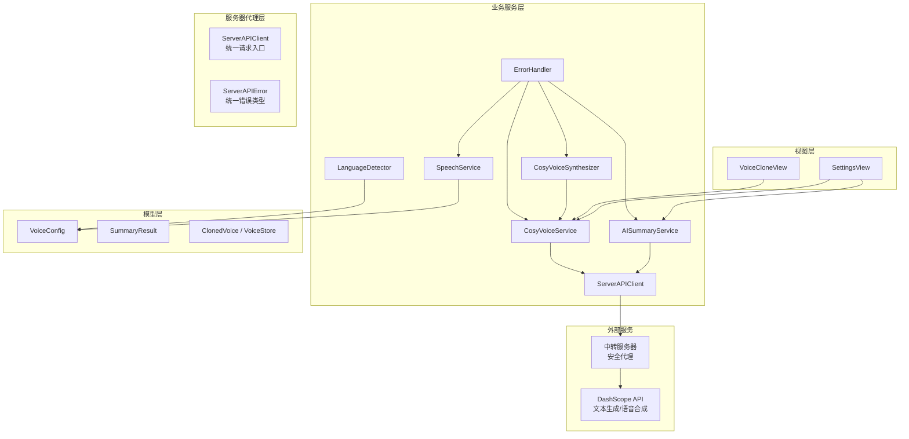
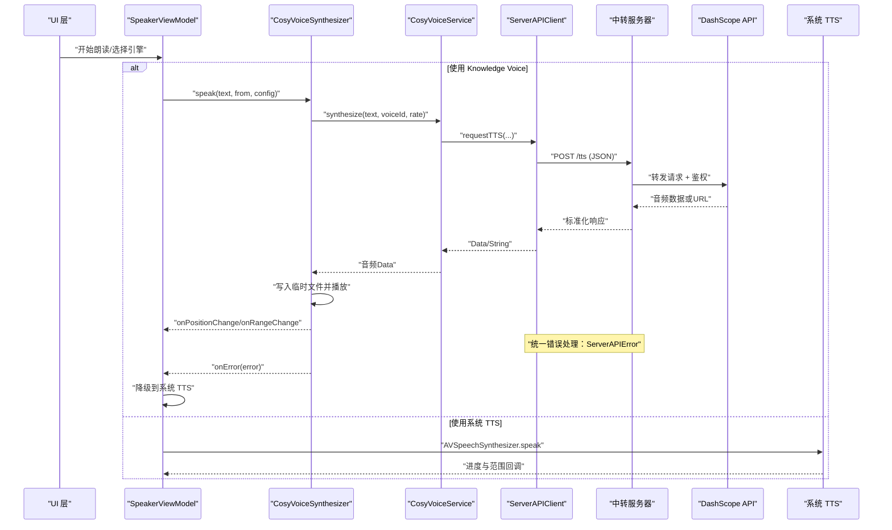
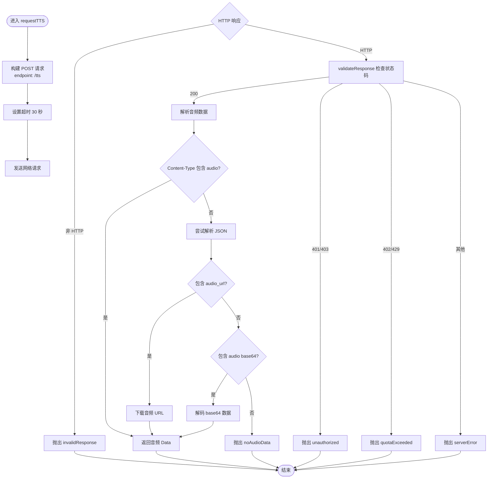
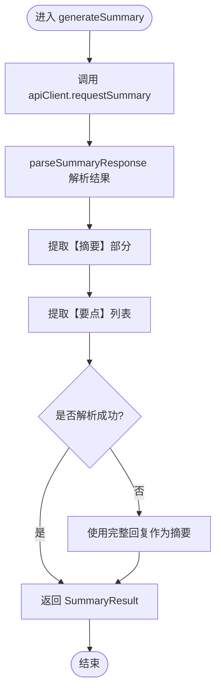
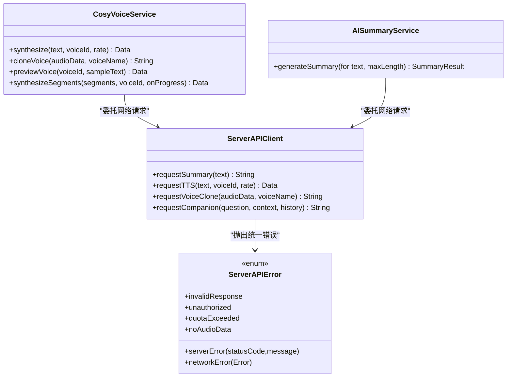
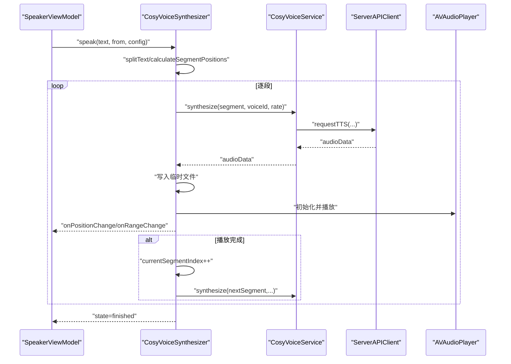
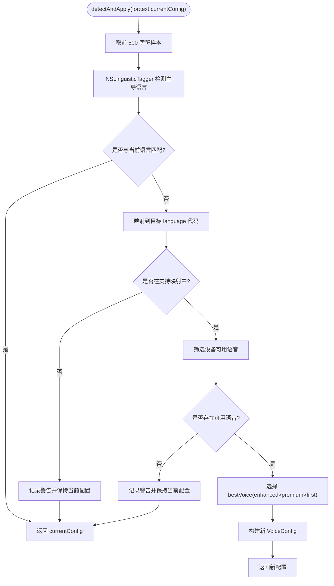
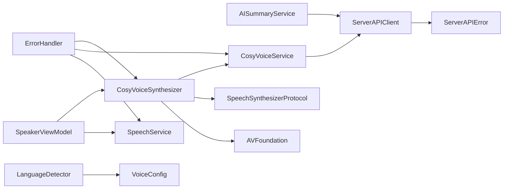

# 外部服务集成

<cite>
**本文引用的文件**   
- [AISummaryService.swift](file://Services/AISummaryService.swift)
- [CosyVoiceService.swift](file://Services/CosyVoiceService.swift)
- [ServerAPIClient.swift](file://Services/ServerAPIClient.swift)
- [CosyVoiceSynthesizer.swift](file://Services/CosyVoiceSynthesizer.swift)
- [LanguageDetector.swift](file://Services/LanguageDetector.swift)
- [ErrorHandler.swift](file://Services/ErrorHandler.swift)
- [SpeechService.swift](file://Services/SpeechService.swift)
- [SpeechSynthesizerProtocol.swift](file://Services/SpeechSynthesizerProtocol.swift)
- [VoiceConfig.swift](file://Models/VoiceConfig.swift)
- [SummaryResult.swift](file://Models/SummaryResult.swift)
- [ClonedVoice.swift](file://Models/ClonedVoice.swift)
- [SettingsView.swift](file://Views/SettingsView.swift)
- [SpeakerViewModel.swift](file://ViewModels/SpeakerViewModel.swift)
</cite>

## 更新摘要
**变更内容**   
- 外部服务集成架构从直接API调用改为服务器代理模式
- 新增统一的ServerAPIClient作为所有外部请求的中转层
- 错误处理统一为ServerAPIError类型，提供更清晰的错误分类
- API密钥安全管理从客户端存储改为服务器端集中管理
- 简化了服务层的网络请求逻辑，提高了安全性

## 目录
1. [简介](#简介)
2. [项目结构](#项目结构)
3. [核心组件](#核心组件)
4. [架构总览](#架构总览)
5. [详细组件分析](#详细组件分析)
6. [依赖关系分析](#依赖关系分析)
7. [性能与稳定性](#性能与稳定性)
8. [故障排除指南](#故障排除指南)
9. [结论](#结论)
10. [附录](#附录)

## 简介
本文件面向 Knowledge 应用的外部服务集成，重点介绍基于服务器代理模式的阿里云 DashScope API 集成实现。文档将说明：
- 服务器中转架构的安全优势与实现原理
- 统一的网络请求错误处理机制（ServerAPIError）
- AI 摘要服务与 CosyVoice 语音合成的配置和使用方法
- 语言检测服务的实现原理
- 第三方服务集成的最佳实践与排障建议

## 项目结构
围绕外部服务集成，关键代码分布在 Services、Models、Views 与 ViewModels 中：
- Services：AI 摘要、CosyVoice 服务、服务器代理客户端、语音合成引擎适配、语言检测、错误处理
- Models：语音配置、摘要结果、音色模型与持久化
- Views：设置页、语音克隆界面
- ViewModels：TTS 引擎切换与状态同步

图表来源
- [AISummaryService.swift:1-90](file://Services/AISummaryService.swift#L1-L90)
- [CosyVoiceService.swift:1-104](file://Services/CosyVoiceService.swift#L1-L104)
- [ServerAPIClient.swift:1-203](file://Services/ServerAPIClient.swift#L1-L203)
- [CosyVoiceSynthesizer.swift:1-258](file://Services/CosyVoiceSynthesizer.swift#L1-L258)
- [LanguageDetector.swift:1-83](file://Services/LanguageDetector.swift#L1-L83)
- [ErrorHandler.swift:1-53](file://Services/ErrorHandler.swift#L1-L53)
- [SpeechService.swift:1-166](file://Services/SpeechService.swift#L1-L166)
- [VoiceConfig.swift:1-71](file://Models/VoiceConfig.swift#L1-L71)
- [SummaryResult.swift:1-33](file://Models/SummaryResult.swift#L1-L33)
- [ClonedVoice.swift:1-118](file://Models/ClonedVoice.swift#L1-L118)
- [SettingsView.swift:1-306](file://Views/SettingsView.swift#L1-L306)
- [SpeakerViewModel.swift:1-103](file://ViewModels/SpeakerViewModel.swift#L1-L103)

章节来源
- [AISummaryService.swift:1-90](file://Services/AISummaryService.swift#L1-L90)
- [CosyVoiceService.swift:1-104](file://Services/CosyVoiceService.swift#L1-L104)
- [ServerAPIClient.swift:1-203](file://Services/ServerAPIClient.swift#L1-L203)
- [CosyVoiceSynthesizer.swift:1-258](file://Services/CosyVoiceSynthesizer.swift#L1-L258)
- [LanguageDetector.swift:1-83](file://Services/LanguageDetector.swift#L1-L83)
- [ErrorHandler.swift:1-53](file://Services/ErrorHandler.swift#L1-L53)
- [SpeechService.swift:1-166](file://Services/SpeechService.swift#L1-L166)
- [VoiceConfig.swift:1-71](file://Models/VoiceConfig.swift#L1-L71)
- [SummaryResult.swift:1-33](file://Models/SummaryResult.swift#L1-L33)
- [ClonedVoice.swift:1-118](file://Models/ClonedVoice.swift#L1-L118)
- [SettingsView.swift:1-306](file://Views/SettingsView.swift#L1-L306)
- [SpeakerViewModel.swift:1-103](file://ViewModels/SpeakerViewModel.swift#L1-L103)

## 核心组件
- **服务器代理客户端（ServerAPIClient）**
  - 统一管理所有外部 API 请求，提供安全的中间层
  - 集中处理超时、重试、错误分类和响应解析
  - 支持多种请求类型：文本摘要、语音合成、语音克隆等
- **AI 摘要服务（通过服务器代理）**
  - 通过 ServerAPIClient 发起请求，不再直接访问外部 API
  - 负责构建提示词、解析响应并返回结构化摘要结果
- **CosyVoice 语音合成服务（通过服务器代理）**
  - 通过 ServerAPIClient 进行文本转音频、语音克隆等操作
  - 支持预设音色、自定义克隆音色和分段合成
- **CosyVoice 合成器适配器**
  - 将 HTTP 服务封装为 SpeechSynthesizerProtocol，实现分段朗读、位置跟踪
  - 出错时回调上层进行降级处理
- **系统 TTS 引擎**
  - 基于 AVSpeechSynthesizer 的系统内置 TTS，作为默认与降级方案
- **语言检测服务**
  - 基于 NSLinguisticTagger 检测主导语言，映射到合适的 VoiceConfig 语言与可用语音
- **全局错误处理**
  - 统一日志与弹窗提示，便于跨模块一致的用户反馈

章节来源
- [ServerAPIClient.swift:1-203](file://Services/ServerAPIClient.swift#L1-L203)
- [AISummaryService.swift:1-90](file://Services/AISummaryService.swift#L1-L90)
- [CosyVoiceService.swift:1-104](file://Services/CosyVoiceService.swift#L1-L104)
- [CosyVoiceSynthesizer.swift:1-258](file://Services/CosyVoiceSynthesizer.swift#L1-L258)
- [SpeechService.swift:1-166](file://Services/SpeechService.swift#L1-L166)
- [LanguageDetector.swift:1-83](file://Services/LanguageDetector.swift#L1-L83)
- [ErrorHandler.swift:1-53](file://Services/ErrorHandler.swift#L1-L53)

## 架构总览
下图展示了从 UI 到外部服务的调用链路与数据流，包括失败路径与降级策略。新的架构通过服务器代理层增强了安全性和可维护性。

图表来源
- [CosyVoiceSynthesizer.swift:28-192](file://Services/CosyVoiceSynthesizer.swift#L28-L192)
- [CosyVoiceService.swift:22-46](file://Services/CosyVoiceService.swift#L22-L46)
- [ServerAPIClient.swift:50-88](file://Services/ServerAPIClient.swift#L50-L88)
- [SpeechService.swift:30-132](file://Services/SpeechService.swift#L30-L132)
- [SpeakerViewModel.swift:68-95](file://ViewModels/SpeakerViewModel.swift#L68-L95)

## 详细组件分析

### 服务器代理客户端（ServerAPIClient）
- **功能要点**
  - 统一管理所有外部 API 请求，提供统一的 baseURL 配置
  - 支持多种请求类型：文本摘要、伴读对话、语音合成、语音克隆
  - 自动处理 JSON 序列化、HTTP 头设置和响应解析
- **安全特性**
  - API Key 仅存储在服务器端，客户端不接触敏感信息
  - 统一的请求验证和错误处理机制
  - 支持可选的 App 身份验证 Token
- **超时与错误处理**
  - 请求超时 60 秒，资源超时 120 秒
  - 统一使用 ServerAPIError 类型进行分类处理
  - 支持 401/403 未授权、402/429 配额超限等特定错误码
- **响应解析**
  - 智能解析 JSON 响应，支持 content 字段和 DashScope 原始格式
  - 特殊处理音频数据，支持二进制流和 base64 编码

图表来源
- [ServerAPIClient.swift:50-88](file://Services/ServerAPIClient.swift#L50-L88)
- [ServerAPIClient.swift:161-173](file://Services/ServerAPIClient.swift#L161-L173)
- [ServerAPIClient.swift:178-202](file://Services/ServerAPIClient.swift#L178-L202)

章节来源
- [ServerAPIClient.swift:1-203](file://Services/ServerAPIClient.swift#L1-L203)

### AI 摘要服务（通过服务器代理）
- **功能要点**
  - 通过 ServerAPIClient.requestSummary 发起请求，不再直接访问外部 API
  - 构建提示词，限制输入长度，调用 qwen-plus 模型生成摘要与要点
  - 解析 JSON 响应，提取 content 字段，按固定标记拆分"摘要"和"要点"
- **安全改进**
  - API Key 完全由服务器端管理，客户端零敏感信息暴露
  - 请求通过 HTTPS 加密传输到中转服务器
- **数据结构**
  - 返回 SummaryResult，包含 content 与 keyPoints

图表来源
- [AISummaryService.swift:20-23](file://Services/AISummaryService.swift#L20-L23)
- [AISummaryService.swift:25-69](file://Services/AISummaryService.swift#L25-L69)
- [SummaryResult.swift:1-33](file://Models/SummaryResult.swift#L1-L33)

章节来源
- [AISummaryService.swift:1-90](file://Services/AISummaryService.swift#L1-L90)
- [SummaryResult.swift:1-33](file://Models/SummaryResult.swift#L1-L33)

### CosyVoice 语音合成服务（通过服务器代理）
- **功能要点**
  - 通过 ServerAPIClient 进行所有语音相关操作
  - 文本转音频：支持预设/克隆 voiceId，返回 MP3 数据
  - 语音克隆：上传参考音频（WAV/MP3），返回 voice_id
  - 分段合成：对长文本分片并发请求，拼接音频，并提供进度回调
- **安全改进**
  - 所有鉴权信息在服务器端处理，客户端只传递必要参数
  - 统一的错误处理机制，避免泄露敏感信息
- **数据结构**
  - 输出标准化的音频数据，内部处理不同的响应格式

图表来源
- [CosyVoiceService.swift:22-46](file://Services/CosyVoiceService.swift#L22-L46)
- [AISummaryService.swift:20-23](file://Services/AISummaryService.swift#L20-L23)
- [ServerAPIClient.swift:27-97](file://Services/ServerAPIClient.swift#L27-L97)
- [ServerAPIClient.swift:178-202](file://Services/ServerAPIClient.swift#L178-L202)

章节来源
- [CosyVoiceService.swift:1-104](file://Services/CosyVoiceService.swift#L1-L104)

### CosyVoice 合成器适配器（SpeechSynthesizerProtocol）
- **职责**
  - 将 CosyVoiceService 的能力适配为统一的语音合成协议，屏蔽底层差异
  - 负责文本分段、段落播放顺序、位置估算与范围高亮更新
  - 在发生错误时回调 onError，供上层执行降级策略
- **关键流程**
  - speak 时根据 position 定位起始段落，逐段合成并播放，完成后自动推进至下一段
  - 每段合成后写入临时文件并通过 AVAudioPlayer 播放，定时更新位置

图表来源
- [CosyVoiceSynthesizer.swift:28-192](file://Services/CosyVoiceSynthesizer.swift#L28-L192)
- [CosyVoiceSynthesizer.swift:240-257](file://Services/CosyVoiceSynthesizer.swift#L240-L257)
- [SpeechSynthesizerProtocol.swift:1-20](file://Services/SpeechSynthesizerProtocol.swift#L1-L20)

章节来源
- [CosyVoiceSynthesizer.swift:1-258](file://Services/CosyVoiceSynthesizer.swift#L1-L258)
- [SpeechSynthesizerProtocol.swift:1-20](file://Services/SpeechSynthesizerProtocol.swift#L1-L20)

### 系统 TTS 引擎（SpeechService）
- **职责**
  - 基于 AVSpeechSynthesizer 实现系统级朗读，支持语速、音高、音量与多语言语音选择
  - 提供 skipForward/skipBackward 跳转与分段朗读逻辑
- **与外部服务的关系**
  - 作为默认与降级方案，当 Knowledge Voice 不可用时自动回退

章节来源
- [SpeechService.swift:1-166](file://Services/SpeechService.swift#L1-L166)

### 语言检测服务（LanguageDetector）
- **实现原理**
  - 使用 NSLinguisticTagger 检测主导语言，映射到支持的 VoiceConfig.language
  - 在设备可用语音中选择质量最优的 voiceIdentifier（优先 enhanced，其次 premium，最后默认）
- **行为**
  - 若检测到语言不在支持列表或设备无对应语音，保持当前配置不变

图表来源
- [LanguageDetector.swift:32-76](file://Services/LanguageDetector.swift#L32-L76)
- [LanguageDetector.swift:78-81](file://Services/LanguageDetector.swift#L78-L81)

章节来源
- [LanguageDetector.swift:1-83](file://Services/LanguageDetector.swift#L1-L83)

### 错误处理与用户提示
- **统一错误处理**
  - ErrorHandler 提供 handle/log 方法，集中记录错误并弹出提示
  - 所有服务层错误最终转换为 LocalizedError 以便统一处理
- **服务层错误类型**
  - ServerAPIError 定义明确的错误场景（未授权、配额超限、服务器错误等）
  - AIServiceError 与 CosyVoiceError 保留用于向后兼容
- **用户可见性**
  - 错误信息通过 @Published AlertInfo 推送给 UI 展示

章节来源
- [ErrorHandler.swift:1-53](file://Services/ErrorHandler.swift#L1-L53)
- [ServerAPIClient.swift:178-202](file://Services/ServerAPIClient.swift#L178-L202)
- [AISummaryService.swift:74-89](file://Services/AISummaryService.swift#L74-L89)
- [CosyVoiceService.swift:82-103](file://Services/CosyVoiceService.swift#L82-L103)

## 依赖关系分析
- **组件耦合**
  - ServerAPIClient 作为核心代理层，被 AISummaryService 和 CosyVoiceService 共同依赖
  - CosyVoiceSynthesizer 依赖 CosyVoiceService 与 AVFoundation；同时遵循 SpeechSynthesizerProtocol，便于替换实现
  - SpeakerViewModel 监听合成器状态与错误，实现引擎切换与降级
- **外部依赖**
  - 仅依赖 Apple 框架（Foundation、AVFoundation）与中转服务器的 RESTful API
  - 不再直接依赖外部 SDK，降低了版本冲突风险
- **潜在循环依赖**
  - 当前未见循环引用；服务层单向依赖代理层和工具类

图表来源
- [ServerAPIClient.swift:1-203](file://Services/ServerAPIClient.swift#L1-L203)
- [AISummaryService.swift:1-90](file://Services/AISummaryService.swift#L1-L90)
- [CosyVoiceService.swift:1-104](file://Services/CosyVoiceService.swift#L1-L104)
- [CosyVoiceSynthesizer.swift:1-258](file://Services/CosyVoiceSynthesizer.swift#L1-L258)
- [SpeechService.swift:1-166](file://Services/SpeechService.swift#L1-L166)
- [LanguageDetector.swift:1-83](file://Services/LanguageDetector.swift#L1-L83)
- [ErrorHandler.swift:1-53](file://Services/ErrorHandler.swift#L1-L53)
- [SpeakerViewModel.swift:1-103](file://ViewModels/SpeakerViewModel.swift#L1-L103)

章节来源
- [ServerAPIClient.swift:1-203](file://Services/ServerAPIClient.swift#L1-L203)
- [AISummaryService.swift:1-90](file://Services/AISummaryService.swift#L1-L90)
- [CosyVoiceService.swift:1-104](file://Services/CosyVoiceService.swift#L1-L104)
- [CosyVoiceSynthesizer.swift:1-258](file://Services/CosyVoiceSynthesizer.swift#L1-L258)
- [SpeechService.swift:1-166](file://Services/SpeechService.swift#L1-L166)
- [LanguageDetector.swift:1-83](file://Services/LanguageDetector.swift#L1-L83)
- [ErrorHandler.swift:1-53](file://Services/ErrorHandler.swift#L1-L53)
- [SpeakerViewModel.swift:1-103](file://ViewModels/SpeakerViewModel.swift#L1-L103)

## 性能与稳定性
- **超时管理**
  - 通用请求超时 60 秒，语音合成 30 秒，可根据实际网络状况调整
  - 资源加载超时 120 秒，确保大文件下载的稳定性
- **重试策略**
  - 当前未实现自动重试。建议在 ServerAPIClient 层引入指数退避重试，针对可恢复错误（如 429、5xx）进行有限次重试
- **速率限制**
  - 分段合成在段间加入 200ms 延迟，降低瞬时请求压力
  - 服务器端可实现更精细的限频策略
- **内存与 IO**
  - 合成音频写入临时文件后再播放，避免大对象驻留内存
  - 注意及时清理临时文件，防止存储空间泄漏
- **降级与容错**
  - Knowledge Voice 出错时自动降级到系统 TTS，保证基本可用性
  - 统一的错误处理机制，提升用户体验一致性

章节来源
- [ServerAPIClient.swift:18-23](file://Services/ServerAPIClient.swift#L18-L23)
- [ServerAPIClient.swift:58](file://Services/ServerAPIClient.swift#L58)
- [CosyVoiceService.swift:70-73](file://Services/CosyVoiceService.swift#L70-L73)
- [CosyVoiceSynthesizer.swift:170-175](file://Services/CosyVoiceSynthesizer.swift#L170-L175)
- [SpeakerViewModel.swift:68-95](file://ViewModels/SpeakerViewModel.swift#L68-L95)

## 故障排除指南
- **无法生成摘要**
  - 检查中转服务器地址是否正确配置；确认网络可达；查看错误描述是否为 unauthorized 或 serverError
- **语音合成失败**
  - 确认 voiceId 有效；检查音频格式与时长（克隆需 10-30 秒）；关注 noAudioData 或 quotaExceeded 错误
- **语言检测未生效**
  - 确认设备支持该语言语音；查看日志中是否有"不在支持列表"或"没有对应语音"的警告
- **播放位置不同步**
  - 检查 onPositionChange/onRangeChange 回调是否正常触发；确认估算逻辑与文本分段是否合理
- **降级到系统 TTS**
  - 观察 ViewModel 的 onError 回调是否触发；确认引擎切换与配置保存逻辑
- **服务器连接问题**
  - 检查 baseURL 配置；验证 HTTPS 证书；查看网络日志中的具体错误信息

章节来源
- [ErrorHandler.swift:21-47](file://Services/ErrorHandler.swift#L21-L47)
- [ServerAPIClient.swift:161-173](file://Services/ServerAPIClient.swift#L161-L173)
- [ServerAPIClient.swift:178-202](file://Services/ServerAPIClient.swift#L178-L202)
- [LanguageDetector.swift:39-67](file://Services/LanguageDetector.swift#L39-L67)
- [SpeakerViewModel.swift:68-95](file://ViewModels/SpeakerViewModel.swift#L68-L95)

## 结论
Knowledge 应用的外部服务集成已重构为基于服务器代理的安全架构：ServerAPIClient 作为统一入口封装所有外部请求，提升了安全性和可维护性。新的架构实现了 API Key 的集中管理、统一的错误处理机制和更好的扩展性。当前实现具备基本的鉴权、超时与错误分类能力，并保持了 Knowledge Voice 到系统 TTS 的降级策略。后续可在重试、限频、监控等方面进一步增强，以提升鲁棒性与用户体验。

## 附录
- **相关模型与配置**
  - VoiceConfig：语速、音高、音量、语言、语音标识、引擎选择、克隆/预设音色 ID
  - SummaryResult：摘要正文与关键要点
  - ClonedVoice/PresetVoice：音色模型与持久化管理
- **服务器配置**
  - baseURL：中转服务器基础地址，需要部署实际的代理服务
  - 超时配置：请求超时 60 秒，资源超时 120 秒
  - 错误类型：ServerAPIError 提供统一的错误分类

章节来源
- [VoiceConfig.swift:1-71](file://Models/VoiceConfig.swift#L1-L71)
- [SummaryResult.swift:1-33](file://Models/SummaryResult.swift#L1-L33)
- [ClonedVoice.swift:1-118](file://Models/ClonedVoice.swift#L1-L118)
- [ServerAPIClient.swift:11-14](file://Services/ServerAPIClient.swift#L11-L14)
- [ServerAPIClient.swift:178-202](file://Services/ServerAPIClient.swift#L178-L202)