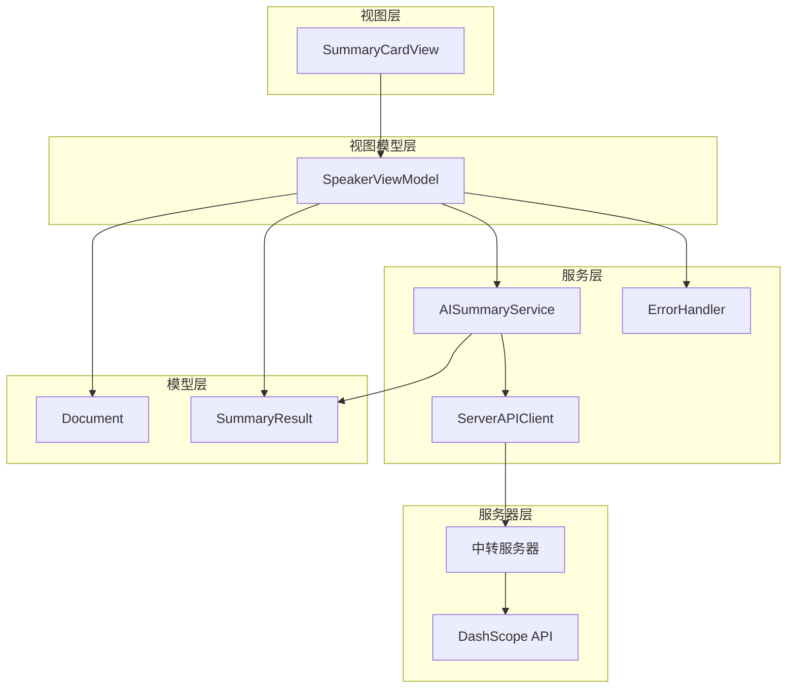
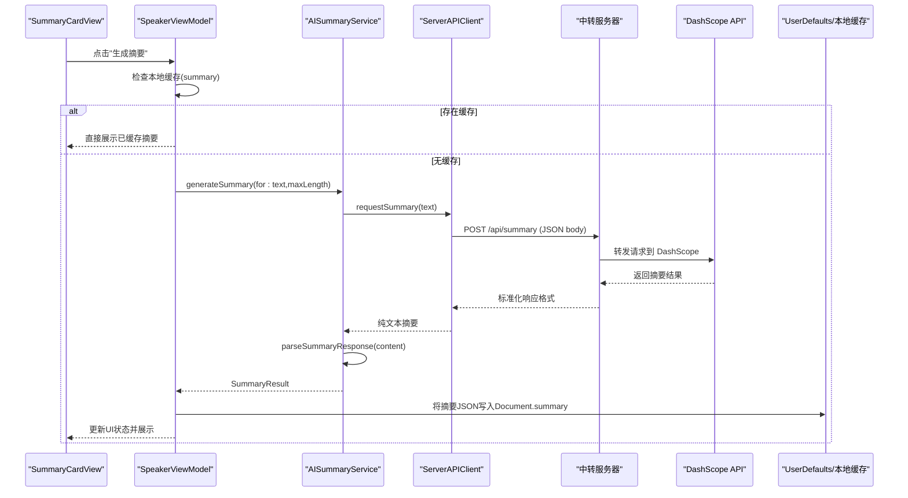
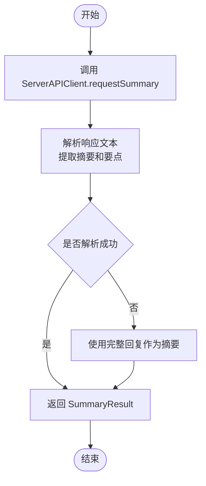
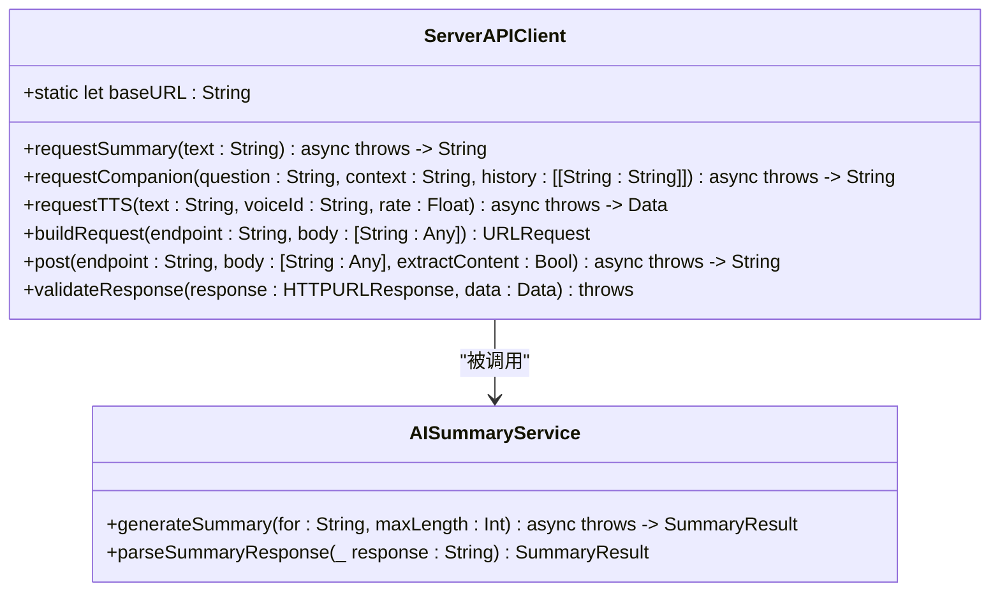
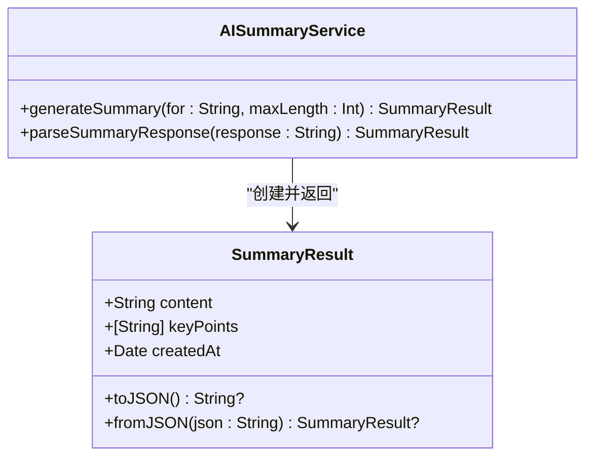
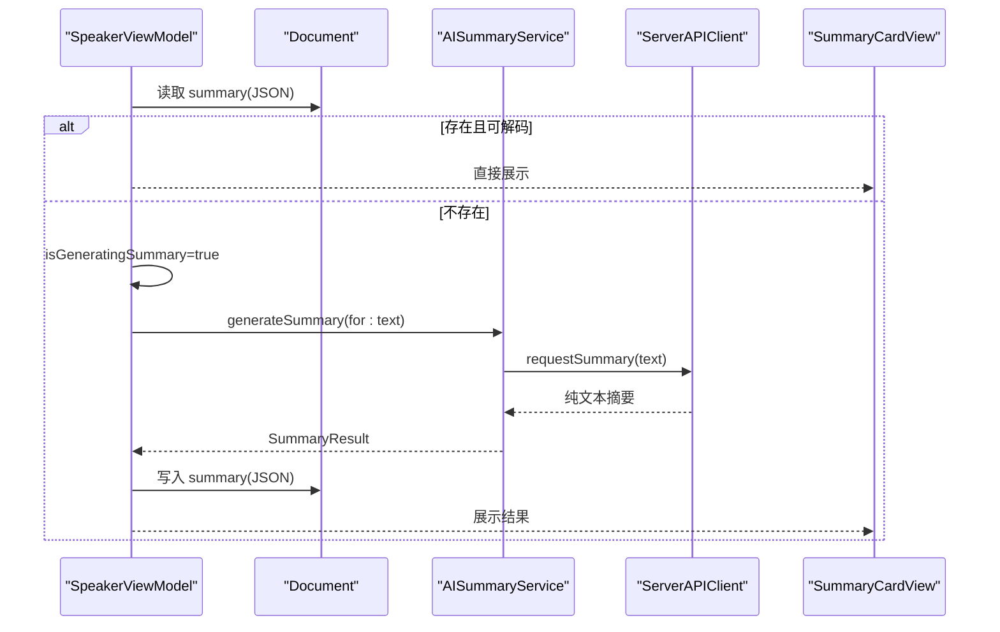
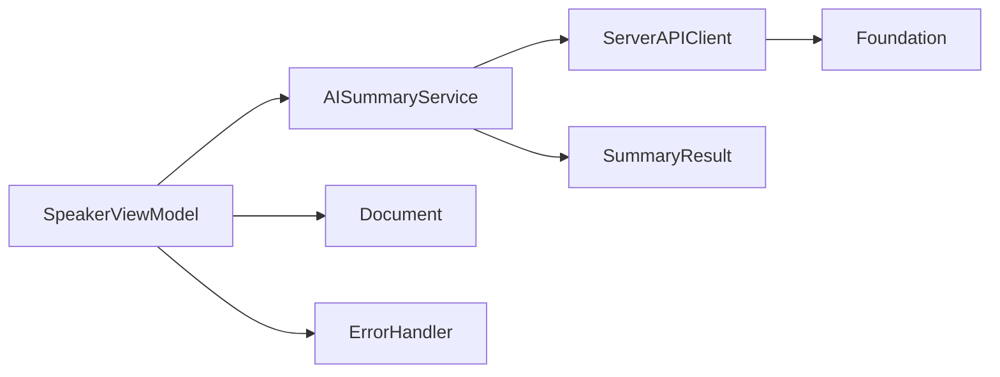

# 阿里云 DashScope API 集成

<cite>
**本文引用的文件**
- [AISummaryService.swift](file://Services/AISummaryService.swift)
- [ServerAPIClient.swift](file://Services/ServerAPIClient.swift)
- [SummaryResult.swift](file://Models/SummaryResult.swift)
- [ErrorHandler.swift](file://Services/ErrorHandler.swift)
- [SpeakerViewModel.swift](file://ViewModels/SpeakerViewModel.swift)
- [Document.swift](file://Models/Document.swift)
- [SummaryCardView.swift](file://Views/SummaryCardView.swift)
</cite>

## 更新摘要
**变更内容**
- 移除了直接的DashScope客户端API密钥管理和HTTP请求处理
- 引入ServerAPIClient作为统一的中转层，所有AI请求都通过服务器中转
- 简化了AISummaryService的实现，专注于响应解析逻辑
- 增强了错误处理机制，支持更丰富的错误类型和用户友好的提示信息

## 目录
1. [简介](#简介)
2. [项目结构](#项目结构)
3. [核心组件](#核心组件)
4. [架构总览](#架构总览)
5. [详细组件分析](#详细组件分析)
6. [依赖关系分析](#依赖关系分析)
7. [性能与优化建议](#性能与优化建议)
8. [故障排查指南](#故障排查指南)
9. [结论](#结论)
10. [附录：使用示例与最佳实践](#附录使用示例与最佳实践)

## 简介
本文件面向开发者，系统化说明在 iOS 应用中集成阿里云 DashScope（通义千问）文本生成能力的实现方案。重点围绕 AISummaryService 的调用流程、ServerAPIClient 中转层的架构设计、响应解析策略、安全配置管理、网络错误处理与超时设置，以及摘要提示词构建与结果解析算法进行深度解读，并提供完整的调用示例路径与最佳实践建议。

**重要变更**：系统已从直接客户端调用改为通过 ServerAPIClient 中转，所有 API Key 和敏感配置均存储在服务器端，提升了安全性和可维护性。

## 项目结构
本项目采用分层组织方式，引入了新的中转层架构：
- Services：服务层封装外部能力（如 AI 摘要、语音合成、错误处理等），新增 ServerAPIClient 中转层
- Models：数据模型（文档、摘要结果等）
- ViewModels：业务编排与状态管理
- Views：UI 展示与交互

**图表来源**
- [AISummaryService.swift:1-90](file://Services/AISummaryService.swift#L1-L90)
- [ServerAPIClient.swift:1-203](file://Services/ServerAPIClient.swift#L1-L203)
- [SpeakerViewModel.swift:198-229](file://ViewModels/SpeakerViewModel.swift#L198-L229)
- [Document.swift:65-66](file://Models/Document.swift#L65-L66)
- [SummaryResult.swift:1-33](file://Models/SummaryResult.swift#L1-L33)

**章节来源**
- [AISummaryService.swift:1-90](file://Services/AISummaryService.swift#L1-L90)
- [ServerAPIClient.swift:1-203](file://Services/ServerAPIClient.swift#L1-L203)
- [SpeakerViewModel.swift:198-229](file://ViewModels/SpeakerViewModel.swift#L198-L229)
- [Document.swift:1-115](file://Models/Document.swift#L1-L115)
- [SummaryResult.swift:1-33](file://Models/SummaryResult.swift#L1-L33)

## 核心组件
- **AISummaryService**：简化的摘要服务，专注于响应解析和业务逻辑，不再处理底层网络请求。
- **ServerAPIClient**：新的中转客户端，负责所有 HTTP 请求、错误处理和与中转服务器的通信。
- **SummaryResult**：摘要结果的数据载体，支持 JSON 序列化用于缓存。
- **SpeakerViewModel**：业务编排器，负责触发摘要生成、异步任务调度、结果缓存与 UI 状态更新。
- **ErrorHandler**：统一错误日志与弹窗提示。
- **Document**：文档实体，包含摘要缓存字段。

**章节来源**
- [AISummaryService.swift:1-90](file://Services/AISummaryService.swift#L1-L90)
- [ServerAPIClient.swift:1-203](file://Services/ServerAPIClient.swift#L1-L203)
- [SummaryResult.swift:1-33](file://Models/SummaryResult.swift#L1-L33)
- [SpeakerViewModel.swift:198-229](file://ViewModels/SpeakerViewModel.swift#L198-L229)
- [ErrorHandler.swift:1-53](file://Services/ErrorHandler.swift#L1-L53)
- [Document.swift:65-66](file://Models/Document.swift#L65-L66)

## 架构总览
整体调用链路从 UI 触发到服务层完成网络请求与解析，再回写 ViewModel 状态并持久化摘要。新架构通过 ServerAPIClient 实现了更好的解耦和安全控制。

**图表来源**
- [AISummaryService.swift:20-23](file://Services/AISummaryService.swift#L20-L23)
- [ServerAPIClient.swift:27-33](file://Services/ServerAPIClient.swift#L27-L33)
- [SpeakerViewModel.swift:201-229](file://ViewModels/SpeakerViewModel.swift#L201-L229)
- [Document.swift:65-66](file://Models/Document.swift#L65-L66)

## 详细组件分析

### AISummaryService 简化实现原理
**重大变更**：服务层现在专注于业务逻辑，不再处理底层网络请求。

- **单例模式**：通过 shared 暴露全局实例。
- **职责分离**：仅负责调用 ServerAPIClient 和解析响应数据。
- **响应解析**：
  - 文本解析：按"【摘要】"和"【要点】"分割内容，支持多种要点列表格式（"- "、"• "、"· "或"数字."）。
  - 兜底策略：若未解析到任何内容，则将整段回复作为摘要。
- **错误映射**：将网络与业务异常映射为 LocalizedError，便于上层统一处理。

**图表来源**
- [AISummaryService.swift:20-23](file://Services/AISummaryService.swift#L20-L23)
- [AISummaryService.swift:25-69](file://Services/AISummaryService.swift#L25-L69)

**章节来源**
- [AISummaryService.swift:1-90](file://Services/AISummaryService.swift#L1-L90)

### ServerAPIClient 中转层实现
**新增组件**：统一的 HTTP 客户端，负责所有与服务器的通信。

- **单例模式**：通过 shared 暴露全局实例，避免重复初始化 URLSession。
- **配置管理**：
  - 基础 URL：通过 baseURL 常量配置中转服务器地址。
  - 超时设置：请求超时 60 秒，资源超时 120 秒。
- **请求处理**：
  - 自动文本截断：超过 8000 字符的文本自动截断。
  - 统一请求格式：POST /api/summary，JSON 格式传输。
  - 响应标准化：兼容多种响应格式（通用 content 字段和 DashScope 原始格式）。
- **错误处理**：
  - 分类错误：invalidResponse、unauthorized、quotaExceeded、serverError、networkError。
  - 用户友好提示：每个错误类型都有清晰的中文描述。

**图表来源**
- [ServerAPIClient.swift:6-23](file://Services/ServerAPIClient.swift#L6-L23)
- [ServerAPIClient.swift:27-33](file://Services/ServerAPIClient.swift#L27-L33)
- [AISummaryService.swift:6-23](file://Services/AISummaryService.swift#L6-L23)

**章节来源**
- [ServerAPIClient.swift:1-203](file://Services/ServerAPIClient.swift#L1-L203)

### 请求参数配置与响应处理
**简化后的请求流程**：
- 客户端发送：`{ "text": "文档内容(最多8000字符)" }`
- 服务器处理：转发到 DashScope，处理 API Key 和模型配置
- 响应格式：支持两种格式
  - 通用格式：`{ "content": "摘要文本" }`
  - DashScope 原始格式：`{ "output": { "choices": [{ "message": { "content": "..." }}] }}`

**章节来源**
- [ServerAPIClient.swift:27-33](file://Services/ServerAPIClient.swift#L27-L33)
- [ServerAPIClient.swift:127-141](file://Services/ServerAPIClient.swift#L127-L141)

### 响应解析逻辑与数据结构
- **文本解析规则**：
  - 以"【摘要】"定位摘要正文，直到"【要点】"前。
  - 以"【要点】"定位要点列表，支持多种前缀与编号格式。
  - 若未解析到任何内容，则将整段回复作为摘要。
- **结果模型**：
  - SummaryResult：content（摘要正文）、keyPoints（要点数组）、createdAt（时间戳），支持 toJSON/fromJSON 用于持久化。

**图表来源**
- [AISummaryService.swift:20-23](file://Services/AISummaryService.swift#L20-L23)
- [AISummaryService.swift:25-69](file://Services/AISummaryService.swift#L25-L69)
- [SummaryResult.swift:1-33](file://Models/SummaryResult.swift#L1-L33)

**章节来源**
- [AISummaryService.swift:25-69](file://Services/AISummaryService.swift#L25-L69)
- [SummaryResult.swift:1-33](file://Models/SummaryResult.swift#L1-L33)

### 安全配置管理与部署
**重大改进**：移除了客户端 API Key 管理，所有敏感配置移至服务器端。

- **服务器端配置**：
  - API Key 存储：在服务器上安全存储 DashScope API Key
  - 模型配置：qwen-plus 模型参数在服务器端配置
  - 访问控制：可通过中间件添加应用级身份验证
- **客户端配置**：
  - 服务器地址：通过 `ServerAPIClient.baseURL` 配置
  - 无需客户端 API Key：所有认证由服务器处理
- **部署要求**：
  - 需要部署中转服务器（阿里云或其他云服务）
  - 服务器需实现 `/api/summary`、`/api/companion`、`/api/tts` 等接口

**章节来源**
- [ServerAPIClient.swift:11-14](file://Services/ServerAPIClient.swift#L11-L14)
- [ServerAPIClient.swift:101-110](file://Services/ServerAPIClient.swift#L101-L110)

### 网络请求的错误处理机制与超时设置
**增强的错误处理**：
- **超时设置**：请求超时 60 秒，资源超时 120 秒。
- **错误分类**：
  - invalidResponse：响应结构不符合预期。
  - unauthorized：认证失败（401/403）。
  - quotaExceeded：配额超限（402/429）。
  - serverError：其他服务器错误。
  - networkError：底层网络错误。
- **用户友好提示**：每个错误类型都有清晰的中文描述。
- **上层处理**：SpeakerViewModel 捕获异常并更新 summaryError；ErrorHandler 可统一打印日志与弹窗提示。

**章节来源**
- [ServerAPIClient.swift:161-173](file://Services/ServerAPIClient.swift#L161-L173)
- [ServerAPIClient.swift:178-202](file://Services/ServerAPIClient.swift#L178-L202)
- [AISummaryService.swift:74-89](file://Services/AISummaryService.swift#L74-L89)
- [SpeakerViewModel.swift:222-227](file://ViewModels/SpeakerViewModel.swift#L222-L227)
- [ErrorHandler.swift:21-35](file://Services/ErrorHandler.swift#L21-L35)

### 结果解析算法
- **摘要正文**：截取"【摘要】"之后至"【要点】"之前的内容，去除首尾空白。
- **关键要点**：
  - 支持前缀"- "、"• "、"· "。
  - 支持编号格式"1. "、"2. "等。
  - 过滤空行与无效条目。
- **兜底策略**：若未解析到任何内容，将整段回复作为摘要正文。

**章节来源**
- [AISummaryService.swift:25-69](file://Services/AISummaryService.swift#L25-L69)

### 调用示例与异步处理
- **触发入口**：SpeakerViewModel.generateSummary()
- **异步流程**：
  - 检查本地缓存（Document.summary）
  - 若无缓存，开启 Task 异步调用 AISummaryService
  - 成功：更新 summaryResult、关闭 isGeneratingSummary、将结果 JSON 写入 Document.summary
  - 失败：记录 summaryError、关闭 isGeneratingSummary
- **UI 展示**：SummaryCardView 根据状态显示加载中、错误或结果卡片。

**图表来源**
- [SpeakerViewModel.swift:201-229](file://ViewModels/SpeakerViewModel.swift#L201-L229)
- [AISummaryService.swift:20-23](file://Services/AISummaryService.swift#L20-L23)
- [ServerAPIClient.swift:27-33](file://Services/ServerAPIClient.swift#L27-L33)
- [Document.swift:65-66](file://Models/Document.swift#L65-L66)
- [SummaryCardView.swift:1-91](file://Views/SummaryCardView.swift#L1-L91)

**章节来源**
- [SpeakerViewModel.swift:201-229](file://ViewModels/SpeakerViewModel.swift#L201-L229)
- [SummaryCardView.swift:1-197](file://Views/SummaryCardView.swift#L1-L197)

## 依赖关系分析
**更新后的依赖关系**：
- **AISummaryService 依赖**：
  - ServerAPIClient（网络请求中转）
  - SummaryResult（结果模型）
- **ServerAPIClient 依赖**：
  - Foundation（URLSession、JSONSerialization）
- **SpeakerViewModel 依赖**：
  - AISummaryService（摘要生成）
  - Document（摘要缓存）
  - ErrorHandler（错误处理）

**图表来源**
- [AISummaryService.swift:1-90](file://Services/AISummaryService.swift#L1-L90)
- [ServerAPIClient.swift:1-203](file://Services/ServerAPIClient.swift#L1-L203)
- [SpeakerViewModel.swift:198-229](file://ViewModels/SpeakerViewModel.swift#L198-L229)

**章节来源**
- [AISummaryService.swift:1-90](file://Services/AISummaryService.swift#L1-L90)
- [ServerAPIClient.swift:1-203](file://Services/ServerAPIClient.swift#L1-L203)
- [SpeakerViewModel.swift:198-229](file://ViewModels/SpeakerViewModel.swift#L198-L229)

## 性能与优化建议
- **文本截断策略**：客户端和服务端双重截断至 8000 字符，建议在更高层面对超长文档进行分段摘要或分块处理，以降低单次请求成本与延迟。
- **并发控制**：避免同时发起多个摘要请求，可通过队列或信号量限制并发度，防止资源争用。
- **缓存命中**：充分利用 Document.summary 缓存，减少不必要的网络请求。
- **连接复用**：使用共享 URLSession 已具备连接复用优势，无需额外配置。
- **重试与退避**：对网络错误实施指数退避重试，提高鲁棒性。
- **服务器端优化**：
  - 实现请求缓存机制，避免重复请求相同内容
  - 添加速率限制，防止滥用
  - 实现负载均衡，提高可用性

## 故障排查指南
- **常见错误与定位**：
  - invalidResponse：检查中转服务器返回格式是否符合预期。
  - unauthorized：确认中转服务器配置正确，检查应用身份验证。
  - quotaExceeded：检查中转服务器的 DashScope API 配额使用情况。
  - serverError：查看中转服务器日志，核对后端服务状态。
  - networkError：检查网络连接和中转服务器可达性。
- **日志与提示**：
  - ErrorHandler 提供统一日志与弹窗，便于快速定位问题。
  - 可在调用处增加上下文标签，帮助区分不同业务场景的错误来源。
- **部署相关问题**：
  - 确认中转服务器地址配置正确
  - 检查防火墙和网络策略
  - 验证 HTTPS 证书配置

**章节来源**
- [ServerAPIClient.swift:161-173](file://Services/ServerAPIClient.swift#L161-L173)
- [ServerAPIClient.swift:178-202](file://Services/ServerAPIClient.swift#L178-L202)
- [ErrorHandler.swift:21-35](file://Services/ErrorHandler.swift#L21-L35)

## 结论
本次架构升级通过引入 ServerAPIClient 中转层，实现了更好的安全性、可维护性和扩展性。新的架构将敏感的 API Key 管理和复杂的网络请求处理转移到服务器端，客户端只需关注业务逻辑和数据解析。配合完善的错误处理、超时设置与缓存策略，系统在可用性与性能方面达到良好平衡。建议在生产环境中进一步引入重试、限流与监控，以提升稳定性与可观测性。

## 附录：使用示例与最佳实践

- **基本调用示例（路径引用）**
  - 触发摘要生成：[SpeakerViewModel.generateSummary:201-229](file://ViewModels/SpeakerViewModel.swift#L201-L229)
  - 服务层接口：[AISummaryService.generateSummary:20-23](file://Services/AISummaryService.swift#L20-L23)
  - 结果展示：[SummaryCardView:1-197](file://Views/SummaryCardView.swift#L1-L197)

- **中转层配置（路径引用）**
  - 服务器地址配置：[ServerAPIClient.baseURL:11-14](file://Services/ServerAPIClient.swift#L11-L14)
  - 请求超时设置：[ServerAPIClient.init:18-23](file://Services/ServerAPIClient.swift#L18-L23)
  - 请求构建方法：[ServerAPIClient.buildRequest:101-110](file://Services/ServerAPIClient.swift#L101-L110)

- **错误处理与用户体验（路径引用）**
  - 错误分类定义：[ServerAPIError:178-202](file://Services/ServerAPIClient.swift#L178-L202)
  - 响应验证逻辑：[ServerAPIClient.validateResponse:161-173](file://Services/ServerAPIClient.swift#L161-L173)
  - 统一错误处理：[ErrorHandler.handle:21-35](file://Services/ErrorHandler.swift#L21-L35)

- **响应解析与数据模型（路径引用）**
  - 响应解析算法：[AISummaryService.parseSummaryResponse:25-69](file://Services/AISummaryService.swift#L25-L69)
  - 摘要结果模型：[SummaryResult:1-33](file://Models/SummaryResult.swift#L1-L33)
  - 摘要缓存读写：[Document.summary:65-66](file://Models/Document.swift#L65-L66)

- **最佳实践清单**
  - 始终配置正确的中转服务器地址，避免运行时错误。
  - 合理设置请求超时时间，兼顾用户体验和系统稳定性。
  - 对网络错误实施重试与退避，提升用户体验。
  - 利用本地缓存减少重复请求，降低延迟与成本。
  - 实现服务端请求缓存，避免重复处理相同内容。
  - 使用统一错误处理与日志记录，便于问题追踪与复盘。
  - 在生产环境部署时，确保 HTTPS 配置正确，保障数据传输安全。
  - 定期监控中转服务器性能和可用性，及时发现问题。