# 数据模型设计

<cite>
**本文引用的文件**
- [KnowledgeApp.swift](file://App/KnowledgeApp.swift)
- [Document.swift](file://Models/Document.swift)
- [VoiceConfig.swift](file://Models/VoiceConfig.swift)
- [SummaryResult.swift](file://Models/SummaryResult.swift)
- [ClonedVoice.swift](file://Models/ClonedVoice.swift)
- [PlaybackState.swift](file://Models/PlaybackState.swift)
- [EdgeTTSService.swift](file://Services/EdgeTTSService.swift)
- [EdgeTTSSynthesizer.swift](file://Services/EdgeTTSSynthesizer.swift)
- [AISummaryService.swift](file://Services/AISummaryService.swift)
- [CosyVoiceService.swift](file://Services/CosyVoiceService.swift)
- [SpeakerViewModel.swift](file://ViewModels/SpeakerViewModel.swift)
- [EdgeVoiceSelectView.swift](file://Views/EdgeVoiceSelectView.swift)
- [SettingsView.swift](file://Views/SettingsView.swift)
- [DocumentListView.swift](file://Views/DocumentListView.swift)
- [ContentView.swift](file://Views/ContentView.swift)
</cite>

## 更新摘要
**所做更改**
- 更新了 VoiceConfig 配置结构，新增 Edge TTS 引擎支持和 edgeVoiceId 字段
- 扩展了 TTSEngine 枚举，新增 requiresNetwork 属性和 edgeTTS 引擎类型
- 新增了 Edge TTS 服务层和音色选择视图的数据模型说明
- 更新了多引擎架构的数据流图和组件关系
- 完善了语音合成引擎的持久化策略和约束规则

## 目录
1. [简介](#简介)
2. [项目结构](#项目结构)
3. [核心组件](#核心组件)
4. [架构总览](#架构总览)
5. [详细组件分析](#详细组件分析)
6. [依赖关系分析](#依赖关系分析)
7. [性能与缓存策略](#性能与缓存策略)
8. [故障排查指南](#故障排查指南)
9. [结论](#结论)
10. [附录](#附录)

## 简介
本文件面向 Knowledge 应用的数据模型，系统性梳理基于 SwiftData 的持久化方案与相关配置。重点覆盖以下方面：
- 核心实体与数据结构：Document、VoiceConfig、SummaryResult、ClonedVoice、PlaybackState 等
- 字段定义、关系映射与约束规则
- 数据验证逻辑与业务规则实现
- 数据迁移策略与版本管理现状
- 数据库 Schema 图与样例数据
- 数据访问模式与缓存策略最佳实践
- 数据完整性、一致性与安全性保障建议

## 项目结构
当前仓库采用按功能域组织的方式，数据模型集中在 Models 目录；SwiftData 容器在应用入口初始化；视图层通过 @Query/@ModelContext 进行数据读写；服务层负责外部 API 调用与结果解析；ViewModel 作为门面协调播放、摘要生成与配置持久化。

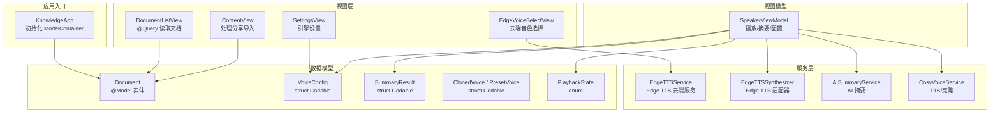

**图表来源**
- [KnowledgeApp.swift:10-18](file://App/KnowledgeApp.swift#L10-L18)
- [Document.swift:54-114](file://Models/Document.swift#L54-L114)
- [VoiceConfig.swift:52-82](file://Models/VoiceConfig.swift#L52-L82)
- [SummaryResult.swift:5-32](file://Models/SummaryResult.swift#L5-L32)
- [ClonedVoice.swift:33-117](file://Models/ClonedVoice.swift#L33-L117)
- [PlaybackState.swift:3-8](file://Models/PlaybackState.swift#L3-L8)
- [EdgeTTSService.swift:7-134](file://Services/EdgeTTSService.swift#L7-L134)
- [EdgeTTSSynthesizer.swift:7-37](file://Services/EdgeTTSSynthesizer.swift#L7-L37)
- [EdgeVoiceSelectView.swift:6-174](file://Views/EdgeVoiceSelectView.swift#L6-L174)
- [SettingsView.swift:120-319](file://Views/SettingsView.swift#L120-L319)
- [DocumentListView.swift:9-106](file://Views/DocumentListView.swift#L9-L106)
- [ContentView.swift:58-96](file://Views/ContentView.swift#L58-L96)
- [SpeakerViewModel.swift:8-54](file://ViewModels/SpeakerViewModel.swift#L8-L54)
- [AISummaryService.swift:5-34](file://Services/AISummaryService.swift#L5-L34)
- [CosyVoiceService.swift:6-27](file://Services/CosyVoiceService.swift#L6-L27)

**章节来源**
- [KnowledgeApp.swift:10-18](file://App/KnowledgeApp.swift#L10-L18)
- [Document.swift:54-114](file://Models/Document.swift#L54-L114)
- [DocumentListView.swift:9-106](file://Views/DocumentListView.swift#L9-L106)
- [ContentView.swift:58-96](file://Views/ContentView.swift#L58-L96)

## 核心组件
本节聚焦于数据模型的定义、用途与约束。

### Document（SwiftData 实体）
- 标识与元信息：id、title、fileName、fileTypeRaw（持久化用）、fileType（计算属性）
- 内容：extractedText（文本正文）
- 阅读状态：currentPosition、totalLength（计算属性）、progress（计算属性）
- 时间戳：lastOpenedDate、createdAt
- 偏好：isFavorite
- AI 摘要：summary（JSON 字符串缓存）
- 音频路径：podcastAudioPath（V3.0 扩展）
- 约束与建议：
  - title、fileName 应非空且长度合理
  - extractedText 可为空但需校验后再参与进度计算
  - currentPosition 应在 [0, totalLength] 范围内
  - summary 为 JSON 字符串，需保证可解码为 SummaryResult

### VoiceConfig（配置对象）
**已更新** 新增 Edge TTS 引擎支持和相关字段

- 引擎选择：engine（系统 TTS、Edge TTS、Knowledge Voice、传统系统 TTS）
- 语音参数：rate、pitchMultiplier、volume、language、voiceIdentifier
- 音色 ID：clonedVoiceId、presetVoiceId、**edgeVoiceId**（新增）
- 默认值与预设档位：defaultConfig、speedPresets
- 约束与建议：
  - rate 范围 0.1~2.0，超出需裁剪
  - volume/pitchMultiplier 需在合理区间
  - language 使用 IETF BCP 47 格式
  - **edgeVoiceId** 仅在 engine 为 .edgeTTS 时有效，存储如 "zh-CN-XiaoxiaoNeural" 的音色 ID

### TTSEngine 枚举（已扩展）
**已更新** 新增 requiresNetwork 属性和 edgeTTS 引擎类型

- system：iOS 17+ Neural TTS（离线/免费）
- **edgeTTS**：Edge TTS 云端（在线/免费）**新增**
- knowledgeVoice：Knowledge Voice（在线/Premium）
- legacySystem：传统系统 TTS（离线/兼容）
- **requiresNetwork**：计算属性，标识是否需要网络连接
  - edgeTTS、knowledgeVoice：需要网络
  - system、legacySystem：无需网络

### SummaryResult（AI 摘要结果）
- content：摘要正文
- keyPoints：关键要点数组
- createdAt：生成时间
- 序列化：toJSON/fromJSON 用于持久化到 Document.summary

### ClonedVoice / PresetVoice（音色模型）
- ClonedVoice：用户克隆音色的 id、name、description、createdAt、sampleAudioPath
- PresetVoice：内置预设音色 id、name、description、category、language、sampleAudioURL
- 持久化：VoiceStore 使用 UserDefaults 保存列表与选中项

### PlaybackState（播放状态）
- idle、playing、paused、finished

**章节来源**
- [Document.swift:54-114](file://Models/Document.swift#L54-L114)
- [VoiceConfig.swift:52-82](file://Models/VoiceConfig.swift#L52-L82)
- [VoiceConfig.swift:5-50](file://Models/VoiceConfig.swift#L5-L50)
- [SummaryResult.swift:5-32](file://Models/SummaryResult.swift#L5-L32)
- [ClonedVoice.swift:33-117](file://Models/ClonedVoice.swift#L33-L117)
- [PlaybackState.swift:3-8](file://Models/PlaybackState.swift#L3-L8)

## 架构总览
下图展示从 UI 到数据层的整体流程，包括文档导入、查询、播放控制、AI 摘要生成与缓存、以及多引擎语音合成的集成。

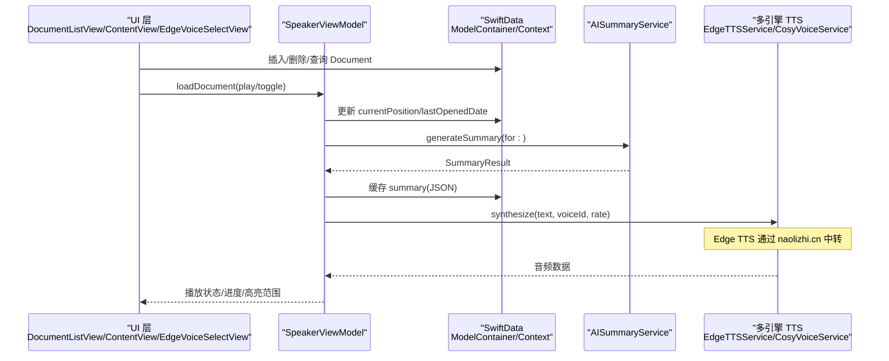

**图表来源**
- [DocumentListView.swift:99-145](file://Views/DocumentListView.swift#L99-L145)
- [ContentView.swift:58-96](file://Views/ContentView.swift#L58-L96)
- [EdgeVoiceSelectView.swift:115-121](file://Views/EdgeVoiceSelectView.swift#L115-L121)
- [SpeakerViewModel.swift:81-106](file://ViewModels/SpeakerViewModel.swift#L81-L106)
- [SpeakerViewModel.swift:175-203](file://ViewModels/SpeakerViewModel.swift#L175-L203)
- [AISummaryService.swift:25-34](file://Services/AISummaryService.swift#L25-L34)
- [CosyVoiceService.swift:27-88](file://Services/CosyVoiceService.swift#L27-L88)
- [EdgeTTSService.swift:63-92](file://Services/EdgeTTSService.swift#L63-L92)

## 详细组件分析

### Document 实体与 SwiftData 集成
- 实体定义与计算属性
  - fileType 由 fileTypeRaw 派生，便于枚举类型与持久化兼容
  - totalLength 与 progress 提供阅读进度计算
- 生命周期与约束
  - 建议在创建时确保 title、fileName 非空
  - 对 extractedText 做长度限制与编码校验
  - currentPosition 写入前需归一化至 [0, totalLength]
- 与视图交互
  - DocumentListView 使用 @Query 排序并渲染列表
  - 通过 modelContext.insert/save/delete 完成增删改查

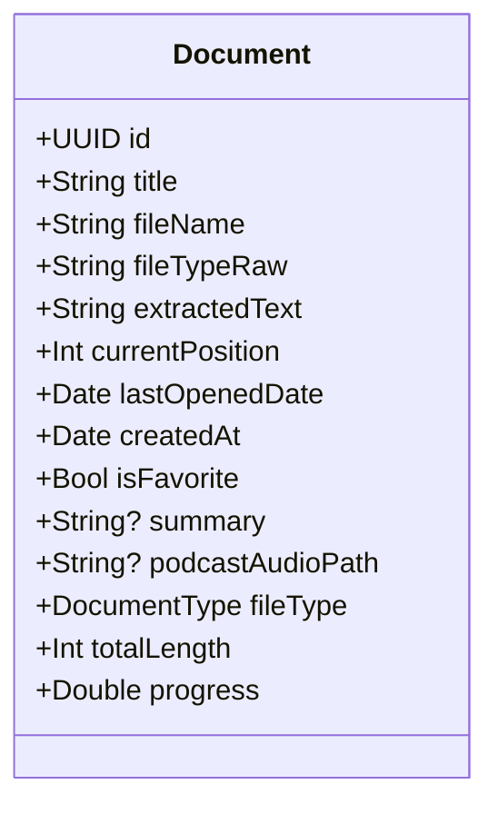

**图表来源**
- [Document.swift:54-114](file://Models/Document.swift#L54-L114)

**章节来源**
- [Document.swift:54-114](file://Models/Document.swift#L54-L114)
- [DocumentListView.swift:9-106](file://Views/DocumentListView.swift#L9-L106)

### VoiceConfig 配置与多引擎支持
**已更新** 新增 Edge TTS 引擎支持和 edgeVoiceId 字段

- 配置项说明
  - engine：系统 TTS、Edge TTS、Knowledge Voice、传统系统 TTS
  - rate、pitchMultiplier、volume、language、voiceIdentifier
  - clonedVoiceId、presetVoiceId、**edgeVoiceId**（新增）
- 持久化策略
  - SpeakerViewModel 将 VoiceConfig 序列化为 JSON 存入 UserDefaults
  - 切换引擎后自动保存并重新绑定回调
- 约束与校验
  - 对 rate/volume/pitchMultiplier 设置边界检查
  - language 使用标准语言标签
  - **edgeVoiceId** 仅在 Edge TTS 引擎下有效

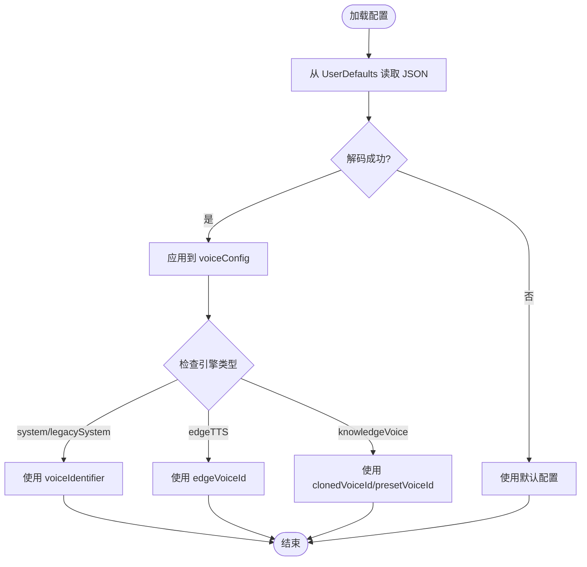

**图表来源**
- [SpeakerViewModel.swift:302-312](file://ViewModels/SpeakerViewModel.swift#L302-L312)
- [VoiceConfig.swift:52-82](file://Models/VoiceConfig.swift#L52-L82)

**章节来源**
- [SpeakerViewModel.swift:302-312](file://ViewModels/SpeakerViewModel.swift#L302-L312)
- [VoiceConfig.swift:52-82](file://Models/VoiceConfig.swift#L52-L82)

### Edge TTS 服务层数据模型
**新增** Edge TTS 云端语音合成服务的数据结构

- EdgeVoice 结构体
  - id：音色标识符（如 "zh-CN-XiaoxiaoNeural"）
  - name：显示名称（如 "晓晓"）
  - gender：性别（Female/Male）
  - tag：标签（推荐、新闻、粤语等）
- 精选音色列表
  - recommendedChinese：16 种中文普通话音色
  - recommendedCantonese：3 种粤语音色
  - allVoices：全部推荐音色组合
- 服务接口
  - synthesize(text:voice:rate:)：异步合成方法
  - 返回 MP3 音频数据
  - 错误处理：EdgeTTSError 枚举

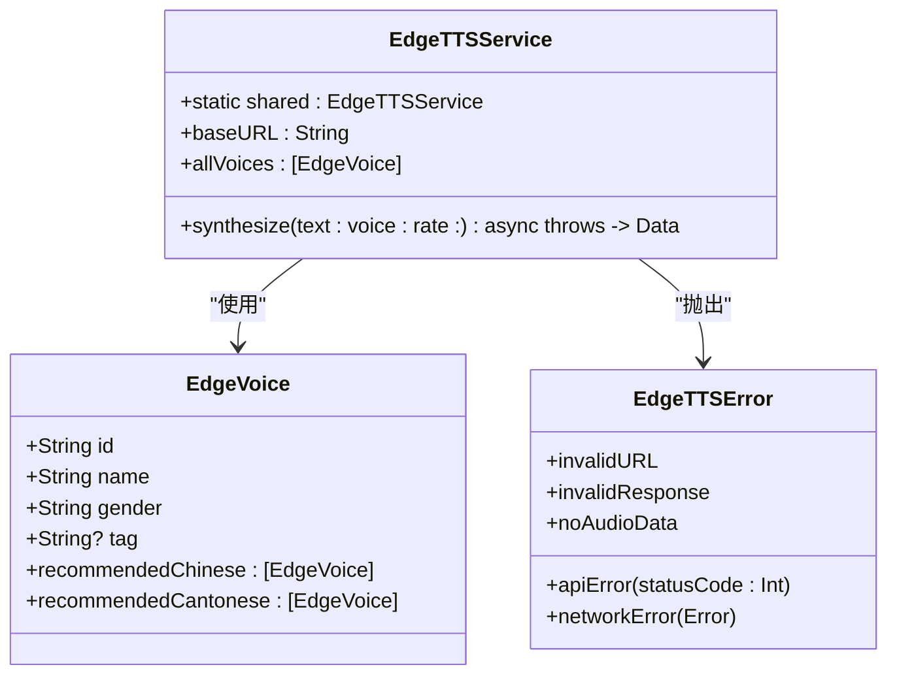

**图表来源**
- [EdgeTTSService.swift:7-134](file://Services/EdgeTTSService.swift#L7-L134)

**章节来源**
- [EdgeTTSService.swift:14-53](file://Services/EdgeTTSService.swift#L14-L53)
- [EdgeTTSService.swift:63-92](file://Services/EdgeTTSService.swift#L63-L92)
- [EdgeTTSService.swift:112-133](file://Services/EdgeTTSService.swift#L112-L133)

### Edge TTS 音色选择视图数据流
**新增** Edge TTS 音色选择界面的数据绑定和处理

- EdgeVoiceSelectView 组件
  - 监听 speakerVM.voiceConfig.edgeVoiceId 获取当前选中的音色
  - 维护 selectedVoiceId 本地状态
  - 提供试听功能和确认选择
- 数据绑定流程
  - onAppear：从 speakerVM.voiceConfig.edgeVoiceId 恢复选中状态
  - applyVoice()：更新 config.engine 为 .edgeTTS，设置 edgeVoiceId
  - testVoice()：调用 EdgeTTSService.synthesize 进行试听

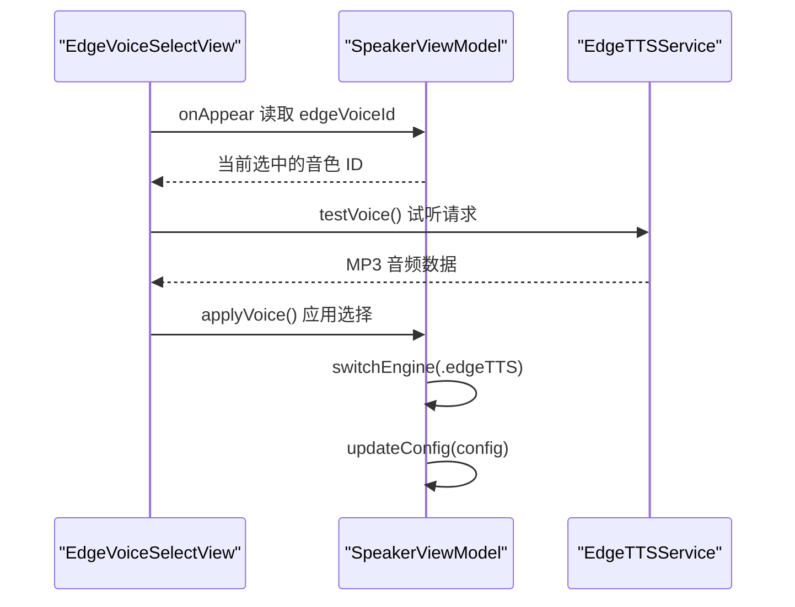

**图表来源**
- [EdgeVoiceSelectView.swift:49-53](file://Views/EdgeVoiceSelectView.swift#L49-L53)
- [EdgeVoiceSelectView.swift:115-121](file://Views/EdgeVoiceSelectView.swift#L115-L121)
- [EdgeVoiceSelectView.swift:123-152](file://Views/EdgeVoiceSelectView.swift#L123-L152)

**章节来源**
- [EdgeVoiceSelectView.swift:49-53](file://Views/EdgeVoiceSelectView.swift#L49-L53)
- [EdgeVoiceSelectView.swift:115-121](file://Views/EdgeVoiceSelectView.swift#L115-L121)
- [EdgeVoiceSelectView.swift:123-152](file://Views/EdgeVoiceSelectView.swift#L123-L152)

### SummaryResult 与 AI 摘要缓存
- 生成流程
  - 若已有缓存（Document.summary），直接返回
  - 否则调用 AISummaryService.generateSummary，解析响应为 SummaryResult
  - 将 SummaryResult.toJSON() 缓存回 Document.summary
- 错误处理
  - 网络/鉴权/响应异常均抛出结构化错误
  - ViewModel 捕获并更新 UI 错误提示

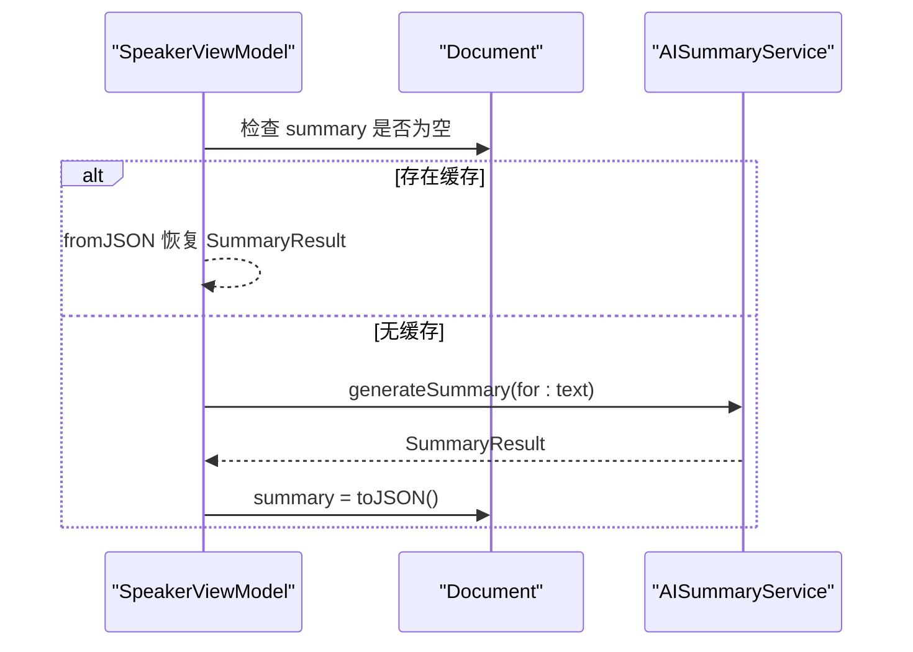

**图表来源**
- [SpeakerViewModel.swift:175-203](file://ViewModels/SpeakerViewModel.swift#L175-L203)
- [AISummaryService.swift:25-34](file://Services/AISummaryService.swift#L25-L34)
- [SummaryResult.swift:20-32](file://Models/SummaryResult.swift#L20-L32)

**章节来源**
- [SpeakerViewModel.swift:175-203](file://ViewModels/SpeakerViewModel.swift#L175-L203)
- [AISummaryService.swift:25-34](file://Services/AISummaryService.swift#L25-L34)
- [SummaryResult.swift:20-32](file://Models/SummaryResult.swift#L20-L32)

### ClonedVoice / PresetVoice 与 VoiceStore
- 数据模型
  - ClonedVoice：用户克隆音色，包含本地 sampleAudioPath
  - PresetVoice：内置预设音色，含分类与语言
- 持久化
  - VoiceStore 使用 UserDefaults 保存克隆列表与选中项
- 使用场景
  - CosyVoiceService 支持预设音色与克隆音色合成
  - SpeakerViewModel 根据 engine 选择对应合成器

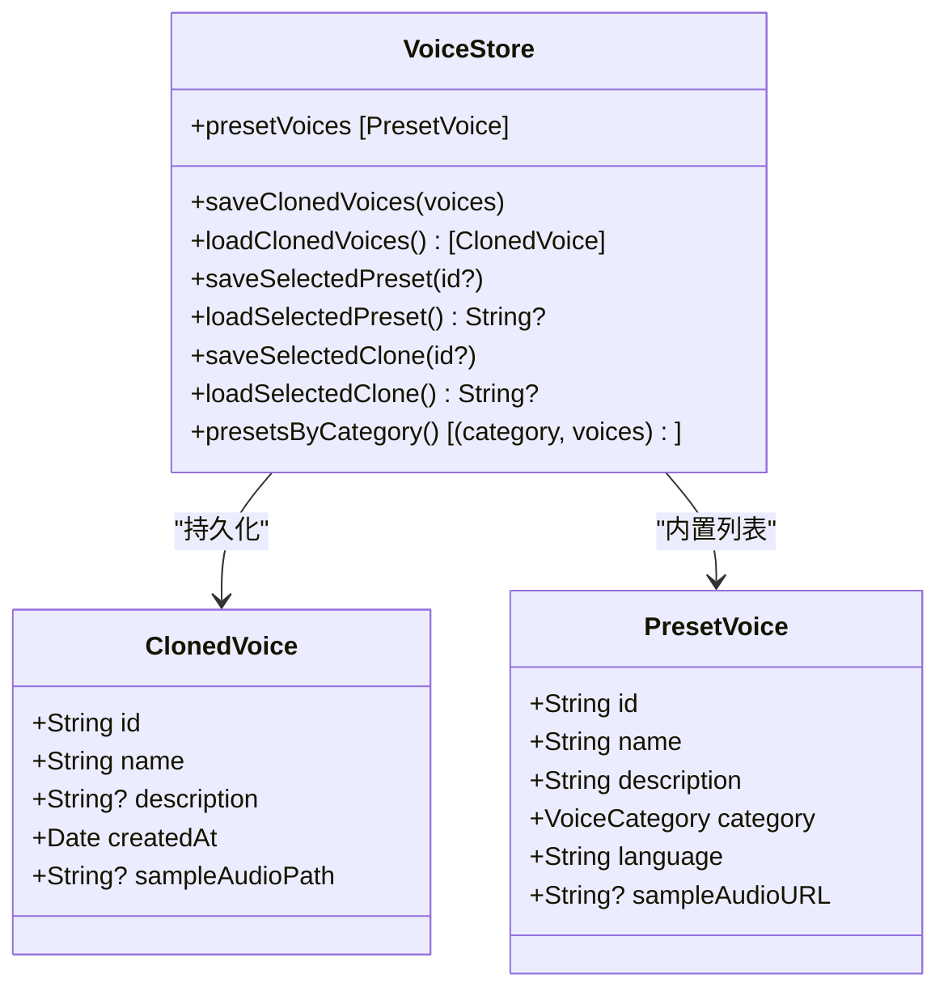

**图表来源**
- [ClonedVoice.swift:33-117](file://Models/ClonedVoice.swift#L33-L117)

**章节来源**
- [ClonedVoice.swift:33-117](file://Models/ClonedVoice.swift#L33-L117)

### PlaybackState 状态机
- 状态转换
  - idle → playing：开始播放
  - playing → paused：暂停
  - paused → playing：继续
  - playing → finished：播放结束
  - finished → idle：重置
- 与 ViewModel 同步
  - Timer 轮询合成器状态，驱动 state 变化
  - 结束时保存位置

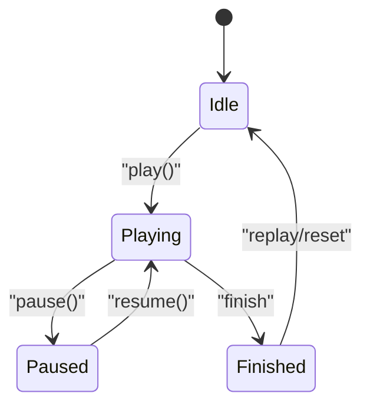

**图表来源**
- [PlaybackState.swift:3-8](file://Models/PlaybackState.swift#L3-L8)
- [SpeakerViewModel.swift:249-260](file://ViewModels/SpeakerViewModel.swift#L249-L260)

**章节来源**
- [PlaybackState.swift:3-8](file://Models/PlaybackState.swift#L3-L8)
- [SpeakerViewModel.swift:249-260](file://ViewModels/SpeakerViewModel.swift#L249-L260)

## 依赖关系分析
- 应用入口
  - KnowledgeApp 初始化 ModelContainer，注册 Document 实体
- 视图层
  - DocumentListView 使用 @Query 读取并按 lastOpenedDate 倒序显示
  - ContentView 处理分享导入，构造 Document 并插入
  - **EdgeVoiceSelectView** 处理 Edge TTS 音色选择和试听
  - **SettingsView** 集成多引擎选择和配置管理
- 视图模型
  - SpeakerViewModel 协调播放、摘要生成、配置持久化
  - **新增 EdgeTTSSynthesizer 实例** 支持 Edge TTS 引擎
- 服务层
  - AISummaryService 调用阿里云 DashScope 文本生成接口
  - CosyVoiceService 调用 TTS/克隆接口
  - **EdgeTTSService** 通过 naolizhi.cn 服务器中转调用微软 Edge TTS

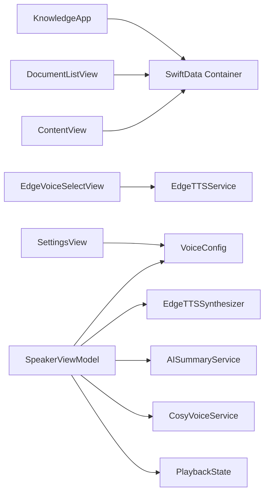

**图表来源**
- [KnowledgeApp.swift:10-18](file://App/KnowledgeApp.swift#L10-L18)
- [DocumentListView.swift:9-106](file://Views/DocumentListView.swift#L9-L106)
- [ContentView.swift:58-96](file://Views/ContentView.swift#L58-L96)
- [EdgeVoiceSelectView.swift:6-174](file://Views/EdgeVoiceSelectView.swift#L6-L174)
- [SettingsView.swift:120-319](file://Views/SettingsView.swift#L120-L319)
- [SpeakerViewModel.swift:8-54](file://ViewModels/SpeakerViewModel.swift#L8-L54)
- [EdgeTTSService.swift:7-134](file://Services/EdgeTTSService.swift#L7-L134)
- [EdgeTTSSynthesizer.swift:7-37](file://Services/EdgeTTSSynthesizer.swift#L7-L37)
- [AISummaryService.swift:5-34](file://Services/AISummaryService.swift#L5-L34)
- [CosyVoiceService.swift:6-27](file://Services/CosyVoiceService.swift#L6-L27)

**章节来源**
- [KnowledgeApp.swift:10-18](file://App/KnowledgeApp.swift#L10-L18)
- [DocumentListView.swift:9-106](file://Views/DocumentListView.swift#L9-L106)
- [ContentView.swift:58-96](file://Views/ContentView.swift#L58-L96)
- [SpeakerViewModel.swift:8-54](file://ViewModels/SpeakerViewModel.swift#L8-L54)

## 性能与缓存策略
- 文档列表查询
  - 使用 @Query 排序减少内存排序开销
  - 分页与懒加载可通过 SwiftUI 列表特性自然实现
- 摘要缓存
  - 优先读取 Document.summary，避免重复请求
  - 失败重试与退避策略可在 ViewModel 中实现
- 语音合成
  - 长文本分段合成，段间延迟避免限流
  - 本地缓存已合成的音频片段（可选）
  - **Edge TTS 服务端限制**：单次请求最长 5000 字符，客户端分段为 2000 字符
- 配置与偏好
  - VoiceConfig 与主题模式使用 UserDefaults 轻量存储
  - 大对象（如音色列表）考虑 CoreData 或 SQLite 替代
  - **Edge TTS 音色列表**：静态常量存储在 EdgeTTSService 中，避免网络请求

## 故障排查指南
- API Key 缺失或无效
  - AISummaryService/CosyVoiceService 会抛出鉴权错误
  - 建议在设置页校验并提示用户
- 网络异常
  - 统一包装为 LocalizedError，便于 UI 展示
  - **Edge TTS 网络错误**：EdgeTTSError.networkError 提供详细的错误描述
- 解析失败
  - SummaryResult.fromJSON 返回 nil 时需降级处理
- 播放状态不同步
  - 检查 onPositionChange/onRangeChange 回调是否在主线程更新
- **Edge TTS 特定问题**
  - 服务器响应异常：检查 HTTP 状态码和响应数据
  - 音频数据为空：验证合成请求参数和网络连接
  - 音色 ID 无效：确认使用的音色是否在 EdgeTTSService.recommendedChinese/Cantonese 列表中

**章节来源**
- [AISummaryService.swift:158-179](file://Services/AISummaryService.swift#L158-L179)
- [CosyVoiceService.swift:191-218](file://Services/CosyVoiceService.swift#L191-L218)
- [SummaryResult.swift:20-32](file://Models/SummaryResult.swift#L20-L32)
- [SpeakerViewModel.swift:215-266](file://ViewModels/SpeakerViewModel.swift#L215-L266)
- [EdgeTTSService.swift:112-133](file://Services/EdgeTTSService.swift#L112-L133)

## 结论
Knowledge 应用以 SwiftData 为核心持久化方案，围绕 Document 实体构建文档管理与朗读体验；VoiceConfig 与 SummaryResult 分别承担配置与摘要缓存职责；ClonedVoice/PresetVoice 配合 CosyVoiceService 提供高质量语音合成能力。**新增的 Edge TTS 引擎**通过 EdgeTTSService 和 EdgeTTSSynthesizer 实现了免费的云端语音合成，丰富了用户的语音选择。当前版本未显式实现 SwiftData 迁移，后续可按需引入迁移策略以支持模型演进。

## 附录

### 数据库 Schema 图（概念映射）
以下为概念性 Schema 映射，便于理解实体字段与关系。注意：当前仅注册了 Document 实体，其他结构多为 struct 并通过 UserDefaults 或内存缓存管理。

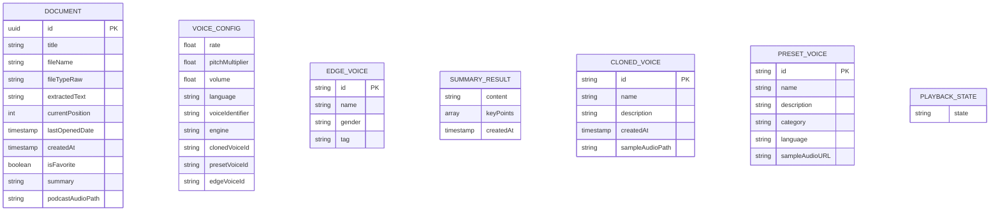

**图表来源**
- [Document.swift:54-114](file://Models/Document.swift#L54-L114)
- [VoiceConfig.swift:52-82](file://Models/VoiceConfig.swift#L52-L82)
- [EdgeTTSService.swift:16-48](file://Services/EdgeTTSService.swift#L16-L48)
- [SummaryResult.swift:5-32](file://Models/SummaryResult.swift#L5-L32)
- [ClonedVoice.swift:33-117](file://Models/ClonedVoice.swift#L33-L117)
- [PlaybackState.swift:3-8](file://Models/PlaybackState.swift#L3-L8)
- [KnowledgeApp.swift:10-18](file://App/KnowledgeApp.swift#L10-L18)

### 样例数据
- Document
  - id: UUID
  - title: "示例文档"
  - fileName: "example.pdf"
  - fileTypeRaw: "pdf"
  - extractedText: "这是一段示例文本..."
  - currentPosition: 0
  - lastOpenedDate: Date.now
  - createdAt: Date.now
  - isFavorite: false
  - summary: null
  - podcastAudioPath: null
- VoiceConfig
  - engine: edgeTTS（新增支持）
  - rate: 0.5
  - pitchMultiplier: 1.0
  - volume: 1.0
  - language: "zh-CN"
  - voiceIdentifier: null
  - clonedVoiceId: null
  - presetVoiceId: null
  - **edgeVoiceId: "zh-CN-XiaoxiaoNeural"**（新增）
- EdgeVoice
  - id: "zh-CN-XiaoxiaoNeural"
  - name: "晓晓"
  - gender: "Female"
  - tag: "推荐"
- SummaryResult
  - content: "这是摘要正文"
  - keyPoints: ["要点1", "要点2", "要点3"]
  - createdAt: Date.now
- ClonedVoice
  - id: "clone_001"
  - name: "我的音色"
  - description: "自定义描述"
  - createdAt: Date.now
  - sampleAudioPath: "/path/to/sample.wav"
- PresetVoice
  - id: "longxiaochun"
  - name: "龙小春"
  - description: "沉稳大气的男声"
  - category: male
  - language: "zh-CN"
  - sampleAudioURL: null

### 数据迁移策略与版本管理（建议）
- 现状
  - 当前仅注册 Document 实体，未显式配置迁移
- 建议方案
  - 使用 SwiftData 的迁移 API（如 schema 版本与迁移闭包）
  - 针对新增字段（如 podcastAudioPath、edgeVoiceId）提供向后兼容默认值
  - 在应用启动时检测版本并执行增量迁移
  - 对不可逆变更（如重命名字段）提供数据转换脚本
  - **Edge TTS 兼容性**：确保旧版 VoiceConfig 能正确忽略新的 edgeVoiceId 字段