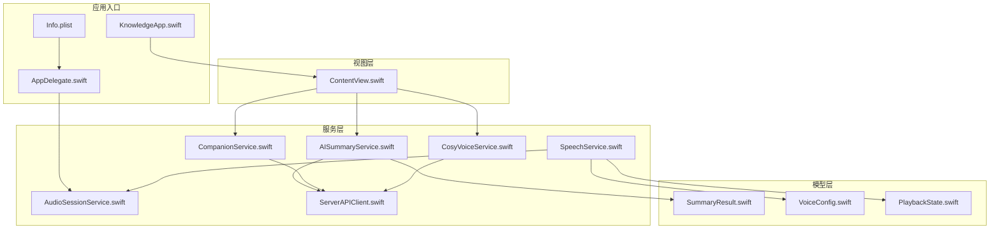
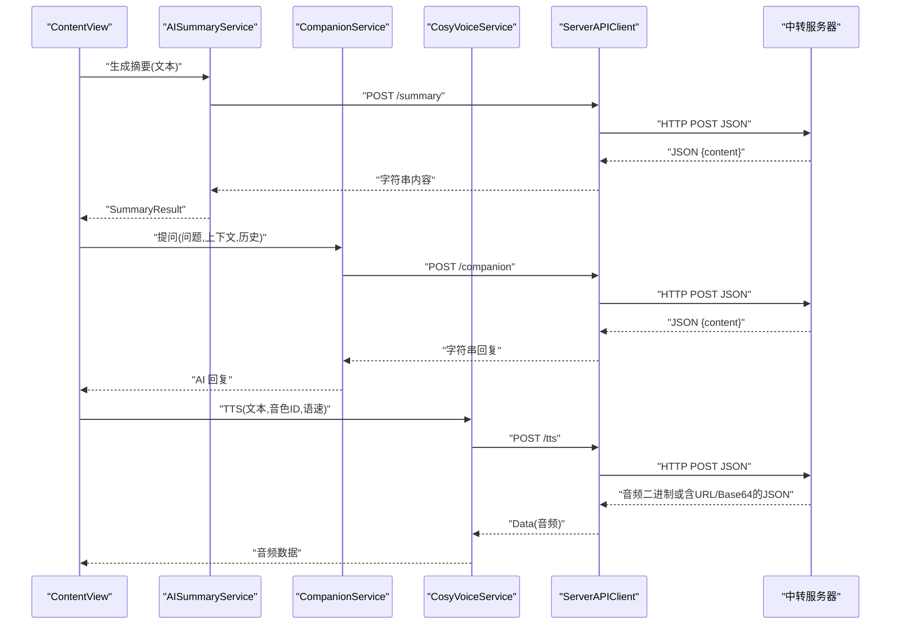
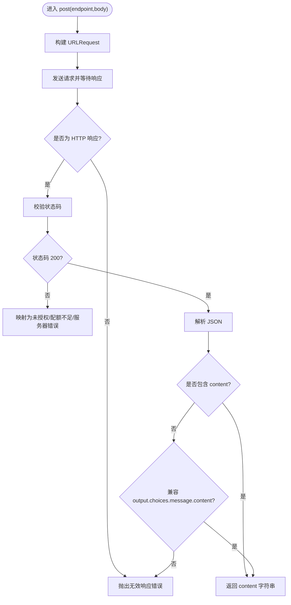
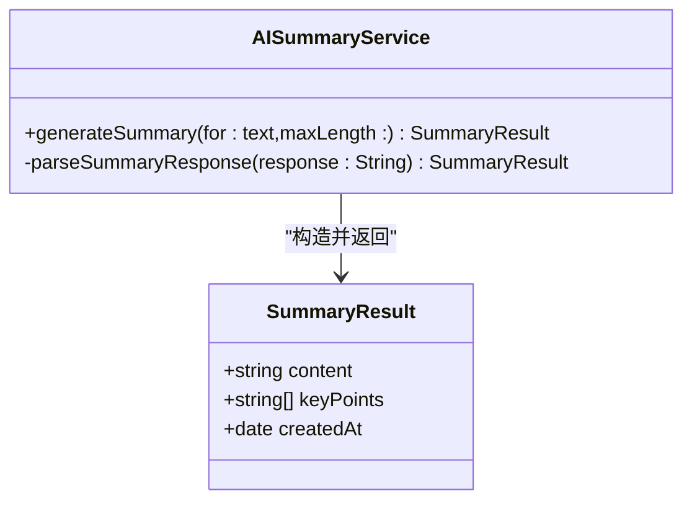
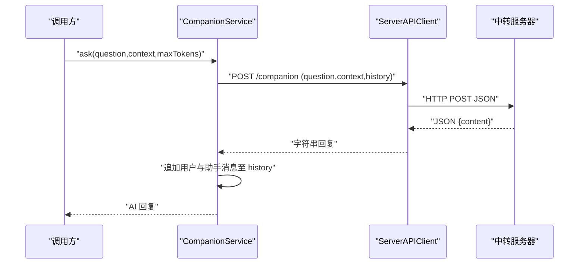
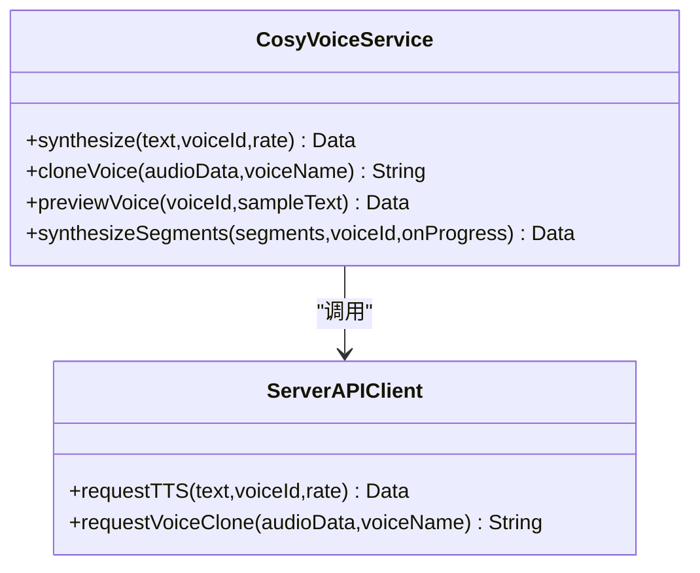
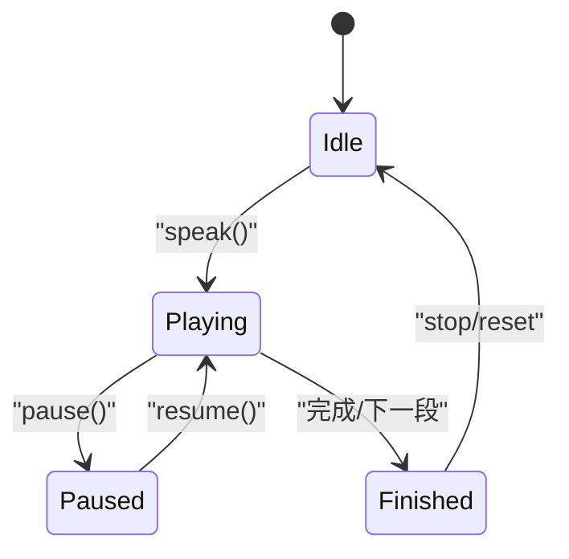
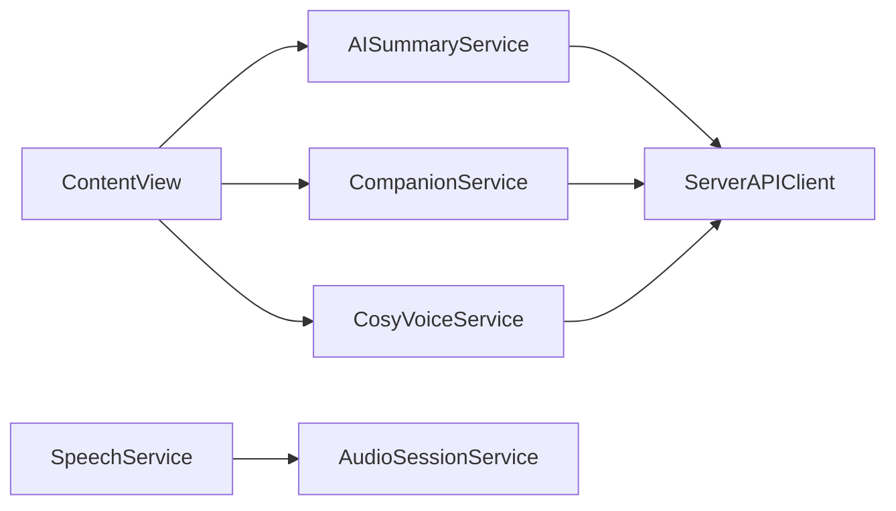

# 服务器代理架构

<cite>
**本文引用的文件**   
- [ServerAPIClient.swift](file://Services/ServerAPIClient.swift)
- [AISummaryService.swift](file://Services/AISummaryService.swift)
- [CosyVoiceService.swift](file://Services/CosyVoiceService.swift)
- [CompanionService.swift](file://Services/CompanionService.swift)
- [SpeechService.swift](file://Services/SpeechService.swift)
- [AudioSessionService.swift](file://Services/AudioSessionService.swift)
- [SummaryResult.swift](file://Models/SummaryResult.swift)
- [VoiceConfig.swift](file://Models/VoiceConfig.swift)
- [PlaybackState.swift](file://Models/PlaybackState.swift)
- [ContentView.swift](file://Views/ContentView.swift)
- [AppDelegate.swift](file://App/AppDelegate.swift)
- [KnowledgeApp.swift](file://App/KnowledgeApp.swift)
- [Info.plist](file://Resources/Info.plist)
</cite>

## 目录
1. [简介](#简介)
2. [项目结构](#项目结构)
3. [核心组件](#核心组件)
4. [架构总览](#架构总览)
5. [详细组件分析](#详细组件分析)
6. [依赖关系分析](#依赖关系分析)
7. [性能与可靠性](#性能与可靠性)
8. [故障排查指南](#故障排查指南)
9. [结论](#结论)
10. [附录](#附录)

## 简介
本仓库为 iOS 应用“挠荔枝”，其核心目标是提供文档阅读、AI 摘要、伴读对话以及语音合成（TTS）能力。为保障 API Key 安全并统一接入第三方 AI 服务，客户端采用“服务器代理”模式：所有 AI 请求均通过自建中转服务器转发，避免在客户端暴露敏感凭据。本文聚焦于该代理架构的设计、数据流、错误处理与扩展点，帮助读者快速理解并在此基础上进行二次开发或部署。

## 项目结构
整体采用分层组织：
- App 层：应用入口与全局配置
- Services 层：业务服务与网络代理
- Models 层：领域模型与配置
- Views 层：UI 展示与交互
- Resources 层：应用资源与权限声明

图表来源
- [AppDelegate.swift:1-14](file://App/AppDelegate.swift#L1-L14)
- [KnowledgeApp.swift:1-29](file://App/KnowledgeApp.swift#L1-L29)
- [Info.plist:1-44](file://Resources/Info.plist#L1-L44)
- [ContentView.swift:1-98](file://Views/ContentView.swift#L1-L98)
- [AISummaryService.swift:1-90](file://Services/AISummaryService.swift#L1-L90)
- [CompanionService.swift:1-47](file://Services/CompanionService.swift#L1-L47)
- [CosyVoiceService.swift:1-104](file://Services/CosyVoiceService.swift#L1-L104)
- [SpeechService.swift:1-166](file://Services/SpeechService.swift#L1-L166)
- [AudioSessionService.swift:1-46](file://Services/AudioSessionService.swift#L1-L46)
- [SummaryResult.swift:1-33](file://Models/SummaryResult.swift#L1-L33)
- [VoiceConfig.swift:1-71](file://Models/VoiceConfig.swift#L1-L71)
- [PlaybackState.swift:1-9](file://Models/PlaybackState.swift#L1-L9)

章节来源
- [AppDelegate.swift:1-14](file://App/AppDelegate.swift#L1-L14)
- [KnowledgeApp.swift:1-29](file://App/KnowledgeApp.swift#L1-L29)
- [Info.plist:1-44](file://Resources/Info.plist#L1-L44)
- [ContentView.swift:1-98](file://Views/ContentView.swift#L1-L98)

## 核心组件
- 服务器代理客户端：集中管理 HTTP 请求构建、超时、响应校验与错误映射，屏蔽下游差异，向上提供服务化接口。
- 业务服务：封装具体功能（摘要、伴读、TTS），复用代理客户端，负责参数组装、结果解析与状态维护。
- 播放服务：基于系统 TTS 的本地播放控制，支持分段朗读、进度回调与状态机。
- 音频会话服务：统一管理 AVAudioSession 的配置、激活与停用，确保后台播放与蓝牙/AirPlay 兼容。
- 模型与配置：定义摘要结果、语音配置与播放状态等数据结构。

章节来源
- [ServerAPIClient.swift:1-203](file://Services/ServerAPIClient.swift#L1-L203)
- [AISummaryService.swift:1-90](file://Services/AISummaryService.swift#L1-L90)
- [CompanionService.swift:1-47](file://Services/CompanionService.swift#L1-L47)
- [CosyVoiceService.swift:1-104](file://Services/CosyVoiceService.swift#L1-L104)
- [SpeechService.swift:1-166](file://Services/SpeechService.swift#L1-L166)
- [AudioSessionService.swift:1-46](file://Services/AudioSessionService.swift#L1-L46)
- [SummaryResult.swift:1-33](file://Models/SummaryResult.swift#L1-L33)
- [VoiceConfig.swift:1-71](file://Models/VoiceConfig.swift#L1-L71)
- [PlaybackState.swift:1-9](file://Models/PlaybackState.swift#L1-L9)

## 架构总览
下图展示了从 UI 到服务端代理的关键调用链与数据流向。

图表来源
- [ContentView.swift:1-98](file://Views/ContentView.swift#L1-L98)
- [AISummaryService.swift:1-90](file://Services/AISummaryService.swift#L1-L90)
- [CompanionService.swift:1-47](file://Services/CompanionService.swift#L1-L47)
- [CosyVoiceService.swift:1-104](file://Services/CosyVoiceService.swift#L1-L104)
- [ServerAPIClient.swift:1-203](file://Services/ServerAPIClient.swift#L1-L203)

## 详细组件分析

### 服务器代理客户端（ServerAPIClient）
职责
- 统一构建请求、设置超时、校验响应码与类型
- 抽象通用 JSON 提取逻辑（兼容多格式）
- 提供总结、伴读、TTS、语音克隆等接口
- 将网络与协议细节封装为结构化错误

关键流程
- 请求构建：拼接 baseURL + endpoint，设置 Content-Type 与 JSON Body
- 响应校验：按状态码分类抛出语义化错误
- 内容提取：优先取 content；兼容 output.choices[*].message.content
- TTS 特殊处理：直接返回 audio 二进制，或解析 JSON 中的 audio_url/audio base64

图表来源
- [ServerAPIClient.swift:101-173](file://Services/ServerAPIClient.swift#L101-L173)

章节来源
- [ServerAPIClient.swift:1-203](file://Services/ServerAPIClient.swift#L1-L203)

### AI 摘要服务（AISummaryService）
职责
- 调用代理客户端获取原始文本
- 解析结构化摘要（正文与要点）
- 输出 SummaryResult

图表来源
- [AISummaryService.swift:1-90](file://Services/AISummaryService.swift#L1-L90)
- [SummaryResult.swift:1-33](file://Models/SummaryResult.swift#L1-L33)

章节来源
- [AISummaryService.swift:1-90](file://Services/AISummaryService.swift#L1-L90)
- [SummaryResult.swift:1-33](file://Models/SummaryResult.swift#L1-L33)

### AI 伴读服务（CompanionService）
职责
- 维护多轮对话历史（最多 20 条消息）
- 携带当前朗读上下文向服务器发起对话请求
- 返回 AI 回复文本

图表来源
- [CompanionService.swift:1-47](file://Services/CompanionService.swift#L1-L47)
- [ServerAPIClient.swift:35-45](file://Services/ServerAPIClient.swift#L35-L45)

章节来源
- [CompanionService.swift:1-47](file://Services/CompanionService.swift#L1-L47)

### CosyVoice 语音合成服务（CosyVoiceService）
职责
- 封装 TTS 与语音克隆接口
- 提供分段合成与进度回调
- 透传音频数据给上层播放器

图表来源
- [CosyVoiceService.swift:1-104](file://Services/CosyVoiceService.swift#L1-L104)
- [ServerAPIClient.swift:47-97](file://Services/ServerAPIClient.swift#L47-L97)

章节来源
- [CosyVoiceService.swift:1-104](file://Services/CosyVoiceService.swift#L1-L104)

### 本地播放服务（SpeechService）
职责
- 基于系统 TTS 的分段朗读、暂停/继续、跳转
- 维护播放状态与位置回调
- 适配不同引擎与语言配置

图表来源
- [SpeechService.swift:1-166](file://Services/SpeechService.swift#L1-L166)
- [PlaybackState.swift:1-9](file://Models/PlaybackState.swift#L1-L9)

章节来源
- [SpeechService.swift:1-166](file://Services/SpeechService.swift#L1-L166)
- [PlaybackState.swift:1-9](file://Models/PlaybackState.swift#L1-L9)

### 音频会话服务（AudioSessionService）
职责
- 统一配置与激活/停用 AVAudioSession
- 支持后台播放、蓝牙与 AirPlay

章节来源
- [AudioSessionService.swift:1-46](file://Services/AudioSessionService.swift#L1-L46)
- [AppDelegate.swift:1-14](file://App/AppDelegate.swift#L1-L14)
- [Info.plist:1-44](file://Resources/Info.plist#L1-L44)

### 视图与集成（ContentView）
职责
- 作为主入口承载多个 Tab
- 协调分享导入、错误提示与服务调用

章节来源
- [ContentView.swift:1-98](file://Views/ContentView.swift#L1-L98)

## 依赖关系分析
- 低耦合：各业务服务仅依赖统一的 ServerAPIClient，避免重复网络实现
- 高内聚：每个服务聚焦单一职责（摘要/伴读/TTS/播放）
- 外部依赖：AVFoundation（TTS/音频）、SwiftData（持久化，由 App 注入）
- 潜在循环：未发现循环依赖；服务间通过单例共享客户端

图表来源
- [AISummaryService.swift:1-90](file://Services/AISummaryService.swift#L1-L90)
- [CompanionService.swift:1-47](file://Services/CompanionService.swift#L1-L47)
- [CosyVoiceService.swift:1-104](file://Services/CosyVoiceService.swift#L1-L104)
- [SpeechService.swift:1-166](file://Services/SpeechService.swift#L1-L166)
- [AudioSessionService.swift:1-46](file://Services/AudioSessionService.swift#L1-L46)
- [ContentView.swift:1-98](file://Views/ContentView.swift#L1-L98)

章节来源
- [ServerAPIClient.swift:1-203](file://Services/ServerAPIClient.swift#L1-L203)

## 性能与可靠性
- 超时策略：默认请求与资源超时分别设置为 60s/120s，TTS 单独设为 30s，兼顾长文本与音频传输
- 重试建议：对可重试的网络错误（如 429/5xx）可在上层增加指数退避重试
- 分片与节流：长文本 TTS 已内置分段与 200ms 间隔，降低瞬时压力
- 内存与带宽：大音频尽量流式处理或按需下载，避免一次性加载
- 降级路径：当云端不可用时，可回退到系统 TTS（VoiceConfig.engine 切换）

[本节为通用指导，不直接分析具体文件]

## 故障排查指南
常见问题与定位思路
- 未授权/配额限制：检查服务端鉴权与配额策略，确认客户端是否正确传递必要字段
- 响应格式异常：核对服务端返回是否包含 content 或兼容字段；必要时在服务端统一包装
- 无音频数据：确认 Content-Type 或 JSON 中 audio_url/audio 字段是否存在且可达
- 网络错误：查看底层错误描述，结合日志级别输出定位

错误映射与日志
- 服务端错误统一映射为结构化错误类型，便于 UI 展示与统计
- 全局错误处理器提供弹窗与日志输出，便于快速复现问题

章节来源
- [ServerAPIClient.swift:161-203](file://Services/ServerAPIClient.swift#L161-L203)

## 结论
本项目以“服务器代理”为核心，将 AI 能力与安全边界收敛在服务端，客户端通过轻量化的代理客户端与清晰的服务分层，实现了可扩展、易维护的架构。未来可在以下方向持续演进：
- 引入统一认证与签名机制，增强接口安全性
- 完善错误上报与指标采集，提升可观测性
- 优化长文本与音频的流式传输体验
- 增加缓存与离线策略，提高鲁棒性与用户体验

[本节为总结性内容，不直接分析具体文件]

## 附录
- 配置项说明
  - baseURL：中转服务器地址，需替换为实际域名
  - 超时：请求/资源/特定接口的超时时间
  - 引擎选择：VoiceConfig.engine 决定使用系统 TTS 或云端 TTS
- 部署清单
  - 后端需提供 /summary、/companion、/tts、/voice-clone 四个接口
  - 确保返回 JSON 包含 content 字段，或兼容 output.choices.message.content
  - TTS 接口返回音频二进制或包含 audio_url/audio base64 的 JSON

章节来源
- [ServerAPIClient.swift:11-23](file://Services/ServerAPIClient.swift#L11-L23)
- [VoiceConfig.swift:1-71](file://Models/VoiceConfig.swift#L1-L71)