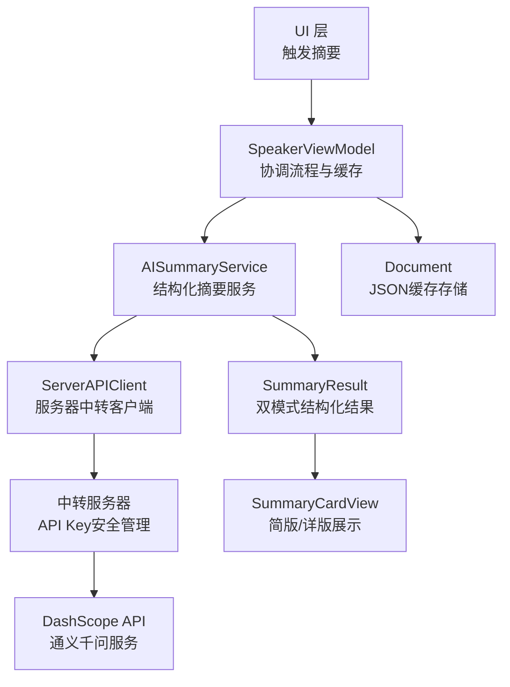
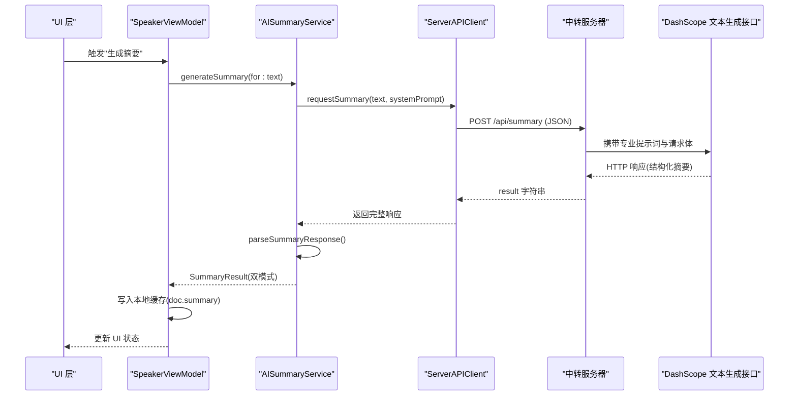
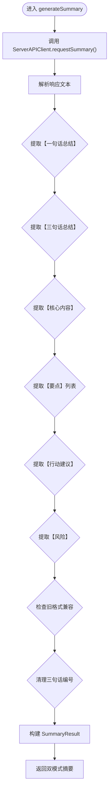
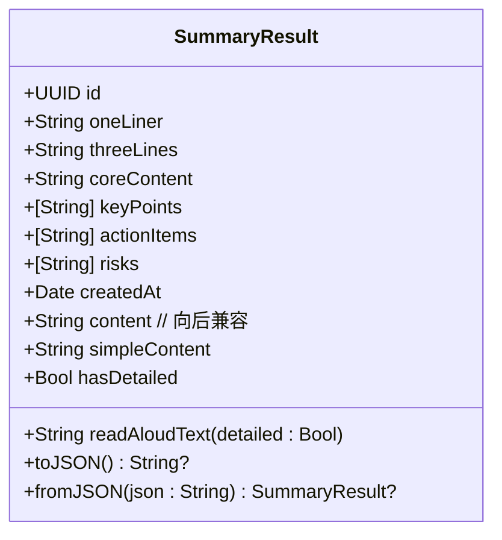
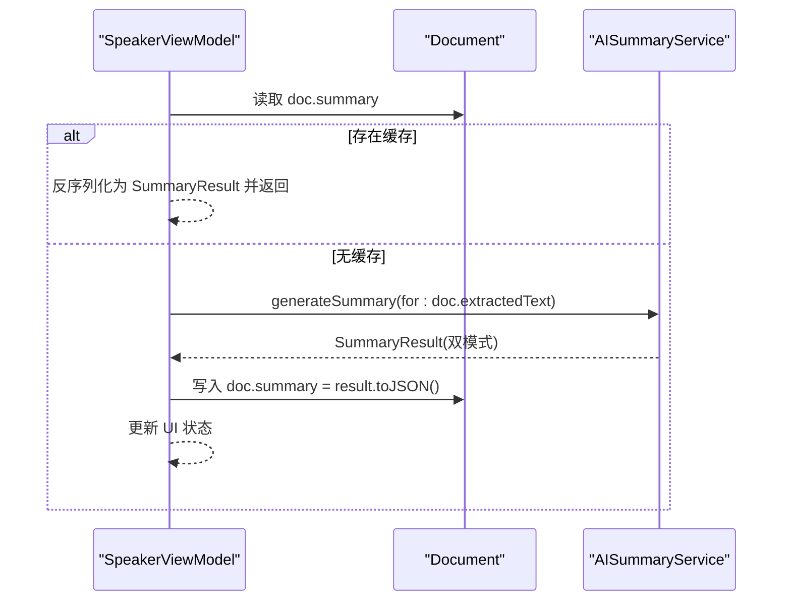
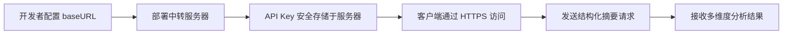
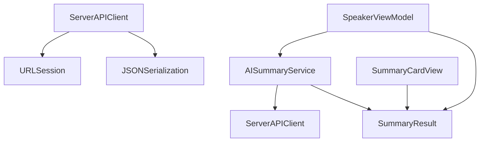

# AI 摘要生成服务

<cite>
**本文引用的文件**
- [AISummaryService.swift](file://Services/AISummaryService.swift)
- [ServerAPIClient.swift](file://Services/ServerAPIClient.swift)
- [SummaryResult.swift](file://Models/SummaryResult.swift)
- [SpeakerViewModel.swift](file://ViewModels/SpeakerViewModel.swift)
- [SummaryCardView.swift](file://Views/SummaryCardView.swift)
- [Document.swift](file://Models/Document.swift)
</cite>

## 更新摘要
**所做更改**
- 完全重写了 SummaryResult 数据模型，从简单的单字段 content 结构升级为支持双模式摘要的复杂数据结构
- 新增了结构化摘要字段：oneLiner（一句话总结）、threeLines（三句话总结）、coreContent（核心内容）、keyPoints（关键要点）、actionItems（行动建议）、risks（风险与注意事项）
- 更新了 AISummaryService 的提示词工程和解析逻辑，支持新的结构化输出格式
- 增强了 UI 展示层，支持简版和详版两种摘要模式的切换显示
- 保持了向后兼容性，确保旧缓存数据能够正常读取和使用

## 目录
1. [简介](#简介)
2. [项目结构](#项目结构)
3. [核心组件](#核心组件)
4. [架构总览](#架构总览)
5. [详细组件分析](#详细组件分析)
6. [依赖关系分析](#依赖关系分析)
7. [性能与优化建议](#性能与优化建议)
8. [故障排查指南](#故障排查指南)
9. [结论](#结论)
10. [附录：使用示例与最佳实践](#附录使用示例与最佳实践)

## 简介
本文件面向 AISummaryService AI 摘要生成服务，说明其如何通过服务器中转调用阿里云通义千问（DashScope）文本生成 API，实现智能文档摘要。经过重大重构后，服务现在支持双模式摘要生成：简版摘要适合快速浏览，详版摘要提供深度分析和结构化信息。内容涵盖：
- 工作流程：文本预处理、专业提示词工程、网络请求、结构化结果解析与缓存策略
- 数据模型：全新的 SummaryResult 双模式结构与字段含义
- 错误处理机制与异常分类
- 服务器中转配置、安全优势与性能优化建议
- 实际使用示例与最佳实践

## 项目结构
AI 摘要功能涉及以下关键文件：
- 服务层：AISummaryService.swift（支持结构化摘要生成的服务封装）
- 网络层：ServerAPIClient.swift（服务器中转客户端，统一管理所有AI请求）
- 数据模型：SummaryResult.swift（全新双模式摘要结果结构）
- 视图模型集成：SpeakerViewModel.swift
- 用户界面：SummaryCardView.swift（支持简版/详版切换的展示卡片）
- 文档模型：Document.swift（存储JSON格式的摘要数据）

图表来源
- [AISummaryService.swift:1-180](file://Services/AISummaryService.swift#L1-L180)
- [ServerAPIClient.swift:1-208](file://Services/ServerAPIClient.swift#L1-L208)
- [SummaryResult.swift:1-90](file://Models/SummaryResult.swift#L1-L90)
- [SummaryCardView.swift:1-538](file://Views/SummaryCardView.swift#L1-L538)
- [SpeakerViewModel.swift:260-350](file://ViewModels/SpeakerViewModel.swift#L260-L350)
- [Document.swift:54-115](file://Models/Document.swift#L54-L115)

章节来源
- [AISummaryService.swift:1-180](file://Services/AISummaryService.swift#L1-L180)
- [ServerAPIClient.swift:1-208](file://Services/ServerAPIClient.swift#L1-L208)
- [SummaryResult.swift:1-90](file://Models/SummaryResult.swift#L1-L90)
- [SummaryCardView.swift:1-538](file://Views/SummaryCardView.swift#L1-L538)
- [SpeakerViewModel.swift:260-350](file://ViewModels/SpeakerViewModel.swift#L260-L350)
- [Document.swift:54-115](file://Models/Document.swift#L54-L115)

## 核心组件
- **AISummaryService**：支持结构化摘要生成的服务类，包含专业的系统提示词和复杂的响应解析逻辑，能够提取一句话总结、三句话总结、核心内容、关键要点、行动建议和风险等多个维度的信息。
- **ServerAPIClient**：服务器中转客户端，负责与后端服务器通信，所有AI请求都通过此客户端进行，确保API Key安全性。提供统一的HTTP请求构建、响应验证和错误处理。
- **SummaryResult**：全新的双模式摘要结果数据结构，支持简版（一句话总结+关键要点）和详版（完整的多维度分析），并提供向后兼容的content字段访问。
- **SpeakerViewModel**：作为门面，协调摘要生成流程，提供本地缓存命中逻辑，并将结果写回文档对象。
- **SummaryCardView**：支持简版和详版两种展示模式的UI组件，用户可以根据需要切换不同的摘要展示方式。

章节来源
- [AISummaryService.swift:1-180](file://Services/AISummaryService.swift#L1-L180)
- [ServerAPIClient.swift:1-208](file://Services/ServerAPIClient.swift#L1-L208)
- [SummaryResult.swift:1-90](file://Models/SummaryResult.swift#L1-L90)
- [SummaryCardView.swift:1-538](file://Views/SummaryCardView.swift#L1-L538)
- [SpeakerViewModel.swift:260-350](file://ViewModels/SpeakerViewModel.swift#L260-L350)

## 架构总览
整体调用链从 UI 或 ViewModel 发起，经 AISummaryService 处理后，通过 ServerAPIClient 转发到中转服务器，最终由服务器调用 DashScope API 完成结构化摘要生成。新的架构支持更丰富的摘要内容和更好的用户体验。

图表来源
- [AISummaryService.swift:72-75](file://Services/AISummaryService.swift#L72-L75)
- [ServerAPIClient.swift:26-32](file://Services/ServerAPIClient.swift#L26-L32)
- [SpeakerViewModel.swift:280-295](file://ViewModels/SpeakerViewModel.swift#L280-L295)

## 详细组件分析

### AISummaryService 组件分析
职责与流程：
- **专业级摘要服务**，包含精心设计的系统提示词，指导AI生成高质量的结构化摘要
- 对外暴露异步方法生成摘要，内部依次执行：
  - 调用 ServerAPIClient.requestSummary() 获取结构化摘要文本
  - 解析响应文本，提取多个维度的信息：一句话总结、三句话总结、核心内容、关键要点、行动建议、风险
  - 构建 SummaryResult 对象返回，支持双模式展示
- **高级文本解析逻辑**：
  - 支持多种列表格式（"- "、"• "、"· "以及"数字."）
  - 智能清理三句话总结中的编号前缀
  - 向后兼容旧的【摘要】格式
  - 兜底策略为整段文本作为一句话总结
- **错误类型**：
  - 服务器返回数据异常
  - API 错误（含状态码与消息）
  - 网络错误（包装底层 Error）

图表来源
- [AISummaryService.swift:72-121](file://Services/AISummaryService.swift#L72-L121)

章节来源
- [AISummaryService.swift:1-180](file://Services/AISummaryService.swift#L1-L180)

### SummaryResult 数据模型
全新重构的双模式摘要结果结构：
- **id**：唯一标识，便于 UI 列表展示与绑定。
- **oneLiner**：一句话总结，用于简版摘要的核心内容。
- **threeLines**：三句话总结，提供更详细的背景信息。
- **coreContent**：核心内容，对内容进行深度分析。
- **keyPoints**：关键要点数组，提炼最重要的信息点。
- **actionItems**：行动建议，提供可操作的建议事项。
- **risks**：风险与注意事项，提醒潜在风险和限制。
- **createdAt**：生成时间戳。
- **向后兼容字段**：
  - `content`：计算属性，优先返回 oneLiner，兼容旧缓存数据
  - `simpleContent`：简版展示内容，自动选择最佳内容
  - `hasDetailed`：判断是否有详版内容的布尔值
- **朗读支持**：`readAloudText(detailed:)` 方法根据模式生成合适的朗读文本

图表来源
- [SummaryResult.swift:5-90](file://Models/SummaryResult.swift#L5-L90)

章节来源
- [SummaryResult.swift:1-90](file://Models/SummaryResult.swift#L1-L90)

### 视图模型集成与缓存策略
- **缓存命中**：在生成前检查文档是否已有摘要缓存（以 JSON 字符串形式存储在文档对象中），若有则直接返回，避免重复调用。
- **生成流程**：若无缓存，调用 AISummaryService 生成结构化摘要，成功后将结果转存为 JSON 字符串写回文档对象，并更新 UI 状态。
- **朗读摘要**：根据选择的模式（简版/详版）生成相应的朗读文本。

图表来源
- [SpeakerViewModel.swift:268-296](file://ViewModels/SpeakerViewModel.swift#L268-L296)

章节来源
- [SpeakerViewModel.swift:260-350](file://ViewModels/SpeakerViewModel.swift#L260-L350)

### 用户界面展示层
SummaryCardView 提供了完整的摘要展示功能：
- **双模式切换**：当检测到有详版内容时，自动显示简版/详版切换器
- **简版模式**：显示一句话总结和关键要点，适合快速浏览
- **详版模式**：完整展示所有维度信息，包括一句话总结、三句话总结、核心内容、关键要点、行动建议和风险
- **朗读功能**：根据当前模式生成合适的朗读文本
- **分享功能**：支持将摘要内容生成为图片进行分享

章节来源
- [SummaryCardView.swift:1-538](file://Views/SummaryCardView.swift#L1-L538)

### 服务器中转配置
- **配置入口**：ServerAPIClient.baseURL 静态属性，需替换为实际的服务器地址
- **安全优势**：API Key 仅存储在服务器端，客户端无需管理敏感配置
- **部署要求**：需要在阿里云服务器上部署中转 API 服务
- **统一配置**：所有AI服务（摘要、伴读、TTS）共享同一服务器配置

图表来源
- [ServerAPIClient.swift:11-14](file://Services/ServerAPIClient.swift#L11-L14)

章节来源
- [ServerAPIClient.swift:1-208](file://Services/ServerAPIClient.swift#L1-L208)

## 依赖关系分析
- **AISummaryService 依赖**：
  - ServerAPIClient：调用服务器中转服务
  - SummaryResult：返回结构化结果
- **ServerAPIClient 依赖**：
  - URLSession：发起 HTTP 请求
  - JSONSerialization：JSON 数据处理
- **SpeakerViewModel 依赖**：
  - AISummaryService：调用摘要生成
  - SummaryResult：本地缓存读写
- **SummaryCardView 依赖**：
  - SummaryResult：展示双模式摘要内容

图表来源
- [AISummaryService.swift:1-180](file://Services/AISummaryService.swift#L1-L180)
- [ServerAPIClient.swift:1-208](file://Services/ServerAPIClient.swift#L1-L208)
- [SummaryResult.swift:1-90](file://Models/SummaryResult.swift#L1-L90)
- [SummaryCardView.swift:1-538](file://Views/SummaryCardView.swift#L1-L538)
- [SpeakerViewModel.swift:260-350](file://ViewModels/SpeakerViewModel.swift#L260-L350)

章节来源
- [AISummaryService.swift:1-180](file://Services/AISummaryService.swift#L1-L180)
- [ServerAPIClient.swift:1-208](file://Services/ServerAPIClient.swift#L1-L208)
- [SummaryResult.swift:1-90](file://Models/SummaryResult.swift#L1-L90)
- [SummaryCardView.swift:1-538](file://Views/SummaryCardView.swift#L1-L538)
- [SpeakerViewModel.swift:260-350](file://ViewModels/SpeakerViewModel.swift#L260-L350)

## 性能与优化建议
- **文本预处理**
  - 当前实现将输入文本截断至8000字符，有助于控制Token消耗与响应时间。可根据业务需求调整截断阈值。
- **网络请求**
  - 超时时间已设置为合理值（请求60秒，资源120秒）。建议在业务层增加重试与退避策略，针对临时性网络抖动进行自动重试。
- **结果解析**
  - 解析逻辑支持多种格式并具有良好鲁棒性。若模型输出不稳定，可在提示词中进一步约束格式，或在解析层增加容错与降级策略。
- **缓存策略**
  - 当前采用文档级 JSON 缓存，避免重复调用。可引入基于内容哈希的失效策略，当原文变更时主动清除旧缓存。
- **并发与线程**
  - 服务层使用 async/await，ViewModel 在主线程更新 UI。对于批量摘要场景，建议使用任务组限制并发度，避免资源争用。
- **成本与速率**
  - 通过文本截断控制输入规模，降低费用与延迟。可按文档类型自适应参数。
- **双模式优化**
  - 简版模式适合快速浏览，详版模式适合深度阅读。建议根据用户行为分析优化默认展示模式。

[本节为通用指导，不直接分析具体文件]

## 故障排查指南
常见问题与定位步骤：
- **服务器地址配置错误**
  - 现象：网络连接失败或无法访问
  - 处理：检查 ServerAPIClient.baseURL 配置是否正确
- **服务器返回数据异常**
  - 现象：抛出无效响应错误
  - 处理：检查网络连通性与服务端状态，稍后重试
- **认证失败（401/403）**
  - 现象：抛出未授权错误
  - 处理：确认服务器端API Key配置正确且权限有效
- **配额超限（402/429）**
  - 现象：抛出配额超限错误
  - 处理：升级套餐或等待下月重置
- **其他服务器错误**
  - 现象：抛出服务器错误（含状态码与消息）
  - 处理：记录状态码与消息，结合服务端日志定位问题
- **网络错误**
  - 现象：抛出网络错误
  - 处理：检查设备网络、代理与防火墙设置
- **摘要解析失败**
  - 现象：SummaryResult 字段为空或格式不正确
  - 处理：检查服务端返回格式是否符合预期，查看解析日志

章节来源
- [AISummaryService.swift:164-179](file://Services/AISummaryService.swift#L164-L179)
- [ServerAPIClient.swift:183-207](file://Services/ServerAPIClient.swift#L183-L207)

## 结论
AISummaryService 经过重大重构后实现了更强大的结构化摘要功能，通过全新的 SummaryResult 双模式数据结构，不仅提升了摘要质量，还改善了用户体验。新的架构支持一句话总结、三句话总结、核心内容、关键要点、行动建议和风险等多维度信息提取，配合完善的UI展示层，为用户提供灵活的阅读体验。通过 ServerAPIClient 的服务中转模式，确保了API Key的安全性，同时简化了客户端代码。建议在生产环境中完善服务器部署，补充重试与限流策略，并结合业务场景优化文本截断参数，以获得更稳定与高效的摘要体验。

[本节为总结性内容，不直接分析具体文件]

## 附录：使用示例与最佳实践

- **基本用法**
  - 在需要生成摘要的位置调用服务方法，传入文档文本，捕获并处理错误，成功时获取 SummaryResult。
  - 参考路径：[generateSummary 调用位置:280-295](file://ViewModels/SpeakerViewModel.swift#L280-L295)

- **服务器配置**
  - 在 ServerAPIClient 中配置正确的 baseURL，部署中转服务器后替换示例地址。
  - 参考路径：[服务器地址配置:11-14](file://Services/ServerAPIClient.swift#L11-L14)

- **缓存策略**
  - 生成前先检查文档是否已有摘要缓存，命中则直接返回；否则生成后写回缓存。
  - 参考路径：[缓存命中与写回:271-288](file://ViewModels/SpeakerViewModel.swift#L271-L288)

- **错误处理与重试**
  - 区分服务器错误、网络错误与认证错误，分别给出用户提示与恢复策略。
  - 建议：在网络层增加指数退避重试，对认证错误立即失败并引导用户检查配置。
  - 参考路径：[错误枚举:164-179](file://Services/AISummaryService.swift#L164-L179)、[服务器错误枚举:183-207](file://Services/ServerAPIClient.swift#L183-L207)

- **双模式展示**
  - 使用 SummaryCardView 展示摘要，自动检测是否有详版内容并显示模式切换器。
  - 简版模式适合快速浏览，详版模式适合深度阅读。
  - 参考路径：[摘要展示:47-66](file://Views/SummaryCardView.swift#L47-L66)

- **朗读功能**
  - 根据选择的模式生成合适的朗读文本，简版模式朗读一句话总结和要点，详版模式朗读完整内容。
  - 参考路径：[朗读实现:299-304](file://ViewModels/SpeakerViewModel.swift#L299-L304)

- **性能优化**
  - 文本截断与参数调优：根据文档类型和目标受众调整文本长度限制。
  - 并发控制：批量生成时使用任务组限制并发度，避免资源竞争。
  - 缓存失效：当文档内容变化时主动清除旧摘要缓存，保证一致性。
  - 双模式优化：根据用户行为分析优化默认展示模式。

- **安全最佳实践**
  - API Key 安全管理：确保只在服务器端存储敏感配置，客户端不接触密钥。
  - HTTPS 传输：所有网络请求使用HTTPS加密传输。
  - 请求验证：在服务端实施请求频率限制和身份验证。

- **提示词工程**
  - 使用专业的系统提示词指导AI生成高质量的结构化摘要。
  - 提示词包含工作原则、工作流程和严格的输出格式要求。
  - 参考路径：[系统提示词:16-67](file://Services/AISummaryService.swift#L16-L67)

[本节为使用指导，不直接分析具体文件]