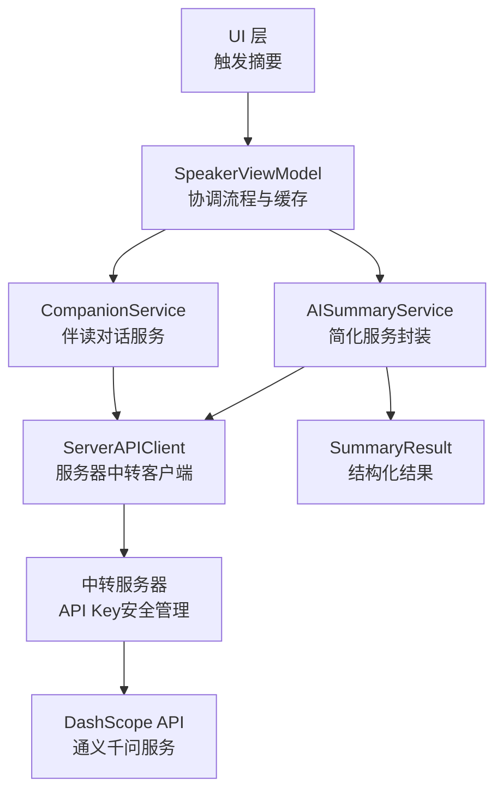
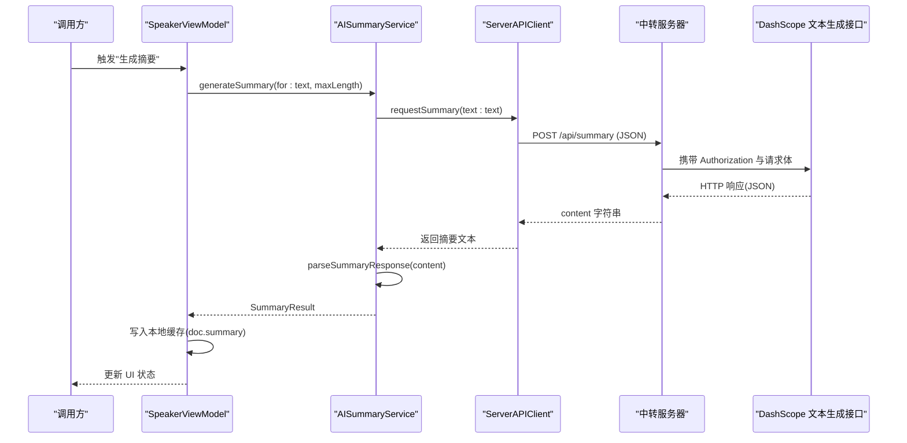
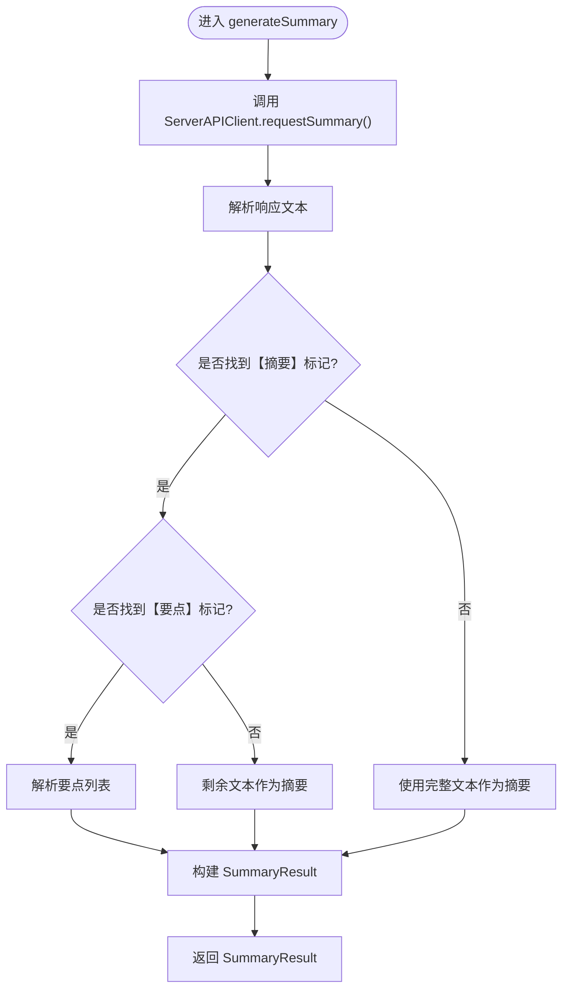
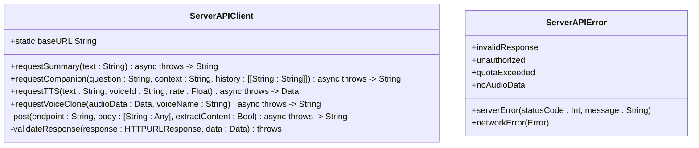
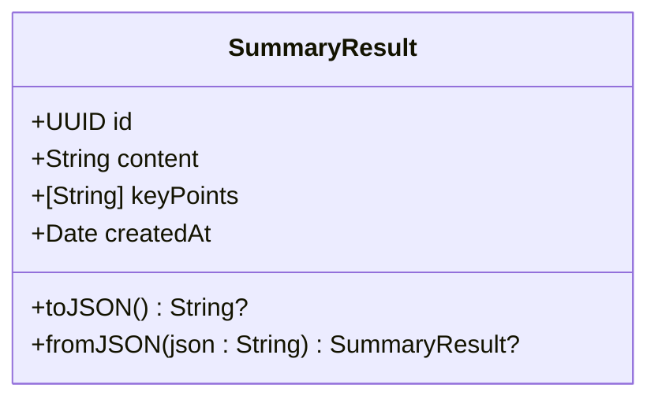
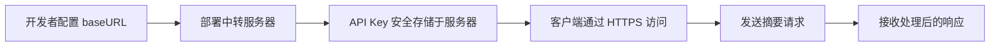
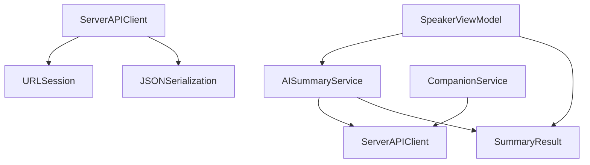

# AI 摘要生成服务

<cite>
**本文引用的文件**
- [AISummaryService.swift](file://Services/AISummaryService.swift)
- [ServerAPIClient.swift](file://Services/ServerAPIClient.swift)
- [SummaryResult.swift](file://Models/SummaryResult.swift)
- [SpeakerViewModel.swift](file://ViewModels/SpeakerViewModel.swift)
- [CompanionService.swift](file://Services/CompanionService.swift)
</cite>

## 更新摘要
**所做更改**
- 更新了AISummaryService组件分析，反映其简化后的架构（从95行减少到72行）
- 新增了ServerAPIClient组件分析，说明服务器中转机制的完整实现
- 更新了架构图和序列图以反映新的请求流程
- 修改了API配置部分，说明新的服务器中转配置方式
- 更新了错误处理机制，移除客户端API Key管理相关逻辑
- 更新了依赖关系分析，反映新的组件依赖结构
- 新增了CompanionService集成说明

## 目录
1. [简介](#简介)
2. [项目结构](#项目结构)
3. [核心组件](#核心组件)
4. [架构总览](#架构总览)
5. [详细组件分析](#详细组件分析)
6. [依赖关系分析](#依赖关系分析)
7. [性能与优化建议](#性能与优化建议)
8. [故障排查指南](#故障排查指南)
9. [结论](#结论)
10. [附录：使用示例与最佳实践](#附录使用示例与最佳实践)

## 简介
本文件面向 AISummaryService AI 摘要生成服务，说明其如何通过服务器中转调用阿里云通义千问（DashScope）文本生成 API，实现智能文档摘要。经过重构后，服务采用更简洁的架构设计，移除了直接的DashScope API调用，改为通过ServerAPIClient进行服务器代理请求。内容涵盖：
- 工作流程：文本预处理、提示词工程、网络请求、结果解析与缓存策略
- 数据模型：SummaryResult 的结构与字段含义
- 错误处理机制与异常分类
- 服务器中转配置、安全优势与性能优化建议
- 实际使用示例与最佳实践

## 项目结构
AI 摘要功能涉及以下关键文件：
- 服务层：AISummaryService.swift（简化后的服务封装，仅负责业务逻辑）
- 网络层：ServerAPIClient.swift（服务器中转客户端，统一管理所有AI请求）
- 数据模型：SummaryResult.swift
- 视图模型集成：SpeakerViewModel.swift
- 伴读服务：CompanionService.swift（交互式对话服务）

图表来源
- [AISummaryService.swift:1-90](file://Services/AISummaryService.swift#L1-L90)
- [ServerAPIClient.swift:1-203](file://Services/ServerAPIClient.swift#L1-L203)
- [SummaryResult.swift:1-33](file://Models/SummaryResult.swift#L1-L33)
- [SpeakerViewModel.swift:200-229](file://ViewModels/SpeakerViewModel.swift#L200-L229)
- [CompanionService.swift:1-47](file://Services/CompanionService.swift#L1-L47)

章节来源
- [AISummaryService.swift:1-90](file://Services/AISummaryService.swift#L1-L90)
- [ServerAPIClient.swift:1-203](file://Services/ServerAPIClient.swift#L1-L203)
- [SummaryResult.swift:1-33](file://Models/SummaryResult.swift#L1-L33)
- [SpeakerViewModel.swift:200-229](file://ViewModels/SpeakerViewModel.swift#L200-L229)
- [CompanionService.swift:1-47](file://Services/CompanionService.swift#L1-L47)

## 核心组件
- **AISummaryService**：简化后的服务封装类，仅负责调用ServerAPIClient并解析响应结果，不再直接处理网络请求和API Key管理。代码从95行精简到72行，专注于业务逻辑。
- **ServerAPIClient**：服务器中转客户端，负责与后端服务器通信，所有AI请求都通过此客户端进行，确保API Key安全性。提供统一的HTTP请求构建、响应验证和错误处理。
- **SummaryResult**：定义摘要结果的数据结构，包含摘要正文、关键要点列表与生成时间，并提供 JSON 序列化方法用于持久化。
- **SpeakerViewModel**：作为门面，协调摘要生成流程，提供本地缓存命中逻辑，并将结果写回文档对象。
- **CompanionService**：伴读对话服务，支持多轮对话，携带当前朗读上下文，同样通过ServerAPIClient进行服务器中转。

章节来源
- [AISummaryService.swift:1-90](file://Services/AISummaryService.swift#L1-L90)
- [ServerAPIClient.swift:1-203](file://Services/ServerAPIClient.swift#L1-L203)
- [SummaryResult.swift:1-33](file://Models/SummaryResult.swift#L1-L33)
- [SpeakerViewModel.swift:200-229](file://ViewModels/SpeakerViewModel.swift#L200-L229)
- [CompanionService.swift:1-47](file://Services/CompanionService.swift#L1-L47)

## 架构总览
整体调用链从 UI 或 ViewModel 发起，经 AISummaryService 简化处理后，通过 ServerAPIClient 转发到中转服务器，最终由服务器调用 DashScope API 完成摘要生成。重构后的架构显著简化了客户端代码，提升了安全性和可维护性。

图表来源
- [AISummaryService.swift:20-23](file://Services/AISummaryService.swift#L20-L23)
- [ServerAPIClient.swift:28-33](file://Services/ServerAPIClient.swift#L28-L33)
- [SpeakerViewModel.swift:213-228](file://ViewModels/SpeakerViewModel.swift#L213-L228)

## 详细组件分析

### AISummaryService 组件分析
职责与流程：
- **简化后的服务类**，仅保留核心的摘要生成功能，代码量从95行减少到72行
- 对外暴露异步方法生成摘要，内部依次执行：
  - 调用 ServerAPIClient.requestSummary() 获取原始摘要文本
  - 解析响应文本，提取【摘要】和【要点】部分
  - 构建 SummaryResult 对象返回
- **文本解析逻辑**：
  - 支持多种要点格式（如"- "、"• "、"· "以及"数字."）
  - 兜底策略为整段文本作为摘要
- **错误类型**：
  - 服务器返回数据异常
  - API 错误（含状态码与消息）
  - 网络错误（包装底层 Error）

图表来源
- [AISummaryService.swift:20-69](file://Services/AISummaryService.swift#L20-L69)

章节来源
- [AISummaryService.swift:1-90](file://Services/AISummaryService.swift#L1-L90)

### ServerAPIClient 组件分析
职责与流程：
- **服务器中转客户端**，统一管理所有与服务器的通信
- **配置管理**：集中管理服务器地址、超时设置等配置
- **请求处理**：统一的HTTP请求构建、响应验证和错误处理
- **摘要生成**：专门处理AI摘要请求，自动截断过长文本至8000字符
- **错误处理**：统一的错误分类和用户友好的错误消息
- **多服务支持**：同时支持摘要生成、伴读对话、语音合成等多种AI服务

图表来源
- [ServerAPIClient.swift:6-203](file://Services/ServerAPIClient.swift#L6-L203)

章节来源
- [ServerAPIClient.swift:1-203](file://Services/ServerAPIClient.swift#L1-L203)

### SummaryResult 数据模型
字段与行为：
- **id**：唯一标识，便于 UI 列表展示与绑定。
- **content**：摘要正文字符串。
- **keyPoints**：关键要点数组，元素为字符串。
- **createdAt**：生成时间戳。
- **toJSON/fromJSON**：提供 JSON 编解码能力，用于本地持久化。

图表来源
- [SummaryResult.swift:1-33](file://Models/SummaryResult.swift#L1-L33)

章节来源
- [SummaryResult.swift:1-33](file://Models/SummaryResult.swift#L1-L33)

### 视图模型集成与缓存策略
- **缓存命中**：在生成前检查文档是否已有摘要缓存（以 JSON 字符串形式存储在文档对象中），若有则直接返回，避免重复调用。
- **生成流程**：若无缓存，调用 AISummaryService 生成摘要，成功后将结果转存为 JSON 字符串写回文档对象，并更新 UI 状态。
- **朗读摘要**：将摘要正文与要点拼接后交由语音合成器播放。

图表来源
- [SpeakerViewModel.swift:200-229](file://ViewModels/SpeakerViewModel.swift#L200-L229)

章节来源
- [SpeakerViewModel.swift:200-229](file://ViewModels/SpeakerViewModel.swift#L200-L229)

### 伴读服务集成
CompanionService 提供了交互式对话功能，支持多轮对话并携带当前朗读上下文：
- **多轮对话**：维护对话历史，最多保留最近10轮对话
- **上下文感知**：自动提取当前朗读位置前后的文本片段作为上下文
- **服务器中转**：同样通过ServerAPIClient进行请求，确保API Key安全

章节来源
- [CompanionService.swift:1-47](file://Services/CompanionService.swift#L1-L47)

### 服务器中转配置
- **配置入口**：ServerAPIClient.baseURL 静态属性，需替换为实际的服务器地址
- **安全优势**：API Key 仅存储在服务器端，客户端无需管理敏感配置
- **部署要求**：需要在阿里云服务器上部署中转 API 服务
- **统一配置**：所有AI服务（摘要、伴读、TTS）共享同一服务器配置

图表来源
- [ServerAPIClient.swift:11-14](file://Services/ServerAPIClient.swift#L11-L14)

章节来源
- [ServerAPIClient.swift:1-203](file://Services/ServerAPIClient.swift#L1-L203)

## 依赖关系分析
- **AISummaryService 依赖**：
  - ServerAPIClient：调用服务器中转服务
  - SummaryResult：返回结构化结果
- **ServerAPIClient 依赖**：
  - URLSession：发起 HTTP 请求
  - JSONSerialization：JSON 数据处理
- **SpeakerViewModel 依赖**：
  - AISummaryService：调用摘要生成
  - SummaryResult：本地缓存读写
- **CompanionService 依赖**：
  - ServerAPIClient：调用服务器中转服务

图表来源
- [AISummaryService.swift:1-90](file://Services/AISummaryService.swift#L1-L90)
- [ServerAPIClient.swift:1-203](file://Services/ServerAPIClient.swift#L1-L203)
- [SummaryResult.swift:1-33](file://Models/SummaryResult.swift#L1-L33)
- [SpeakerViewModel.swift:200-229](file://ViewModels/SpeakerViewModel.swift#L200-L229)
- [CompanionService.swift:1-47](file://Services/CompanionService.swift#L1-L47)

章节来源
- [AISummaryService.swift:1-90](file://Services/AISummaryService.swift#L1-L90)
- [ServerAPIClient.swift:1-203](file://Services/ServerAPIClient.swift#L1-L203)
- [SummaryResult.swift:1-33](file://Models/SummaryResult.swift#L1-L33)
- [SpeakerViewModel.swift:200-229](file://ViewModels/SpeakerViewModel.swift#L200-L229)
- [CompanionService.swift:1-47](file://Services/CompanionService.swift#L1-L47)

## 性能与优化建议
- **文本预处理**
  - 当前实现将输入文本截断至8000字符，有助于控制Token消耗与响应时间。可根据业务需求调整截断阈值。
- **网络请求**
  - 超时时间已设置为合理值（请求60秒，资源120秒）。建议在业务层增加重试与退避策略，针对临时性网络抖动进行自动重试。
- **结果解析**
  - 解析逻辑兼容多种要点格式，具备良好鲁棒性。若模型输出不稳定，可在提示词中进一步约束格式，或在解析层增加容错与降级策略。
- **缓存策略**
  - 当前采用文档级 JSON 缓存，避免重复调用。可引入基于内容哈希的失效策略，当原文变更时主动清除旧缓存。
- **并发与线程**
  - 服务层使用 async/await，ViewModel 在主线程更新 UI。对于批量摘要场景，建议使用任务组限制并发度，避免资源争用。
- **成本与速率**
  - 通过文本截断控制输入规模，降低费用与延迟。可按文档类型自适应参数。

[本节为通用指导，不直接分析具体文件]

## 故障排查指南
常见问题与定位步骤：
- **服务器地址配置错误**
  - 现象：网络连接失败或无法访问
  - 处理：检查 ServerAPIClient.baseURL 配置是否正确
- **服务器返回数据异常**
  - 现象：抛出无效响应错误
  - 处理：检查网络连通性与服务端状态，稍后重试
- **认证失败（401/403）**
  - 现象：抛出未授权错误
  - 处理：确认服务器端API Key配置正确且权限有效
- **配额超限（402/429）**
  - 现象：抛出配额超限错误
  - 处理：升级套餐或等待下月重置
- **其他服务器错误**
  - 现象：抛出服务器错误（含状态码与消息）
  - 处理：记录状态码与消息，结合服务端日志定位问题
- **网络错误**
  - 现象：抛出网络错误
  - 处理：检查设备网络、代理与防火墙设置

章节来源
- [AISummaryService.swift:74-89](file://Services/AISummaryService.swift#L74-L89)
- [ServerAPIClient.swift:178-202](file://Services/ServerAPIClient.swift#L178-L202)

## 结论
AISummaryService 经过重构后实现了更简洁的架构设计，通过 ServerAPIClient 的服务中转模式，不仅简化了客户端代码（从95行减少到72行），还提升了API Key的安全性。新的架构将复杂的网络请求、错误处理和配置管理集中在ServerAPIClient中，使AISummaryService专注于业务逻辑。配合ViewModel的本地缓存策略，显著减少重复调用与网络开销。统一错误分类机制便于上层统一处理与用户反馈。建议在生产环境中完善服务器部署，补充重试与限流策略，并结合业务场景优化文本截断参数，以获得更稳定与高效的摘要体验。

[本节为总结性内容，不直接分析具体文件]

## 附录：使用示例与最佳实践

- **基本用法**
  - 在需要生成摘要的位置调用服务方法，传入文档文本，捕获并处理错误，成功时获取 SummaryResult。
  - 参考路径：[generateSummary 调用位置:213-228](file://ViewModels/SpeakerViewModel.swift#L213-L228)

- **服务器配置**
  - 在 ServerAPIClient 中配置正确的 baseURL，部署中转服务器后替换示例地址。
  - 参考路径：[服务器地址配置:11-14](file://Services/ServerAPIClient.swift#L11-L14)

- **缓存策略**
  - 生成前先检查文档是否已有摘要缓存，命中则直接返回；否则生成后写回缓存。
  - 参考路径：[缓存命中与写回:204-221](file://ViewModels/SpeakerViewModel.swift#L204-L221)

- **错误处理与重试**
  - 区分服务器错误、网络错误与认证错误，分别给出用户提示与恢复策略。
  - 建议：在网络层增加指数退避重试，对认证错误立即失败并引导用户检查配置。
  - 参考路径：[错误枚举:74-89](file://Services/AISummaryService.swift#L74-L89)、[服务器错误枚举:178-202](file://Services/ServerAPIClient.swift#L178-L202)

- **伴读对话集成**
  - 使用CompanionService进行交互式对话，自动携带朗读上下文。
  - 参考路径：[伴读服务调用:254-267](file://ViewModels/SpeakerViewModel.swift#L254-L267)

- **性能优化**
  - 文本截断与参数调优：根据文档类型和目标受众调整文本长度限制。
  - 并发控制：批量生成时使用任务组限制并发度，避免资源竞争。
  - 缓存失效：当文档内容变化时主动清除旧摘要缓存，保证一致性。

- **安全最佳实践**
  - API Key 安全管理：确保只在服务器端存储敏感配置，客户端不接触密钥。
  - HTTPS 传输：所有网络请求使用HTTPS加密传输。
  - 请求验证：在服务端实施请求频率限制和身份验证。

[本节为使用指导，不直接分析具体文件]