# AI 伴读对话功能

<cite>
**本文引用的文件**
- [KnowledgeApp.swift](file://App/KnowledgeApp.swift)
- [AppDelegate.swift](file://App/AppDelegate.swift)
- [SpeakerViewModel.swift](file://ViewModels/SpeakerViewModel.swift)
- [CompanionService.swift](file://Services/CompanionService.swift)
- [ServerAPIClient.swift](file://Services/ServerAPIClient.swift)
- [CompanionMessage.swift](file://Models/CompanionMessage.swift)
- [CompanionChat.swift](file://Models/CompanionChat.swift)
- [CompanionView.swift](file://Views/CompanionView.swift)
- [PlayerView.swift](file://Views/PlayerView.swift)
- [SpeechService.swift](file://Services/SpeechService.swift)
- [CosyVoiceSynthesizer.swift](file://Services/CosyVoiceSynthesizer.swift)
- [AISummaryService.swift](file://Services/AISummaryService.swift)
- [Document.swift](file://Models/Document.swift)
- [SummaryResult.swift](file://Models/SummaryResult.swift)
- [ErrorHandler.swift](file://Services/ErrorHandler.swift)
- [VoiceConfig.swift](file://Models/VoiceConfig.swift)
- [SpeechSynthesizerProtocol.swift](file://Services/SpeechSynthesizerProtocol.swift)
- [LycheeMascotView.swift](file://Views/LycheeMascotView.swift)
- [ContentView.swift](file://Views/ContentView.swift)
- [SubscriptionManager.swift](file://Services/SubscriptionManager.swift)
</cite>

## 更新摘要
**已进行的变更**
- CompanionService 从简化的43行代码扩展为217行的专业AI伴读服务，新增专业提示词系统、会话状态管理和难度自适应功能
- 引入苏格拉底式引导方法和分层启发式教学策略
- 实现双模式摘要系统，支持结构化总结和多种输出格式
- 荔枝角色UI全面植入到6个核心场景，提供丰富的动画交互体验
- 增强的上下文感知和会话状态管理，支持首次提问、连续追问和复习模式
- **新增SwiftData持久化支持**：通过CompanionChat模型实现了对话历史的本地存储，用户可以在切换文档或重启应用后继续之前的对话
- **完整的对话管理API**：新增loadConversation(), saveConversation(), clearConversation()等全面的对话生命周期管理方法
- **移除功能开关**：移除了enableCompanion布尔标志，AI伴读功能现在作为核心应用功能永久启用

## 目录
1. [简介](#简介)
2. [项目结构](#项目结构)
3. [核心组件](#核心组件)
4. [架构总览](#架构总览)
5. [详细组件分析](#详细组件分析)
6. [依赖关系分析](#依赖关系分析)
7. [性能考量](#性能考量)
8. [故障排查指南](#故障排查指南)
9. [结论](#结论)

## 简介
本章节面向"AI 伴读对话"能力，说明其在应用中的定位、交互流程与关键实现要点。该功能在用户朗读文档时提供"边听边问"的交互式体验：进入对话界面自动暂停朗读，提问时将当前朗读位置上下文注入系统提示，调用云端大模型生成简短口语化回答；退出对话后恢复朗读。同时，该功能与播放控制、文本高亮、错误处理等模块协同工作。

**重大更新** CompanionService 经过全面重构，从简单的历史管理服务升级为专业的AI伴读系统，新增了专业提示词系统、会话状态管理、难度自适应和苏格拉底式引导方法，为用户提供更加智能和个性化的学习体验。**新增SwiftData持久化支持**，通过CompanionChat模型实现了对话历史的本地存储，用户可以在切换文档或重启应用后继续之前的对话，大大提升了用户体验的连续性。**AI伴读功能现已作为核心功能永久启用**，不再需要功能开关进行控制。

## 项目结构
围绕 AI 伴读对话的关键代码分布在以下层次：
- 应用入口与生命周期：初始化主题、数据容器、音频会话配置
- 视图层：播放器主界面与伴读对话界面，集成荔枝吉祥物角色
- 视图模型层：统一编排播放、摘要、伴读状态与事件
- 服务层：专业的伴读对话服务（含提示词系统）、统一的服务器 API 客户端、语音合成引擎（本地与云端）
- 数据模型：消息、文档、摘要结果、语音配置、等级系统、**对话持久化模型**

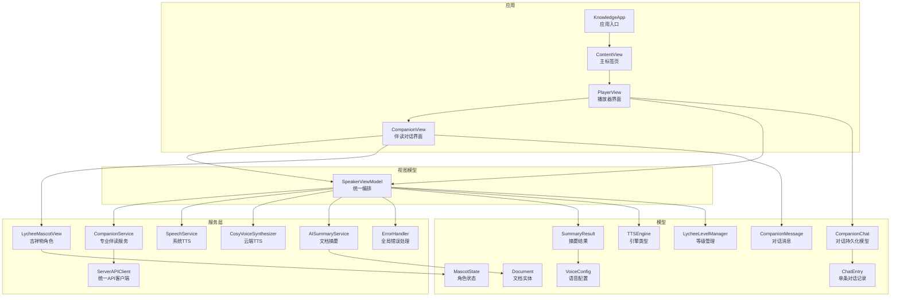

**图表来源**
- [KnowledgeApp.swift:10-18](file://App/KnowledgeApp.swift#L10-L18)
- [PlayerView.swift:1-187](file://Views/PlayerView.swift#L1-L187)
- [CompanionView.swift:1-258](file://Views/CompanionView.swift#L1-L258)
- [SpeakerViewModel.swift:1-505](file://ViewModels/SpeakerViewModel.swift#L1-L505)
- [CompanionService.swift:1-217](file://Services/CompanionService.swift#L1-L217)
- [ServerAPIClient.swift:1-208](file://Services/ServerAPIClient.swift#L1-L208)
- [SpeechService.swift:1-166](file://Services/SpeechService.swift#L1-L166)
- [CosyVoiceSynthesizer.swift:1-258](file://Services/CosyVoiceSynthesizer.swift#L1-L258)
- [AISummaryService.swift:1-180](file://Services/AISummaryService.swift#L1-L180)
- [CompanionMessage.swift:1-11](file://Models/CompanionMessage.swift#L1-L11)
- [CompanionChat.swift:1-42](file://Models/CompanionChat.swift#L1-L42)
- [Document.swift:1-115](file://Models/Document.swift#L1-L115)
- [SummaryResult.swift:1-33](file://Models/SummaryResult.swift#L1-L33)
- [ErrorHandler.swift:1-53](file://Services/ErrorHandler.swift#L1-L53)
- [VoiceConfig.swift:1-64](file://Models/VoiceConfig.swift#L1-L64)
- [LycheeMascotView.swift:1-144](file://Views/LycheeMascotView.swift#L1-L144)
- [ContentView.swift:1-101](file://Views/ContentView.swift#L1-L101)

## 核心组件
- **专业伴读对话服务**：包含完整的专业提示词系统、会话状态管理、难度自适应和苏格拉底式引导方法
- **SwiftData持久化支持**：通过CompanionChat模型实现对话历史的本地存储，支持跨文档和跨应用会话
- **统一的服务器API客户端**：集中处理所有网络请求、错误处理和响应解析
- **伴读对话视图**：消息列表、快捷问题、输入栏、加载态与滚动定位，集成荔枝吉祥物角色
- **视图模型**：编排伴读流程、提取上下文、管理消息队列与播放联动
- **语音引擎**：系统 TTS、传统系统 TTS 与云端 CosyVoice 三引擎，支持切换与降级
- **荔枝吉祥物角色**：可复用的角色视图，支持7种动画状态和等级装饰
- **双模式摘要系统**：支持结构化总结和多种输出格式的AI摘要服务
- **错误处理**：统一弹窗与日志输出
- **订阅管理系统**：管理AI功能的免费试用次数和Premium订阅权限

**重大更新** CompanionService 从简单的历史管理服务升级为专业的AI伴读系统，新增了完整的提示词工程、会话状态管理和个性化学习体验。**新增SwiftData持久化支持**，实现了对话历史的本地存储和恢复功能，包括完整的loadConversation(), saveConversation(), clearConversation()方法。**AI伴读功能现已作为核心功能永久启用**，移除了原有的enableCompanion功能开关。

**章节来源**
- [CompanionService.swift:1-217](file://Services/CompanionService.swift#L1-L217)
- [CompanionChat.swift:1-42](file://Models/CompanionChat.swift#L1-L42)
- [ServerAPIClient.swift:1-208](file://Services/ServerAPIClient.swift#L1-L208)
- [CompanionView.swift:1-258](file://Views/CompanionView.swift#L1-L258)
- [SpeakerViewModel.swift:1-505](file://ViewModels/SpeakerViewModel.swift#L1-L505)
- [SpeechService.swift:1-166](file://Services/SpeechService.swift#L1-L166)
- [CosyVoiceSynthesizer.swift:1-258](file://Services/CosyVoiceSynthesizer.swift#L1-L258)
- [AISummaryService.swift:1-180](file://Services/AISummaryService.swift#L1-L180)
- [LycheeMascotView.swift:1-144](file://Views/LycheeMascotView.swift#L1-L144)
- [ErrorHandler.swift:1-53](file://Services/ErrorHandler.swift#L1-L53)
- [VoiceConfig.swift:1-64](file://Models/VoiceConfig.swift#L1-L64)
- [SubscriptionManager.swift:1-166](file://Services/SubscriptionManager.swift#L1-L166)

## 架构总览
下图展示从 UI 到服务的数据与控制流，以及伴读对话与播放控制的协作关系。新的架构中，CompanionService 作为专业的AI伴读服务，负责提示词工程、会话状态管理和难度自适应，所有复杂的网络请求都通过 ServerAPIClient 处理。**新增的SwiftData持久化层确保对话历史可以跨应用会话保存和恢复**。

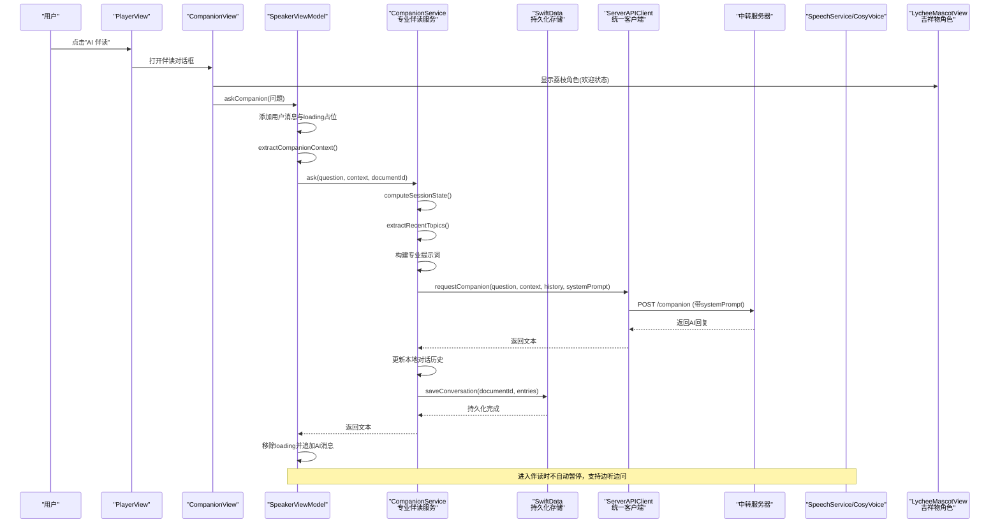

**图表来源**
- [PlayerView.swift:116-153](file://Views/PlayerView.swift#L116-L153)
- [CompanionView.swift:140-171](file://Views/CompanionView.swift#L140-L171)
- [SpeakerViewModel.swift:321-356](file://ViewModels/SpeakerViewModel.swift#L321-L356)
- [CompanionService.swift:99-139](file://Services/CompanionService.swift#L99-L139)
- [CompanionService.swift:163-175](file://Services/CompanionService.swift#L163-L175)
- [ServerAPIClient.swift:37-45](file://Services/ServerAPIClient.swift#L37-L45)

## 详细组件分析

### 专业伴读对话服务（CompanionService）
- **职责**：专业的AI伴读服务，包含完整的专业提示词系统、会话状态管理、难度自适应和苏格拉底式引导方法
- **关键点**：
  - **专业提示词系统**：包含角色定位、动态上下文、核心回答规则、文字表达规则、信息密度控制等完整体系
  - **会话状态管理**：自动计算学习状态（首次提问、连续追问、复习模式），基于对话历史和文档切换判断
  - **难度自适应**：支持beginner、intermediate、advanced三个层级，根据用户水平调整表达方式
  - **苏格拉底式引导**：针对不同问题类型采用差异化引导策略，包括事实类、理解类、探索类和检验类问题
  - **上下文记忆**：提取最近3条用户问题，避免重复解释，保持对话连贯性
  - **历史裁剪**：保留最近20轮对话记录，避免内存占用过大
  - **SwiftData持久化**：自动保存对话历史到本地存储，支持跨应用会话恢复
  - **完整对话管理API**：提供loadConversation(), saveConversation(), clearConversation()等全面的对话生命周期管理

**重大更新** CompanionService 从简单的历史管理服务升级为专业的AI伴读系统，新增了完整的提示词工程和智能会话管理功能。**新增SwiftData持久化支持**，实现了对话历史的自动保存和恢复功能，包括完整的对话管理API。

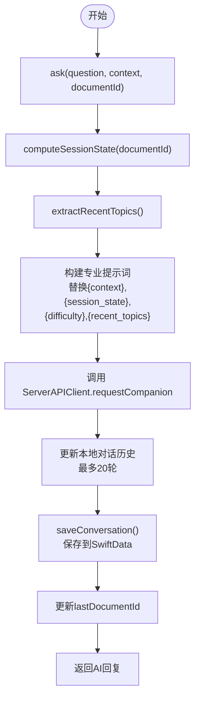

**图表来源**
- [CompanionService.swift:99-139](file://Services/CompanionService.swift#L99-L139)
- [CompanionService.swift:163-175](file://Services/CompanionService.swift#L163-L175)
- [CompanionService.swift:189-215](file://Services/CompanionService.swift#L189-L215)

**章节来源**
- [CompanionService.swift:1-217](file://Services/CompanionService.swift#L1-L217)

### SwiftData持久化模型（CompanionChat）
- **职责**：定义对话历史的SwiftData模型，实现按文档ID存储和管理对话记录
- **关键点**：
  - **CompanionChat模型**：使用@Model注解标记，包含documentId、messagesData、updatedAt字段
  - **ChatEntry结构体**：Codable协议实现，存储单条对话记录的JSON数据
  - **JSON序列化**：将[ChatEntry]数组编码为Data存储，支持高效读写
  - **自动时间戳**：每次修改自动更新updatedAt时间戳
  - **按文档隔离**：每个文档有独立的对话历史记录
  - **完整持久化API**：提供loadConversation(), saveConversation(), clearConversation()等全面的对话管理方法

**新增功能** CompanionChat模型提供了完整的SwiftData持久化支持，实现了对话历史的本地存储和跨应用会话恢复。通过JSON编码策略优化了存储效率，避免了频繁的数据库操作。

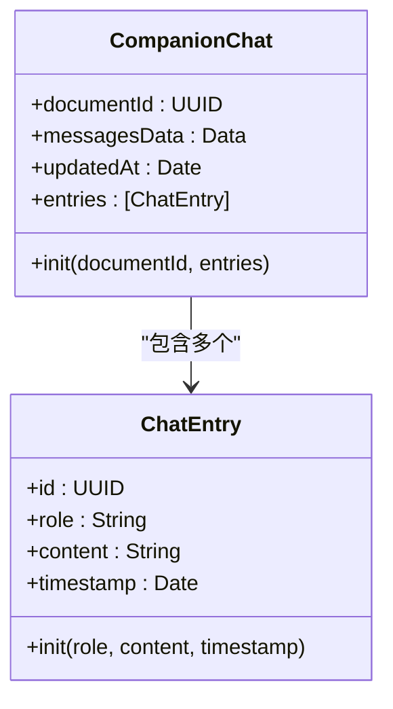

**图表来源**
- [CompanionChat.swift:20-41](file://Models/CompanionChat.swift#L20-L41)
- [CompanionChat.swift:5-18](file://Models/CompanionChat.swift#L5-L18)

**章节来源**
- [CompanionChat.swift:1-42](file://Models/CompanionChat.swift#L1-L42)

### 统一的服务器API客户端（ServerAPIClient）
- **职责**：集中处理所有网络请求、错误处理和响应解析
- **关键点**：
  - **统一接口**：提供 requestCompanion、requestSummary、requestTTS 等方法
  - **错误处理**：统一的 HTTP 状态码处理和错误映射
  - **响应解析**：支持多种响应格式（JSON、二进制音频等）
  - **超时管理**：合理的请求超时设置

**更新** ServerAPIClient 承担了原来 CompanionService 中的所有网络请求和认证逻辑，提供了更清晰的职责分离。

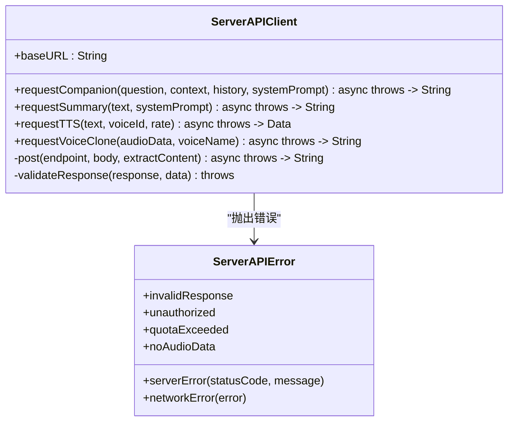

**图表来源**
- [ServerAPIClient.swift:6-208](file://Services/ServerAPIClient.swift#L6-L208)

**章节来源**
- [ServerAPIClient.swift:1-208](file://Services/ServerAPIClient.swift#L1-L208)

### 伴读对话视图（CompanionView）
- **职责**：消息气泡渲染、欢迎语与快捷问题、输入框与发送逻辑、进入/退出时的播放联动
- **关键点**：
  - 自动滚动到底部：新消息出现后滚动至最新
  - 加载态：显示"思考中..."占位，集成荔枝角色动画
  - 工具栏：清空对话、继续听（返回播放器）
  - 快捷问题：提供常用问题按钮，提升用户体验
  - 智能焦点管理：自动聚焦输入框，提升操作效率
  - 下拉手势：支持下拉回到播放页的便捷操作
  - 播放控制：内置播放/暂停切换按钮，支持边听边问

**重大更新** 改进了用户界面，新增了快捷问题按钮、更好的加载状态显示、下拉手势操作和内置播放控制，同时优化了输入框的焦点管理。

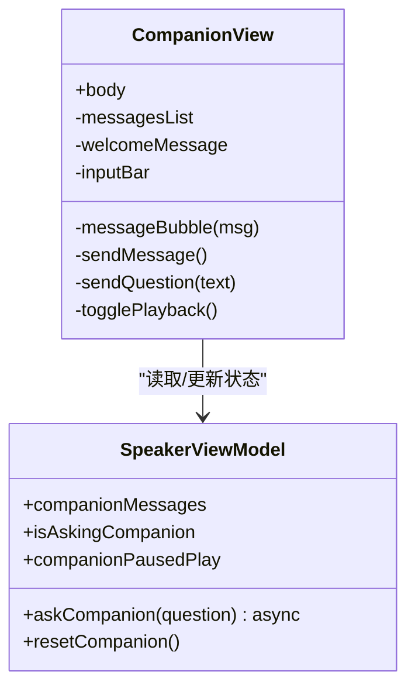

**图表来源**
- [CompanionView.swift:1-258](file://Views/CompanionView.swift#L1-L258)
- [SpeakerViewModel.swift:321-365](file://ViewModels/SpeakerViewModel.swift#L321-L365)

**章节来源**
- [CompanionView.swift:1-258](file://Views/CompanionView.swift#L1-L258)

### 视图模型（SpeakerViewModel）
- **职责**：对外暴露统一接口，协调播放、摘要、伴读；管理上下文提取、消息队列与引擎切换
- **伴读相关**：
  - askCompanion：插入用户消息与 loading 占位，提取上下文，调用专业的伴读服务，回写结果或错误
  - resetCompanion：清空消息与对话历史
  - extractCompanionContext：基于当前位置前后固定范围截取上下文
  - 播放联动：进入伴读不自动暂停，支持边听边问，退出时不自动恢复
  - 引擎切换：支持三种 TTS 引擎的动态切换
  - **持久化集成**：在加载文档时自动恢复对话历史，在重置时清除持久化数据

**更新** 增强了伴读功能的集成，移除了自动暂停逻辑以支持边听边问的学习模式，同时保持了良好的用户体验。**新增SwiftData持久化集成**，在文档加载时自动恢复对话历史，在文档切换时清理旧对话并加载新文档的历史对话。

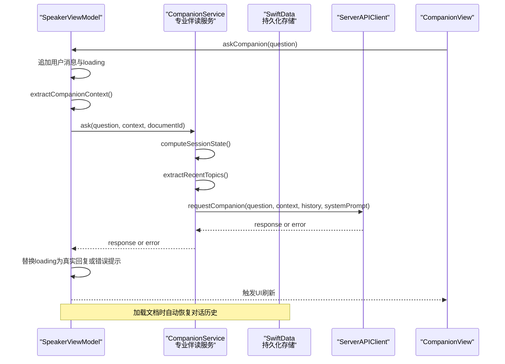

**图表来源**
- [SpeakerViewModel.swift:321-356](file://ViewModels/SpeakerViewModel.swift#L321-L356)
- [SpeakerViewModel.swift:142-177](file://ViewModels/SpeakerViewModel.swift#L142-L177)
- [CompanionService.swift:99-139](file://Services/CompanionService.swift#L99-L139)
- [ServerAPIClient.swift:37-45](file://Services/ServerAPIClient.swift#L37-L45)

**章节来源**
- [SpeakerViewModel.swift:1-505](file://ViewModels/SpeakerViewModel.swift#L1-L505)

### 荔枝吉祥物角色系统（LycheeMascotView）
- **职责**：可复用的荔枝吉祥物视图，支持多种动画状态、等级装饰和长按彩蛋
- **关键点**：
  - **7种动画状态**：idle（呼吸缩放）、listening（左右轻摇）、thinking（叶子转动）、happy（弹跳放大）、sleeping（倾斜Zzz）、surprised（放大抖动）、waving（旋转摇摆）
  - **等级系统**：small（0~60分钟）、medium（60~300分钟）、large（300+分钟），不同等级有不同大小倍数和装饰图标
  - **多场景集成**：书库空状态、AI伴读头像、播放器伴侣、加载动画、长按彩蛋、进度激励
  - **动画实现**：基于SwiftUI的.rotationEffect、.scaleEffect、.offset + withAnimation(.easeInOut.repeatForever)实现

**新增功能** 荔枝吉祥物角色系统全面植入到应用的6个核心场景，通过单张静态图配合SwiftUI动画实现了丰富的表情状态和交互体验。

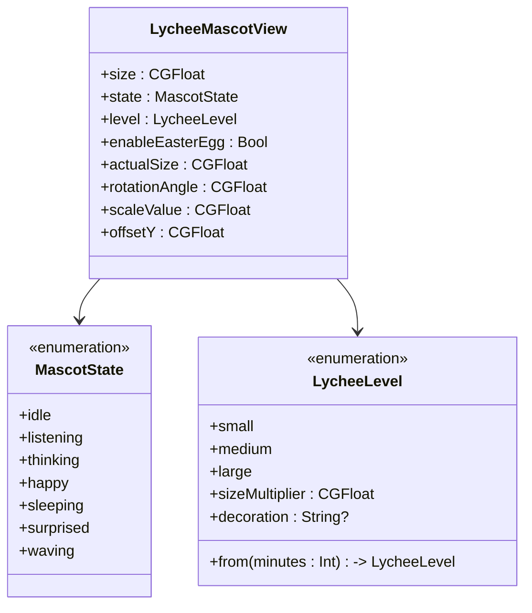

**图表来源**
- [LycheeMascotView.swift:1-144](file://Views/LycheeMascotView.swift#L1-L144)

**章节来源**
- [LycheeMascotView.swift:1-144](file://Views/LycheeMascotView.swift#L1-L144)

### 双模式摘要系统（AISummaryService）
- **职责**：AI文档总结服务，支持结构化总结和多种输出格式
- **关键点**：
  - **专业提示词系统**：包含工作原则、工作流程、输出模板、自动选择总结方式等完整体系
  - **双模式输出**：支持一句话总结、三句话总结、详细总结等多种粒度
  - **结构化解析**：自动解析【一句话总结】、【三句话总结】、【核心内容】、【要点】、【行动建议】、【风险】等标记
  - **内容类型识别**：自动识别新闻、技术文档、PRD、论文等不同内容类型，采用相应的总结策略
  - **向后兼容**：支持旧格式【摘要】标记，确保平滑升级

**新增功能** AISummaryService 实现了专业的双模式摘要系统，能够根据不同内容类型自动生成高质量的结构化总结。

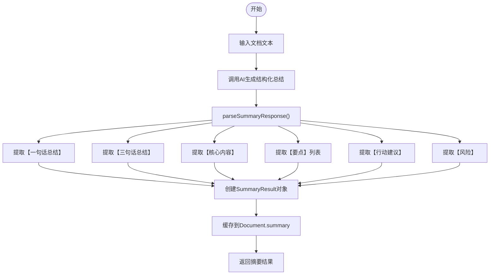

**图表来源**
- [AISummaryService.swift:72-121](file://Services/AISummaryService.swift#L72-L121)

**章节来源**
- [AISummaryService.swift:1-180](file://Services/AISummaryService.swift#L1-L180)

### 语音引擎（SpeechService / CosyVoiceSynthesizer）
- SpeechService（系统 TTS）：按自然断点分块朗读，回调位置与范围变化，完成自动推进
- CosyVoiceSynthesizer（云端 TTS）：分段合成 MP3，顺序播放，定时估算位置，失败时回调错误以触发降级
- legacySystem 支持：通过 TTSEngine 枚举提供传统系统 TTS 选项，兼容旧版本 iOS

**更新** 新增了 legacySystem TTS 引擎支持，提供了更好的设备兼容性，特别是在 iOS 17 以下的设备上。

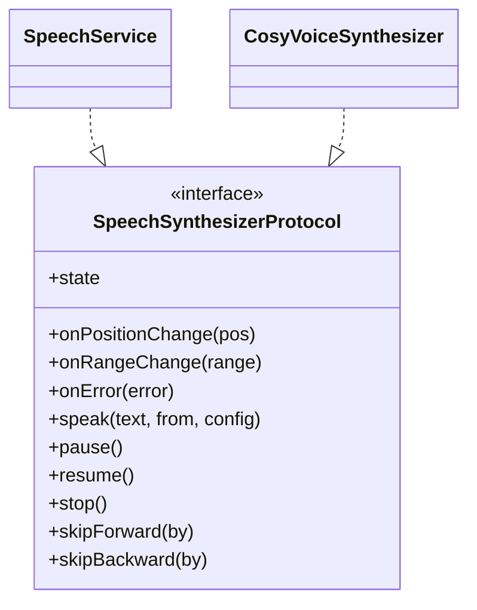

**图表来源**
- [SpeechService.swift:1-166](file://Services/SpeechService.swift#L1-L166)
- [CosyVoiceSynthesizer.swift:1-258](file://Services/CosyVoiceSynthesizer.swift#L1-L258)
- [SpeechSynthesizerProtocol.swift:1-20](file://Services/SpeechSynthesizerProtocol.swift#L1-L20)

**章节来源**
- [SpeechService.swift:1-166](file://Services/SpeechService.swift#L1-L166)
- [CosyVoiceSynthesizer.swift:1-258](file://Services/CosyVoiceSynthesizer.swift#L1-L258)
- [SpeechSynthesizerProtocol.swift:1-20](file://Services/SpeechSynthesizerProtocol.swift#L1-L20)

### 数据模型（CompanionMessage / Document / SummaryResult / VoiceConfig / CompanionChat）
- CompanionMessage：消息内容、是否用户消息、加载态
- **CompanionChat**：**SwiftData模型，按文档ID存储对话历史，支持JSON序列化和反序列化**
- **ChatEntry**：**单条对话记录，包含角色、内容、时间戳等信息**
- Document：文档元信息、提取文本、当前位置、进度、摘要缓存
- SummaryResult：摘要正文与要点列表，支持 JSON 序列化
- VoiceConfig：语音配置，包含引擎选择、音色设置等
- TTSEngine：语音引擎类型枚举，支持 system、knowledgeVoice、legacySystem

**更新** 新增了 CompanionChat 和 ChatEntry 模型，提供了完整的SwiftData持久化支持，实现了对话历史的本地存储和跨应用会话恢复。

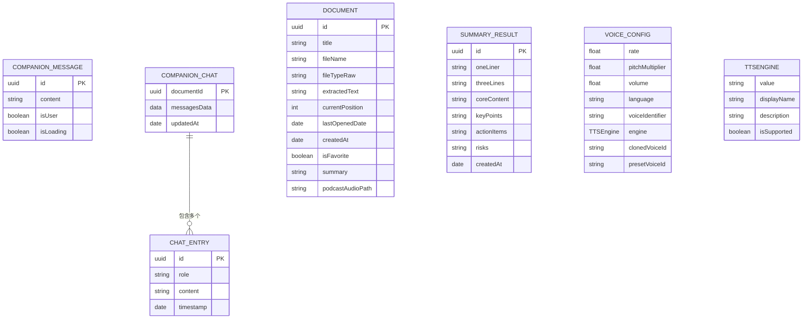

**图表来源**
- [CompanionMessage.swift:1-11](file://Models/CompanionMessage.swift#L1-L11)
- [CompanionChat.swift:20-41](file://Models/CompanionChat.swift#L20-L41)
- [CompanionChat.swift:5-18](file://Models/CompanionChat.swift#L5-L18)
- [Document.swift:1-115](file://Models/Document.swift#L1-L115)
- [SummaryResult.swift:1-33](file://Models/SummaryResult.swift#L1-L33)
- [VoiceConfig.swift:1-64](file://Models/VoiceConfig.swift#L1-L64)

**章节来源**
- [CompanionMessage.swift:1-11](file://Models/CompanionMessage.swift#L1-L11)
- [CompanionChat.swift:1-42](file://Models/CompanionChat.swift#L1-L42)
- [Document.swift:1-115](file://Models/Document.swift#L1-L115)
- [SummaryResult.swift:1-33](file://Models/SummaryResult.swift#L1-L33)
- [VoiceConfig.swift:1-64](file://Models/VoiceConfig.swift#L1-L64)

## 依赖关系分析
- 视图依赖视图模型：PlayerView 与 CompanionView 通过 @ObservedObject 订阅状态
- 视图模型聚合服务：SpeakerViewModel 组合专业的伴读服务、语音引擎、摘要服务与错误处理器
- **专业的伴读服务依赖统一API客户端**：CompanionService 负责提示词工程和会话管理，所有网络请求委托给 ServerAPIClient
- **统一的API客户端处理所有网络逻辑**：ServerAPIClient 集中处理HTTP请求、错误处理和响应解析
- **SwiftData持久化集成**：CompanionService 通过 ModelContext 访问 SwiftData 存储，实现对话历史的本地持久化
- 语音引擎可插拔：通过协议抽象，运行时切换系统/云端引擎，并在出错时降级
- 引擎兼容性：支持多种 TTS 引擎，根据设备能力自动选择合适的引擎
- **荔枝角色系统集成**：LycheeMascotView 在多个视图中被引用，提供一致的吉祥物体验
- **应用级SwiftData配置**：KnowledgeApp 中注册 CompanionChat 模型，ContentView 注入 ModelContext
- **订阅权限管理**：通过 SubscriptionManager 管理AI功能的免费试用次数和Premium订阅权限

**重大更新** 新的架构实现了更清晰的职责分离，CompanionService 专注于专业的AI伴读功能，ServerAPIClient 专注于网络请求，LycheeMascotView 提供统一的吉祥物体验，**新增的SwiftData持久化层确保数据一致性**。提高了代码的可维护性和可测试性。**AI伴读功能现已作为核心功能永久启用**，不再需要功能开关控制。

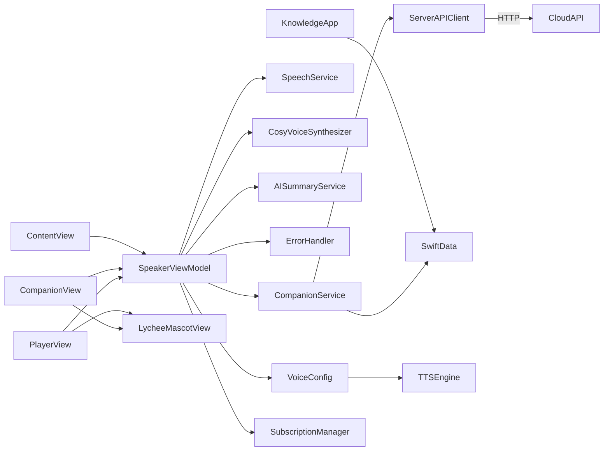

**图表来源**
- [PlayerView.swift:1-187](file://Views/PlayerView.swift#L1-L187)
- [CompanionView.swift:1-258](file://Views/CompanionView.swift#L1-L258)
- [SpeakerViewModel.swift:1-505](file://ViewModels/SpeakerViewModel.swift#L1-L505)
- [CompanionService.swift:1-217](file://Services/CompanionService.swift#L1-L217)
- [ServerAPIClient.swift:1-208](file://Services/ServerAPIClient.swift#L1-L208)
- [KnowledgeApp.swift:10-18](file://App/KnowledgeApp.swift#L10-L18)
- [ContentView.swift:1-101](file://Views/ContentView.swift#L1-L101)
- [VoiceConfig.swift:1-64](file://Models/VoiceConfig.swift#L1-L64)
- [LycheeMascotView.swift:1-144](file://Views/LycheeMascotView.swift#L1-L144)
- [SubscriptionManager.swift:1-166](file://Services/SubscriptionManager.swift#L1-L166)

**章节来源**
- [SpeakerViewModel.swift:1-505](file://ViewModels/SpeakerViewModel.swift#L1-L505)
- [CompanionService.swift:1-217](file://Services/CompanionService.swift#L1-L217)
- [ServerAPIClient.swift:1-208](file://Services/ServerAPIClient.swift#L1-L208)
- [KnowledgeApp.swift:10-18](file://App/KnowledgeApp.swift#L10-L18)
- [ContentView.swift:1-101](file://Views/ContentView.swift#L1-L101)
- [VoiceConfig.swift:1-64](file://Models/VoiceConfig.swift#L1-L64)
- [LycheeMascotView.swift:1-144](file://Views/LycheeMascotView.swift#L1-L144)
- [SubscriptionManager.swift:1-166](file://Services/SubscriptionManager.swift#L1-L166)

## 性能考量
- **专业化服务设计**：CompanionService 专注于AI伴读功能，通过提示词工程和会话管理提升服务质量
- **上下文长度控制**：伴读上下文采用固定窗口（前后若干字符），避免过大请求体
- **历史裁剪**：对话历史限制在最近20轮，降低内存消耗与网络传输开销
- **统一网络处理**：ServerAPIClient 集中处理网络请求，提高代码复用率
- **SwiftData持久化优化**：使用JSON编码存储对话历史，减少数据库查询复杂度
- **异步与主线程**：网络与合成在后台执行，UI 更新在主线程，避免卡顿
- **资源释放**：停止播放时清理临时文件与定时器，防止内存泄漏
- **引擎选择**：根据设备能力选择合适的 TTS 引擎，平衡音质与性能
- **动画优化**：荔枝角色动画使用轻量级SwiftUI修饰符，避免过度渲染
- **摘要缓存**：AI摘要结果持久化存储，避免重复生成
- **增量持久化**：仅在对话更新时保存，避免频繁写入磁盘

**重大更新** 新的架构显著提升了性能和用户体验，通过专业化服务设计、优化的动画系统和智能缓存机制，减少了不必要的计算和内存占用。**新增的SwiftData持久化采用了高效的JSON编码策略，避免了频繁的数据库操作，并通过增量保存机制进一步优化了性能**。

## 故障排查指南
- **常见问题**
  - **服务器连接问题**：检查 ServerAPIClient.baseURL 配置是否正确
  - **API Key 无效**：服务端返回鉴权错误，需检查服务器端密钥配置
  - **网络异常**：抛出网络错误，建议重试或检查网络环境
  - **云端 TTS 失败**：自动降级到系统 TTS，可在设置中确认引擎状态
  - **引擎不支持**：某些引擎在当前设备上不可用，会自动切换到支持的引擎
  - **对话历史丢失**：检查 CompanionService.resetConversation() 调用时机
  - **提示词失效**：检查 CompanionService.systemPrompt 中的占位符替换是否正常
  - **会话状态异常**：验证 computeSessionState() 的逻辑是否符合预期
  - **难度自适应问题**：检查 UserDefaults 中 companion_difficulty 的设置
  - **荔枝角色动画异常**：确认 LycheeMascotView 的状态切换逻辑
  - **SwiftData持久化失败**：检查 ModelContainer 配置和 ModelContext 注入
  - **对话恢复异常**：验证 loadConversation() 的JSON解码逻辑
  - **文档切换问题**：确认 resetConversation() 在文档切换时的调用时机
  - **持久化数据损坏**：检查 JSON 编码/解码过程中的错误处理
  - **订阅权限问题**：检查 SubscriptionManager.canUseAICompanion 权限状态
  - **免费次数耗尽**：验证 aiCompanionUsed 计数器和 freeTrialLimit 设置

**重大更新** 新增了专业伴读服务相关的故障排查指导，包括提示词系统、会话状态管理和荔枝角色系统的诊断方法。**新增SwiftData持久化相关的故障排查指导**，包括模型配置、数据恢复、JSON编解码和持久化失败的诊断方法。**新增订阅权限相关的故障排查指导**，包括权限检查、免费次数管理和Premium订阅状态验证。

**章节来源**
- [ServerAPIClient.swift:166-207](file://Services/ServerAPIClient.swift#L166-L207)
- [ErrorHandler.swift:1-53](file://Services/ErrorHandler.swift#L1-L53)
- [SpeakerViewModel.swift:321-365](file://ViewModels/SpeakerViewModel.swift#L321-L365)
- [VoiceConfig.swift:26-33](file://Models/VoiceConfig.swift#L26-L33)
- [CompanionService.swift:152-185](file://Services/CompanionService.swift#L152-L185)
- [KnowledgeApp.swift:10-18](file://App/KnowledgeApp.swift#L10-L18)
- [LycheeMascotView.swift:105-144](file://Views/LycheeMascotView.swift#L105-L144)
- [SubscriptionManager.swift:43-69](file://Services/SubscriptionManager.swift#L43-L69)

## 结论
AI 伴读对话功能经过重大重构，采用了更加专业和智能化的架构设计。新的 CompanionService 作为专业的AI伴读服务，包含了完整的提示词工程、会话状态管理、难度自适应和苏格拉底式引导方法，为用户提供了更加个性化和高效的学习体验。**新增的SwiftData持久化支持确保了对话历史的本地存储和跨应用会话恢复，大大提升了用户体验的连续性**。**AI伴读功能现已作为核心功能永久启用**，移除了原有的功能开关，使功能更加稳定可靠。

**重大更新** 本次重构将 CompanionService 从简单的43行历史管理服务扩展为217行的专业AI伴读系统，新增了专业提示词系统、会话状态管理、难度自适应和苏格拉底式引导方法。**同时新增了完整的SwiftData持久化支持**，通过CompanionChat模型实现了对话历史的本地存储，包括loadConversation(), saveConversation(), clearConversation()等全面的对话管理API。**移除了enableCompanion功能开关**，使AI伴读功能成为应用的核心组成部分。荔枝吉祥物角色系统全面植入到6个核心场景，双模式摘要系统提供了高质量的文档总结功能。

新的架构不仅提高了代码的可维护性和可测试性，还显著提升了性能和用户体验。通过专业化的服务设计、优化的动画系统、智能缓存机制和**可靠的本地持久化**，为用户提供了更加流畅和可靠的伴读体验。建议在后续迭代中持续优化提示词效果、增加更多学习模式、改进难度自适应算法，并对长文档场景进行更精细的分段与缓存策略。

新的架构为未来的功能扩展奠定了良好的基础，特别是当需要添加更多AI服务、改进现有服务或扩展学习模式时，可以更容易地进行维护和升级。**SwiftData持久化层的加入为未来可能的离线功能和数据同步功能提供了坚实的基础**，使得应用能够在网络不可用时仍然保持基本的对话功能。**AI伴读功能作为核心功能的永久启用**，为用户提供了更加一致和稳定的学习体验。