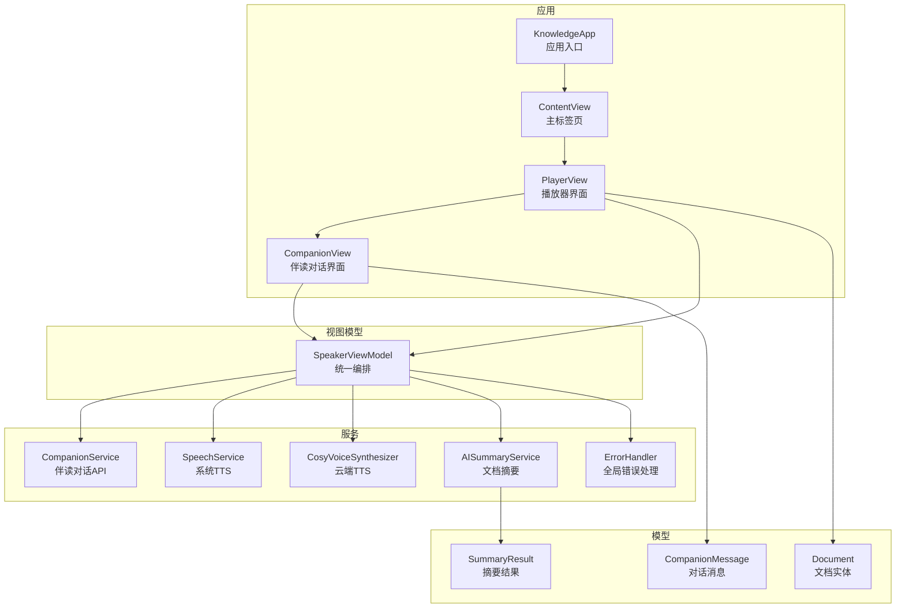
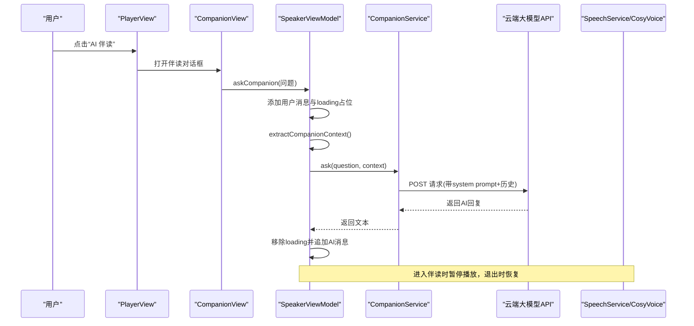
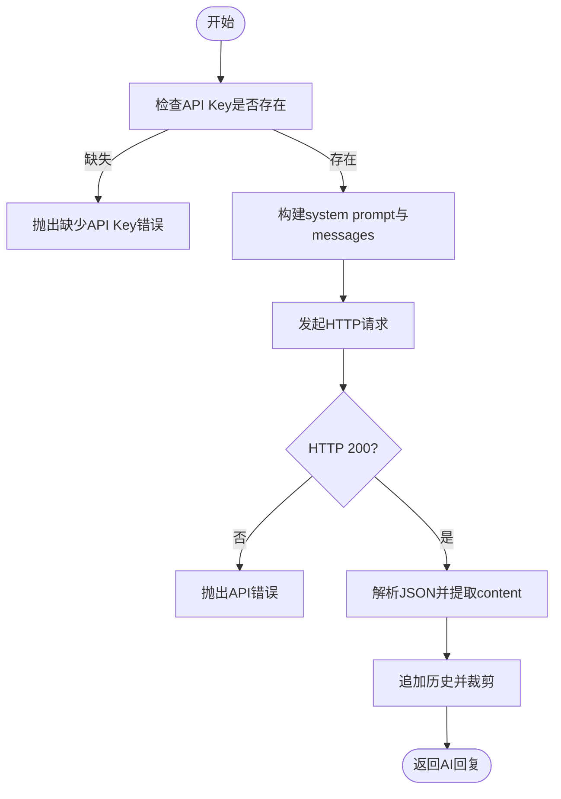
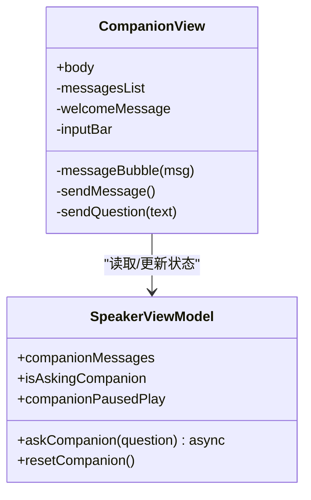
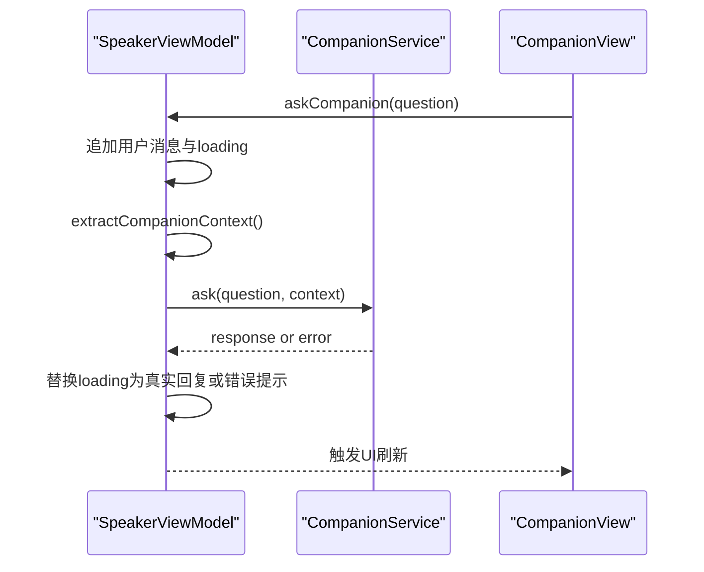
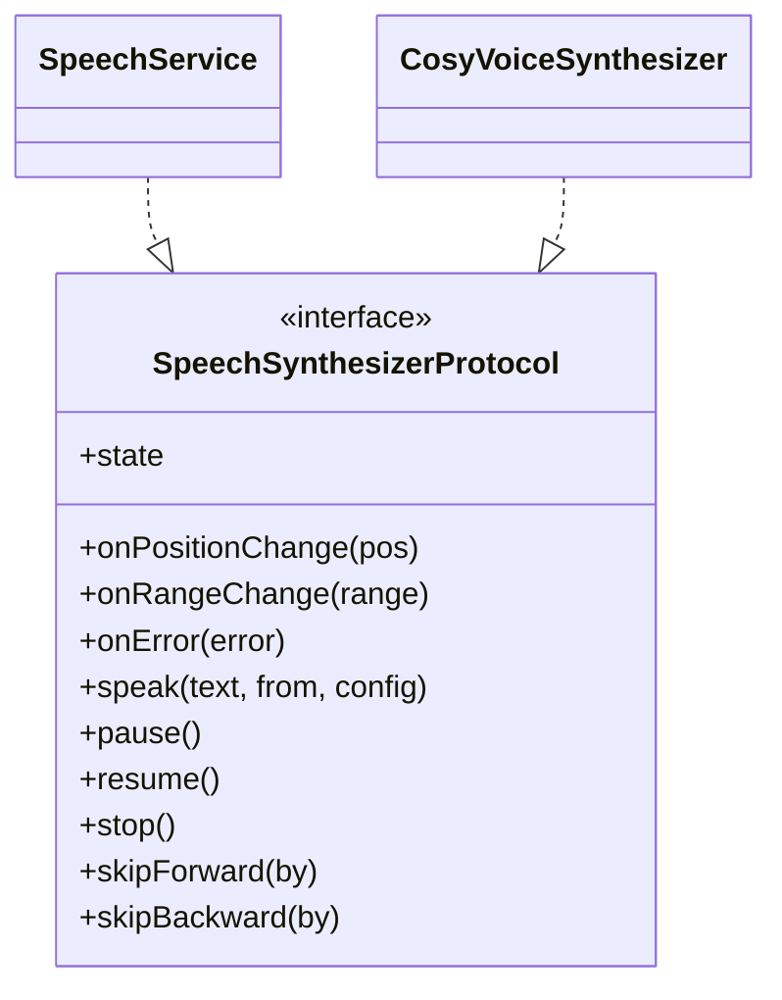
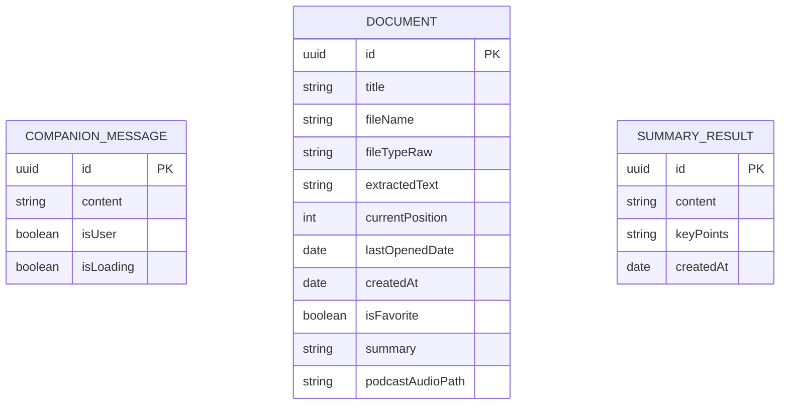
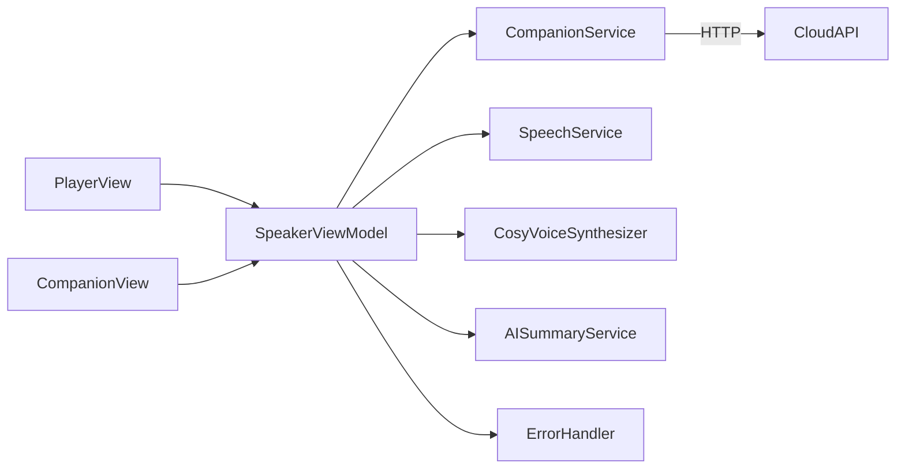

# AI 伴读对话功能

<cite>
**本文引用的文件**
- [KnowledgeApp.swift](file://App/KnowledgeApp.swift)
- [AppDelegate.swift](file://App/AppDelegate.swift)
- [SpeakerViewModel.swift](file://ViewModels/SpeakerViewModel.swift)
- [CompanionService.swift](file://Services/CompanionService.swift)
- [CompanionMessage.swift](file://Models/CompanionMessage.swift)
- [CompanionView.swift](file://Views/CompanionView.swift)
- [PlayerView.swift](file://Views/PlayerView.swift)
- [SpeechService.swift](file://Services/SpeechService.swift)
- [CosyVoiceSynthesizer.swift](file://Services/CosyVoiceSynthesizer.swift)
- [AISummaryService.swift](file://Services/AISummaryService.swift)
- [Document.swift](file://Models/Document.swift)
- [SummaryResult.swift](file://Models/SummaryResult.swift)
- [ErrorHandler.swift](file://Services/ErrorHandler.swift)
</cite>

## 目录
1. [简介](#简介)
2. [项目结构](#项目结构)
3. [核心组件](#核心组件)
4. [架构总览](#架构总览)
5. [详细组件分析](#详细组件分析)
6. [依赖关系分析](#依赖关系分析)
7. [性能考量](#性能考量)
8. [故障排查指南](#故障排查指南)
9. [结论](#结论)

## 简介
本章节面向“AI 伴读对话”能力，说明其在应用中的定位、交互流程与关键实现要点。该功能在用户朗读文档时提供“边听边问”的交互式体验：进入对话界面自动暂停朗读，提问时将当前朗读位置上下文注入系统提示，调用云端大模型生成简短口语化回答；退出对话后恢复朗读。同时，该功能与播放控制、文本高亮、错误处理等模块协同工作。

## 项目结构
围绕 AI 伴读对话的关键代码分布在以下层次：
- 应用入口与生命周期：初始化主题、数据容器、音频会话配置
- 视图层：播放器主界面与伴读对话界面
- 视图模型层：统一编排播放、摘要、伴读状态与事件
- 服务层：伴读对话服务（调用云端）、语音合成引擎（本地与云端）
- 数据模型：消息、文档、摘要结果

图表来源
- [KnowledgeApp.swift:1-29](file://App/KnowledgeApp.swift#L1-L29)
- [PlayerView.swift:1-187](file://Views/PlayerView.swift#L1-L187)
- [CompanionView.swift:1-200](file://Views/CompanionView.swift#L1-L200)
- [SpeakerViewModel.swift:1-378](file://ViewModels/SpeakerViewModel.swift#L1-L378)
- [CompanionService.swift:1-114](file://Services/CompanionService.swift#L1-L114)
- [SpeechService.swift:1-155](file://Services/SpeechService.swift#L1-L155)
- [CosyVoiceSynthesizer.swift:1-258](file://Services/CosyVoiceSynthesizer.swift#L1-L258)
- [AISummaryService.swift:1-180](file://Services/AISummaryService.swift#L1-L180)
- [CompanionMessage.swift:1-11](file://Models/CompanionMessage.swift#L1-L11)
- [Document.swift:1-115](file://Models/Document.swift#L1-L115)
- [SummaryResult.swift:1-33](file://Models/SummaryResult.swift#L1-L33)
- [ErrorHandler.swift:1-53](file://Services/ErrorHandler.swift#L1-L53)

章节来源
- [KnowledgeApp.swift:1-29](file://App/KnowledgeApp.swift#L1-L29)
- [AppDelegate.swift:1-14](file://App/AppDelegate.swift#L1-L14)
- [ContentView.swift:1-98](file://Views/ContentView.swift#L1-L98)

## 核心组件
- 伴读对话服务：封装多轮对话、上下文注入、历史裁剪与错误映射
- 伴读对话视图：消息列表、快捷问题、输入栏、加载态与滚动定位
- 视图模型：编排伴读流程、提取上下文、管理消息队列与播放联动
- 语音引擎：系统 TTS 与云端 CosyVoice 双引擎，支持切换与降级
- 错误处理：统一弹窗与日志输出

章节来源
- [CompanionService.swift:1-114](file://Services/CompanionService.swift#L1-L114)
- [CompanionView.swift:1-200](file://Views/CompanionView.swift#L1-L200)
- [SpeakerViewModel.swift:1-378](file://ViewModels/SpeakerViewModel.swift#L1-L378)
- [SpeechService.swift:1-155](file://Services/SpeechService.swift#L1-L155)
- [CosyVoiceSynthesizer.swift:1-258](file://Services/CosyVoiceSynthesizer.swift#L1-L258)
- [ErrorHandler.swift:1-53](file://Services/ErrorHandler.swift#L1-L53)

## 架构总览
下图展示从 UI 到服务的数据与控制流，以及伴读对话与播放控制的协作关系。

图表来源
- [PlayerView.swift:46-72](file://Views/PlayerView.swift#L46-L72)
- [CompanionView.swift:186-197](file://Views/CompanionView.swift#L186-L197)
- [SpeakerViewModel.swift:227-275](file://ViewModels/SpeakerViewModel.swift#L227-L275)
- [CompanionService.swift:24-112](file://Services/CompanionService.swift#L24-L112)

## 详细组件分析

### 伴读对话服务（CompanionService）
- 职责：构建 system prompt（角色定义 + 段落上下文），维护多轮消息历史，调用云端接口，解析响应并抛出领域错误
- 关键点：
  - 历史裁剪：保留最近若干轮，避免上下文过长
  - 错误映射：区分未配置/无效 API Key、网络或业务错误
  - 超时与鉴权：设置请求超时，处理 401/403

图表来源
- [CompanionService.swift:24-112](file://Services/CompanionService.swift#L24-L112)

章节来源
- [CompanionService.swift:1-114](file://Services/CompanionService.swift#L1-L114)
- [AISummaryService.swift:158-179](file://Services/AISummaryService.swift#L158-L179)

### 伴读对话视图（CompanionView）
- 职责：消息气泡渲染、欢迎语与快捷问题、输入框与发送逻辑、进入/退出时的播放联动
- 关键点：
  - 自动滚动到底部：新消息出现后滚动至最新
  - 加载态：显示“思考中...”占位
  - 工具栏：清空对话、继续听（返回播放器）

图表来源
- [CompanionView.swift:1-200](file://Views/CompanionView.swift#L1-L200)
- [SpeakerViewModel.swift:227-259](file://ViewModels/SpeakerViewModel.swift#L227-L259)

章节来源
- [CompanionView.swift:1-200](file://Views/CompanionView.swift#L1-L200)

### 视图模型（SpeakerViewModel）
- 职责：对外暴露统一接口，协调播放、摘要、伴读；管理上下文提取、消息队列与引擎切换
- 伴读相关：
  - askCompanion：插入用户消息与 loading 占位，提取上下文，调用伴读服务，回写结果或错误
  - resetCompanion：清空消息与对话历史
  - extractCompanionContext：基于当前位置前后固定范围截取上下文
  - 播放联动：进入伴读暂停、退出恢复

图表来源
- [SpeakerViewModel.swift:227-275](file://ViewModels/SpeakerViewModel.swift#L227-L275)
- [CompanionService.swift:24-112](file://Services/CompanionService.swift#L24-L112)

章节来源
- [SpeakerViewModel.swift:1-378](file://ViewModels/SpeakerViewModel.swift#L1-L378)

### 语音引擎（SpeechService / CosyVoiceSynthesizer）
- SpeechService（系统 TTS）：按自然断点分块朗读，回调位置与范围变化，完成自动推进
- CosyVoiceSynthesizer（云端 TTS）：分段合成 MP3，顺序播放，定时估算位置，失败时回调错误以触发降级

图表来源
- [SpeechService.swift:1-155](file://Services/SpeechService.swift#L1-L155)
- [CosyVoiceSynthesizer.swift:1-258](file://Services/CosyVoiceSynthesizer.swift#L1-L258)

章节来源
- [SpeechService.swift:1-155](file://Services/SpeechService.swift#L1-L155)
- [CosyVoiceSynthesizer.swift:1-258](file://Services/CosyVoiceSynthesizer.swift#L1-L258)

### 数据模型（CompanionMessage / Document / SummaryResult）
- CompanionMessage：消息内容、是否用户消息、加载态
- Document：文档元信息、提取文本、当前位置、进度、摘要缓存
- SummaryResult：摘要正文与要点列表，支持 JSON 序列化

图表来源
- [CompanionMessage.swift:1-11](file://Models/CompanionMessage.swift#L1-L11)
- [Document.swift:1-115](file://Models/Document.swift#L1-L115)
- [SummaryResult.swift:1-33](file://Models/SummaryResult.swift#L1-L33)

章节来源
- [CompanionMessage.swift:1-11](file://Models/CompanionMessage.swift#L1-L11)
- [Document.swift:1-115](file://Models/Document.swift#L1-L115)
- [SummaryResult.swift:1-33](file://Models/SummaryResult.swift#L1-L33)

## 依赖关系分析
- 视图依赖视图模型：PlayerView 与 CompanionView 通过 @ObservedObject 订阅状态
- 视图模型聚合服务：SpeakerViewModel 组合伴读服务、语音引擎、摘要服务与错误处理器
- 伴读服务依赖网络与配置：从 UserDefaults 读取 API Key，向云端发起请求
- 语音引擎可插拔：通过协议抽象，运行时切换系统/云端引擎，并在出错时降级

图表来源
- [PlayerView.swift:1-187](file://Views/PlayerView.swift#L1-L187)
- [CompanionView.swift:1-200](file://Views/CompanionView.swift#L1-L200)
- [SpeakerViewModel.swift:1-378](file://ViewModels/SpeakerViewModel.swift#L1-L378)
- [CompanionService.swift:1-114](file://Services/CompanionService.swift#L1-L114)

章节来源
- [SpeakerViewModel.swift:1-378](file://ViewModels/SpeakerViewModel.swift#L1-L378)
- [CompanionService.swift:1-114](file://Services/CompanionService.swift#L1-L114)

## 性能考量
- 上下文长度控制：伴读上下文采用固定窗口（前后若干字符），避免过大请求体
- 历史裁剪：对话历史限制在最近若干轮，降低 token 消耗与延迟
- 语音分段：系统 TTS 按自然断点切块，云端 TTS 按段落合成，减少单次任务体积
- 异步与主线程：网络与合成在后台执行，UI 更新在主线程，避免卡顿
- 资源释放：停止播放时清理临时文件与定时器，防止内存泄漏

[本节为通用指导，不直接分析具体文件]

## 故障排查指南
- 常见问题
  - 未配置 API Key：伴读与摘要均会抛出“缺少 API Key”错误
  - API Key 无效：服务端返回鉴权错误，需检查密钥有效性
  - 网络异常：抛出网络错误，建议重试或检查网络环境
  - 云端 TTS 失败：自动降级到系统 TTS，可在设置中确认引擎状态
- 定位方法
  - 查看全局错误弹窗与控制台日志
  - 检查伴读消息中的错误提示
  - 验证 UserDefaults 中 API Key 是否正确写入

章节来源
- [AISummaryService.swift:158-179](file://Services/AISummaryService.swift#L158-L179)
- [ErrorHandler.swift:1-53](file://Services/ErrorHandler.swift#L1-L53)
- [SpeakerViewModel.swift:298-311](file://ViewModels/SpeakerViewModel.swift#L298-L311)

## 结论
AI 伴读对话功能以“边听边问”为核心体验，通过上下文注入与多轮历史保持对话连贯性；在工程上采用清晰的分层与协议抽象，使语音引擎可插拔、错误处理统一、UI 与状态解耦。建议在后续迭代中持续优化上下文窗口策略、增加重试与退避机制，并对长文档场景进行更精细的分段与缓存策略。