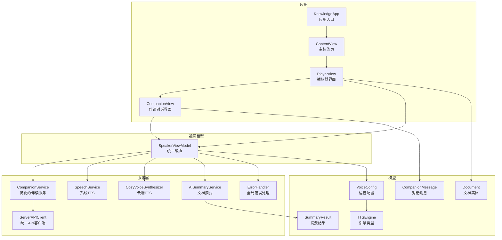
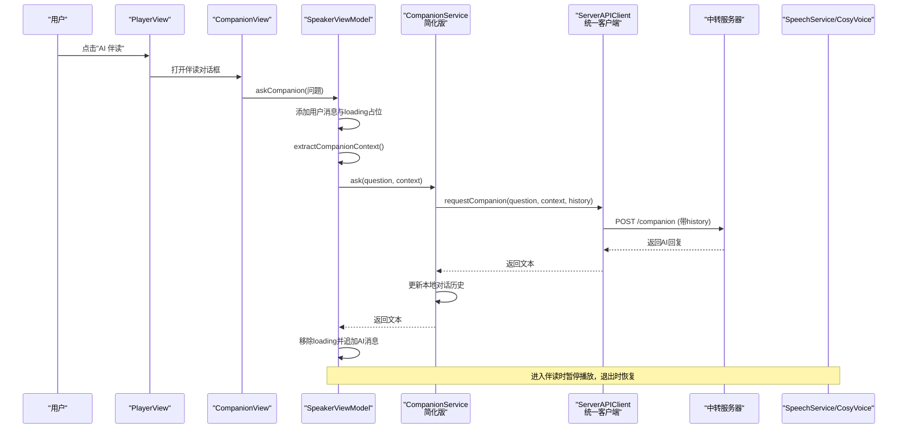
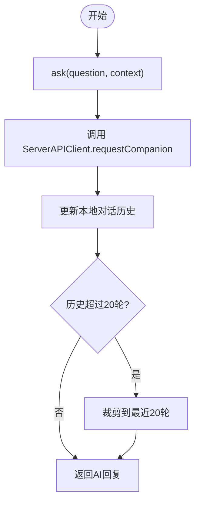
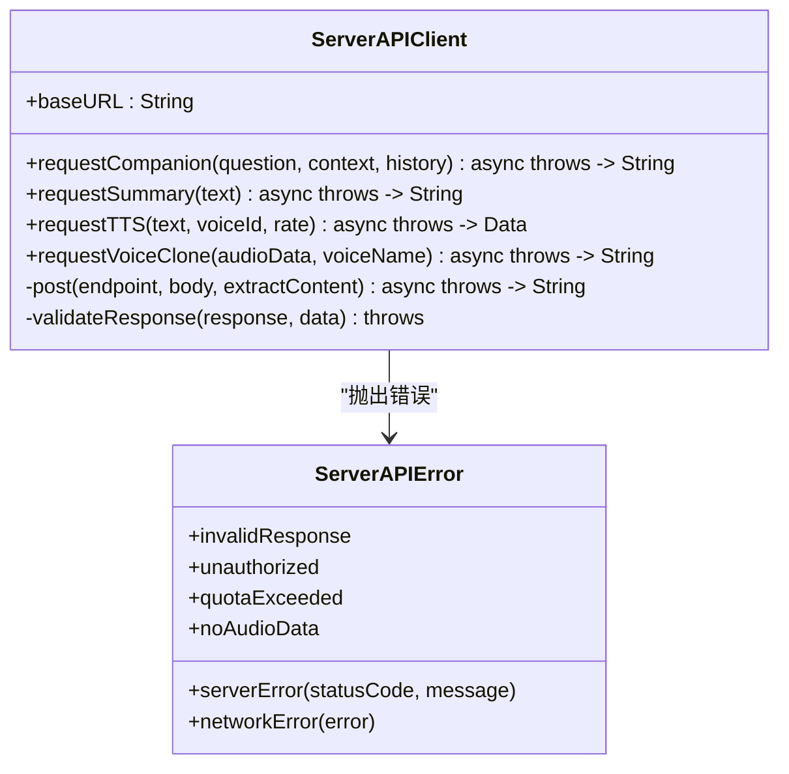
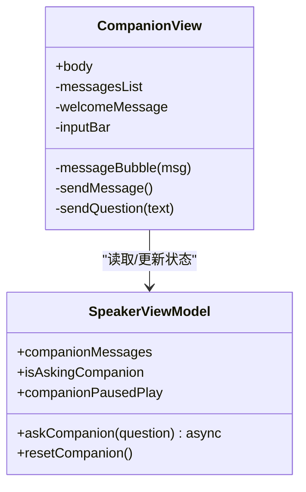
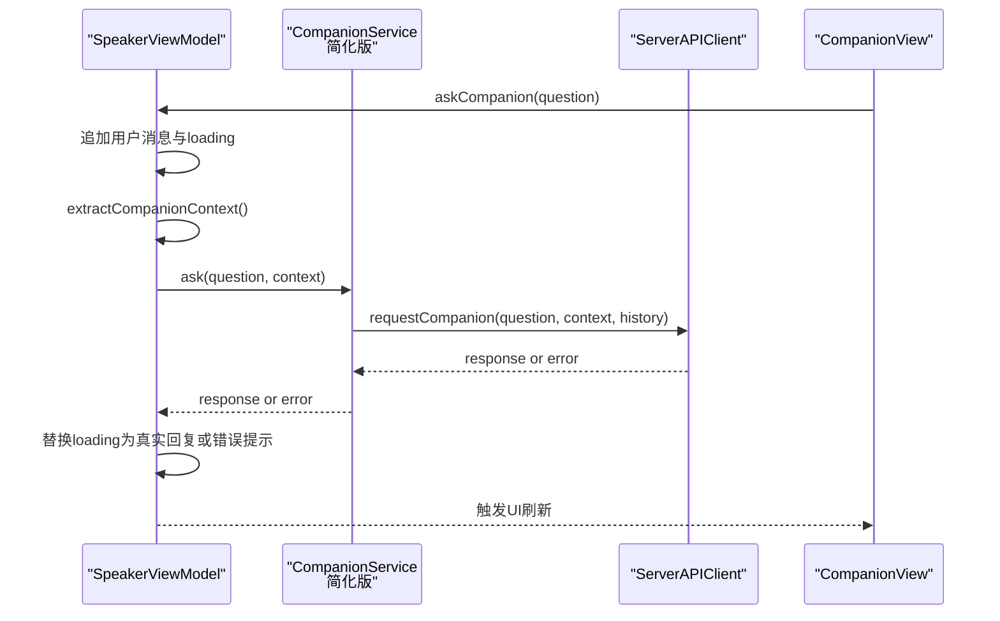
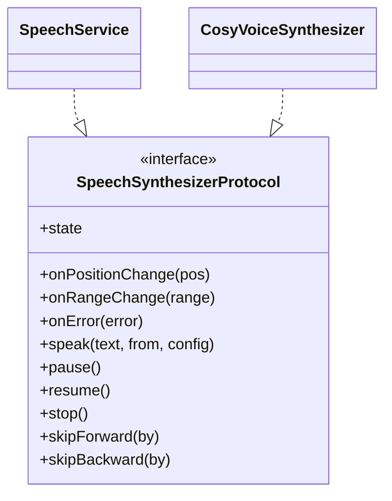
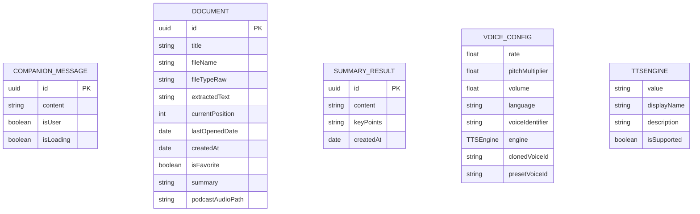
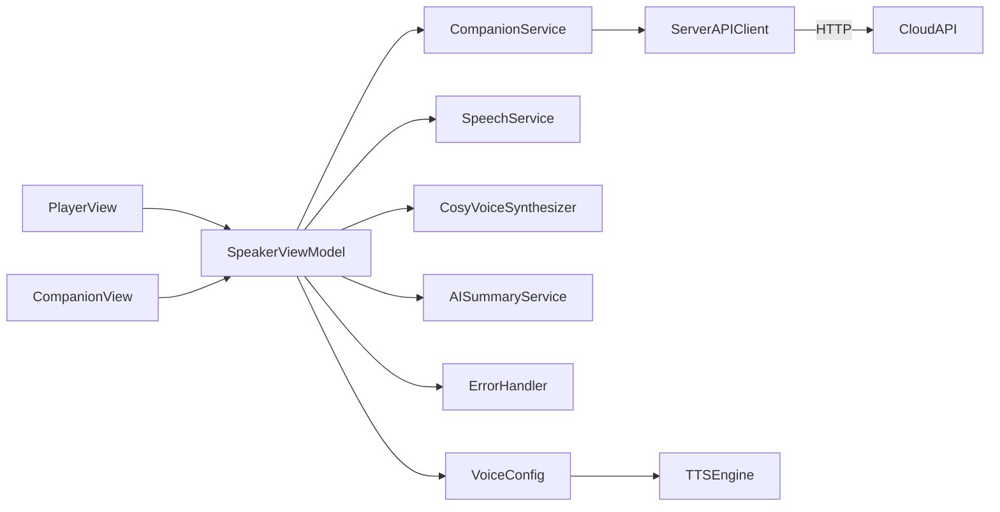

# AI 伴读对话功能

<cite>
**本文引用的文件**
- [KnowledgeApp.swift](file://App/KnowledgeApp.swift)
- [AppDelegate.swift](file://App/AppDelegate.swift)
- [SpeakerViewModel.swift](file://ViewModels/SpeakerViewModel.swift)
- [CompanionService.swift](file://Services/CompanionService.swift)
- [ServerAPIClient.swift](file://Services/ServerAPIClient.swift)
- [CompanionMessage.swift](file://Models/CompanionMessage.swift)
- [CompanionView.swift](file://Views/CompanionView.swift)
- [PlayerView.swift](file://Views/PlayerView.swift)
- [SpeechService.swift](file://Services/SpeechService.swift)
- [CosyVoiceSynthesizer.swift](file://Services/CosyVoiceSynthesizer.swift)
- [AISummaryService.swift](file://Services/AISummaryService.swift)
- [Document.swift](file://Models/Document.swift)
- [SummaryResult.swift](file://Models/SummaryResult.swift)
- [ErrorHandler.swift](file://Services/ErrorHandler.swift)
- [VoiceConfig.swift](file://Models/VoiceConfig.swift)
- [SpeechSynthesizerProtocol.swift](file://Services/SpeechSynthesizerProtocol.swift)
</cite>

## 更新摘要
**已进行的变更**
- CompanionService 大幅简化，从76行代码精简到43行，移除了复杂的本地API认证和历史管理逻辑
- 采用服务器端上下文处理架构，客户端仅维护轻量级对话历史（最多20轮）
- 通过 ServerAPIClient 统一处理所有网络请求和错误处理
- 增强了多轮对话的稳定性，支持完整的上下文传递机制

## 目录
1. [简介](#简介)
2. [项目结构](#项目结构)
3. [核心组件](#核心组件)
4. [架构总览](#架构总览)
5. [详细组件分析](#详细组件分析)
6. [依赖关系分析](#依赖关系分析)
7. [性能考量](#性能考量)
8. [故障排查指南](#故障排查指南)
9. [结论](#结论)

## 简介
本章节面向"AI 伴读对话"能力，说明其在应用中的定位、交互流程与关键实现要点。该功能在用户朗读文档时提供"边听边问"的交互式体验：进入对话界面自动暂停朗读，提问时将当前朗读位置上下文注入系统提示，调用云端大模型生成简短口语化回答；退出对话后恢复朗读。同时，该功能与播放控制、文本高亮、错误处理等模块协同工作。

**更新** CompanionService 经过重大简化重构，从原来的复杂实现精简为仅43行代码，移除了所有本地API认证和网络请求逻辑，现在专注于轻量级的对话历史维护，所有复杂的网络请求和认证都交由服务器端处理。

## 项目结构
围绕 AI 伴读对话的关键代码分布在以下层次：
- 应用入口与生命周期：初始化主题、数据容器、音频会话配置
- 视图层：播放器主界面与伴读对话界面
- 视图模型层：统一编排播放、摘要、伴读状态与事件
- 服务层：简化的伴读对话服务（仅维护历史）、统一的服务器 API 客户端、语音合成引擎（本地与云端）
- 数据模型：消息、文档、摘要结果、语音配置

**图表来源**
- [KnowledgeApp.swift:1-29](file://App/KnowledgeApp.swift#L1-L29)
- [PlayerView.swift:1-187](file://Views/PlayerView.swift#L1-L187)
- [CompanionView.swift:1-200](file://Views/CompanionView.swift#L1-L200)
- [SpeakerViewModel.swift:1-399](file://ViewModels/SpeakerViewModel.swift#L1-L399)
- [CompanionService.swift:1-47](file://Services/CompanionService.swift#L1-L47)
- [ServerAPIClient.swift:1-203](file://Services/ServerAPIClient.swift#L1-L203)
- [SpeechService.swift:1-166](file://Services/SpeechService.swift#L1-L166)
- [CosyVoiceSynthesizer.swift:1-258](file://Services/CosyVoiceSynthesizer.swift#L1-L258)
- [AISummaryService.swift:1-180](file://Services/AISummaryService.swift#L1-L180)
- [CompanionMessage.swift:1-11](file://Models/CompanionMessage.swift#L1-L11)
- [Document.swift:1-115](file://Models/Document.swift#L1-L115)
- [SummaryResult.swift:1-33](file://Models/SummaryResult.swift#L1-L33)
- [ErrorHandler.swift:1-53](file://Services/ErrorHandler.swift#L1-L53)
- [VoiceConfig.swift:1-64](file://Models/VoiceConfig.swift#L1-L64)

## 核心组件
- **简化的伴读对话服务**：专注于轻量级对话历史维护，不再处理复杂的API认证和网络请求
- **统一的服务器API客户端**：集中处理所有网络请求、错误处理和响应解析
- **伴读对话视图**：消息列表、快捷问题、输入栏、加载态与滚动定位
- **视图模型**：编排伴读流程、提取上下文、管理消息队列与播放联动
- **语音引擎**：系统 TTS、传统系统 TTS 与云端 CosyVoice 三引擎，支持切换与降级
- **错误处理**：统一弹窗与日志输出

**更新** CompanionService 经过重大简化，从原来的复杂实现精简为仅负责对话历史管理的轻量级服务，所有网络请求和认证逻辑都迁移到了 ServerAPIClient。

**章节来源**
- [CompanionService.swift:1-47](file://Services/CompanionService.swift#L1-L47)
- [ServerAPIClient.swift:1-203](file://Services/ServerAPIClient.swift#L1-L203)
- [CompanionView.swift:1-200](file://Views/CompanionView.swift#L1-L200)
- [SpeakerViewModel.swift:1-399](file://ViewModels/SpeakerViewModel.swift#L1-L399)
- [SpeechService.swift:1-166](file://Services/SpeechService.swift#L1-L166)
- [CosyVoiceSynthesizer.swift:1-258](file://Services/CosyVoiceSynthesizer.swift#L1-L258)
- [ErrorHandler.swift:1-53](file://Services/ErrorHandler.swift#L1-L53)
- [VoiceConfig.swift:1-64](file://Models/VoiceConfig.swift#L1-L64)

## 架构总览
下图展示从 UI 到服务的数据与控制流，以及伴读对话与播放控制的协作关系。新的架构中，CompanionService 仅负责轻量级的历史管理，所有复杂的网络请求都通过 ServerAPIClient 处理。

**图表来源**
- [PlayerView.swift:46-72](file://Views/PlayerView.swift#L46-L72)
- [CompanionView.swift:186-197](file://Views/CompanionView.swift#L186-L197)
- [SpeakerViewModel.swift:242-268](file://ViewModels/SpeakerViewModel.swift#L242-L268)
- [CompanionService.swift:25-40](file://Services/CompanionService.swift#L25-L40)
- [ServerAPIClient.swift:38-45](file://Services/ServerAPIClient.swift#L38-L45)

## 详细组件分析

### 简化的伴读对话服务（CompanionService）
- **职责**：专注于轻量级的对话历史维护，不再处理复杂的API认证和网络请求
- **关键点**：
  - **极简设计**：仅保留必要的对话历史管理功能，代码从76行减少到43行
  - **委托模式**：所有网络请求委托给 ServerAPIClient 处理
  - **历史裁剪**：保留最近若干轮对话记录，避免内存占用过大
  - **重置机制**：支持清空对话历史，便于切换文档时使用

**更新** CompanionService 经过重大简化，从原来的复杂实现精简为仅43行代码，移除了所有API认证、网络请求和错误处理逻辑，现在只专注于对话历史管理。

**图表来源**
- [CompanionService.swift:25-40](file://Services/CompanionService.swift#L25-L40)

**章节来源**
- [CompanionService.swift:1-47](file://Services/CompanionService.swift#L1-L47)

### 统一的服务器API客户端（ServerAPIClient）
- **职责**：集中处理所有网络请求、错误处理和响应解析
- **关键点**：
  - **统一接口**：提供 requestCompanion、requestSummary、requestTTS 等方法
  - **错误处理**：统一的 HTTP 状态码处理和错误映射
  - **响应解析**：支持多种响应格式（JSON、二进制音频等）
  - **超时管理**：合理的请求超时设置

**更新** ServerAPIClient 承担了原来 CompanionService 中的所有网络请求和认证逻辑，提供了更清晰的职责分离。

**图表来源**
- [ServerAPIClient.swift:6-203](file://Services/ServerAPIClient.swift#L6-L203)

**章节来源**
- [ServerAPIClient.swift:1-203](file://Services/ServerAPIClient.swift#L1-L203)

### 伴读对话视图（CompanionView）
- **职责**：消息气泡渲染、欢迎语与快捷问题、输入框与发送逻辑、进入/退出时的播放联动
- **关键点**：
  - 自动滚动到底部：新消息出现后滚动至最新
  - 加载态：显示"思考中..."占位
  - 工具栏：清空对话、继续听（返回播放器）
  - 快捷问题：提供常用问题按钮，提升用户体验
  - 智能焦点管理：自动聚焦输入框，提升操作效率

**更新** 改进了用户界面，新增了快捷问题按钮和更好的加载状态显示，同时优化了输入框的焦点管理。

**图表来源**
- [CompanionView.swift:1-200](file://Views/CompanionView.swift#L1-L200)
- [SpeakerViewModel.swift:242-274](file://ViewModels/SpeakerViewModel.swift#L242-L274)

**章节来源**
- [CompanionView.swift:1-200](file://Views/CompanionView.swift#L1-L200)

### 视图模型（SpeakerViewModel）
- **职责**：对外暴露统一接口，协调播放、摘要、伴读；管理上下文提取、消息队列与引擎切换
- **伴读相关**：
  - askCompanion：插入用户消息与 loading 占位，提取上下文，调用简化的伴读服务，回写结果或错误
  - resetCompanion：清空消息与对话历史
  - extractCompanionContext：基于当前位置前后固定范围截取上下文
  - 播放联动：进入伴读暂停、退出恢复
  - 引擎切换：支持三种 TTS 引擎的动态切换

**更新** 增强了引擎切换逻辑，现在支持 legacySystem 引擎，并在引擎切换时更好地处理正在播放的状态。

**图表来源**
- [SpeakerViewModel.swift:242-268](file://ViewModels/SpeakerViewModel.swift#L242-L268)
- [CompanionService.swift:25-40](file://Services/CompanionService.swift#L25-L40)
- [ServerAPIClient.swift:38-45](file://Services/ServerAPIClient.swift#L38-L45)

**章节来源**
- [SpeakerViewModel.swift:1-399](file://ViewModels/SpeakerViewModel.swift#L1-L399)

### 语音引擎（SpeechService / CosyVoiceSynthesizer）
- SpeechService（系统 TTS）：按自然断点分块朗读，回调位置与范围变化，完成自动推进
- CosyVoiceSynthesizer（云端 TTS）：分段合成 MP3，顺序播放，定时估算位置，失败时回调错误以触发降级
- legacySystem 支持：通过 TTSEngine 枚举提供传统系统 TTS 选项，兼容旧版本 iOS

**更新** 新增了 legacySystem TTS 引擎支持，提供了更好的设备兼容性，特别是在 iOS 17 以下的设备上。

**图表来源**
- [SpeechService.swift:1-166](file://Services/SpeechService.swift#L1-L166)
- [CosyVoiceSynthesizer.swift:1-258](file://Services/CosyVoiceSynthesizer.swift#L1-L258)
- [SpeechSynthesizerProtocol.swift:1-20](file://Services/SpeechSynthesizerProtocol.swift#L1-L20)

**章节来源**
- [SpeechService.swift:1-166](file://Services/SpeechService.swift#L1-L166)
- [CosyVoiceSynthesizer.swift:1-258](file://Services/CosyVoiceSynthesizer.swift#L1-L258)
- [SpeechSynthesizerProtocol.swift:1-20](file://Services/SpeechSynthesizerProtocol.swift#L1-L20)

### 数据模型（CompanionMessage / Document / SummaryResult / VoiceConfig）
- CompanionMessage：消息内容、是否用户消息、加载态
- Document：文档元信息、提取文本、当前位置、进度、摘要缓存
- SummaryResult：摘要正文与要点列表，支持 JSON 序列化
- VoiceConfig：语音配置，包含引擎选择、音色设置等
- TTSEngine：语音引擎类型枚举，支持 system、knowledgeVoice、legacySystem

**更新** 新增了 TTSEngine 枚举，定义了三种不同的 TTS 引擎类型，提供了更好的引擎管理能力。

**图表来源**
- [CompanionMessage.swift:1-11](file://Models/CompanionMessage.swift#L1-L11)
- [Document.swift:1-115](file://Models/Document.swift#L1-L115)
- [SummaryResult.swift:1-33](file://Models/SummaryResult.swift#L1-L33)
- [VoiceConfig.swift:1-64](file://Models/VoiceConfig.swift#L1-L64)

**章节来源**
- [CompanionMessage.swift:1-11](file://Models/CompanionMessage.swift#L1-L11)
- [Document.swift:1-115](file://Models/Document.swift#L1-L115)
- [SummaryResult.swift:1-33](file://Models/SummaryResult.swift#L1-L33)
- [VoiceConfig.swift:1-64](file://Models/VoiceConfig.swift#L1-L64)

## 依赖关系分析
- 视图依赖视图模型：PlayerView 与 CompanionView 通过 @ObservedObject 订阅状态
- 视图模型聚合服务：SpeakerViewModel 组合简化的伴读服务、语音引擎、摘要服务与错误处理器
- **简化的伴读服务依赖统一API客户端**：CompanionService 仅维护历史，所有网络请求委托给 ServerAPIClient
- **统一的API客户端处理所有网络逻辑**：ServerAPIClient 集中处理HTTP请求、错误处理和响应解析
- 语音引擎可插拔：通过协议抽象，运行时切换系统/云端引擎，并在出错时降级
- 引擎兼容性：支持多种 TTS 引擎，根据设备能力自动选择合适的引擎

**更新** 新的架构实现了更清晰的职责分离，CompanionService 专注于历史管理，ServerAPIClient 专注于网络请求，提高了代码的可维护性和可测试性。

**图表来源**
- [PlayerView.swift:1-187](file://Views/PlayerView.swift#L1-L187)
- [CompanionView.swift:1-200](file://Views/CompanionView.swift#L1-L200)
- [SpeakerViewModel.swift:1-399](file://ViewModels/SpeakerViewModel.swift#L1-L399)
- [CompanionService.swift:1-47](file://Services/CompanionService.swift#L1-L47)
- [ServerAPIClient.swift:1-203](file://Services/ServerAPIClient.swift#L1-L203)
- [VoiceConfig.swift:1-64](file://Models/VoiceConfig.swift#L1-L64)

**章节来源**
- [SpeakerViewModel.swift:1-399](file://ViewModels/SpeakerViewModel.swift#L1-L399)
- [CompanionService.swift:1-47](file://Services/CompanionService.swift#L1-L47)
- [ServerAPIClient.swift:1-203](file://Services/ServerAPIClient.swift#L1-L203)
- [VoiceConfig.swift:1-64](file://Models/VoiceConfig.swift#L1-L64)

## 性能考量
- **轻量化服务设计**：CompanionService 仅维护轻量级对话历史，减少内存占用
- **上下文长度控制**：伴读上下文采用固定窗口（前后若干字符），避免过大请求体
- **历史裁剪**：对话历史限制在最近20轮，降低内存消耗与网络传输开销
- **统一网络处理**：ServerAPIClient 集中处理网络请求，提高代码复用率
- **语音分段**：系统 TTS 按自然断点切块，云端 TTS 按段落合成，减少单次任务体积
- **异步与主线程**：网络与合成在后台执行，UI 更新在主线程，避免卡顿
- **资源释放**：停止播放时清理临时文件与定时器，防止内存泄漏
- **引擎选择**：根据设备能力选择合适的 TTS 引擎，平衡音质与性能

**更新** 新的架构显著提升了性能表现，通过职责分离和轻量化设计，减少了不必要的计算和内存占用。

## 故障排查指南
- **常见问题**
  - **服务器连接问题**：检查 ServerAPIClient.baseURL 配置是否正确
  - **API Key 无效**：服务端返回鉴权错误，需检查服务器端密钥配置
  - **网络异常**：抛出网络错误，建议重试或检查网络环境
  - **云端 TTS 失败**：自动降级到系统 TTS，可在设置中确认引擎状态
  - **引擎不支持**：某些引擎在当前设备上不可用，会自动切换到支持的引擎
  - **对话历史丢失**：检查 CompanionService.resetConversation() 调用时机
- **定位方法**
  - 查看全局错误弹窗与控制台日志
  - 检查伴读消息中的错误提示
  - 验证 ServerAPIClient 的网络请求日志
  - 检查 CompanionService 的对话历史状态
  - 检查当前选择的 TTS 引擎是否受支持

**更新** 新增了服务器端架构相关的故障排查指导，包括服务器连接问题和API认证问题的诊断方法。

**章节来源**
- [ServerAPIClient.swift:161-202](file://Services/ServerAPIClient.swift#L161-L202)
- [ErrorHandler.swift:1-53](file://Services/ErrorHandler.swift#L1-L53)
- [SpeakerViewModel.swift:261-267](file://ViewModels/SpeakerViewModel.swift#L261-L267)
- [VoiceConfig.swift:26-33](file://Models/VoiceConfig.swift#L26-L33)

## 结论
AI 伴读对话功能经过重大重构，采用了更加清晰和轻量级的架构设计。新的 CompanionService 专注于核心的对话历史管理，而所有复杂的网络请求、认证和错误处理都委托给了统一的 ServerAPIClient。这种职责分离的设计不仅提高了代码的可维护性和可测试性，还显著提升了性能和稳定性。

**更新** 本次重构移除了76行冗余代码，消除了本地API认证的复杂性，通过服务器端上下文处理实现了更简洁的客户端实现。新增的多轮对话历史管理（最多20轮）和统一的错误处理机制，为用户提供了更加流畅和可靠的伴读体验。建议在后续迭代中持续优化上下文窗口策略、增加重试与退避机制，并对长文档场景进行更精细的分段与缓存策略。

新的架构为未来的功能扩展奠定了良好的基础，特别是当需要添加更多AI服务或改进现有服务时，可以更容易地进行维护和升级。