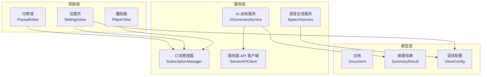
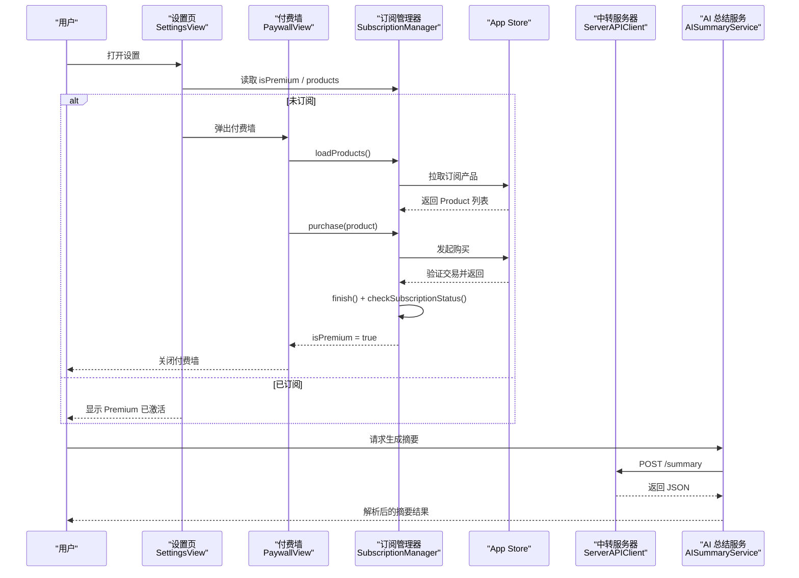
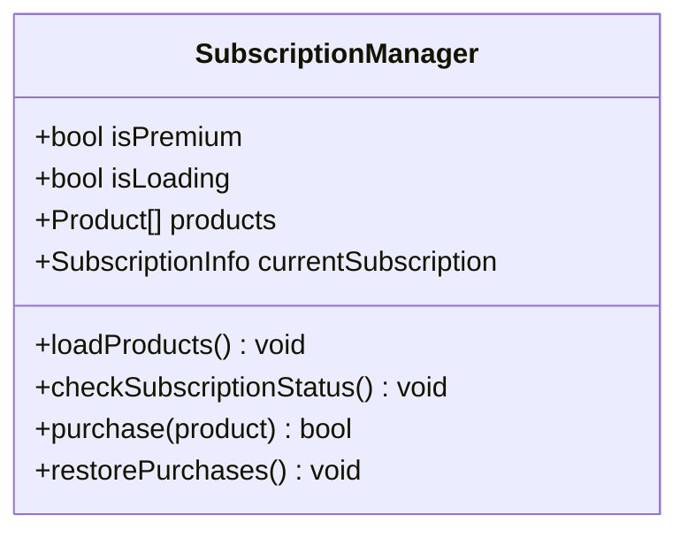
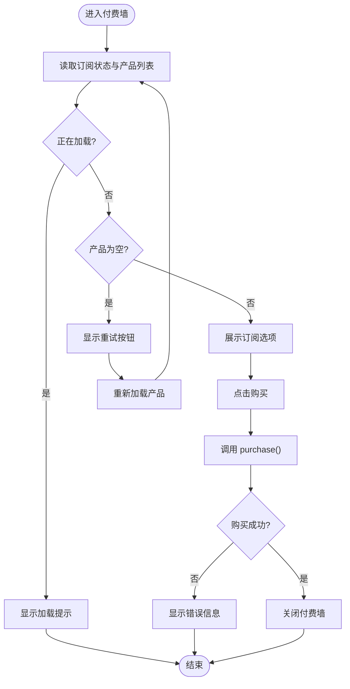
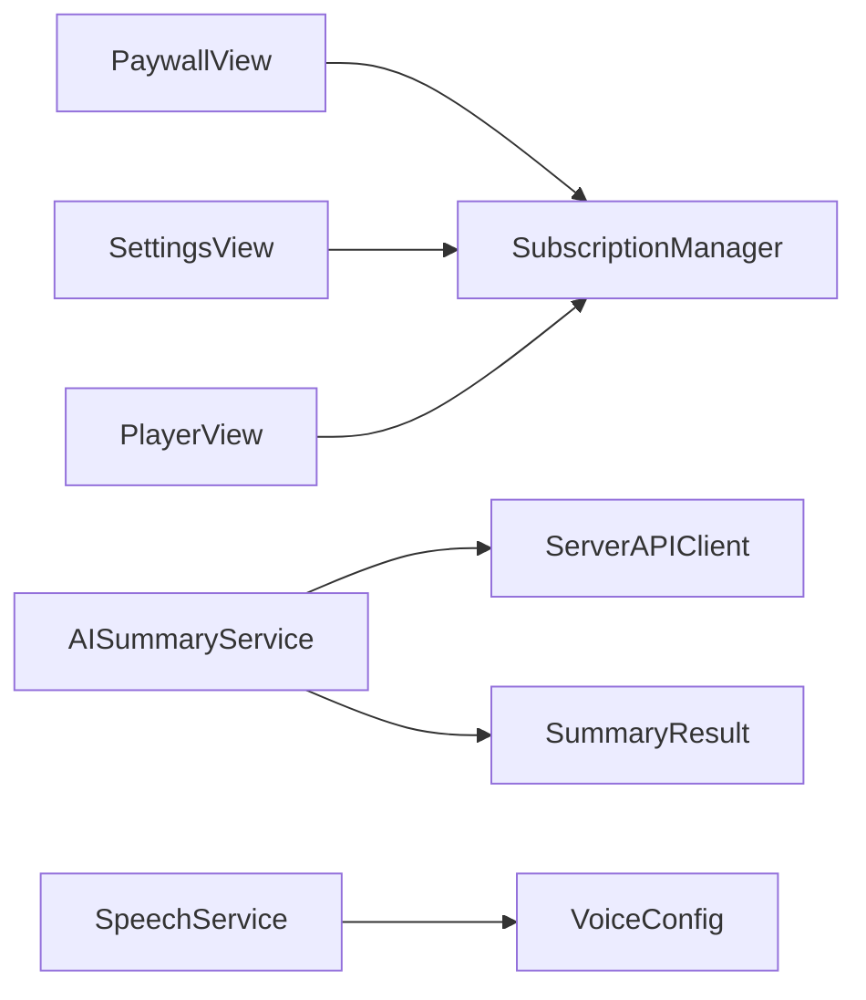

# 订阅管理系统

<cite>
**本文引用的文件**   
- [SubscriptionManager.swift](file://Services/SubscriptionManager.swift)
- [PaywallView.swift](file://Views/PaywallView.swift)
- [SettingsView.swift](file://Views/SettingsView.swift)
- [KnowledgeApp.swift](file://App/KnowledgeApp.swift)
- [AppDelegate.swift](file://App/AppDelegate.swift)
- [ServerAPIClient.swift](file://Services/ServerAPIClient.swift)
- [AISummaryService.swift](file://Services/AISummaryService.swift)
- [SpeechService.swift](file://Services/SpeechService.swift)
- [VoiceConfig.swift](file://Models/VoiceConfig.swift)
- [Document.swift](file://Models/Document.swift)
- [SummaryResult.swift](file://Models/SummaryResult.swift)
</cite>

## 目录
1. [简介](#简介)
2. [项目结构](#项目结构)
3. [核心组件](#核心组件)
4. [架构总览](#架构总览)
5. [详细组件分析](#详细组件分析)
6. [依赖关系分析](#依赖关系分析)
7. [性能与可靠性](#性能与可靠性)
8. [故障排查指南](#故障排查指南)
9. [结论](#结论)
10. [附录](#附录)

## 简介
本文件围绕“订阅管理系统”展开，聚焦于应用内订阅（StoreKit 2）的加载、检查、购买与恢复流程，以及付费墙展示与功能权限控制。同时梳理订阅状态如何影响 AI 总结、AI 伴读、高品质音色等 Premium 功能的可用性，并给出关键数据流与错误处理策略。

## 项目结构
订阅管理相关代码主要分布在 Services 与 Views 层：
- 服务层：订阅管理器、网络客户端、AI 服务、语音合成服务
- 视图层：付费墙、设置页（入口）、播放器（功能入口）
- 模型层：文档、摘要结果、语音配置

图表来源
- [PaywallView.swift:1-181](file://Views/PaywallView.swift#L1-L181)
- [SettingsView.swift:1-321](file://Views/SettingsView.swift#L1-L321)
- [SubscriptionManager.swift:1-127](file://Services/SubscriptionManager.swift#L1-L127)
- [ServerAPIClient.swift:1-203](file://Services/ServerAPIClient.swift#L1-L203)
- [AISummaryService.swift:1-90](file://Services/AISummaryService.swift#L1-L90)
- [SpeechService.swift:1-166](file://Services/SpeechService.swift#L1-L166)
- [VoiceConfig.swift:1-71](file://Models/VoiceConfig.swift#L1-L71)
- [Document.swift:1-115](file://Models/Document.swift#L1-L115)
- [SummaryResult.swift:1-33](file://Models/SummaryResult.swift#L1-L33)

章节来源
- [KnowledgeApp.swift:1-29](file://App/KnowledgeApp.swift#L1-L29)
- [AppDelegate.swift:1-14](file://App/AppDelegate.swift#L1-L14)

## 核心组件
- 订阅管理器（SubscriptionManager）
  - 职责：加载产品、检查订阅状态、发起购买、恢复购买、维护 isPremium 状态
  - 关键点：使用 StoreKit 2；在初始化时异步加载产品与校验状态；提供 @Published 属性供 SwiftUI 响应式更新
- 付费墙（PaywallView）
  - 职责：展示 Premium 权益、列出可用订阅产品、触发购买与恢复购买、显示错误信息
  - 关键点：根据 SubscriptionManager 的状态动态渲染；购买成功后自动关闭
- 设置页（SettingsView）
  - 职责：作为 Premium 入口，未订阅用户点击后弹出付费墙；同时承载语音引擎与参数设置
  - 关键点：通过 sheet 展示付费墙；结合 VoiceConfig 切换 TTS 引擎
- 服务器 API 客户端（ServerAPIClient）
  - 职责：封装对中转服务器的 HTTP 请求（总结、伴读、TTS、克隆），统一错误映射
  - 关键点：超时配置、JSON 解析与字段提取、音频数据兼容多种返回格式
- AI 总结服务（AISummaryService）
  - 职责：调用服务端生成摘要，解析结构化结果（正文 + 要点）
  - 关键点：容错处理，当无法解析时回退为整段文本
- 语音合成服务（SpeechService）
  - 职责：基于 AVSpeechSynthesizer 实现分段朗读、进度回调、跳转、暂停/继续/停止
  - 关键点：按自然断点切分语块；iOS 17+ 优先 Neural TTS；回调驱动 UI 高亮与播放位置更新
- 模型（Document、SummaryResult、VoiceConfig）
  - 职责：持久化文档、存储摘要结果、保存语音配置与引擎选择

章节来源
- [SubscriptionManager.swift:1-127](file://Services/SubscriptionManager.swift#L1-L127)
- [PaywallView.swift:1-181](file://Views/PaywallView.swift#L1-L181)
- [SettingsView.swift:1-321](file://Views/SettingsView.swift#L1-L321)
- [ServerAPIClient.swift:1-203](file://Services/ServerAPIClient.swift#L1-L203)
- [AISummaryService.swift:1-90](file://Services/AISummaryService.swift#L1-L90)
- [SpeechService.swift:1-166](file://Services/SpeechService.swift#L1-L166)
- [Document.swift:1-115](file://Models/Document.swift#L1-L115)
- [SummaryResult.swift:1-33](file://Models/SummaryResult.swift#L1-L33)
- [VoiceConfig.swift:1-71](file://Models/VoiceConfig.swift#L1-L71)

## 架构总览
订阅管理与功能权限的整体交互如下：

图表来源
- [SettingsView.swift:44-82](file://Views/SettingsView.swift#L44-L82)
- [PaywallView.swift:83-136](file://Views/PaywallView.swift#L83-L136)
- [SubscriptionManager.swift:44-95](file://Services/SubscriptionManager.swift#L44-L95)
- [ServerAPIClient.swift:27-33](file://Services/ServerAPIClient.swift#L27-L33)
- [AISummaryService.swift:15-23](file://Services/AISummaryService.swift#L15-L23)

## 详细组件分析

### 订阅管理器（SubscriptionManager）
- 设计要点
  - 单例 + MainActor：确保 UI 线程安全与状态一致性
  - 发布属性：isPremium、isLoading、products、currentSubscription 供 SwiftUI 观察
  - 生命周期：初始化即异步加载产品与校验订阅状态
- 关键流程
  - 加载产品：调用 StoreKit 获取产品列表，失败则清空并提示
  - 检查订阅：遍历当前授权，若存在有效且未被撤销的交易，标记为已订阅
  - 购买流程：发起购买 → 验证交易 → 完成交易 → 刷新订阅状态
  - 恢复购买：同步 App Store 状态并刷新订阅
- 复杂度与性能
  - 产品加载与状态检查均为 I/O 操作，采用 async/await 避免阻塞主线程
  - 建议缓存产品列表并在后台定时刷新，减少重复网络请求

图表来源
- [SubscriptionManager.swift:1-127](file://Services/SubscriptionManager.swift#L1-L127)

章节来源
- [SubscriptionManager.swift:1-127](file://Services/SubscriptionManager.swift#L1-L127)

### 付费墙（PaywallView）
- 设计要点
  - 展示 Premium 权益与订阅选项，支持恢复购买与错误提示
  - 根据 SubscriptionManager 的 isLoading 与 products 状态进行分支渲染
- 交互流程
  - 点击订阅项：调用 purchase，成功则关闭付费墙
  - 点击恢复购买：触发 restorePurchases，成功后关闭付费墙
- 用户体验优化
  - 加载中显示进度提示
  - 产品为空时提供“重新加载”按钮
  - 购买失败时显示具体错误信息

图表来源
- [PaywallView.swift:83-136](file://Views/PaywallView.swift#L83-L136)
- [SubscriptionManager.swift:44-95](file://Services/SubscriptionManager.swift#L44-L95)

章节来源
- [PaywallView.swift:1-181](file://Views/PaywallView.swift#L1-L181)

### 设置页（SettingsView）
- 设计要点
  - 作为 Premium 入口：未订阅用户点击“解锁 Premium”弹出付费墙
  - 集成语音引擎与参数设置，结合 VoiceConfig 实时更新
- 订阅状态联动
  - 已订阅：显示“Premium 已激活”
  - 未订阅：显示引导信息与箭头，点击后弹出付费墙

章节来源
- [SettingsView.swift:44-82](file://Views/SettingsView.swift#L44-L82)
- [SettingsView.swift:225-233](file://Views/SettingsView.swift#L225-L233)

### 服务器 API 客户端（ServerAPIClient）
- 设计要点
  - 统一构建请求、超时配置、HTTP 状态码校验
  - 通用 JSON 解析与字段提取，兼容不同后端格式
  - 音频接口支持直接二进制或 JSON 中 URL/Base64 两种形式
- 错误映射
  - 将常见错误（未授权、配额超限、服务器异常、网络错误）转换为本地可读描述

章节来源
- [ServerAPIClient.swift:1-203](file://Services/ServerAPIClient.swift#L1-L203)

### AI 总结服务（AISummaryService）
- 设计要点
  - 调用 ServerAPIClient 的 /summary 接口
  - 解析“【摘要】”和“【要点】”两部分内容，兼容多种要点格式
  - 若解析失败，回退为整段文本
- 数据结构
  - 返回 SummaryResult，包含 content 与 keyPoints

章节来源
- [AISummaryService.swift:15-69](file://Services/AISummaryService.swift#L15-L69)
- [SummaryResult.swift:1-33](file://Models/SummaryResult.swift#L1-L33)

### 语音合成服务（SpeechService）
- 设计要点
  - 基于 AVSpeechSynthesizer，按自然断点切分语块，提升朗读体验
  - 支持 iOS 17+ Neural TTS 与传统 TTS 降级兼容
  - 提供 onPositionChange/onRangeChange 回调，驱动 UI 高亮与播放位置更新
- 控制能力
  - speak/pause/resume/stop/skipForward/skipBackward
  - 根据 VoiceConfig 实时调整 rate/pitch/volume/language/voiceIdentifier

章节来源
- [SpeechService.swift:30-166](file://Services/SpeechService.swift#L30-L166)
- [VoiceConfig.swift:1-71](file://Models/VoiceConfig.swift#L1-L71)

### 模型（Document、SummaryResult、VoiceConfig）
- Document
  - 存储标题、文件名、类型、提取文本、阅读进度、收藏、摘要、播客音频路径等
- SummaryResult
  - 存储摘要正文与要点列表，并提供 JSON 序列化方法
- VoiceConfig
  - 定义 TTS 引擎枚举 TTSEngine（system/knowledgeVoice/legacySystem）及常用语速预设

章节来源
- [Document.swift:1-115](file://Models/Document.swift#L1-L115)
- [SummaryResult.swift:1-33](file://Models/SummaryResult.swift#L1-L33)
- [VoiceConfig.swift:1-71](file://Models/VoiceConfig.swift#L1-L71)

## 依赖关系分析
订阅管理与功能权限的关键依赖如下：

图表来源
- [PaywallView.swift:1-181](file://Views/PaywallView.swift#L1-L181)
- [SettingsView.swift:1-321](file://Views/SettingsView.swift#L1-L321)
- [SubscriptionManager.swift:1-127](file://Services/SubscriptionManager.swift#L1-L127)
- [AISummaryService.swift:1-90](file://Services/AISummaryService.swift#L1-L90)
- [ServerAPIClient.swift:1-203](file://Services/ServerAPIClient.swift#L1-L203)
- [SpeechService.swift:1-166](file://Services/SpeechService.swift#L1-L166)
- [VoiceConfig.swift:1-71](file://Models/VoiceConfig.swift#L1-L71)
- [SummaryResult.swift:1-33](file://Models/SummaryResult.swift#L1-L33)

章节来源
- [SubscriptionManager.swift:1-127](file://Services/SubscriptionManager.swift#L1-L127)
- [ServerAPIClient.swift:1-203](file://Services/ServerAPIClient.swift#L1-L203)

## 性能与可靠性
- 异步与并发
  - 订阅产品加载与状态检查均使用 async/await，避免阻塞主线程
  - 建议在后台任务中定期刷新产品与订阅状态，降低首次加载延迟
- 网络与超时
  - 为总结与伴读请求设置合理超时；音频下载需考虑大文件与弱网场景
  - 对 401/403/429 等状态码进行明确错误映射与用户提示
- 资源占用
  - 语音合成按需激活会话，避免过早占用系统音频资源
- 幂等与恢复
  - 恢复购买后应强制刷新订阅状态，确保跨设备/重装后权限一致

[本节为通用指导，不直接分析具体文件]

## 故障排查指南
- 产品加载失败
  - 现象：付费墙显示“订阅信息加载中，请稍后重试”，无产品列表
  - 排查：确认 App Store Connect 已配置订阅产品 ID；检查网络与沙盒环境
  - 参考：[SubscriptionManager.swift:44-54](file://Services/SubscriptionManager.swift#L44-L54)、[PaywallView.swift:90-105](file://Views/PaywallView.swift#L90-L105)
- 购买验证失败
  - 现象：提示“购买验证失败，请重试”
  - 排查：检查 Transaction 验证逻辑与 finish 调用；确认 App Store 沙盒账号权限
  - 参考：[SubscriptionManager.swift:105-112](file://Services/SubscriptionManager.swift#L105-L112)
- 未授权或配额超限
  - 现象：调用 AI 接口返回“请确认已订阅 Premium”或“本月使用次数已达上限”
  - 排查：确认 isPremium 状态；检查服务端鉴权与配额策略
  - 参考：[ServerAPIClient.swift:178-201](file://Services/ServerAPIClient.swift#L178-L201)
- 音频数据缺失
  - 现象：TTS 返回“未获取到音频数据”
  - 排查：检查 Content-Type 与 JSON 中的 audio_url/base64 字段；确认服务端返回格式
  - 参考：[ServerAPIClient.swift:68-88](file://Services/ServerAPIClient.swift#L68-L88)
- 语音合成异常
  - 现象：朗读中断、进度不更新
  - 排查：检查 delegate 回调是否在主线程更新；确认 NSMakeRange 与字符长度计算
  - 参考：[SpeechService.swift:129-154](file://Services/SpeechService.swift#L129-L154)

章节来源
- [SubscriptionManager.swift:44-112](file://Services/SubscriptionManager.swift#L44-L112)
- [PaywallView.swift:90-105](file://Views/PaywallView.swift#L90-L105)
- [ServerAPIClient.swift:161-201](file://Services/ServerAPIClient.swift#L161-L201)
- [SpeechService.swift:129-154](file://Services/SpeechService.swift#L129-L154)

## 结论
订阅管理系统以 SubscriptionManager 为核心，结合 PaywallView 与 SettingsView 形成完整的付费墙与权限控制闭环。通过 StoreKit 2 的产品加载与交易验证，配合 ServerAPIClient 的后端鉴权与配额策略，实现对 Premium 功能的精细化管控。整体架构清晰、职责分离良好，具备较好的可扩展性与可维护性。

[本节为总结性内容，不直接分析具体文件]

## 附录
- 启动与初始化
  - KnowledgeApp 负责注入主题与环境对象，并创建 SwiftData 容器
  - AppDelegate 仅配置音频会话类别，避免过早激活
- 数据模型
  - Document 用于文档持久化与阅读进度跟踪
  - SummaryResult 用于摘要结果的序列化与反序列化
  - VoiceConfig 定义 TTS 引擎与参数，支持快速切换与实时生效

章节来源
- [KnowledgeApp.swift:10-27](file://App/KnowledgeApp.swift#L10-L27)
- [AppDelegate.swift:5-12](file://App/AppDelegate.swift#L5-L12)
- [Document.swift:54-115](file://Models/Document.swift#L54-L115)
- [SummaryResult.swift:1-33](file://Models/SummaryResult.swift#L1-L33)
- [VoiceConfig.swift:1-71](file://Models/VoiceConfig.swift#L1-L71)