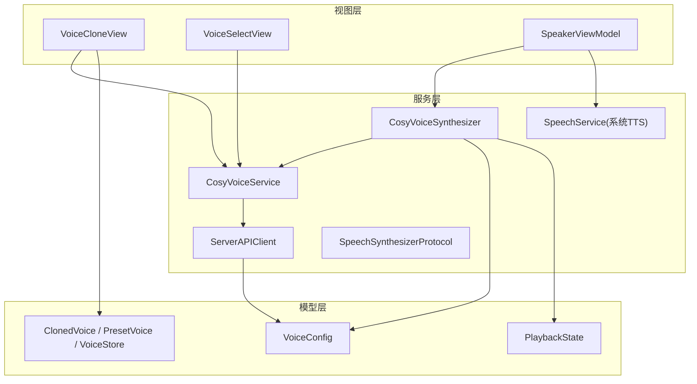
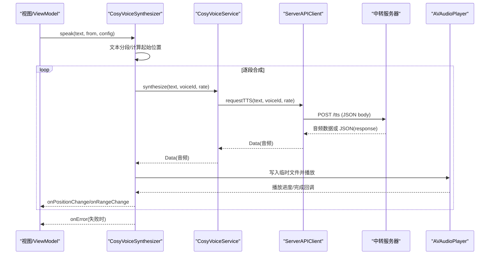
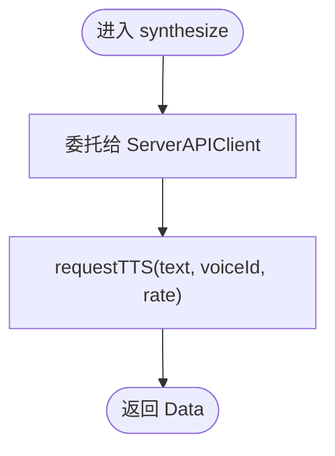
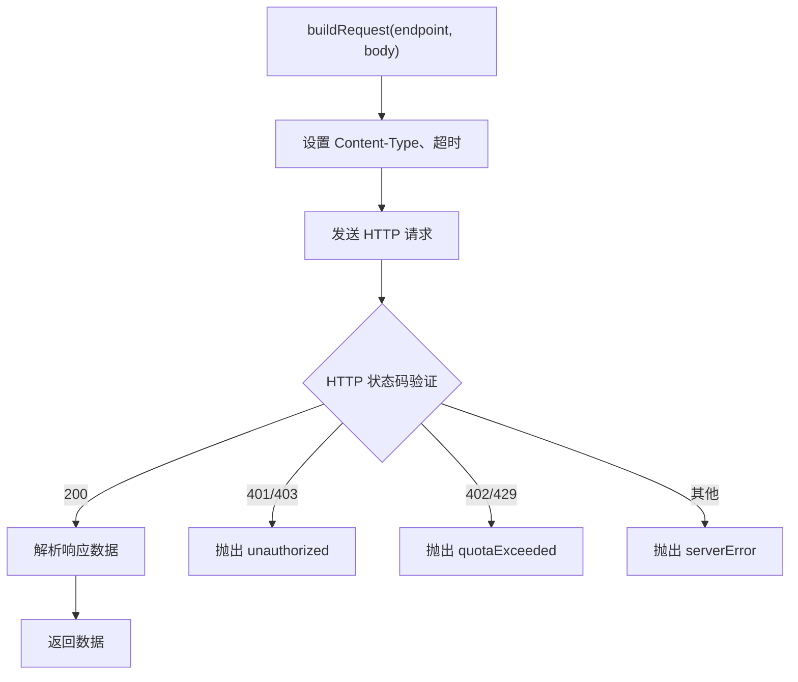
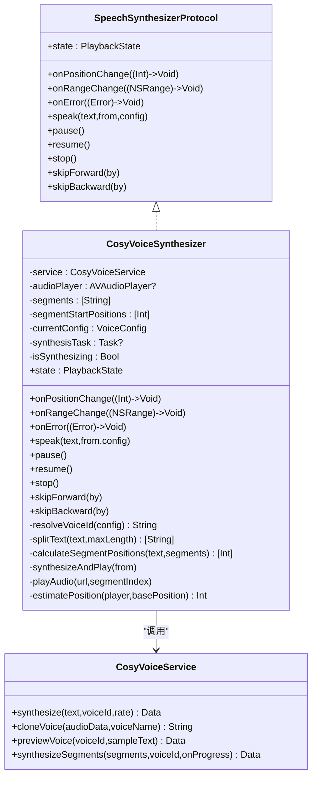
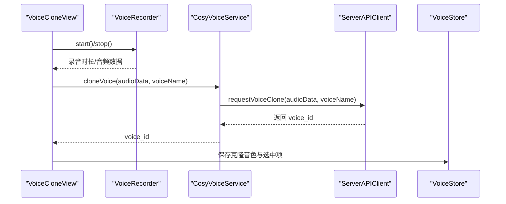
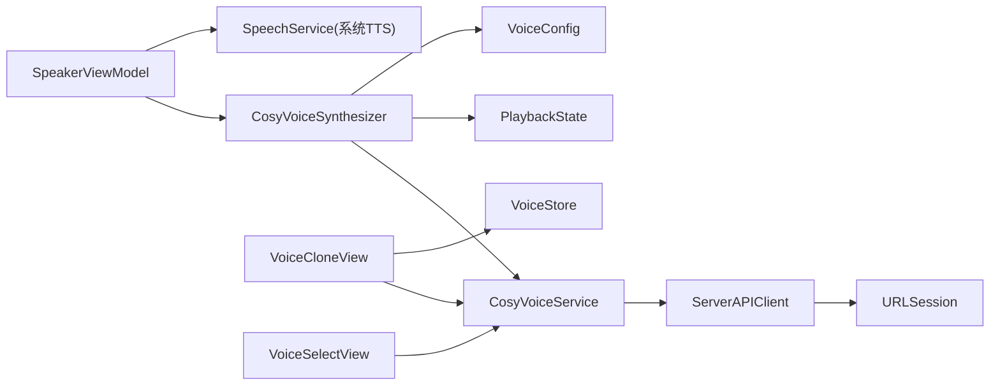

# CosyVoice AI 语音服务

<cite>
**本文引用的文件**
- [CosyVoiceService.swift](file://Services/CosyVoiceService.swift)
- [CosyVoiceSynthesizer.swift](file://Services/CosyVoiceSynthesizer.swift)
- [ServerAPIClient.swift](file://Services/ServerAPIClient.swift)
- [SpeechSynthesizerProtocol.swift](file://Services/SpeechSynthesizerProtocol.swift)
- [PlaybackState.swift](file://Models/PlaybackState.swift)
- [VoiceConfig.swift](file://Models/VoiceConfig.swift)
- [ClonedVoice.swift](file://Models/ClonedVoice.swift)
- [VoiceCloneView.swift](file://Views/VoiceCloneView.swift)
- [VoiceSelectView.swift](file://Views/VoiceSelectView.swift)
- [ErrorHandler.swift](file://Services/ErrorHandler.swift)
- [SpeakerViewModel.swift](file://ViewModels/SpeakerViewModel.swift)
</cite>

## 更新摘要
**变更内容**
- CosyVoiceService 重构完成，移除了本地 API 密钥验证和直接 HTTP 请求处理
- 新增 ServerAPIClient 统一客户端，集中处理所有网络请求和鉴权逻辑
- 简化了 CosyVoiceService 接口，专注于业务逻辑封装，代码从121行减少到80行
- 实现了三层架构："引擎适配器 + 业务服务 + 统一客户端"
- 优化了错误处理和响应解析逻辑，支持多种响应格式

## 目录
1. [简介](#简介)
2. [项目结构](#项目结构)
3. [核心组件](#核心组件)
4. [架构总览](#架构总览)
5. [详细组件分析](#详细组件分析)
6. [依赖关系分析](#依赖关系分析)
7. [性能与优化](#性能与优化)
8. [故障排查指南](#故障排查指南)
9. [结论](#结论)
10. [附录](#附录)

## 简介
本文件面向开发者与产品使用者，系统性梳理 CosyVoice AI 语音服务的实现与协作方式。重点围绕以下目标：
- 深入解析 CosyVoiceService 与 CosyVoiceSynthesizer 的协作架构
- 说明如何通过统一的 ServerAPIClient 中转调用阿里云 DashScope API
- 详解新的分层架构设计、请求构建、响应处理、错误与重试策略
- 阐述语音克隆原理、音色选择与情感控制等高级特性
- 提供网络请求优化、缓存策略与降级处理的落地方案

## 项目结构
本项目采用分层组织：
- Services：服务层封装网络与播放逻辑（CosyVoiceService、CosyVoiceSynthesizer、ServerAPIClient 等）
- Models：数据模型与配置（VoiceConfig、ClonedVoice、PlaybackState 等）
- Views：UI 交互（VoiceCloneView、VoiceSelectView 等）
- ViewModels：业务编排与状态管理（SpeakerViewModel）

**图表来源**
- [CosyVoiceService.swift:1-104](file://Services/CosyVoiceService.swift#L1-L104)
- [CosyVoiceSynthesizer.swift:1-258](file://Services/CosyVoiceSynthesizer.swift#L1-L258)
- [ServerAPIClient.swift:1-203](file://Services/ServerAPIClient.swift#L1-L203)
- [SpeechSynthesizerProtocol.swift:1-20](file://Services/SpeechSynthesizerProtocol.swift#L1-L20)
- [VoiceConfig.swift:1-71](file://Models/VoiceConfig.swift#L1-L71)
- [ClonedVoice.swift:1-118](file://Models/ClonedVoice.swift#L1-L118)
- [VoiceCloneView.swift:1-404](file://Views/VoiceCloneView.swift#L1-L404)
- [VoiceSelectView.swift:1-215](file://Views/VoiceSelectView.swift#L1-L215)
- [SpeakerViewModel.swift:79-129](file://ViewModels/SpeakerViewModel.swift#L79-L129)

## 核心组件
- **CosyVoiceService**：精简后的业务服务层，通过 ServerAPIClient 提供 TTS 合成、语音克隆、音色试听与分段合成能力。不再直接处理 HTTP 请求和 API 密钥管理。
- **ServerAPIClient**：统一的网络客户端，负责所有与服务器的通信，包括请求构建、鉴权、响应处理、错误包装等。
- **CosyVoiceSynthesizer**：作为 SpeechSynthesizerProtocol 的实现之一，将 CosyVoiceService 的能力适配为统一的"引擎"接口，负责文本分段、流式合成与播放、位置与范围回调、错误回调与降级触发。
- **VoiceConfig**：统一描述语速、音高、音量、语言、引擎类型、预设/克隆音色 ID 等参数。
- **ClonedVoice/PresetVoice/VoiceStore**：定义预设音色与用户克隆音色数据结构，并提供本地持久化能力。
- **PlaybackState**：抽象播放状态（空闲、播放中、暂停、完成）。
- **VoiceCloneView**：录音、预览、上传并调用 cloneVoice 接口，完成后持久化克隆音色。
- **VoiceSelectView**：展示预设与克隆音色列表，支持试听与选择应用。
- **SpeakerViewModel**：编排播放流程、监听引擎状态、错误回调与自动降级到系统 TTS。

**章节来源**
- [CosyVoiceService.swift:1-104](file://Services/CosyVoiceService.swift#L1-L104)
- [ServerAPIClient.swift:1-203](file://Services/ServerAPIClient.swift#L1-L203)
- [CosyVoiceSynthesizer.swift:1-258](file://Services/CosyVoiceSynthesizer.swift#L1-L258)
- [VoiceConfig.swift:1-71](file://Models/VoiceConfig.swift#L1-L71)
- [ClonedVoice.swift:1-118](file://Models/ClonedVoice.swift#L1-L118)
- [PlaybackState.swift:1-9](file://Models/PlaybackState.swift#L1-L9)
- [VoiceCloneView.swift:1-404](file://Views/VoiceCloneView.swift#L1-L404)
- [VoiceSelectView.swift:1-215](file://Views/VoiceSelectView.swift#L1-L215)
- [SpeakerViewModel.swift:79-129](file://ViewModels/SpeakerViewModel.swift#L79-L129)

## 架构总览
CosyVoice 服务采用三层架构："引擎适配器 + 业务服务 + 统一客户端"。上层通过统一协议切换不同引擎（AI 或系统），在 AI 引擎出错时自动降级至系统 TTS，保证可用性。

**图表来源**
- [CosyVoiceSynthesizer.swift:28-51](file://Services/CosyVoiceSynthesizer.swift#L28-L51)
- [CosyVoiceSynthesizer.swift:148-192](file://Services/CosyVoiceSynthesizer.swift#L148-L192)
- [CosyVoiceService.swift:22-24](file://Services/CosyVoiceService.swift#L22-L24)
- [ServerAPIClient.swift:50-88](file://Services/ServerAPIClient.swift#L50-L88)
- [SpeakerViewModel.swift:226-247](file://ViewModels/SpeakerViewModel.swift#L226-L247)

## 详细组件分析

### CosyVoiceService：精简的业务服务层
职责
- 通过 ServerAPIClient 提供 TTS 合成、语音克隆、音色试听功能
- 提供分段合成辅助方法，处理长文本的批量合成
- 维护统一的错误类型 CosyVoiceError

关键流程
- 合成：委托给 apiClient.requestTTS，返回音频数据
- 克隆：委托给 apiClient.requestVoiceClone，返回 voice_id
- 试听：复用合成接口，使用默认示例文本
- 分段：顺序合成并拼接，段间加入延迟避免限流

**更新** 重构后移除了本地 API 密钥验证和直接 HTTP 请求处理，专注于业务逻辑封装，代码量从121行减少到80行

**图表来源**
- [CosyVoiceService.swift:22-24](file://Services/CosyVoiceService.swift#L22-L24)
- [CosyVoiceService.swift:58-77](file://Services/CosyVoiceService.swift#L58-L77)

**章节来源**
- [CosyVoiceService.swift:1-104](file://Services/CosyVoiceService.swift#L1-L104)

### ServerAPIClient：统一网络客户端
职责
- 集中管理所有与服务器的网络请求
- 处理请求构建、超时设置、响应验证
- 统一错误处理和异常包装
- 支持多种响应格式（二进制音频、JSON、Base64）

关键流程
- 请求构建：buildRequest 方法统一设置请求头、超时、Body
- TTS 合成：requestTTS 处理音频数据返回，支持多种响应格式
- 语音克隆：requestVoiceClone 处理 Base64 音频上传
- 响应验证：validateResponse 统一处理 HTTP 状态码和错误

**新增** 这是重构后新增的核心组件，替代了原有的直接 HTTP 请求处理，统一管理所有网络通信

**图表来源**
- [ServerAPIClient.swift:101-110](file://Services/ServerAPIClient.swift#L101-L110)
- [ServerAPIClient.swift:161-173](file://Services/ServerAPIClient.swift#L161-L173)

**章节来源**
- [ServerAPIClient.swift:1-203](file://Services/ServerAPIClient.swift#L1-L203)

### CosyVoiceSynthesizer：引擎适配与播放编排
职责
- 实现 SpeechSynthesizerProtocol，对外暴露 speak/pause/resume/stop/skipForward/skipBackward
- 文本智能分段（按标点/换行/空格断句，单段不超过 500 字符）
- 基于当前段落起始位置估算全文绝对位置，驱动高亮与进度
- 将每段音频写入临时文件并通过 AVAudioPlayer 播放
- 错误回调向上抛出，供 ViewModel 执行降级

关键流程
- 初始化：根据 VoiceConfig 解析 voiceId（优先克隆，其次预设，最后默认）
- 分段：splitText/calculateSegmentPositions
- 合成与播放：循环调用 service.synthesize，写入临时文件，启动播放器，定时更新位置
- 完成：下一段自动衔接，全部完成后置 finished

**图表来源**
- [SpeechSynthesizerProtocol.swift:1-20](file://Services/SpeechSynthesizerProtocol.swift#L1-L20)
- [CosyVoiceSynthesizer.swift:1-258](file://Services/CosyVoiceSynthesizer.swift#L1-L258)
- [CosyVoiceService.swift:1-104](file://Services/CosyVoiceService.swift#L1-L104)

**章节来源**
- [CosyVoiceSynthesizer.swift:1-258](file://Services/CosyVoiceSynthesizer.swift#L1-L258)
- [SpeechSynthesizerProtocol.swift:1-20](file://Services/SpeechSynthesizerProtocol.swift#L1-L20)

### 语音克隆：录音、上传与持久化
流程要点
- 录音：使用 AVAudioRecorder 录制 PCM 音频（采样率 24kHz，单声道，16bit），限制最短时长
- 预览：AVAudioPlayer 回放本地录音
- 上传：调用 cloneVoice，将音频 Base64 放入 input.audio，附带 voice_name
- 持久化：保存 ClonedVoice 到 VoiceStore，并记录选中项

**图表来源**
- [VoiceCloneView.swift:283-322](file://Views/VoiceCloneView.swift#L283-L322)
- [CosyVoiceService.swift:33-35](file://Services/CosyVoiceService.swift#L33-L35)
- [ServerAPIClient.swift:91-97](file://Services/ServerAPIClient.swift#L91-L97)
- [ClonedVoice.swift:52-118](file://Models/ClonedVoice.swift#L52-L118)

**章节来源**
- [VoiceCloneView.swift:1-404](file://Views/VoiceCloneView.swift#L1-L404)
- [CosyVoiceService.swift:33-35](file://Services/CosyVoiceService.swift#L33-L35)
- [ServerAPIClient.swift:91-97](file://Services/ServerAPIClient.swift#L91-L97)
- [ClonedVoice.swift:1-118](file://Models/ClonedVoice.swift#L1-L118)

### 音色选择与试听
- 预设音色：VoiceStore.presetVoices 内置多组中文/英文音色，按分类展示
- 克隆音色：用户录制后保存在本地，可在列表中删除与选择
- 试听：调用 previewVoice 获取示例音频并播放

**章节来源**
- [VoiceSelectView.swift:1-215](file://Views/VoiceSelectView.swift#L1-L215)
- [ClonedVoice.swift:94-118](file://Models/ClonedVoice.swift#L94-L118)
- [CosyVoiceService.swift:44-46](file://Services/CosyVoiceService.swift#L44-L46)

### API Key 配置
**更新** API Key 管理已完全移至服务器端，不再需要本地配置界面

- 原 APIKeyConfigView 已移除
- API Key 现在由 ServerAPIClient 在服务端统一管理
- 客户端只需配置服务器地址即可，无需关心敏感信息
- 服务器地址通过 ServerAPIClient.baseURL 配置

**章节来源**
- [ServerAPIClient.swift:11-14](file://Services/ServerAPIClient.swift#L11-L14)

### 错误处理与降级
- CosyVoiceSynthesizer 在合成阶段捕获错误，回调 onError
- SpeakerViewModel 监听 onError，当使用 Knowledge Voice 时自动降级到系统 TTS，并恢复播放
- ServerAPIClient 提供统一的错误类型 ServerAPIError
- ErrorHandler 提供全局错误日志和用户提示

**章节来源**
- [CosyVoiceSynthesizer.swift:176-184](file://Services/CosyVoiceSynthesizer.swift#L176-L184)
- [SpeakerViewModel.swift:234-247](file://ViewModels/SpeakerViewModel.swift#L234-L247)
- [ErrorHandler.swift:1-53](file://Services/ErrorHandler.swift#L1-L53)
- [ServerAPIClient.swift:178-202](file://Services/ServerAPIClient.swift#L178-L202)

## 依赖关系分析
- CosyVoiceSynthesizer 依赖 CosyVoiceService 进行业务逻辑处理
- CosyVoiceService 依赖 ServerAPIClient 进行网络请求
- ServerAPIClient 依赖 URLSession 进行实际的 HTTP 通信
- 视图层依赖服务层与模型层
- ViewModel 协调引擎切换与状态同步

**图表来源**
- [CosyVoiceSynthesizer.swift:1-258](file://Services/CosyVoiceSynthesizer.swift#L1-L258)
- [CosyVoiceService.swift:1-104](file://Services/CosyVoiceService.swift#L1-L104)
- [ServerAPIClient.swift:1-203](file://Services/ServerAPIClient.swift#L1-L203)
- [SpeakerViewModel.swift:79-129](file://ViewModels/SpeakerViewModel.swift#L79-L129)
- [VoiceCloneView.swift:1-404](file://Views/VoiceCloneView.swift#L1-L404)
- [VoiceSelectView.swift:1-215](file://Views/VoiceSelectView.swift#L1-L215)
- [ClonedVoice.swift:1-118](file://Models/ClonedVoice.swift#L1-L118)

**章节来源**
- [CosyVoiceSynthesizer.swift:1-258](file://Services/CosyVoiceSynthesizer.swift#L1-L258)
- [CosyVoiceService.swift:1-104](file://Services/CosyVoiceService.swift#L1-L104)
- [ServerAPIClient.swift:1-203](file://Services/ServerAPIClient.swift#L1-L203)
- [SpeakerViewModel.swift:79-129](file://ViewModels/SpeakerViewModel.swift#L79-L129)
- [VoiceCloneView.swift:1-404](file://Views/VoiceCloneView.swift#L1-L404)
- [VoiceSelectView.swift:1-215](file://Views/VoiceSelectView.swift#L1-L215)
- [ClonedVoice.swift:1-118](file://Models/ClonedVoice.swift#L1-L118)

## 性能与优化
本节提供可落地的优化建议，结合现有实现进行增强：

- 网络请求优化
  - 并发与限速：当前分段合成串行且段间有 200ms 延迟，建议在队列中限制并发数（如 2~3），并结合速率限制器避免触发服务端限流
  - 连接复用：ServerAPIClient 已使用 URLSession.shared，保持连接复用；可考虑自定义 URLSessionConfiguration 调整超时与缓存策略
  - 压缩与传输：对大音频下载启用 gzip（若服务端支持），减少带宽占用

- 缓存策略
  - 结果缓存：对相同 text+voiceId+rate 的音频结果进行内存/磁盘缓存（LRU），键可用哈希生成，避免重复合成
  - 试听缓存：预览音频可短期缓存，提升用户体验
  - 临时文件清理：定期清理临时目录中的 MP3/WAV 文件，防止存储膨胀

- 降级处理
  - 当前已在合成失败时回调 onError，ViewModel 自动降级到系统 TTS，确保可用性
  - 可增加"离线模式"提示与快速回退路径

- 播放体验
  - 预加载：在播放当前段前预加载下一段，降低首帧等待
  - 平滑跳转：skipForward/skipBackward 时尽量对齐自然断点，避免突兀中断

## 故障排查指南
常见问题与定位步骤
- 服务器连接问题
  - 现象：networkError 或 invalidResponse
  - 处理：检查 ServerAPIClient.baseURL 配置是否正确，确认网络连接正常
- 权限不足
  - 现象：unauthorized 错误
  - 处理：确认用户订阅状态，检查服务器端鉴权配置
- 配额超限
  - 现象：quotaExceeded 错误
  - 处理：检查套餐使用情况，引导用户升级或等待下月重置
- 服务器异常
  - 现象：serverError 携带状态码与消息
  - 处理：查看服务端日志，核对接口规范和参数格式
- 未获取到音频数据
  - 现象：noAudioData
  - 处理：检查服务器返回的数据格式，确认 audio_url 或 audio base64 字段存在
- 录音时长不足
  - 现象：audioTooShort
  - 处理：引导用户录制至少 5 秒，提高样本质量

**章节来源**
- [ServerAPIClient.swift:178-202](file://Services/ServerAPIClient.swift#L178-L202)
- [ErrorHandler.swift:1-53](file://Services/ErrorHandler.swift#L1-L53)

## 结论
CosyVoice 服务通过重构实现了更清晰的职责分离：CosyVoiceService 专注业务逻辑，ServerAPIClient 统一处理网络请求，CosyVoiceSynthesizer 负责播放编排。这种分层架构提高了代码的可维护性和可扩展性，同时通过统一的错误处理和自动降级机制，确保了语音阅读体验的稳定性。在此基础上，可通过并发控制、缓存与预加载进一步优化性能与体验。

## 附录

### 服务器配置
- 服务器地址：ServerAPIClient.baseURL
- 部署要求：需要在阿里云服务器上部署中转 API 服务
- 安全考虑：API Key 仅存储在服务器端，客户端不直接接触敏感信息

**章节来源**
- [ServerAPIClient.swift:11-14](file://Services/ServerAPIClient.swift#L11-L14)

### 请求构建与响应处理
- 请求头：Content-Type application/json
- 请求体：包含 text、voice_id、rate 等字段
- 响应：支持多种格式（二进制音频、JSON 含 audio_url、Base64 音频数据）

**章节来源**
- [ServerAPIClient.swift:50-88](file://Services/ServerAPIClient.swift#L50-L88)
- [ServerAPIClient.swift:101-110](file://Services/ServerAPIClient.swift#L101-L110)

### 错误处理机制
- 统一错误类型：ServerAPIError 提供标准化的错误描述
- 状态码映射：401/403 → unauthorized，402/429 → quotaExceeded
- 网络异常：包装为 networkError，保留原始错误信息

**章节来源**
- [ServerAPIClient.swift:178-202](file://Services/ServerAPIClient.swift#L178-L202)

### 语音克隆实现原理
- 录音：PCM 24kHz/单声道/16bit，最短 5 秒
- 上传：Base64 编码音频，附带 voice_name
- 返回：voice_id，用于后续合成

**章节来源**
- [VoiceCloneView.swift:346-372](file://Views/VoiceCloneView.swift#L346-L372)
- [CosyVoiceService.swift:33-35](file://Services/CosyVoiceService.swift#L33-L35)
- [ServerAPIClient.swift:91-97](file://Services/ServerAPIClient.swift#L91-L97)

### 音色选择与情感控制
- 音色选择：预设与克隆两类，VoiceStore 提供持久化与分组展示
- 情感控制：当前未直接暴露情感参数，可通过语速、音高、音量调节近似表达

**章节来源**
- [VoiceSelectView.swift:1-215](file://Views/VoiceSelectView.swift#L1-L215)
- [VoiceConfig.swift:44-56](file://Models/VoiceConfig.swift#L44-L56)

### 网络请求优化、缓存策略与降级处理
- 优化：并发限制、连接复用、压缩
- 缓存：结果 LRU、试听短缓存、临时文件清理
- 降级：AI 引擎失败自动回退系统 TTS

**章节来源**
- [CosyVoiceSynthesizer.swift:176-184](file://Services/CosyVoiceSynthesizer.swift#L176-L184)
- [SpeakerViewModel.swift:234-247](file://ViewModels/SpeakerViewModel.swift#L234-L247)