# Apple Neural TTS 语音管理系统

<cite>
**本文引用的文件**   
- [KnowledgeApp.swift](file://App/KnowledgeApp.swift)
- [AppDelegate.swift](file://App/AppDelegate.swift)
- [VoiceConfig.swift](file://Models/VoiceConfig.swift)
- [PlaybackState.swift](file://Models/PlaybackState.swift)
- [SpeechService.swift](file://Services/SpeechService.swift)
- [SpeechSynthesizerProtocol.swift](file://Services/SpeechSynthesizerProtocol.swift)
- [SystemVoiceManager.swift](file://Services/SystemVoiceManager.swift)
- [CosyVoiceService.swift](file://Services/CosyVoiceService.swift)
- [ClonedVoice.swift](file://Models/ClonedVoice.swift)
- [SpeakerViewModel.swift](file://ViewModels/SpeakerViewModel.swift)
- [Document.swift](file://Models/Document.swift)
- [AudioSessionService.swift](file://Services/AudioSessionService.swift)
- [PlayerView.swift](file://Views/PlayerView.swift)
- [ContentView.swift](file://Views/ContentView.swift)
- [ErrorHandler.swift](file://Services/ErrorHandler.swift)
- [SystemVoiceSelectView.swift](file://Views/SystemVoiceSelectView.swift)
- [LanguageDetector.swift](file://Services/LanguageDetector.swift)
- [SettingsView.swift](file://Views/SettingsView.swift)
- [VoiceSelectView.swift](file://Views/VoiceSelectView.swift)
- [VoiceCloneView.swift](file://Views/VoiceCloneView.swift)
- [SubscriptionManager.swift](file://Services/SubscriptionManager.swift)
- [PaywallView.swift](file://Views/PaywallView.swift)
</cite>

## 更新摘要
**已完成的变更**   
- 更新了 Knowledge Voice 引擎的访问模型，从基于 API Key 的配置改为 Premium 订阅制访问
- 增强了订阅管理系统的实现，包括 StoreKit 2 集成和付费墙界面
- 改进了引擎选择界面的用户体验，明确标注 Premium 专属功能
- 完善了语音克隆和预设音色选择的访问控制机制

## 目录
1. [简介](#简介)
2. [项目结构](#项目结构)
3. [核心组件](#核心组件)
4. [架构总览](#架构总览)
5. [详细组件分析](#详细组件分析)
6. [依赖关系分析](#依赖关系分析)
7. [性能考量](#性能考量)
8. [故障排查指南](#故障排查指南)
9. [结论](#结论)
10. [附录](#附录)

## 简介
本系统是一个面向 iOS 的"Apple Neural TTS 语音管理系统"，提供多引擎语音合成（本地 Apple Neural TTS 与云端 CosyVoice）、文档朗读、播放控制、AI 摘要与伴读等能力。系统采用 SwiftUI + SwiftData 构建，通过统一的 ViewModel 协调 UI 与底层服务，支持在设备不支持时自动降级，并具备错误处理与远程控制中心集成。

**更新** 系统现已采用订阅制访问模型，Knowledge Voice 高级功能（包括语音克隆、预设音色、AI 总结等）需要 Premium 订阅才能使用，而基础的 Apple Neural TTS 功能对所有用户免费开放。

## 项目结构
- App 层：应用入口与生命周期初始化
- Models 层：数据模型与配置
- Services 层：音频会话、TTS 引擎、网络合成、错误处理、订阅管理等
- ViewModels 层：业务编排与状态管理
- Views 层：UI 界面与交互
- ShareExtension：分享扩展入口（未在本节深入）

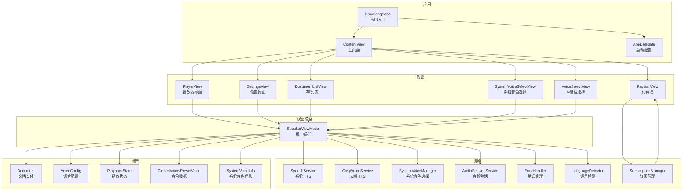

图表来源
- [KnowledgeApp.swift:1-29](file://App/KnowledgeApp.swift#L1-L29)
- [ContentView.swift:1-98](file://Views/ContentView.swift#L1-L98)
- [PlayerView.swift:1-261](file://Views/PlayerView.swift#L1-L261)
- [SystemVoiceSelectView.swift:1-274](file://Views/SystemVoiceSelectView.swift#L1-L274)
- [SpeakerViewModel.swift:1-399](file://ViewModels/SpeakerViewModel.swift#L1-L399)
- [SpeechService.swift:1-166](file://Services/SpeechService.swift#L1-L166)
- [CosyVoiceService.swift:1-219](file://Services/CosyVoiceService.swift#L1-L219)
- [SystemVoiceManager.swift:1-104](file://Services/SystemVoiceManager.swift#L1-L104)
- [AudioSessionService.swift:1-46](file://Services/AudioSessionService.swift#L1-L46)
- [LanguageDetector.swift:1-83](file://Services/LanguageDetector.swift#L1-L83)
- [Document.swift:1-115](file://Models/Document.swift#L1-L115)
- [VoiceConfig.swift:1-71](file://Models/VoiceConfig.swift#L1-L71)
- [PlaybackState.swift:1-9](file://Models/PlaybackState.swift#L1-L9)
- [ClonedVoice.swift:1-118](file://Models/ClonedVoice.swift#L1-L118)
- [SettingsView.swift:1-321](file://Views/SettingsView.swift#L1-L321)
- [VoiceSelectView.swift:1-215](file://Views/VoiceSelectView.swift#L1-L215)
- [SubscriptionManager.swift:1-127](file://Services/SubscriptionManager.swift#L1-L127)
- [PaywallView.swift:1-181](file://Views/PaywallView.swift#L1-L181)

章节来源
- [KnowledgeApp.swift:1-29](file://App/KnowledgeApp.swift#L1-L29)
- [ContentView.swift:1-98](file://Views/ContentView.swift#L1-L98)
- [PlayerView.swift:1-261](file://Views/PlayerView.swift#L1-L261)
- [SystemVoiceSelectView.swift:1-274](file://Views/SystemVoiceSelectView.swift#L1-L274)
- [SpeakerViewModel.swift:1-399](file://ViewModels/SpeakerViewModel.swift#L1-L399)

## 核心组件
- 语音合成协议与实现
  - 抽象协议定义统一接口，便于替换与测试
  - 系统实现基于 AVSpeechSynthesizer，支持分段朗读、位置回调、范围高亮
- 云端语音合成
  - 阿里云 DashScope CosyVoice 服务，支持预设音色与语音克隆
  - 长文本分段合成与进度回调
- 系统音色管理
  - **更新** 筛选与推荐 iOS 17+ Neural 增强版音色，支持更广泛的中文语言代码
  - **新增** 通过 identifier 字符串识别 Neural TTS 音色，区分 eloquence 和 super-compact 系列
- 播放编排
  - 统一 ViewModel 负责切换引擎、播放控制、进度同步、远程控制、错误降级
- 文档与配置
  - Document 持久化阅读进度与摘要；VoiceConfig 保存语速、语言、引擎等
- 音频会话
  - 集中管理 AVAudioSession 的配置、激活与停用
- **新增** 语言检测器
  - 自动检测文档语言并匹配对应的 VoiceConfig，支持中文方言识别
- **新增** 订阅管理系统
  - 基于 StoreKit 2 的 Premium 订阅管理，支持购买、恢复和状态检查
  - 付费墙界面展示 Premium 功能并引导用户订阅

章节来源
- [SpeechSynthesizerProtocol.swift:1-20](file://Services/SpeechSynthesizerProtocol.swift#L1-L20)
- [SpeechService.swift:1-166](file://Services/SpeechService.swift#L1-L166)
- [CosyVoiceService.swift:1-219](file://Services/CosyVoiceService.swift#L1-L219)
- [SystemVoiceManager.swift:1-104](file://Services/SystemVoiceManager.swift#L1-L104)
- [LanguageDetector.swift:1-83](file://Services/LanguageDetector.swift#L1-L83)
- [SpeakerViewModel.swift:1-399](file://ViewModels/SpeakerViewModel.swift#L1-L399)
- [Document.swift:1-115](file://Models/Document.swift#L1-L115)
- [VoiceConfig.swift:1-71](file://Models/VoiceConfig.swift#L1-L71)
- [AudioSessionService.swift:1-46](file://Services/AudioSessionService.swift#L1-L46)
- [SubscriptionManager.swift:1-127](file://Services/SubscriptionManager.swift#L1-L127)

## 架构总览
系统以 SpeakerViewModel 为门面，聚合多种 TTS 引擎与辅助服务，向上暴露统一的播放与配置接口，向下对接系统 TTS 与云端服务。UI 通过 SwiftUI 绑定 ViewModel 的状态变化，实现实时高亮与播放控制。**更新后的架构** 集成了订阅管理系统，通过 SubscriptionManager 控制 Premium 功能的访问权限。

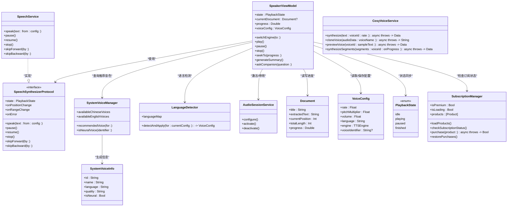

图表来源
- [SpeakerViewModel.swift:1-399](file://ViewModels/SpeakerViewModel.swift#L1-L399)
- [SpeechSynthesizerProtocol.swift:1-20](file://Services/SpeechSynthesizerProtocol.swift#L1-L20)
- [SpeechService.swift:1-166](file://Services/SpeechService.swift#L1-L166)
- [CosyVoiceService.swift:1-219](file://Services/CosyVoiceService.swift#L1-L219)
- [SystemVoiceManager.swift:1-104](file://Services/SystemVoiceManager.swift#L1-L104)
- [LanguageDetector.swift:1-83](file://Services/LanguageDetector.swift#L1-L83)
- [AudioSessionService.swift:1-46](file://Services/AudioSessionService.swift#L1-L46)
- [SubscriptionManager.swift:1-127](file://Services/SubscriptionManager.swift#L1-L127)
- [Document.swift:1-115](file://Models/Document.swift#L1-L115)
- [VoiceConfig.swift:1-71](file://Models/VoiceConfig.swift#L1-L71)
- [PlaybackState.swift:1-9](file://Models/PlaybackState.swift#L1-L9)

## 详细组件分析

### 语音合成协议与系统实现
- 设计要点
  - 通过协议屏蔽具体实现差异，便于单元测试与运行时切换
  - 系统实现基于 AVSpeechSynthesizer，按自然断点切分文本，避免中途截断导致不自然
  - 回调 onPositionChange/onRangeChange 驱动 UI 高亮与进度更新
- 关键流程
  - speak 方法根据配置设置速率、音高、音量与语音标识符
  - 完成回调中推进全文位置，继续下一段
  - 跳过前进/后退通过字符估算定位并重新 speak

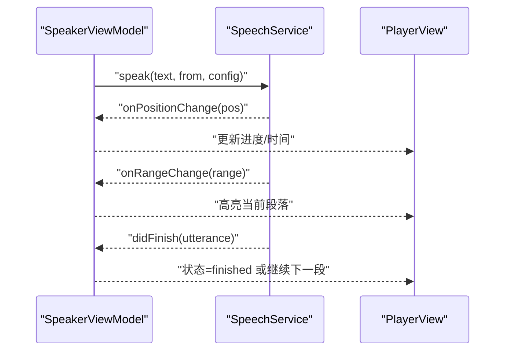

图表来源
- [SpeechSynthesizerProtocol.swift:1-20](file://Services/SpeechSynthesizerProtocol.swift#L1-L20)
- [SpeechService.swift:1-166](file://Services/SpeechService.swift#L1-L166)
- [SpeakerViewModel.swift:1-399](file://ViewModels/SpeakerViewModel.swift#L1-L399)
- [PlayerView.swift:1-261](file://Views/PlayerView.swift#L1-L261)

章节来源
- [SpeechSynthesizerProtocol.swift:1-20](file://Services/SpeechSynthesizerProtocol.swift#L1-L20)
- [SpeechService.swift:1-166](file://Services/SpeechService.swift#L1-L166)
- [SpeakerViewModel.swift:1-399](file://ViewModels/SpeakerViewModel.swift#L1-L399)
- [PlayerView.swift:1-261](file://Views/PlayerView.swift#L1-L261)

### 云端语音合成（CosyVoice）
- 功能概览
  - 预设音色与语音克隆
  - 长文本分段合成与进度回调
  - 错误类型化（API Key 缺失/无效、响应异常、无音频数据等）
- 调用流程
  - synthesize 发起请求，解析 JSON 输出，支持直接返回 base64 或返回 URL 再下载
  - cloneVoice 上传参考音频，返回 voice_id
  - synthesizeSegments 循环合成并拼接，间隔避免限流

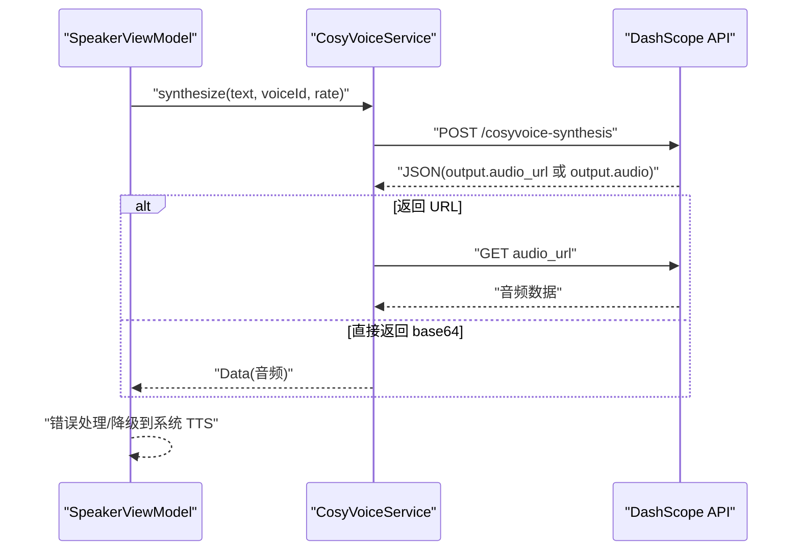

图表来源
- [CosyVoiceService.swift:1-219](file://Services/CosyVoiceService.swift#L1-L219)
- [SpeakerViewModel.swift:1-399](file://ViewModels/SpeakerViewModel.swift#L1-L399)

章节来源
- [CosyVoiceService.swift:1-219](file://Services/CosyVoiceService.swift#L1-L219)
- [SpeakerViewModel.swift:1-399](file://ViewModels/SpeakerViewModel.swift#L1-L399)

### 系统音色管理与推荐
- 能力
  - **更新** 过滤中文/英文 Neural 音色并按名称排序，支持更广泛的中文语言代码（zh-, cmn-, yue）
  - **改进** 根据语言代码推荐增强版或高级版音色，优先选择 eloquence 系列
  - **增强** 判断指定 identifier 是否为 Neural 音色，通过 identifier 字符串而非 quality 属性
- 使用场景
  - 加载文档时若使用 Apple Neural TTS 且未设置 voiceIdentifier，则自动填充推荐值

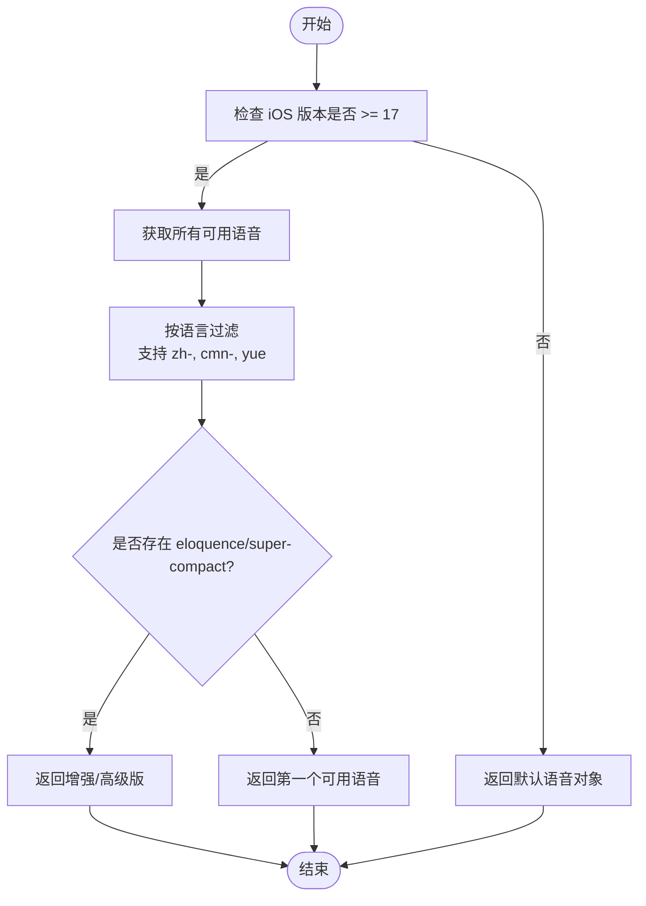

图表来源
- [SystemVoiceManager.swift:1-104](file://Services/SystemVoiceManager.swift#L1-L104)
- [SpeakerViewModel.swift:1-399](file://ViewModels/SpeakerViewModel.swift#L1-L399)

章节来源
- [SystemVoiceManager.swift:1-104](file://Services/SystemVoiceManager.swift#L1-L104)
- [SpeakerViewModel.swift:1-399](file://ViewModels/SpeakerViewModel.swift#L1-L399)

### 增强的 Neural TTS 识别机制
**新增** 系统现在通过 identifier 字符串而非 quality 属性来识别 Neural TTS 音色：

- **识别逻辑**
  - eloquence 系列：`com.apple.eloquence.*` → 标记为 "Neural（增强版）"
  - super-compact 系列：`com.apple.voice.super-compact.*` → 标记为 "Neural（紧凑版）"
  - 其他音色：标记为 "标准版"

- **iOS 17+ 特性**
  - quality 属性在 iOS 17+ 中始终返回 .default，即使对于 Neural TTS
  - 必须通过 identifier 字符串来判断是否为 Neural 音色
  - 支持更精确的音质分类和用户提示

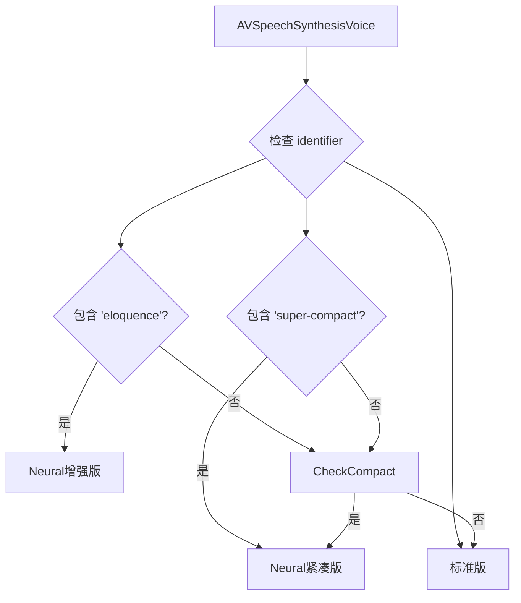

图表来源
- [SystemVoiceManager.swift:70-104](file://Services/SystemVoiceManager.swift#L70-L104)

章节来源
- [SystemVoiceManager.swift:70-104](file://Services/SystemVoiceManager.swift#L70-L104)

### 扩宽的中文语言支持
**更新** 系统现在支持更广泛的中文语言变体：

- **支持的语言代码**
  - `zh-` 前缀：简体中文、繁体中文等
  - `cmn-` 前缀：普通话
  - `yue`：粤语
  - `zh-CN`：中国大陆简体
  - `zh-TW`：台湾繁体
  - `zh-HK`：香港繁体

- **智能推荐逻辑**
  - 优先展示中文 Neural 音色，其次是英文
  - 支持粤语和普通话的自动识别
  - 提供详细的调试信息帮助开发者了解可用的中文音色

章节来源
- [SystemVoiceManager.swift:11-24](file://Services/SystemVoiceManager.swift#L11-L24)
- [SystemVoiceSelectView.swift:71-96](file://Views/SystemVoiceSelectView.swift#L71-L96)

### 语言检测与自动适配
**新增** LanguageDetector 组件提供智能语言检测和自动配置：

- **功能特性**
  - 自动检测文档的主导语言
  - 将检测到的语言映射到合适的 VoiceConfig
  - 支持 18 种语言的自动适配
  - 保持用户现有配置不变，除非检测到不同的主导语言

- **中文方言支持**
  - 简繁体中文自动识别和适配
  - 支持 zh-Hans → zh-CN 映射
  - 支持 zh-Hant → zh-HK 映射

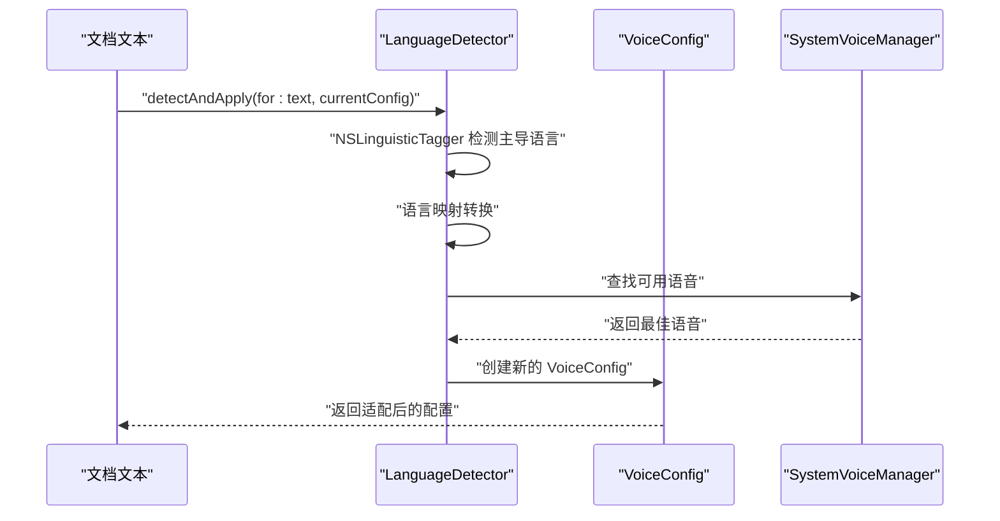

图表来源
- [LanguageDetector.swift:30-76](file://Services/LanguageDetector.swift#L30-L76)
- [SpeakerViewModel.swift:105-117](file://ViewModels/SpeakerViewModel.swift#L105-L117)

章节来源
- [LanguageDetector.swift:1-83](file://Services/LanguageDetector.swift#L1-L83)
- [SpeakerViewModel.swift:105-117](file://ViewModels/SpeakerViewModel.swift#L105-L117)

### 订阅制访问模型与 Premium 功能
**新增** 系统采用订阅制访问模型，Knowledge Voice 高级功能需要 Premium 订阅：

- **引擎访问控制**
  - Apple Neural TTS：免费基础功能，所有用户可用
  - Knowledge Voice：Premium 专属功能，需要订阅才能使用
  - 传统系统 TTS：降级兼容方案，所有用户可用

- **订阅管理**
  - 基于 StoreKit 2 的订阅状态管理
  - 支持月订阅和年订阅产品
  - 自动检查订阅状态和恢复购买

- **付费墙机制**
  - 未订阅用户尝试使用 Premium 功能时显示付费墙
  - 清晰的功能列表和价值主张
  - 便捷的购买流程和错误处理

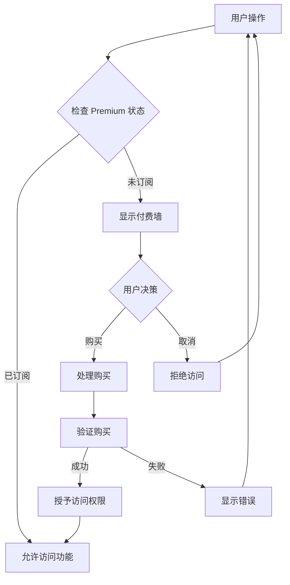

图表来源
- [SubscriptionManager.swift:1-127](file://Services/SubscriptionManager.swift#L1-L127)
- [PaywallView.swift:1-181](file://Views/PaywallView.swift#L1-L181)
- [SettingsView.swift:84-120](file://Views/SettingsView.swift#L84-L120)

章节来源
- [SubscriptionManager.swift:1-127](file://Services/SubscriptionManager.swift#L1-L127)
- [PaywallView.swift:1-181](file://Views/PaywallView.swift#L1-L181)
- [SettingsView.swift:84-120](file://Views/SettingsView.swift#L84-L120)

### 增强的语音选择界面
**更新** SystemVoiceSelectView 提供了更好的用户体验：

- **新功能**
  - 智能推荐：优先展示中文 Neural 音色，然后是英文
  - 下载提示：当没有可用的 Neural 音色时，提供详细的下载指导
  - 调试信息：打印所有可用的中文相关音色，帮助开发者诊断问题
  - 改进的视觉反馈：清晰的 Neural 标签和质量等级显示

- **用户体验改进**
  - 中文音色优先排序
  - 详细的语言显示名称（中文（简体）、中文（香港）、中文（繁体））
  - 一键跳转到系统设置下载音色

章节来源
- [SystemVoiceSelectView.swift:1-274](file://Views/SystemVoiceSelectView.swift#L1-L274)

### AI 音色选择与克隆
**新增** 完整的 AI 音色管理和克隆功能：

- **音色选择界面**
  - 我的克隆音色管理（添加、删除、预览）
  - 预设音色分类浏览（男声、女声、儿童等）
  - 实时试听功能和选择状态管理

- **语音克隆流程**
  - 录音引导和时长验证（至少5秒）
  - 音频上传和AI处理状态反馈
  - 克隆结果保存和自动选择

- **访问控制**
  - Premium 订阅用户可完全访问
  - 未订阅用户显示锁定状态和升级提示

章节来源
- [VoiceSelectView.swift:1-215](file://Views/VoiceSelectView.swift#L1-L215)
- [VoiceCloneView.swift:1-404](file://Views/VoiceCloneView.swift#L1-L404)

### 播放编排与 UI 联动
- 编排职责
  - 切换引擎（系统/云端），并在出错时自动降级
  - 播放控制（播放/暂停/停止/重播/快进/快退/跳转）
  - 进度与高亮同步，防抖更新 UI
  - 与 Now Playing 集成，支持锁屏与控制中心
- UI 联动
  - PlayerView 将 highlightRange 映射到段落高亮，并自动滚动到当前段落
  - 进度条拖动触发 seekTo，必要时立即恢复播放

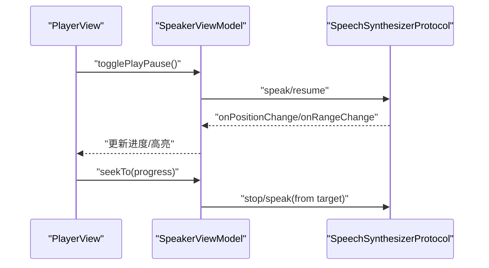

图表来源
- [SpeakerViewModel.swift:1-399](file://ViewModels/SpeakerViewModel.swift#L1-L399)
- [PlayerView.swift:1-261](file://Views/PlayerView.swift#L1-L261)

章节来源
- [SpeakerViewModel.swift:1-399](file://ViewModels/SpeakerViewModel.swift#L1-L399)
- [PlayerView.swift:1-261](file://Views/PlayerView.swift#L1-L261)

### 文档与配置模型
- Document
  - 记录标题、文件名、提取文本、当前位置、最后打开时间、收藏状态、摘要与播客音频路径
  - 计算属性 totalLength 与 progress 用于 UI 展示
- VoiceConfig
  - 包含语速、音高、音量、语言、引擎类型、音色标识符与克隆/预设 ID
  - 提供常用语速预设与引擎描述信息
  - **更新** Knowledge Voice 引擎描述改为"AI 云端合成，支持语音克隆，Premium 专属"
- ClonedVoice/PresetVoice
  - 云端音色数据模型与持久化管理（UserDefaults）

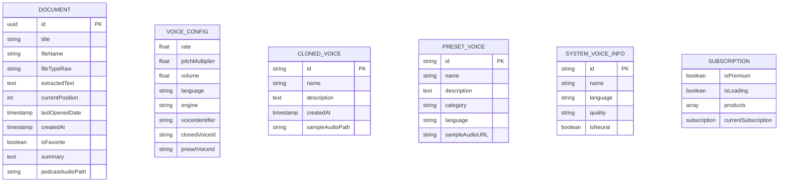

图表来源
- [Document.swift:1-115](file://Models/Document.swift#L1-L115)
- [VoiceConfig.swift:1-71](file://Models/VoiceConfig.swift#L1-L71)
- [ClonedVoice.swift:1-118](file://Models/ClonedVoice.swift#L1-L118)
- [SystemVoiceManager.swift:70-104](file://Services/SystemVoiceManager.swift#L70-L104)
- [SubscriptionManager.swift:1-127](file://Services/SubscriptionManager.swift#L1-L127)

章节来源
- [Document.swift:1-115](file://Models/Document.swift#L1-L115)
- [VoiceConfig.swift:1-71](file://Models/VoiceConfig.swift#L1-L71)
- [ClonedVoice.swift:1-118](file://Models/ClonedVoice.swift#L1-L118)

### 音频会话管理
- 职责
  - 统一配置 AVAudioSession 为播放模式，支持蓝牙与 AirPlay
  - 按需激活与停用，避免过早占用音频资源
- 集成点
  - AppDelegate 启动时仅配置类别，不激活
  - 播放开始时激活，停止时停用并清理远程控制状态

章节来源
- [AudioSessionService.swift:1-46](file://Services/AudioSessionService.swift#L1-L46)
- [AppDelegate.swift:1-14](file://App/AppDelegate.swift#L1-L14)
- [SpeakerViewModel.swift:1-399](file://ViewModels/SpeakerViewModel.swift#L1-L399)

## 依赖关系分析
- 耦合与内聚
  - SpeakerViewModel 作为门面，内聚了播放逻辑与状态管理，降低 UI 与服务之间的耦合
  - 通过协议注入 SpeechSynthesizerProtocol，提升可测试性与可扩展性
- 外部依赖
  - AVFoundation（系统 TTS 与音频会话）
  - URLSession（云端合成）
  - UserDefaults（配置与音色持久化）
  - SwiftData（文档持久化）
  - StoreKit 2（订阅管理）
- 潜在循环依赖
  - 当前未见循环引用，ViewModel 单向依赖服务与模型

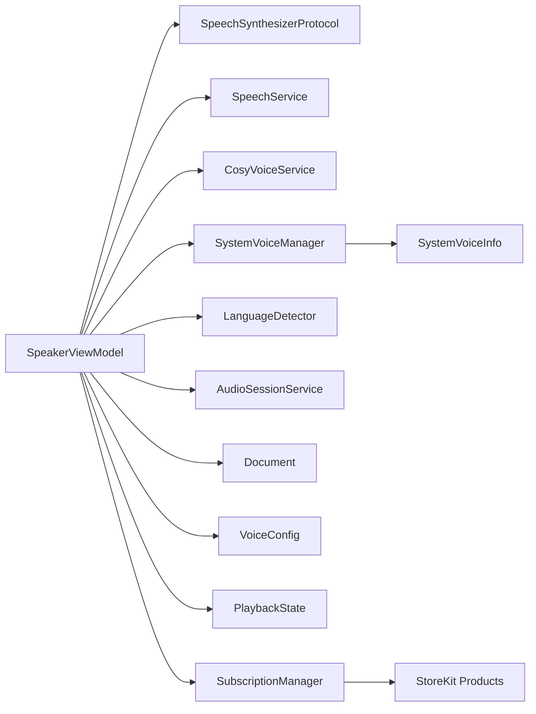

图表来源
- [SpeakerViewModel.swift:1-399](file://ViewModels/SpeakerViewModel.swift#L1-L399)
- [SpeechSynthesizerProtocol.swift:1-20](file://Services/SpeechSynthesizerProtocol.swift#L1-L20)
- [SpeechService.swift:1-166](file://Services/SpeechService.swift#L1-L166)
- [CosyVoiceService.swift:1-219](file://Services/CosyVoiceService.swift#L1-L219)
- [SystemVoiceManager.swift:1-104](file://Services/SystemVoiceManager.swift#L1-L104)
- [LanguageDetector.swift:1-83](file://Services/LanguageDetector.swift#L1-L83)
- [AudioSessionService.swift:1-46](file://Services/AudioSessionService.swift#L1-L46)
- [Document.swift:1-115](file://Models/Document.swift#L1-L115)
- [VoiceConfig.swift:1-71](file://Models/VoiceConfig.swift#L1-L71)
- [PlaybackState.swift:1-9](file://Models/PlaybackState.swift#L1-L9)
- [SubscriptionManager.swift:1-127](file://Services/SubscriptionManager.swift#L1-L127)

章节来源
- [SpeakerViewModel.swift:1-399](file://ViewModels/SpeakerViewModel.swift#L1-L399)

## 性能考量
- 文本分段策略
  - 系统 TTS 按自然断点切分，减少卡顿与不自然中断
- UI 更新优化
  - 高亮范围更新采用定时器防抖，避免频繁刷新
- 网络请求节流
  - 云端分段合成加入延迟，避免触发服务端限流
- 音频会话管理
  - 仅在需要时激活会话，降低功耗与资源占用
- **新增** 语言检测优化
  - 语言检测仅对文档前 500 个字符进行分析，提高性能
  - 缓存检测结果，避免重复检测相同语言
- **新增** 订阅状态缓存
  - 订阅状态检查结果缓存，减少频繁的 StoreKit 查询
  - 异步加载订阅产品，避免阻塞主线程

[本节为通用指导，无需列出章节来源]

## 故障排查指南
- 常见问题
  - 云端 API Key 缺失或无效：检查设置中的 API Key 配置
  - 网络错误：确认网络连接与服务器可达性
  - 系统 TTS 不可用：检查 iOS 版本与语音包安装情况
  - **新增** 中文 Neural TTS 不可用：检查是否已下载所需的中文语音包
  - **新增** Premium 功能无法使用：检查订阅状态和网络连接
- 错误处理机制
  - 全局 ErrorHandler 统一弹窗提示与日志打印
  - 云端服务错误类型化，便于上层区分处理
  - 云端出错时自动降级到系统 TTS，保障可用性
  - **新增** 订阅错误处理：购买失败、验证失败等情况的用户友好提示
- **新增** 调试建议
  - 查看控制台输出的中文音色调试信息
  - 检查 SystemVoiceSelectView 中的下载提示
  - 验证语言检测是否正确识别文档语言
  - 检查 SubscriptionManager 的订阅状态日志
  - 验证 StoreKit 产品配置是否正确

章节来源
- [ErrorHandler.swift:1-53](file://Services/ErrorHandler.swift#L1-L53)
- [CosyVoiceService.swift:1-219](file://Services/CosyVoiceService.swift#L1-L219)
- [SpeakerViewModel.swift:1-399](file://ViewModels/SpeakerViewModel.swift#L1-L399)
- [SystemVoiceSelectView.swift:108-143](file://Views/SystemVoiceSelectView.swift#L108-L143)
- [SubscriptionManager.swift:1-127](file://Services/SubscriptionManager.swift#L1-L127)

## 结论
本系统通过清晰的层次划分与协议抽象，实现了多引擎语音合成的统一管理，具备良好的可扩展性与容错能力。**更新后的系统** 现在采用订阅制访问模型，Knowledge Voice 高级功能需要 Premium 订阅才能使用，而基础的 Apple Neural TTS 功能对所有用户免费开放。系统支持更广泛的中文语言变体，包括普通话、粤语以及各种地区方言，并通过改进的 Neural TTS 识别机制提供更准确的音质分类。结合 AI 摘要与伴读功能，为用户提供更智能的阅读体验。建议在后续迭代中完善云端音频播放适配与离线缓存策略，进一步提升用户体验。

[本节为总结性内容，无需列出章节来源]

## 附录
- 应用入口与主题环境注入
  - KnowledgeApp 创建 ModelContainer 并注入主题管理器
- 分享扩展处理
  - ContentView 监听分享通知，导入网页或文本到书库
- **新增** 语言支持矩阵
  - 支持 18 种语言的自动检测和适配
  - 特别优化了中文方言的支持（简体、繁体、粤语、普通话）
- **新增** Neural TTS 版本说明
  - eloquence 系列：高质量 Neural TTS，标记为 "Neural（增强版）"
  - super-compact 系列：紧凑版 Neural TTS，标记为 "Neural（紧凑版）"
  - 传统 TTS：基础语音合成，标记为 "标准版"
- **新增** 引擎访问权限说明
  - Apple Neural TTS：免费基础功能，支持 iOS 17+
  - Knowledge Voice：Premium 专属功能，需要订阅
  - 传统系统 TTS：降级兼容方案，支持所有 iOS 版本
- **新增** Premium 功能列表
  - AI 智能总结：一键生成文档摘要和关键要点
  - AI 伴读：边听边问，AI 实时解答
  - AI 高品质音色：CosyVoice 自然语音合成
  - 语音克隆：用自己的声音朗读文档

章节来源
- [KnowledgeApp.swift:1-29](file://App/KnowledgeApp.swift#L1-L29)
- [ContentView.swift:1-98](file://Views/ContentView.swift#L1-L98)
- [LanguageDetector.swift:8-28](file://Services/LanguageDetector.swift#L8-L28)
- [SystemVoiceManager.swift:83-103](file://Services/SystemVoiceManager.swift#L83-L103)
- [VoiceConfig.swift:18-24](file://Models/VoiceConfig.swift#L18-L24)
- [SubscriptionManager.swift:28-30](file://Services/SubscriptionManager.swift#L28-L30)
- [PaywallView.swift:39-45](file://Views/PaywallView.swift#L39-L45)