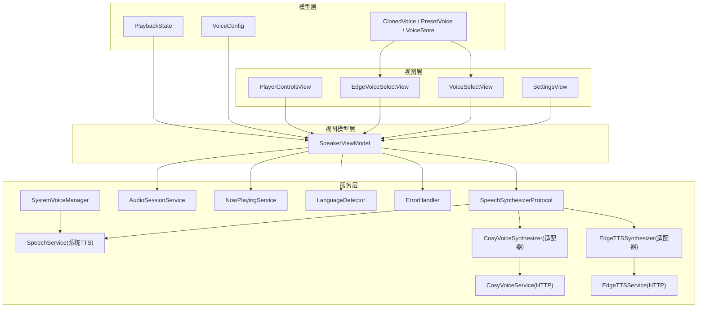
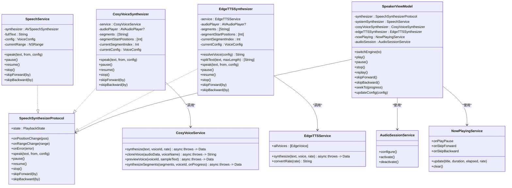
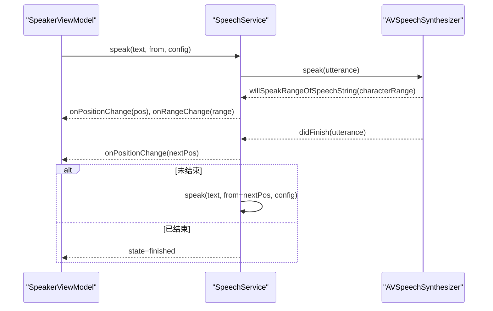
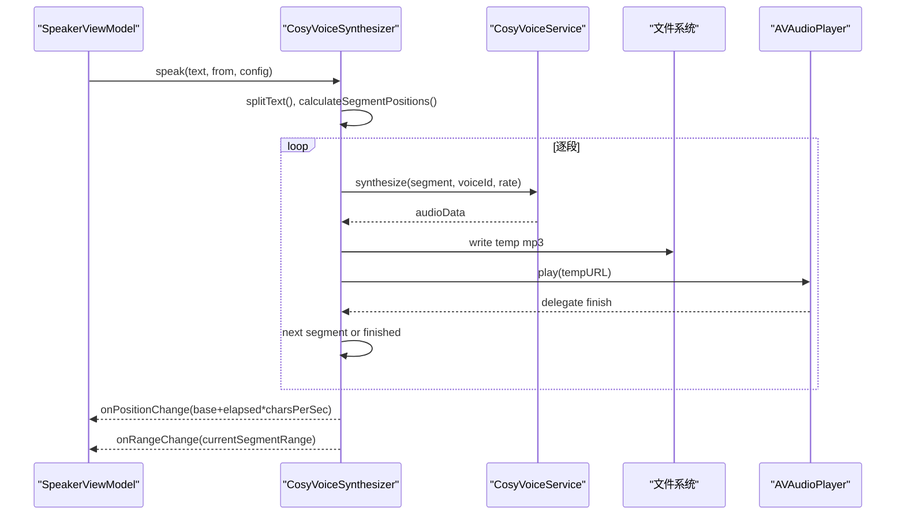
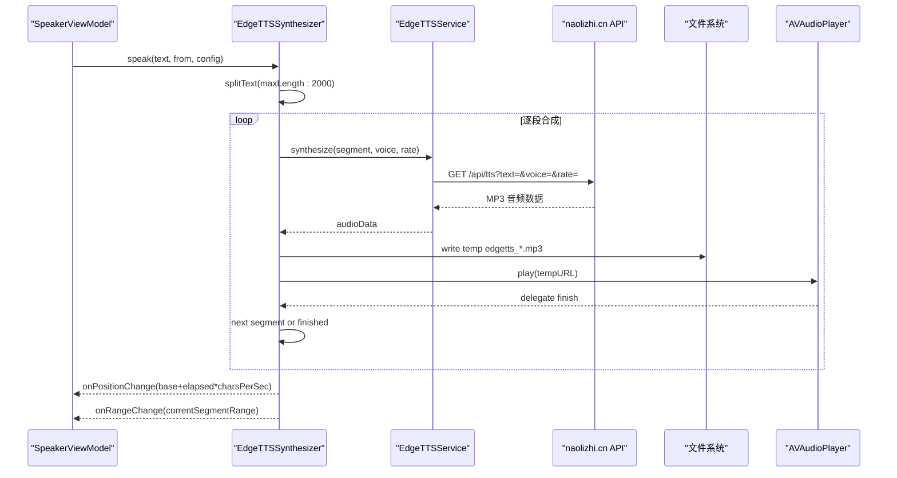
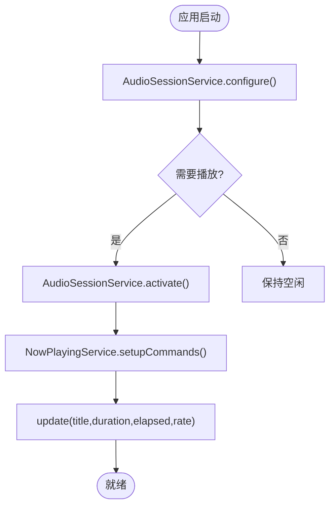
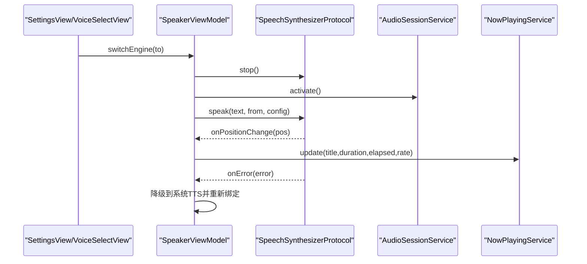
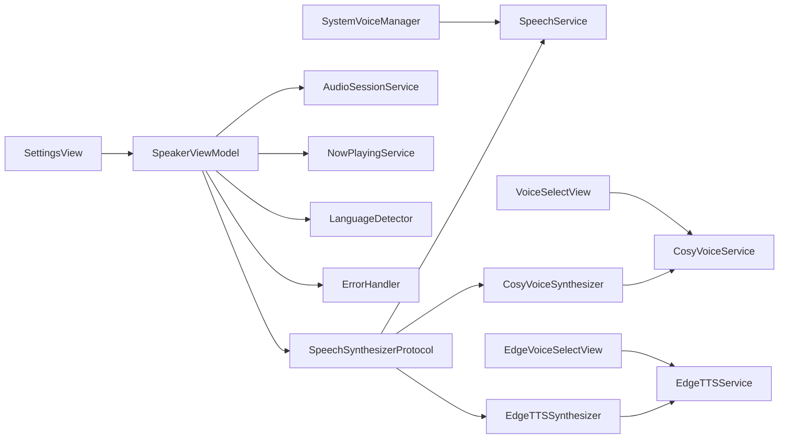

# 语音合成系统

<cite>
**本文引用的文件**   
- [SpeechSynthesizerProtocol.swift](file://Services/SpeechSynthesizerProtocol.swift)
- [SpeechService.swift](file://Services/SpeechService.swift)
- [CosyVoiceService.swift](file://Services/CosyVoiceService.swift)
- [CosyVoiceSynthesizer.swift](file://Services/CosyVoiceSynthesizer.swift)
- [EdgeTTSService.swift](file://Services/EdgeTTSService.swift)
- [EdgeTTSSynthesizer.swift](file://Services/EdgeTTSSynthesizer.swift)
- [AudioSessionService.swift](file://Services/AudioSessionService.swift)
- [NowPlayingService.swift](file://Services/NowPlayingService.swift)
- [SpeakerViewModel.swift](file://ViewModels/SpeakerViewModel.swift)
- [VoiceConfig.swift](file://Models/VoiceConfig.swift)
- [PlaybackState.swift](file://Models/PlaybackState.swift)
- [ClonedVoice.swift](file://Models/ClonedVoice.swift)
- [LanguageDetector.swift](file://Services/LanguageDetector.swift)
- [ErrorHandler.swift](file://Services/ErrorHandler.swift)
- [SettingsView.swift](file://Views/SettingsView.swift)
- [VoiceSelectView.swift](file://Views/VoiceSelectView.swift)
- [EdgeVoiceSelectView.swift](file://Views/EdgeVoiceSelectView.swift)
- [SystemVoiceManager.swift](file://Services/SystemVoiceManager.swift)
</cite>

## 更新摘要
**变更内容**   
- 新增 Edge TTS 引擎（Knowledge 云端语音）作为免费云端语音合成选项
- 集成微软 Edge TTS 服务，通过自建服务器中转调用
- 新增 EdgeTTSService 和 EdgeTTSSynthesizer 实现类
- 扩展 TTSEngine 枚举，支持四种语音引擎选择
- 新增 EdgeVoiceSelectView 音色选择界面
- 完善错误处理和降级策略

## 目录
1. [简介](#简介)
2. [项目结构](#项目结构)
3. [核心组件](#核心组件)
4. [架构总览](#架构总览)
5. [详细组件分析](#详细组件分析)
6. [依赖关系分析](#依赖关系分析)
7. [性能与调优](#性能与调优)
8. [故障排查指南](#故障排查指南)
9. [结论](#结论)
10. [附录：扩展新语音引擎指南](#附录扩展新语音引擎指南)

## 简介
本文件为 Knowledge 应用的语音合成系统提供系统化文档，覆盖以下要点：
- **三种语音引擎的实现与使用**：系统 TTS（基于 AVSpeechSynthesizer）、AI 语音（CosyVoice，阿里云 DashScope）和 **Edge TTS（微软 Neural 云端合成）**。
- SpeechSynthesizerProtocol 协议设计模式，统一播放控制接口。
- AudioSessionService 音频会话管理，以及 NowPlayingService 远程控制集成。
- 播放状态控制机制、错误处理与降级策略。
- 语音配置选项、播放控制接口与 UI 交互。
- 扩展新语音引擎的完整指南与最佳实践。

**更新** 新增了 Edge TTS 引擎作为免费云端语音合成选项，提供丰富的中文音色选择和接近 Azure Neural TTS 的音质。

## 项目结构
语音合成相关代码主要分布在 Services、Models、ViewModels 与 Views 四个层次：
- Services：实现具体引擎、音频会话、远程控制、语言检测与错误处理。
- Models：定义语音配置、播放状态、音色模型与持久化。
- ViewModels：对外暴露统一的播放控制门面，协调引擎切换、状态同步与持久化。
- Views：设置页、音色选择页、播放器控件等用户界面。

**图表来源**
- [SpeakerViewModel.swift:1-120](file://ViewModels/SpeakerViewModel.swift#L1-L120)
- [SpeechSynthesizerProtocol.swift:1-20](file://Services/SpeechSynthesizerProtocol.swift#L1-L20)
- [SpeechService.swift:1-60](file://Services/SpeechService.swift#L1-L60)
- [CosyVoiceSynthesizer.swift:1-60](file://Services/CosyVoiceSynthesizer.swift#L1-L60)
- [EdgeTTSSynthesizer.swift:1-60](file://Services/EdgeTTSSynthesizer.swift#L1-L60)
- [CosyVoiceService.swift:1-60](file://Services/CosyVoiceService.swift#L1-L60)
- [EdgeTTSService.swift:1-60](file://Services/EdgeTTSService.swift#L1-L60)
- [AudioSessionService.swift:1-46](file://Services/AudioSessionService.swift#L1-L46)
- [NowPlayingService.swift:1-57](file://Services/NowPlayingService.swift#L1-L57)
- [VoiceConfig.swift:1-52](file://Models/VoiceConfig.swift#L1-L52)
- [PlaybackState.swift:1-9](file://Models/PlaybackState.swift#L1-L9)
- [ClonedVoice.swift:1-118](file://Models/ClonedVoice.swift#L1-L118)
- [LanguageDetector.swift:1-83](file://Services/LanguageDetector.swift#L1-L83)
- [ErrorHandler.swift:1-53](file://Services/ErrorHandler.swift#L1-L53)
- [SettingsView.swift:1-194](file://Views/SettingsView.swift#L1-L194)
- [VoiceSelectView.swift:1-215](file://Views/VoiceSelectView.swift#L1-L215)
- [EdgeVoiceSelectView.swift:1-174](file://Views/EdgeVoiceSelectView.swift#L1-L174)
- [SystemVoiceManager.swift:1-68](file://Services/SystemVoiceManager.swift#L1-L68)

章节来源
- [SpeakerViewModel.swift:1-120](file://ViewModels/SpeakerViewModel.swift#L1-L120)
- [SpeechSynthesizerProtocol.swift:1-20](file://Services/SpeechSynthesizerProtocol.swift#L1-L20)
- [AudioSessionService.swift:1-46](file://Services/AudioSessionService.swift#L1-L46)
- [NowPlayingService.swift:1-57](file://Services/NowPlayingService.swift#L1-L57)
- [VoiceConfig.swift:1-52](file://Models/VoiceConfig.swift#L1-L52)
- [PlaybackState.swift:1-9](file://Models/PlaybackState.swift#L1-L9)
- [ClonedVoice.swift:1-118](file://Models/ClonedVoice.swift#L1-L118)
- [LanguageDetector.swift:1-83](file://Services/LanguageDetector.swift#L1-L83)
- [ErrorHandler.swift:1-53](file://Services/ErrorHandler.swift#L1-L53)
- [SettingsView.swift:1-194](file://Views/SettingsView.swift#L1-L194)
- [VoiceSelectView.swift:1-215](file://Views/VoiceSelectView.swift#L1-L215)
- [EdgeVoiceSelectView.swift:1-174](file://Views/EdgeVoiceSelectView.swift#L1-L174)
- [SystemVoiceManager.swift:1-68](file://Services/SystemVoiceManager.swift#L1-L68)

## 核心组件
- **协议抽象**：SpeechSynthesizerProtocol 定义了统一的播放能力与回调，屏蔽底层引擎差异。
- **系统 TTS 引擎**：SpeechService 基于 AVSpeechSynthesizer，支持断句朗读、位置与范围回调、跳转与暂停恢复。
- **AI 语音引擎**：CosyVoiceService 负责 HTTP 调用；CosyVoiceSynthesizer 作为适配器，将分段合成与 AVAudioPlayer 播放封装为协议能力。
- **Edge TTS 引擎**：**新增** EdgeTTSService 通过 naolizhi.cn 服务器中转调用微软 Edge TTS；EdgeTTSSynthesizer 作为适配器，提供免费云端语音合成能力。
- **音频会话**：AudioSessionService 统一管理 AVAudioSession 的配置、激活与停用，确保后台播放、蓝牙与 AirPlay 可用。
- **远程控制**：NowPlayingService 集成 MPNowPlayingInfoCenter 与 MPRemoteCommandCenter，提供锁屏/控制中心控制。
- **视图模型门面**：SpeakerViewModel 聚合引擎、会话、远程控制和错误处理，暴露 play/pause/stop/skip/seek 等接口，并维护播放状态与进度。
- **配置与数据**：VoiceConfig 保存语速、音高、音量、语言、引擎类型与音色 ID；PlaybackState 描述 idle/playing/paused/finished；ClonedVoice/PresetVoice/VoiceStore 管理预设与克隆音色。
- **辅助服务**：LanguageDetector 自动检测文本语言并匹配系统语音；ErrorHandler 提供统一日志与弹窗提示；SystemVoiceManager 管理 iOS 17+ Neural TTS 音色。

**更新** 新增了 Edge TTS 引擎作为第四种语音选项，提供免费的云端语音合成服务。

章节来源
- [SpeechSynthesizerProtocol.swift:1-20](file://Services/SpeechSynthesizerProtocol.swift#L1-L20)
- [SpeechService.swift:1-155](file://Services/SpeechService.swift#L1-L155)
- [CosyVoiceService.swift:1-219](file://Services/CosyVoiceService.swift#L1-L219)
- [CosyVoiceSynthesizer.swift:1-258](file://Services/CosyVoiceSynthesizer.swift#L1-L258)
- [EdgeTTSService.swift:1-134](file://Services/EdgeTTSService.swift#L1-L134)
- [EdgeTTSSynthesizer.swift:1-248](file://Services/EdgeTTSSynthesizer.swift#L1-L248)
- [AudioSessionService.swift:1-46](file://Services/AudioSessionService.swift#L1-L46)
- [NowPlayingService.swift:1-57](file://Services/NowPlayingService.swift#L1-L57)
- [SpeakerViewModel.swift:1-314](file://ViewModels/SpeakerViewModel.swift#L1-L314)
- [VoiceConfig.swift:1-52](file://Models/VoiceConfig.swift#L1-L52)
- [PlaybackState.swift:1-9](file://Models/PlaybackState.swift#L1-L9)
- [ClonedVoice.swift:1-118](file://Models/ClonedVoice.swift#L1-L118)
- [LanguageDetector.swift:1-83](file://Services/LanguageDetector.swift#L1-L83)
- [ErrorHandler.swift:1-53](file://Services/ErrorHandler.swift#L1-L53)
- [SystemVoiceManager.swift:1-68](file://Services/SystemVoiceManager.swift#L1-L68)

## 架构总览
整体采用"协议 + 适配器"的分层架构，现已支持四种语音引擎：
- 上层通过 SpeakerViewModel 与 SpeechSynthesizerProtocol 交互，不感知具体引擎实现。
- 系统 TTS、CosyVoice 和 Edge TTS 分别以不同方式满足同一协议，便于替换与测试。
- 音频会话与远程控制由独立服务管理，避免耦合到业务逻辑。
- 配置与状态集中在 ViewModel，UI 仅消费 Published 属性。

**图表来源**
- [SpeechSynthesizerProtocol.swift:1-20](file://Services/SpeechSynthesizerProtocol.swift#L1-L20)
- [SpeechService.swift:1-155](file://Services/SpeechService.swift#L1-L155)
- [CosyVoiceService.swift:1-219](file://Services/CosyVoiceService.swift#L1-L219)
- [EdgeTTSService.swift:1-134](file://Services/EdgeTTSService.swift#L1-L134)
- [CosyVoiceSynthesizer.swift:1-258](file://Services/CosyVoiceSynthesizer.swift#L1-L258)
- [EdgeTTSSynthesizer.swift:1-248](file://Services/EdgeTTSSynthesizer.swift#L1-L248)
- [SpeakerViewModel.swift:1-314](file://ViewModels/SpeakerViewModel.swift#L1-L314)
- [AudioSessionService.swift:1-46](file://Services/AudioSessionService.swift#L1-L46)
- [NowPlayingService.swift:1-57](file://Services/NowPlayingService.swift#L1-L57)

## 详细组件分析

### 协议与播放状态
- SpeechSynthesizerProtocol 定义了统一的播放能力与回调，包括当前状态、位置变化、范围变化与错误回调，以及 speak/pause/resume/stop/skipForward/skipBackward 等方法。
- PlaybackState 枚举表示 idle/playing/paused/finished 四种状态，用于驱动 UI 与持久化。

章节来源
- [SpeechSynthesizerProtocol.swift:1-20](file://Services/SpeechSynthesizerProtocol.swift#L1-L20)
- [PlaybackState.swift:1-9](file://Models/PlaybackState.swift#L1-L9)

### 系统 TTS 引擎（SpeechService）
- 基于 AVSpeechSynthesizer，按自然断点切分文本块进行朗读。
- 通过 willSpeakRangeOfSpeechString 与 didFinish 回调更新当前位置与范围，并在完成后继续下一段。
- 支持 skipForward/skipBackward 基于字符估算进行跳转。
- **iOS 17+ 支持 Neural TTS**，提供更自然的语音质量。

**图表来源**
- [SpeechService.swift:30-155](file://Services/SpeechService.swift#L30-L155)
- [SpeakerViewModel.swift:215-266](file://ViewModels/SpeakerViewModel.swift#L215-L266)

章节来源
- [SpeechService.swift:1-155](file://Services/SpeechService.swift#L1-L155)

### AI 语音引擎（CosyVoice）
- CosyVoiceService 负责与阿里云 DashScope 的 HTTP 交互，支持 TTS 合成、语音克隆与试听。
- CosyVoiceSynthesizer 作为适配器，将长文本分段（每段最多约 500 字符），逐段合成并写入临时文件，使用 AVAudioPlayer 顺序播放，同时维护段落起始位置与全文绝对位置映射。
- 在合成或播放过程中发生错误时，触发 onError 回调，上层可执行降级策略。

**图表来源**
- [CosyVoiceSynthesizer.swift:28-258](file://Services/CosyVoiceSynthesizer.swift#L28-L258)
- [CosyVoiceService.swift:27-186](file://Services/CosyVoiceService.swift#L27-L186)

章节来源
- [CosyVoiceService.swift:1-219](file://Services/CosyVoiceService.swift#L1-L219)
- [CosyVoiceSynthesizer.swift:1-258](file://Services/CosyVoiceSynthesizer.swift#L1-L258)

### Edge TTS 引擎（新增）
**新增功能** EdgeTTSService 通过 naolizhi.cn 服务器中转调用微软 Edge TTS，提供免费的云端语音合成服务。

- **服务特点**：免费无限量使用，音质接近 Azure Neural TTS，支持丰富的中文音色。
- **API 端点**：`https://naolizhi.cn/api/tts`，通过 URL 参数传递文本、音色和语速。
- **音色支持**：内置 15+ 种中文音色（晓晓、云希、云扬等），支持普通话和粤语。
- **语速转换**：内部语速值 (0.1~2.0) 转换为 Edge TTS 百分比格式 (+0% ~ +200%)。
- **文本限制**：单段最长 5000 字符，实际使用时分段为 2000 字符以确保稳定性。

EdgeTTSSynthesizer 作为适配器实现 SpeechSynthesizerProtocol：
- **智能分段**：优先在句号、换行、逗号等自然断点处截断，提升朗读流畅度。
- **位置追踪**：基于每秒约 3 个字符的估算，结合段落起始位置计算绝对位置。
- **错误降级**：网络或服务端错误时自动降级到系统 TTS。
- **临时文件管理**：每个合成的音频片段保存为临时 MP3 文件，播放后自动清理。

**图表来源**
- [EdgeTTSSynthesizer.swift:28-248](file://Services/EdgeTTSSynthesizer.swift#L28-L248)
- [EdgeTTSService.swift:57-92](file://Services/EdgeTTSService.swift#L57-L92)

章节来源
- [EdgeTTSService.swift:1-134](file://Services/EdgeTTSService.swift#L1-L134)
- [EdgeTTSSynthesizer.swift:1-248](file://Services/EdgeTTSSynthesizer.swift#L1-L248)

### 音频会话与远程控制
- AudioSessionService 统一配置 AVAudioSession 为 playback/spokenAudio 模式，并允许蓝牙与 AirPlay；提供 activate/deactivate 生命周期方法。
- NowPlayingService 更新锁屏/控制中心信息，并注册播放/暂停/快进/快退命令，转发到 ViewModel 的统一控制。

**图表来源**
- [AudioSessionService.swift:14-46](file://Services/AudioSessionService.swift#L14-L46)
- [NowPlayingService.swift:14-57](file://Services/NowPlayingService.swift#L14-L57)

章节来源
- [AudioSessionService.swift:1-46](file://Services/AudioSessionService.swift#L1-L46)
- [NowPlayingService.swift:1-57](file://Services/NowPlayingService.swift#L1-L57)

### 视图模型门面（SpeakerViewModel）
- 对外暴露 play/pause/stop/replay/skipForward/skipBackward/seekTo/updateConfig/switchEngine 等接口。
- 内部持有系统 TTS、CosyVoice 和 **Edge TTS** 三个引擎实例，根据 TTSEngine 动态切换。
- 监听引擎的 onPositionChange/onRangeChange/onError，同步到 @Published 属性，驱动 UI 高亮与进度显示。
- **智能降级策略**：当 AI 语音引擎或 Edge TTS 出错时，自动降级到系统 TTS，并重新绑定回调。

**图表来源**
- [SpeakerViewModel.swift:56-170](file://ViewModels/SpeakerViewModel.swift#L56-L170)
- [SpeakerViewModel.swift:215-266](file://ViewModels/SpeakerViewModel.swift#L215-L266)
- [SettingsView.swift:156-194](file://Views/SettingsView.swift#L156-L194)
- [VoiceSelectView.swift:143-163](file://Views/VoiceSelectView.swift#L143-L163)

章节来源
- [SpeakerViewModel.swift:1-402](file://ViewModels/SpeakerViewModel.swift#L1-L402)
- [SettingsView.swift:1-384](file://Views/SettingsView.swift#L1-L384)
- [VoiceSelectView.swift:1-215](file://Views/VoiceSelectView.swift#L1-L215)

### 语音配置与音色管理
- VoiceConfig 包含语速、音高、音量、语言、引擎类型、预设/克隆音色 ID 和 **Edge TTS 音色 ID** 等字段，并提供常用语速预设。
- ClonedVoice/PresetVoice/VoiceStore 管理预设音色列表与用户克隆音色的持久化，支持按分类获取与选择。
- LanguageDetector 基于 NSLinguisticTagger 检测主导语言，并尝试匹配系统高质量语音。
- **SystemVoiceManager** 专门管理 iOS 17+ Neural TTS 音色，支持按语言和音质筛选。

**更新** VoiceConfig 新增 edgeVoiceId 字段用于存储 Edge TTS 音色选择。

章节来源
- [VoiceConfig.swift:1-82](file://Models/VoiceConfig.swift#L1-L82)
- [ClonedVoice.swift:1-118](file://Models/ClonedVoice.swift#L1-L118)
- [LanguageDetector.swift:1-83](file://Services/LanguageDetector.swift#L1-L83)
- [SystemVoiceManager.swift:1-68](file://Services/SystemVoiceManager.swift#L1-L68)

### Edge TTS 音色选择界面（新增）
**新增功能** EdgeVoiceSelectView 提供专门的 Edge TTS 音色选择界面。

- **音色分类**：按普通话和粤语分组展示，普通话音色优先显示。
- **音色信息**：显示音色名称、性别图标、标签（推荐、新闻、粤语）和技术标识符。
- **试听功能**：支持在线试听各音色效果，使用默认测试文本"你好，这是[音色名]的声音效果"。
- **实时预览**：选中音色后在设置页面显示当前选择的音色名称。
- **一键切换**：选择确认后自动切换到 Edge TTS 引擎并应用配置。

章节来源
- [EdgeVoiceSelectView.swift:1-174](file://Views/EdgeVoiceSelectView.swift#L1-L174)

## 依赖关系分析
- 低耦合：SpeakerViewModel 仅依赖 SpeechSynthesizerProtocol，不直接依赖具体引擎实现，便于替换与测试。
- 内聚性：各引擎职责清晰，系统 TTS 专注本地合成，AI 语音专注网络合成与播放拼接，**Edge TTS 专注免费云端合成**。
- 外部依赖：AVFoundation（系统 TTS 与音频播放）、MediaPlayer（远程控制）、UserDefaults（配置与音色持久化）、网络请求（CosyVoiceService 和 EdgeTTSService）。

**图表来源**
- [SpeakerViewModel.swift:1-120](file://ViewModels/SpeakerViewModel.swift#L1-L120)
- [SpeechSynthesizerProtocol.swift:1-20](file://Services/SpeechSynthesizerProtocol.swift#L1-L20)
- [SpeechService.swift:1-60](file://Services/SpeechService.swift#L1-L60)
- [CosyVoiceSynthesizer.swift:1-60](file://Services/CosyVoiceSynthesizer.swift#L1-L60)
- [EdgeTTSSynthesizer.swift:1-60](file://Services/EdgeTTSSynthesizer.swift#L1-L60)
- [CosyVoiceService.swift:1-60](file://Services/CosyVoiceService.swift#L1-L60)
- [EdgeTTSService.swift:1-60](file://Services/EdgeTTSService.swift#L1-L60)
- [AudioSessionService.swift:1-46](file://Services/AudioSessionService.swift#L1-L46)
- [NowPlayingService.swift:1-57](file://Services/NowPlayingService.swift#L1-L57)
- [LanguageDetector.swift:1-83](file://Services/LanguageDetector.swift#L1-L83)
- [ErrorHandler.swift:1-53](file://Services/ErrorHandler.swift#L1-L53)
- [VoiceSelectView.swift:1-215](file://Views/VoiceSelectView.swift#L1-L215)
- [EdgeVoiceSelectView.swift:1-174](file://Views/EdgeVoiceSelectView.swift#L1-L174)
- [SettingsView.swift:1-194](file://Views/SettingsView.swift#L1-L194)
- [SystemVoiceManager.swift:1-68](file://Services/SystemVoiceManager.swift#L1-L68)

章节来源
- [SpeakerViewModel.swift:1-402](file://ViewModels/SpeakerViewModel.swift#L1-L402)
- [SpeechSynthesizerProtocol.swift:1-20](file://Services/SpeechSynthesizerProtocol.swift#L1-L20)
- [SpeechService.swift:1-155](file://Services/SpeechService.swift#L1-L155)
- [CosyVoiceSynthesizer.swift:1-258](file://Services/CosyVoiceSynthesizer.swift#L1-L258)
- [CosyVoiceService.swift:1-219](file://Services/CosyVoiceService.swift#L1-L219)
- [EdgeTTSService.swift:1-134](file://Services/EdgeTTSService.swift#L1-L134)
- [EdgeTTSSynthesizer.swift:1-248](file://Services/EdgeTTSSynthesizer.swift#L1-L248)
- [AudioSessionService.swift:1-46](file://Services/AudioSessionService.swift#L1-L46)
- [NowPlayingService.swift:1-57](file://Services/NowPlayingService.swift#L1-L57)
- [LanguageDetector.swift:1-83](file://Services/LanguageDetector.swift#L1-L83)
- [ErrorHandler.swift:1-53](file://Services/ErrorHandler.swift#L1-L53)
- [VoiceSelectView.swift:1-215](file://Views/VoiceSelectView.swift#L1-L215)
- [EdgeVoiceSelectView.swift:1-174](file://Views/EdgeVoiceSelectView.swift#L1-L174)
- [SettingsView.swift:1-384](file://Views/SettingsView.swift#L1-L384)
- [SystemVoiceManager.swift:1-68](file://Services/SystemVoiceManager.swift#L1-L68)

## 性能与调优
- **文本分段策略**：
  - 系统 TTS：按自然断点（句号、换行等）切分，减少单次合成长度，提升流畅度。
  - AI 语音：每段不超过 500 字符，段间增加短暂延迟，避免请求过快导致限流。
  - **Edge TTS**：每段不超过 2000 字符（服务端限制 5000），优先在标点符号处截断。
- **播放与定位**：
  - 系统 TTS：利用 willSpeakRangeOfSpeechString 精确更新位置与范围。
  - AI 语音与 Edge TTS：基于每秒约 3 个字符的粗略估算，结合段落起始位置计算绝对位置。
- **资源管理**：
  - 临时文件及时释放，避免磁盘占用过大。
  - Timer 定时更新位置，注意在停止时失效，防止内存泄漏。
- **网络优化**：
  - 合理设置超时与重试策略（可在服务层扩展）。
  - 对大文本采用分段串行合成，平衡速度与稳定性。
  - **Edge TTS 通过中转服务器**，避免直接访问微软服务的复杂性。
- **用户体验**：
  - 错误时自动降级到系统 TTS，保证可用性。
  - 远程控制与锁屏信息实时更新，提升多端一致性。
  - **Edge TTS 标注"免费"**，降低用户使用门槛。

**更新** 新增了 Edge TTS 的性能优化策略和网络处理方案。

## 故障排查指南
- **API Key 缺失或无效**：
  - 现象：CosyVoiceService 抛出 missingAPIKey 或 invalidAPIKey。
  - 处理：检查设置中的 API Key 配置，必要时引导用户重新输入。
- **网络异常或服务端错误**：
  - 现象：apiError 携带状态码与消息。
  - 处理：记录日志，提示用户重试或检查网络；必要时降级到系统 TTS。
- **Edge TTS 特定错误**：
  - 现象：invalidURL、invalidResponse、noAudioData、apiError(statusCode)、networkError。
  - 处理：检查 naolizhi.cn 服务器状态，验证网络连接，确认音色 ID 有效性。
- **无音频数据返回**：
  - 现象：noAudioData。
  - 处理：确认服务端响应格式，检查 base64 解码或 URL 下载流程。
- **录音时长不足**：
  - 现象：audioTooShort（语音克隆）。
  - 处理：提示用户录制更长的参考音频（建议 10-30 秒）。
- **错误展示与日志**：
  - ErrorHandler 提供 handle/log 方法，统一打印与弹窗提示，便于定位问题。

**更新** 新增了 Edge TTS 特有的错误类型和处理方案。

章节来源
- [CosyVoiceService.swift:190-219](file://Services/CosyVoiceService.swift#L190-L219)
- [EdgeTTSService.swift:112-134](file://Services/EdgeTTSService.swift#L112-L134)
- [ErrorHandler.swift:1-53](file://Services/ErrorHandler.swift#L1-L53)

## 结论
Knowledge 应用的语音合成系统通过协议抽象与适配器模式，实现了系统 TTS、AI 语音和 **Edge TTS** 三种引擎的统一接入与无缝切换。**新增的 Edge TTS 引擎**提供了免费的云端语音合成服务，具有丰富中文音色和接近 Azure Neural TTS 的音质。AudioSessionService 与 NowPlayingService 提供了稳定的音频会话与远程控制能力。SpeakerViewModel 作为门面，集中管理状态、配置与错误处理，具备良好的可扩展性与健壮性。遵循本文档的扩展指南，可快速接入新的语音引擎并保持一致的播放体验。

**更新** 系统现已支持四种语音引擎选择，满足不同用户的需求和预算要求。

## 附录：扩展新语音引擎指南
- **新增引擎步骤**：
  1. 创建新类实现 SpeechSynthesizerProtocol，定义 state、onPositionChange、onRangeChange、onError 与 speak/pause/resume/stop/skipForward/skipBackward。
  2. 在 SpeakerViewModel 中新增引擎实例，并在 switchEngine 中添加分支，将新引擎注入到 synthesizer。
  3. 若需要网络请求或本地合成，参考 CosyVoiceService、EdgeTTSService 或 SpeechService 的模式，封装异步任务与错误处理。
  4. 在 VoiceConfig 中扩展必要的配置项（如引擎特有参数），并在 SettingsView/VoiceSelectView 中提供 UI 入口。
  5. 如需远程控制或会话管理，复用 AudioSessionService 与 NowPlayingService。
- **最佳实践**：
  - 严格遵循协议契约，确保回调在主线程安全发布。
  - 对长文本进行合理分段，避免单次合成过长导致卡顿。
  - 错误处理要完善，提供降级策略与用户提示。
  - 资源管理要谨慎，及时释放临时文件与定时器。
  - 单元测试：通过注入不同的 SpeechSynthesizerProtocol 实现，验证播放流程与边界条件。
- **参考实现**：
  - **Edge TTS 示例**：参考 EdgeTTSService 的网络请求封装和 EdgeTTSSynthesizer 的分段播放实现。
  - **免费云服务**：学习如何通过中转服务器简化第三方 API 集成。
  - **音色管理**：参考 EdgeTTSService.EdgeVoice 的结构设计和 EdgeVoiceSelectView 的 UI 实现。

**更新** 新增了基于 Edge TTS 实现的参考指南，为开发者提供具体的集成示例。