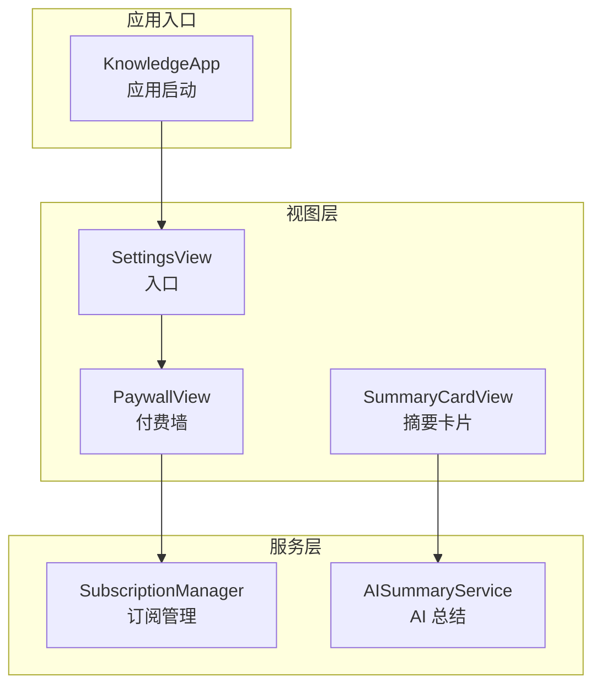
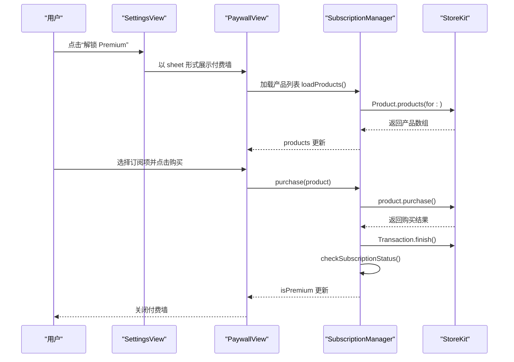
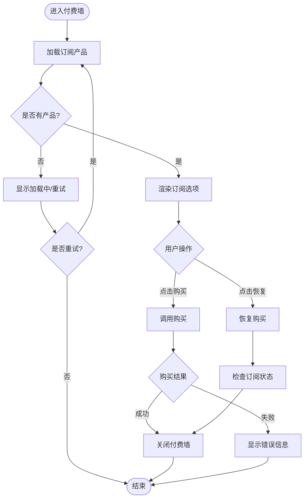
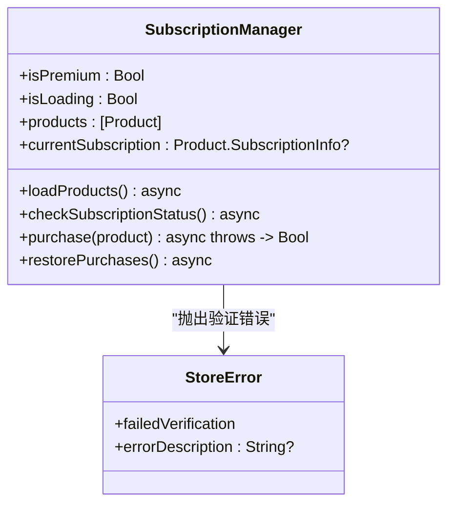
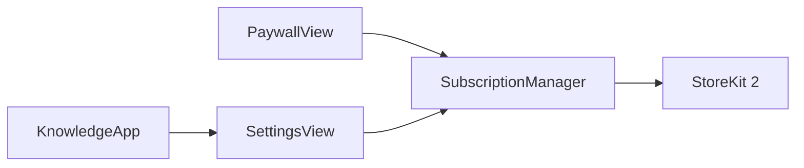

# 付费墙界面

<cite>
**本文引用的文件**
- [PaywallView.swift](file://Views/PaywallView.swift)
- [SubscriptionManager.swift](file://Services/SubscriptionManager.swift)
- [SettingsView.swift](file://Views/SettingsView.swift)
- [AISummaryService.swift](file://Services/AISummaryService.swift)
- [SpeakerViewModel.swift](file://ViewModels/SpeakerViewModel.swift)
- [SummaryCardView.swift](file://Views/SummaryCardView.swift)
- [KnowledgeApp.swift](file://App/KnowledgeApp.swift)
</cite>

## 目录
1. [简介](#简介)
2. [项目结构](#项目结构)
3. [核心组件](#核心组件)
4. [架构总览](#架构总览)
5. [详细组件分析](#详细组件分析)
6. [依赖分析](#依赖分析)
7. [性能考虑](#性能考虑)
8. [故障排查指南](#故障排查指南)
9. [结论](#结论)

## 简介
本文件聚焦于“付费墙界面”的实现与集成，围绕以下目标展开：
- 展示 Premium 订阅权益、加载 App Store 产品列表、发起购买与恢复购买
- 在设置页引导用户进入付费墙，并在购买成功后关闭并刷新状态
- 将付费墙与 AI 功能（摘要、伴读、高品质音色）的访问控制进行解耦设计说明

## 项目结构
付费墙相关代码主要分布在 Views 与 Services 层：
- 视图层：PaywallView 负责 UI 与交互；SettingsView 提供入口
- 服务层：SubscriptionManager 封装 StoreKit 2 的订阅检查、购买与恢复
- 业务层：AI 功能通过 AISummaryService 暴露接口，当前实现未内置权限校验，可在上层统一接入权限判断

图表来源
- [SettingsView.swift:225-227](file://Views/SettingsView.swift#L225-L227)
- [PaywallView.swift:12-80](file://Views/PaywallView.swift#L12-L80)
- [SubscriptionManager.swift:44-101](file://Services/SubscriptionManager.swift#L44-L101)
- [AISummaryService.swift:20-23](file://Services/AISummaryService.swift#L20-L23)
- [KnowledgeApp.swift:20-27](file://App/KnowledgeApp.swift#L20-L27)

章节来源
- [SettingsView.swift:225-227](file://Views/SettingsView.swift#L225-L227)
- [PaywallView.swift:12-80](file://Views/PaywallView.swift#L12-L80)
- [SubscriptionManager.swift:44-101](file://Services/SubscriptionManager.swift#L44-L101)
- [AISummaryService.swift:20-23](file://Services/AISummaryService.swift#L20-L23)
- [KnowledgeApp.swift:20-27](file://App/KnowledgeApp.swift#L20-L27)

## 核心组件
- PaywallView：展示 Premium 权益、订阅选项、错误提示，调用 SubscriptionManager 完成购买与恢复
- SubscriptionManager：单例，使用 StoreKit 2 加载产品、检查 entitlements、执行购买与恢复
- SettingsView：在“Premium 功能”区域显示已激活或未激活状态，并提供打开付费墙的入口
- AISummaryService：对外暴露生成摘要接口（当前未内置权限校验）
- SpeakerViewModel：聚合播放与 AI 能力，可作为未来权限拦截的统一入口

章节来源
- [PaywallView.swift:12-176](file://Views/PaywallView.swift#L12-L176)
- [SubscriptionManager.swift:8-126](file://Services/SubscriptionManager.swift#L8-L126)
- [SettingsView.swift:44-82](file://Views/SettingsView.swift#L44-L82)
- [AISummaryService.swift:20-23](file://Services/AISummaryService.swift#L20-L23)
- [SpeakerViewModel.swift:200-229](file://ViewModels/SpeakerViewModel.swift#L200-L229)

## 架构总览
付费墙与订阅管理的交互流程如下：

图表来源
- [SettingsView.swift:225-227](file://Views/SettingsView.swift#L225-L227)
- [PaywallView.swift:86-136](file://Views/PaywallView.swift#L86-L136)
- [SubscriptionManager.swift:44-95](file://Services/SubscriptionManager.swift#L44-L95)

## 详细组件分析

### 付费墙视图 PaywallView
- 职责
  - 展示 Premium 权益与订阅选项
  - 处理购买与恢复购买
  - 展示加载与错误状态
- 关键行为
  - 初始化时观察 SubscriptionManager 的状态变化
  - 当 products 为空时提供“重新加载”按钮
  - 购买成功则关闭弹窗并刷新订阅状态
- 交互要点
  - 顶部导航栏提供“关闭”按钮
  - 底部“恢复购买”用于换设备或重装后恢复

图表来源
- [PaywallView.swift:86-136](file://Views/PaywallView.swift#L86-L136)
- [PaywallView.swift:160-175](file://Views/PaywallView.swift#L160-L175)

章节来源
- [PaywallView.swift:12-176](file://Views/PaywallView.swift#L12-L176)

### 订阅管理器 SubscriptionManager
- 职责
  - 维护 isPremium、isLoading、products、currentSubscription 等状态
  - 加载产品、检查订阅状态、执行购买与恢复
- 关键点
  - 使用 @MainActor 保证主线程安全
  - 构造时异步加载产品并检查订阅状态
  - 购买完成后 finish 交易并刷新订阅状态
- 错误处理
  - 定义 StoreError.failedVerification，用于验证失败场景

图表来源
- [SubscriptionManager.swift:8-126](file://Services/SubscriptionManager.swift#L8-L126)

章节来源
- [SubscriptionManager.swift:8-126](file://Services/SubscriptionManager.swift#L8-L126)

### 设置页入口 SettingsView
- 职责
  - 展示 Premium 功能区块
  - 根据 isPremium 切换显示“已激活”或“解锁 Premium”入口
  - 以 sheet 形式弹出 PaywallView
- 关键点
  - 订阅状态来自全局 SubscriptionManager.shared
  - 打开付费墙通过 showPaywall 状态驱动

章节来源
- [SettingsView.swift:44-82](file://Views/SettingsView.swift#L44-L82)
- [SettingsView.swift:225-227](file://Views/SettingsView.swift#L225-L227)

### AI 功能与付费墙的关系
- 现状
  - AISummaryService 暴露 generateSummary 接口，当前未内置权限校验
  - SpeakerViewModel 的 generateSummary 直接调用 AISummaryService
- 建议接入点
  - 在调用前检查 SubscriptionManager.isPremium，若未订阅则弹出付费墙
  - 或在更高层（如 SummaryCardView 触发处）统一拦截

章节来源
- [AISummaryService.swift:20-23](file://Services/AISummaryService.swift#L20-L23)
- [SpeakerViewModel.swift:200-229](file://ViewModels/SpeakerViewModel.swift#L200-L229)
- [SummaryCardView.swift:68-77](file://Views/SummaryCardView.swift#L68-L77)

## 依赖分析
- 视图到服务
  - PaywallView 依赖 SubscriptionManager 获取产品与执行购买
  - SettingsView 依赖 SubscriptionManager 展示订阅状态
- 服务到系统
  - SubscriptionManager 依赖 StoreKit 2 的 Product、Transaction、AppStore
- 应用入口
  - KnowledgeApp 作为应用启动点，注入主题与环境对象

图表来源
- [PaywallView.swift:7-11](file://Views/PaywallView.swift#L7-L11)
- [SettingsView.swift:8-9](file://Views/SettingsView.swift#L8-L9)
- [SubscriptionManager.swift:2-3](file://Services/SubscriptionManager.swift#L2-L3)
- [KnowledgeApp.swift:20-27](file://App/KnowledgeApp.swift#L20-L27)

章节来源
- [PaywallView.swift:7-11](file://Views/PaywallView.swift#L7-L11)
- [SettingsView.swift:8-9](file://Views/SettingsView.swift#L8-L9)
- [SubscriptionManager.swift:2-3](file://Services/SubscriptionManager.swift#L2-L3)
- [KnowledgeApp.swift:20-27](file://App/KnowledgeApp.swift#L20-L27)

## 性能考虑
- 产品加载与状态检查在后台异步执行，避免阻塞 UI
- 购买流程中尽快 finish 交易，减少重复回调
- 建议在调用 AI 功能前缓存 isPremium 状态，减少频繁读取

## 故障排查指南
- 产品未加载
  - 现象：付费墙显示“订阅信息加载中，请稍后重试”，并提供“重新加载”
  - 排查：确认 App Store Connect 已配置订阅产品 ID，网络可用
- 购买失败
  - 现象：显示“购买失败：...”
  - 排查：检查 StoreError.failedVerification 是否被抛出，确认交易验证逻辑
- 恢复购买无效
  - 现象：恢复后仍为非 Premium
  - 排查：确认 AppStore.sync() 成功，再次检查 currentEntitlements

章节来源
- [PaywallView.swift:90-105](file://Views/PaywallView.swift#L90-L105)
- [PaywallView.swift:160-175](file://Views/PaywallView.swift#L160-L175)
- [SubscriptionManager.swift:98-101](file://Services/SubscriptionManager.swift#L98-L101)
- [SubscriptionManager.swift:105-112](file://Services/SubscriptionManager.swift#L105-L112)

## 结论
- 付费墙界面清晰展示了 Premium 权益与订阅选项，并通过 SubscriptionManager 与 StoreKit 2 完成购买与恢复
- 当前 AI 功能尚未内置权限校验，建议在调用前统一检查 isPremium 并引导至付费墙
- 后续可结合 SpeakerViewModel 或 SummaryCardView 的触发点，集中实现权限拦截与体验优化