# 播放器界面

<cite>
**本文引用的文件**
- [Views/PlayerView.swift](file://Views/PlayerView.swift)
- [Views/PlayerControlsView.swift](file://Views/PlayerControlsView.swift)
- [Views/ProgressBarView.swift](file://Views/ProgressBarView.swift)
- [Services/HapticService.swift](file://Services/HapticService.swift)
- [Views/CompanionView.swift](file://Views/CompanionView.swift)
- [Views/PaywallView.swift](file://Views/PaywallView.swift)
- [Views/SummaryCardView.swift](file://Views/SummaryCardView.swift)
- [ViewModels/SpeakerViewModel.swift](file://ViewModels/SpeakerViewModel.swift)
- [Models/PlaybackState.swift](file://Models/PlaybackState.swift)
- [Models/VoiceConfig.swift](file://Models/VoiceConfig.swift)
- [Models/Document.swift](file://Models/Document.swift)
- [Models/CompanionMessage.swift](file://Models/CompanionMessage.swift)
- [Services/AudioSessionService.swift](file://Services/AudioSessionService.swift)
- [Services/NowPlayingService.swift](file://Services/NowPlayingService.swift)
- [Services/SpeechService.swift](file://Services/SpeechService.swift)
- [Services/CosyVoiceSynthesizer.swift](file://Services/CosyVoiceSynthesizer.swift)
- [Services/CosyVoiceService.swift](file://Services/CosyVoiceService.swift)
- [Services/CompanionService.swift](file://Services/CompanionService.swift)
- [Services/SubscriptionManager.swift](file://Services/SubscriptionManager.swift)
- [Services/AISummaryService.swift](file://Services/AISummaryService.swift)
- [Views/VoiceSelectView.swift](file://Views/VoiceSelectView.swift)
</cite>

## 更新摘要
**变更内容**
- **视觉设计升级**：播放器控件进行了多项视觉改进，包括速度控制按钮的选择状态优化（选中时显示实心品牌色背景和白色文字）、播放按钮样式增强（实心品牌色圆形和阴影效果），以及语速预设选项精简（移除了0.7x选项，保留1x、1.2x、1.5x、2x四个选项）。主播放器视图也更新了渐变背景使用新的品牌色。

## 目录
1. [简介](#简介)
2. [项目结构](#项目结构)
3. [核心组件](#核心组件)
4. [架构总览](#架构总览)
5. [详细组件分析](#详细组件分析)
6. [依赖关系分析](#依赖关系分析)
7. [性能与体验优化](#性能与体验优化)
8. [故障排查指南](#故障排查指南)
9. [结论](#结论)
10. [附录：扩展与自定义](#附录扩展与自定义)

## 简介
本文件面向"有声阅读器"的播放器界面，系统性说明 PlayerView 与 PlayerControlsView 的核心功能、用户交互设计、播放状态同步、后台播放与锁屏控制集成，并给出语音选择、语速调节、音量控制的 UI 交互说明。**重大更新**：PlayerView实现了革命性的段落级渲染架构，通过将长文档按段落拆分独立渲染，结合精准滚动定位和高亮同步优化，显著提升了长文档的播放性能和用户体验。同时新增AI伴读功能，支持在阅读过程中通过聊天气泡图标进入交互式问答界面，AI会基于当前朗读上下文提供智能回答。**最新UI调整**：AI摘要和伴读按钮已从导航工具栏移至进度条下方的专用功能栏，集成了实时订阅状态检查，为Premium用户提供无缝的AI功能访问体验。**重要升级**：播放器界面现已采用全新的自定义ProgressBarView，提供段落边界可视化指示、智能拖拽交互和全面的触觉反馈系统，为用户带来更加直观和沉浸式的播放体验。**视觉设计升级**：播放器控件进行了多项视觉改进，包括速度控制按钮的选择状态优化、播放按钮样式增强，以及语速预设选项的精简优化。

## 项目结构
播放器相关代码主要分布在 Views、ViewModels、Services 与 Models 四个层次：
- Views：UI 层，包含播放器主视图、控件视图、自定义进度条、AI伴读对话界面和付费墙界面
- ViewModels：业务编排与状态管理，集成伴读功能状态和AI摘要生成
- Services：音频会话、远程控制、TTS 引擎适配、网络服务、AI伴读服务、触觉反馈与订阅管理
- Models：数据模型与配置，新增伴读消息模型

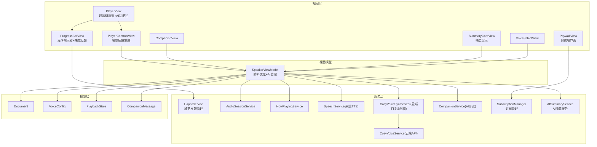

**图表来源**
- [Views/PlayerView.swift:1-329](file://Views/PlayerView.swift#L1-L329)
- [Views/PlayerControlsView.swift:1-85](file://Views/PlayerControlsView.swift#L1-L85)
- [Views/ProgressBarView.swift:1-110](file://Views/ProgressBarView.swift#L1-L110)
- [Services/HapticService.swift:1-69](file://Services/HapticService.swift#L1-L69)
- [Views/CompanionView.swift:1-200](file://Views/CompanionView.swift#L1-L200)
- [Views/PaywallView.swift:1-181](file://Views/PaywallView.swift#L1-L181)
- [Views/SummaryCardView.swift:1-197](file://Views/SummaryCardView.swift#L1-L197)
- [ViewModels/SpeakerViewModel.swift:1-399](file://ViewModels/SpeakerViewModel.swift#L1-L399)
- [Services/AudioSessionService.swift:1-46](file://Services/AudioSessionService.swift#L1-L46)
- [Services/NowPlayingService.swift:1-57](file://Services/NowPlayingService.swift#L1-L57)
- [Services/SpeechService.swift:1-155](file://Services/SpeechService.swift#L1-L155)
- [Services/CosyVoiceSynthesizer.swift:1-258](file://Services/CosyVoiceSynthesizer.swift#L1-L258)
- [Services/CosyVoiceService.swift:1-219](file://Services/CosyVoiceService.swift#L1-L219)
- [Services/CompanionService.swift:1-114](file://Services/CompanionService.swift#L1-L114)
- [Services/SubscriptionManager.swift:1-127](file://Services/SubscriptionManager.swift#L1-L127)
- [Services/AISummaryService.swift:1-90](file://Services/AISummaryService.swift#L1-L90)
- [Models/Document.swift:1-115](file://Models/Document.swift#L1-L115)
- [Models/VoiceConfig.swift:1-71](file://Models/VoiceConfig.swift#L1-L71)
- [Models/PlaybackState.swift:1-9](file://Models/PlaybackState.swift#L1-L9)
- [Models/CompanionMessage.swift:1-11](file://Models/CompanionMessage.swift#L1-L11)

**章节来源**
- [Views/PlayerView.swift:1-329](file://Views/PlayerView.swift#L1-L329)
- [Views/PlayerControlsView.swift:1-85](file://Views/PlayerControlsView.swift#L1-L85)
- [Views/ProgressBarView.swift:1-110](file://Views/ProgressBarView.swift#L1-L110)
- [Services/HapticService.swift:1-69](file://Services/HapticService.swift#L1-L69)
- [Views/CompanionView.swift:1-200](file://Views/CompanionView.swift#L1-L200)
- [Views/PaywallView.swift:1-181](file://Views/PaywallView.swift#L1-L181)
- [Views/SummaryCardView.swift:1-197](file://Views/SummaryCardView.swift#L1-L197)
- [ViewModels/SpeakerViewModel.swift:1-399](file://ViewModels/SpeakerViewModel.swift#L1-L399)
- [Services/AudioSessionService.swift:1-46](file://Services/AudioSessionService.swift#L1-L46)
- [Services/NowPlayingService.swift:1-57](file://Services/NowPlayingService.swift#L1-L57)
- [Services/SpeechService.swift:1-155](file://Services/SpeechService.swift#L1-L155)
- [Services/CosyVoiceSynthesizer.swift:1-258](file://Services/CosyVoiceSynthesizer.swift#L1-L258)
- [Services/CosyVoiceService.swift:1-219](file://Services/CosyVoiceService.swift#L1-L219)
- [Services/CompanionService.swift:1-114](file://Services/CompanionService.swift#L1-L114)
- [Services/SubscriptionManager.swift:1-127](file://Services/SubscriptionManager.swift#L1-L127)
- [Services/AISummaryService.swift:1-90](file://Services/AISummaryService.swift#L1-L90)
- [Models/Document.swift:1-115](file://Models/Document.swift#L1-L115)
- [Models/VoiceConfig.swift:1-71](file://Models/VoiceConfig.swift#L1-L71)
- [Models/PlaybackState.swift:1-9](file://Models/PlaybackState.swift#L1-L9)
- [Models/CompanionMessage.swift:1-11](file://Models/CompanionMessage.swift#L1-L11)

## 核心组件
- **PlayerView**：播放器主界面，采用**段落级渲染架构**，负责文档信息展示、智能文本分段、精准滚动跟随、**自定义进度条与底部控制区布局**，以及**新增的AI功能栏和付费墙集成**。重大改进：实现LazyVStack段落渲染、ScrollViewReader精确定位、防抖高亮同步；**最新UI调整**：将AI功能按钮移至进度条下方的专用功能栏，集成订阅状态检查；**重要升级**：采用自定义ProgressBarView替代默认Slider，提供段落边界指示器和触觉反馈；**视觉升级**：使用新的品牌色渐变背景提升视觉效果。
- **ProgressBarView**：**全新组件** - 自定义进度条实现，支持段落边界可视化标记、拖拽时手柄动画扩展、智能段落边界检测和触觉反馈集成。
- **PlayerControlsView**：播放控制按钮与快捷语速切换，提供播放/暂停、前进后退、快速语速预设等交互，**全面集成触觉反馈系统**；**视觉升级**：速度控制按钮选中状态优化为实心品牌色背景和白色文字，播放按钮采用实心品牌色圆形和阴影效果，语速预设选项精简为1x、1.2x、1.5x、2x四个选项。
- **HapticService**：**新增服务** - 统一管理应用内所有触觉反馈，预初始化多种反馈类型避免延迟，提供统一的触觉反馈接口。
- **CompanionView**：AI伴读对话界面，支持实时问答、快捷问题、对话历史管理与自动滚动。
- **PaywallView**：付费墙界面，展示Premium功能列表、订阅选项和购买流程，支持恢复购买功能。
- **SummaryCardView**：AI摘要展示卡片，包含摘要正文、关键要点列表和朗读操作。
- **SpeakerViewModel**：统一编排播放流程、状态同步、远程控制绑定、配置持久化与错误降级。重要优化：引入highlightDebounceTimer防抖机制，减少频繁UI更新；新增伴读状态管理、对话消息维护、上下文提取与AI问答接口；集成AI摘要生成功能。
- **SubscriptionManager**：订阅管理器，使用StoreKit 2实现Premium订阅状态检查、产品加载、购买流程和恢复购买功能。
- **AudioSessionService**：集中管理 AVAudioSession 的配置、激活与停用，确保后台播放、蓝牙与 AirPlay 可用。
- **NowPlayingService**：对接系统媒体中心，更新锁屏/控制中心信息与远程命令（播放/暂停、快进/快退）。
- **SpeechService**：系统 TTS 引擎实现，按字符段推进朗读，回调位置与范围以驱动 UI 高亮。
- **CosyVoiceSynthesizer**：云端 TTS 适配器，分段合成并流式播放，估算位置并回调 UI。
- **CompanionService**：AI伴读服务，基于通义千问提供智能问答，携带当前朗读上下文进行多轮对话。
- **AISummaryService**：AI摘要服务，通过服务器中转调用通义千问生成文档摘要和关键要点。
- **VoiceSelectView**：音色选择页，支持预设音色与克隆音色选择、试听与保存选择。

**章节来源**
- [Views/PlayerView.swift:1-329](file://Views/PlayerView.swift#L1-L329)
- [Views/PlayerControlsView.swift:1-85](file://Views/PlayerControlsView.swift#L1-L85)
- [Views/ProgressBarView.swift:1-110](file://Views/ProgressBarView.swift#L1-L110)
- [Services/HapticService.swift:1-69](file://Services/HapticService.swift#L1-L69)
- [Views/CompanionView.swift:1-200](file://Views/CompanionView.swift#L1-L200)
- [Views/PaywallView.swift:1-181](file://Views/PaywallView.swift#L1-L181)
- [Views/SummaryCardView.swift:1-197](file://Views/SummaryCardView.swift#L1-L197)
- [ViewModels/SpeakerViewModel.swift:1-399](file://ViewModels/SpeakerViewModel.swift#L1-L399)
- [Services/SubscriptionManager.swift:1-127](file://Services/SubscriptionManager.swift#L1-L127)
- [Services/AISummaryService.swift:1-90](file://Services/AISummaryService.swift#L1-L90)
- [Services/AudioSessionService.swift:1-46](file://Services/AudioSessionService.swift#L1-L46)
- [Services/NowPlayingService.swift:1-57](file://Services/NowPlayingService.swift#L1-L57)
- [Services/SpeechService.swift:1-155](file://Services/SpeechService.swift#L1-L155)
- [Services/CosyVoiceSynthesizer.swift:1-258](file://Services/CosyVoiceSynthesizer.swift#L1-L258)
- [Services/CompanionService.swift:1-114](file://Services/CompanionService.swift#L1-L114)
- [Views/VoiceSelectView.swift:1-215](file://Views/VoiceSelectView.swift#L1-L215)

## 架构总览
播放器采用 MVVM + Service 分层，重大架构升级：
- 视图层通过 @ObservedObject 订阅 ViewModel 的 Published 属性，实现响应式 UI 更新。
- ViewModel 聚合多个 Service，屏蔽底层差异，对外暴露统一的播放控制接口。
- 两个 TTS 引擎（系统/云端）通过同一协议接入，便于运行时切换与错误降级。
- 远程控制由 NowPlayingService 统一注册，事件回调到 ViewModel，再转发到底层引擎。
- AI伴读功能通过独立的 CompanionService 提供服务，支持多轮对话与上下文感知。
- AI摘要功能通过 AISummaryService 提供服务，支持异步生成和缓存。
- 订阅管理通过 SubscriptionManager 统一管理Premium状态，实现功能门控。
- **触觉反馈系统**：**新增架构** - HapticService 作为全局单例，为所有交互元素提供一致的触觉反馈体验。
- **自定义进度条**：**重要升级** - ProgressBarView 替代默认 Slider，提供段落边界指示和智能拖拽交互。
- 性能优化：引入段落级渲染和防抖机制，大幅提升长文档处理效率。
- **商业化集成**：**最新UI调整** - AI功能栏位于进度条下方，付费墙机制无缝集成到AI功能入口，提供清晰的升级引导。
- **视觉设计升级**：**最新改进** - 播放器控件采用更现代的品牌色设计，提升整体视觉一致性和用户体验。

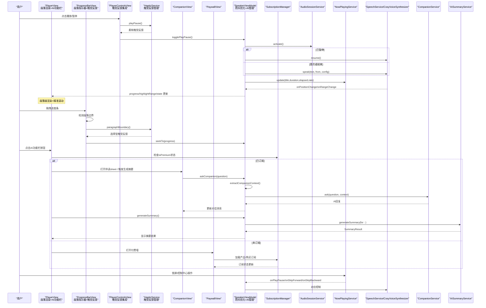

**图表来源**
- [Views/PlayerView.swift:1-329](file://Views/PlayerView.swift#L1-L329)
- [Views/PlayerControlsView.swift:1-85](file://Views/PlayerControlsView.swift#L1-L85)
- [Views/ProgressBarView.swift:1-110](file://Views/ProgressBarView.swift#L1-L110)
- [Services/HapticService.swift:1-69](file://Services/HapticService.swift#L1-L69)
- [Views/CompanionView.swift:1-200](file://Views/CompanionView.swift#L1-L200)
- [Views/PaywallView.swift:1-181](file://Views/PaywallView.swift#L1-L181)
- [ViewModels/SpeakerViewModel.swift:1-399](file://ViewModels/SpeakerViewModel.swift#L1-L399)
- [Services/SubscriptionManager.swift:1-127](file://Services/SubscriptionManager.swift#L1-L127)
- [Services/AISummaryService.swift:1-90](file://Services/AISummaryService.swift#L1-L90)
- [Services/AudioSessionService.swift:1-46](file://Services/AudioSessionService.swift#L1-L46)
- [Services/NowPlayingService.swift:1-57](file://Services/NowPlayingService.swift#L1-L57)
- [Services/SpeechService.swift:1-155](file://Services/SpeechService.swift#L1-L155)
- [Services/CosyVoiceSynthesizer.swift:1-258](file://Services/CosyVoiceSynthesizer.swift#L1-L258)
- [Services/CompanionService.swift:1-114](file://Services/CompanionService.swift#L1-L114)

## 详细组件分析

### PlayerView 分析与交互设计
**重大架构升级与最新UI调整**：实现段落级渲染、精准滚动定位、AI功能栏和付费墙集成，**重要升级**：采用自定义ProgressBarView提供增强的进度条体验，**视觉升级**：使用新的品牌色渐变背景提升视觉效果

- **顶部标题栏**：显示"正在播放"，工具栏区域用于后续扩展。
- **文档头部**：展示文件名、类型图标与长度信息，**视觉升级**：使用LinearGradient实现品牌色渐变背景，从accentColor.opacity(0.8)到accentColor.opacity(0.4)。
- **段落级文本区域**：**全新架构** - 使用 `splitIntoParagraphs` 方法将文本按 `\n\n` 或 `\n` 智能分段，每段独立渲染为 LazyVStack 元素，支持精准滚动跟随。
- **精准滚动机制**：通过 ScrollViewReader 和 id 标识符实现段落级别的平滑滚动，当高亮范围变化时自动滚动到对应段落顶部。
- **智能高亮算法**：为每个段落单独计算高亮范围，仅对当前段落内的交集部分应用前景色、背景色与加粗字体，避免全量重绘。
- **自定义进度条**：**重要升级** - 使用 ProgressBarView 替代默认 Slider，支持段落边界可视化标记、拖拽时手柄动画扩展和智能段落边界检测。
- **AI功能栏**：**最新UI调整** - 位于进度条下方，包含"AI 总结"和"AI 伴读"两个按钮，始终可见但受付费墙门控。
- **付费墙集成**：**重大更新** - 点击AI功能按钮时检查 subscriptionManager.isPremium 状态，非Premium用户显示付费墙界面。
- **控制区**：嵌入 PlayerControlsView，承载播放/暂停、前后跳与快捷语速，**全面集成触觉反馈**。
- **空状态**：无文档时展示引导文案与图标。
- **AI伴读sheet覆盖层**：打开时自动暂停朗读，退出时恢复播放。

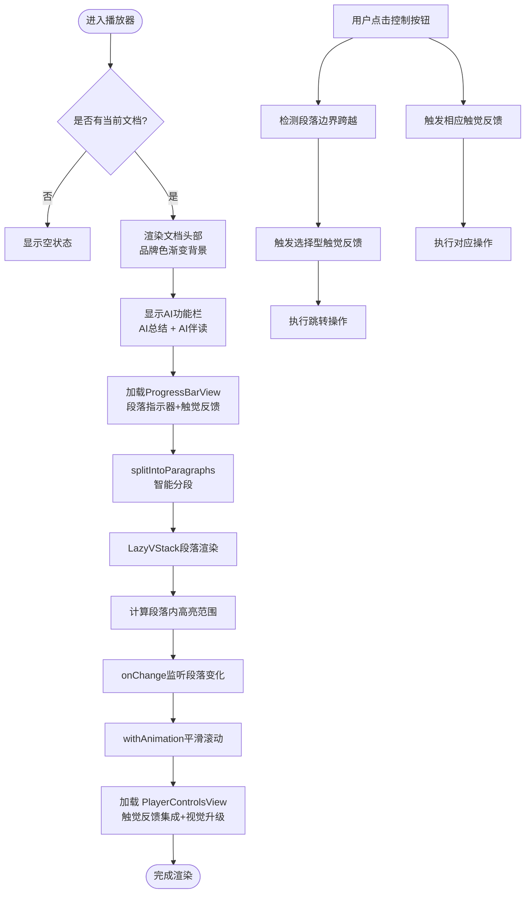

**图表来源**
- [Views/PlayerView.swift:94-109](file://Views/PlayerView.swift#L94-L109)
- [Views/ProgressBarView.swift:17-76](file://Views/ProgressBarView.swift#L17-L76)
- [Views/PlayerControlsView.swift:9-52](file://Views/PlayerControlsView.swift#L9-L52)

**章节来源**
- [Views/PlayerView.swift:1-329](file://Views/PlayerView.swift#L1-L329)

### ProgressBarView 自定义进度条组件
**全新组件**：提供段落边界可视化、智能拖拽交互和触觉反馈集成的自定义进度条

- **段落边界指示器**：在进度条上以小竖线标记段落边界位置，帮助用户了解文档结构。
- **拖拽交互增强**：支持流畅的拖拽操作，拖拽时手柄从12px扩展到16px，提供视觉反馈。
- **智能段落边界检测**：实时检测拖拽是否跨越段落边界，跨过时自动触发选择型触觉反馈。
- **动画效果**：使用弹簧动画(.spring(response: 0.2, dampingFraction: 0.7))实现手柄大小变化的平滑过渡。
- **触觉反馈集成**：通过 HapticService 提供段落边界跨越时的选择型触觉反馈。
- **进度显示**：支持实时进度显示和最终跳转操作，拖动结束时调用 onSeek 回调。
- **视觉设计**：采用胶囊形状的背景轨道和进度条，段落标记使用半透明灰色，手柄带有阴影效果。

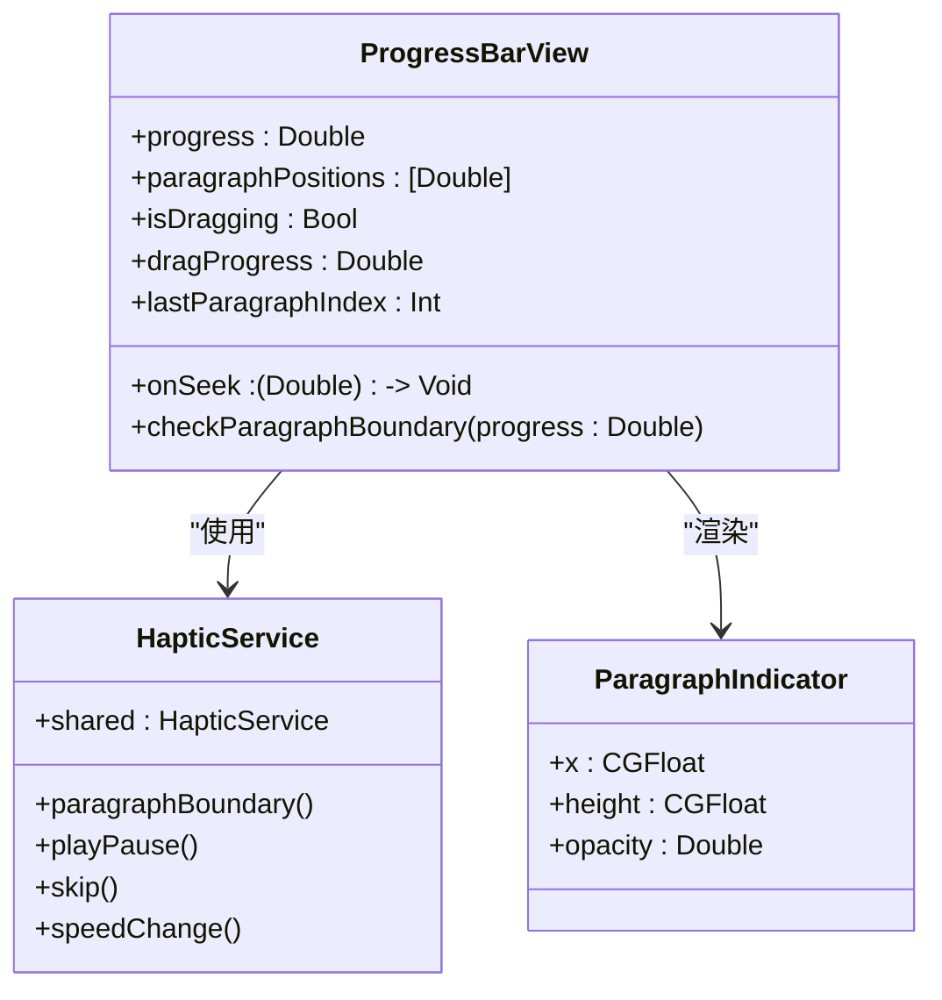

**图表来源**
- [Views/ProgressBarView.swift:6-98](file://Views/ProgressBarView.swift#L6-L98)
- [Services/HapticService.swift:6-69](file://Services/HapticService.swift#L6-L69)

**章节来源**
- [Views/ProgressBarView.swift:1-110](file://Views/ProgressBarView.swift#L1-L110)

### PlayerControlsView 控件布局与手势
**重要升级**：全面集成触觉反馈系统，为所有交互元素提供差异化触觉反馈，**视觉设计升级**：速度控制按钮选择状态优化、播放按钮样式增强、语速预设选项精简

- **主控制按钮**：后退 15 秒、播放/暂停、前进 30 秒，大小与图标区分主次，**集成触觉反馈**；**视觉升级**：大按钮采用实心品牌色圆形背景和阴影效果，小按钮保持简洁设计。
- **触觉反馈集成**：
  - **快进后退按钮**：触发轻触反馈(haptic.skip())，提供轻微的物理感反馈
  - **播放暂停按钮**：触发柔和反馈(haptic.playPause())，提供温和的确认感
  - **语速预设按钮**：切换时触发刚性反馈(haptic.speedChange())，提供明确的档位切换感
- **快捷语速**：**视觉升级** - 语速预设选项精简为1x、1.2x、1.5x、2x四个常用档位，移除了0.7x选项；**交互优化** - 选中态以实心品牌色背景(Color.accentColor)和白色文字(.white)高亮显示，未选中态使用浅色背景(.primary.opacity(0.05))和次要文字(.secondary)。
- **交互方式**：纯点击，**全面集成触觉反馈**；如需增强可在该视图中添加手势识别器并回调至 ViewModel。

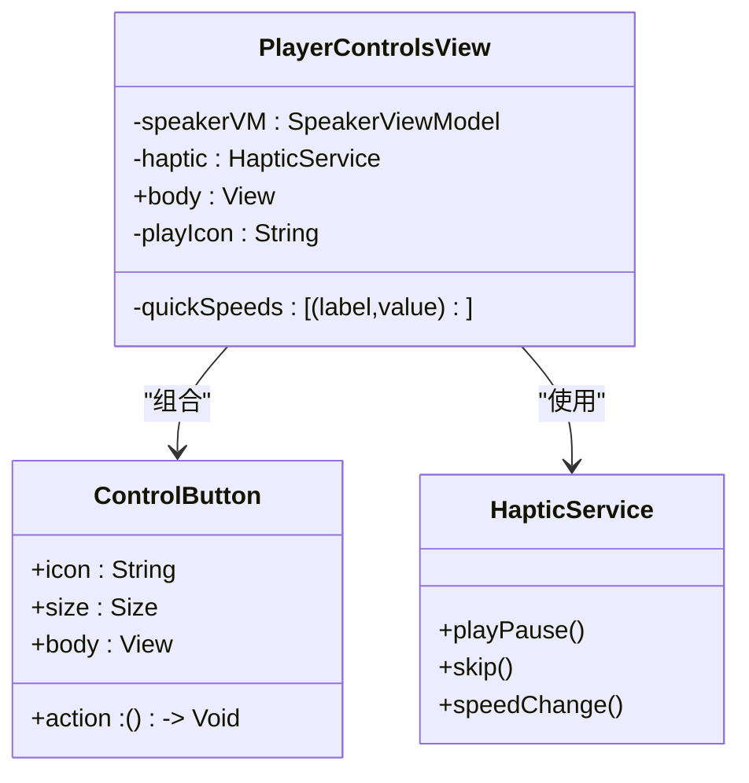

**图表来源**
- [Views/PlayerControlsView.swift:4-85](file://Views/PlayerControlsView.swift#L4-L85)
- [Services/HapticService.swift:6-69](file://Services/HapticService.swift#L6-L69)

**章节来源**
- [Views/PlayerControlsView.swift:1-85](file://Views/PlayerControlsView.swift#L1-L85)

### HapticService 触觉反馈服务
**新增服务**：统一管理应用内所有触觉反馈，提供预初始化的反馈生成器

- **预初始化机制**：在初始化时预热所有反馈生成器，避免首次触发延迟，提升响应速度。
- **多样化反馈类型**：
  - **柔和反馈**：用于播放/暂停操作，提供温和的确认感
  - **轻触反馈**：用于快进/快退操作，提供轻微的物理感
  - **刚性反馈**：用于语速切换操作，提供明确的档位切换感
  - **选择反馈**：用于段落边界跨越，提供选择型触觉提示
  - **通知反馈**：用于操作成功/失败，提供状态反馈
- **资源管理**：每次触发后自动准备下一次使用，确保反馈的及时性和一致性。
- **单例模式**：通过 shared 属性提供全局访问，避免重复创建实例。

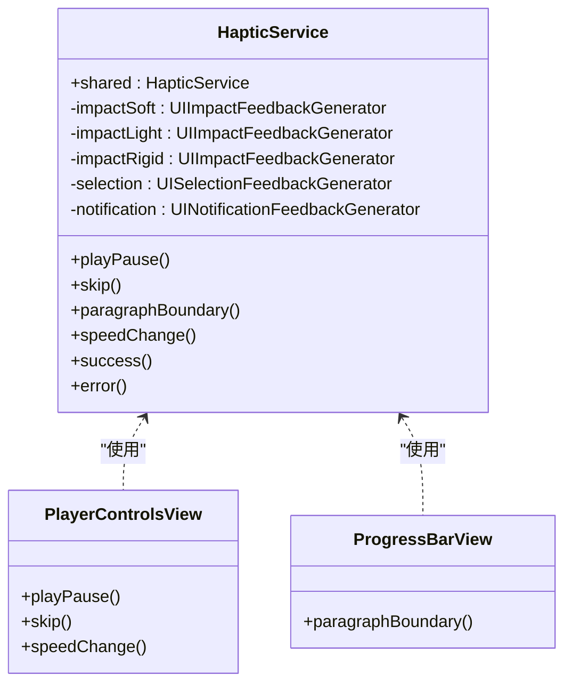

**图表来源**
- [Services/HapticService.swift:6-69](file://Services/HapticService.swift#L6-L69)
- [Views/PlayerControlsView.swift:4-85](file://Views/PlayerControlsView.swift#L4-L85)
- [Views/ProgressBarView.swift:6-98](file://Views/ProgressBarView.swift#L6-L98)

**章节来源**
- [Services/HapticService.swift:1-69](file://Services/HapticService.swift#L1-L69)

### CompanionView AI伴读对话界面
- 导航栏：显示"AI 伴读"标题，左侧"继续听"按钮关闭sheet，右侧菜单支持清空对话。
- 消息列表：支持欢迎语、用户消息气泡、AI回复气泡与加载状态指示器。
- 快捷问题：提供预设问题按钮，如"这段讲了什么？"、"解释一下关键概念"。
- 输入栏：支持多行文本输入、回车发送、发送按钮状态管理。
- 自动滚动：新消息到达时自动滚动到底部。
- 播放控制：进入时暂停朗读，退出时自动恢复播放。

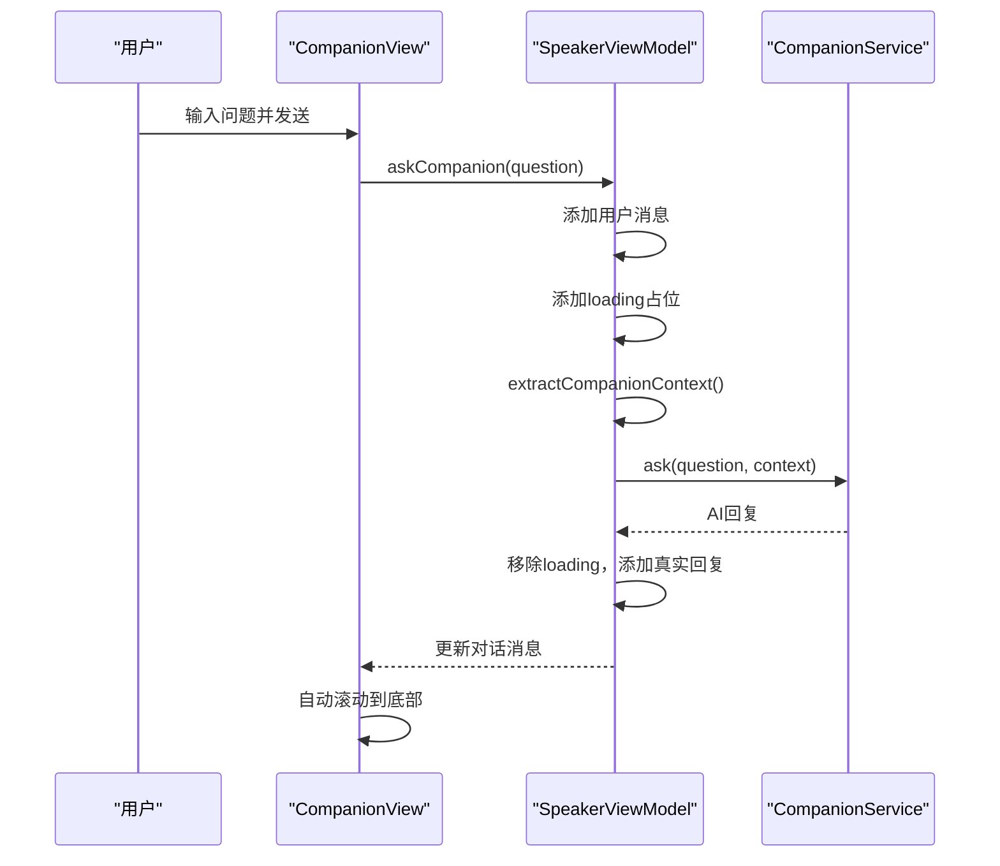

**图表来源**
- [Views/CompanionView.swift:1-200](file://Views/CompanionView.swift#L1-L200)
- [ViewModels/SpeakerViewModel.swift:242-290](file://ViewModels/SpeakerViewModel.swift#L242-L290)
- [Services/CompanionService.swift:1-114](file://Services/CompanionService.swift#L1-L114)

**章节来源**
- [Views/CompanionView.swift:1-200](file://Views/CompanionView.swift#L1-L200)

### PaywallView 付费墙界面
**新增组件**：完整的付费墙实现，提供Premium功能展示和购买流程

- **功能展示**：展示AI智能总结、AI伴读、AI高品质音色、语音克隆等Premium专属功能。
- **订阅选项**：动态加载App Store Connect配置的订阅产品，支持月订阅和年订阅。
- **购买流程**：集成StoreKit 2购买流程，支持交易验证和状态同步。
- **恢复购买**：支持用户恢复之前的购买记录。
- **错误处理**：完善的错误提示和重试机制。
- **用户体验**：精美的渐变配色、动画效果和清晰的视觉层级。

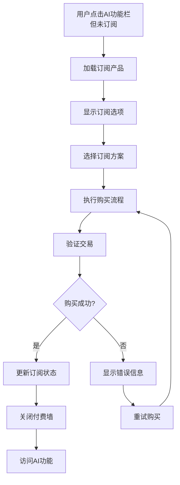

**图表来源**
- [Views/PaywallView.swift:85-136](file://Views/PaywallView.swift#L85-L136)
- [Views/PaywallView.swift:160-175](file://Views/PaywallView.swift#L160-L175)
- [Services/SubscriptionManager.swift:72-95](file://Services/SubscriptionManager.swift#L72-L95)

**章节来源**
- [Views/PaywallView.swift:1-181](file://Views/PaywallView.swift#L1-L181)

### SummaryCardView AI摘要展示
**新增组件**：AI摘要结果的精美展示界面

- **摘要正文**：以卡片形式展示AI生成的文档摘要内容。
- **关键要点**：结构化展示文档的关键要点，支持编号列表格式。
- **朗读功能**：提供一键朗读摘要的操作按钮。
- **状态管理**：支持加载中、错误处理和重试机制。
- **视觉效果**：渐变色主题、圆角卡片设计和优雅的排版布局。

**章节来源**
- [Views/SummaryCardView.swift:1-197](file://Views/SummaryCardView.swift#L1-L197)

### SpeakerViewModel 播放控制与状态同步
**重要性能优化**：引入防抖机制、AI伴读功能和AI摘要生成

- **状态机**：基于 PlaybackState（空闲/播放/暂停/结束），通过 Timer 轮询底层引擎状态变化，驱动 UI 更新。
- **播放流程**：
  - play/pause/stop/replay：封装底层引擎调用，并在合适时机激活/停用 AudioSession。
  - skipForward/skipBackward：按字符数换算跳转距离，重新 speak。
  - seekTo：根据进度百分比计算目标字符位置，若处于播放中则重启 speak，否则仅更新进度与持久化。
- **配置更新**：updateConfig 会持久化 VoiceConfig，并在播放中无缝切换新配置（停止后从当前位置继续）。
- **引擎切换**：switchEngine 在运行时替换底层引擎实例，保持当前进度继续播放。
- **错误处理**：当云端引擎报错时，自动降级到系统 TTS，并更新配置与绑定。
- **远程控制**：将 NowPlayingService 的回调映射到本地控制方法，保证锁屏/控制中心一致行为。
- **位置与高亮**：onPositionChange 更新 progress 与时间文本；**防抖优化**：onRangeChange 使用 highlightDebounceTimer 延迟100ms更新，避免频繁UI刷新。
- **AI伴读功能**：完整的伴读状态管理，包括对话消息数组、询问状态标志、播放暂停标记等。
- **AI摘要功能**：摘要生成状态管理、错误处理、缓存机制和朗读功能。
- **上下文提取**：智能提取当前朗读位置前后500字作为AI问答的上下文背景。

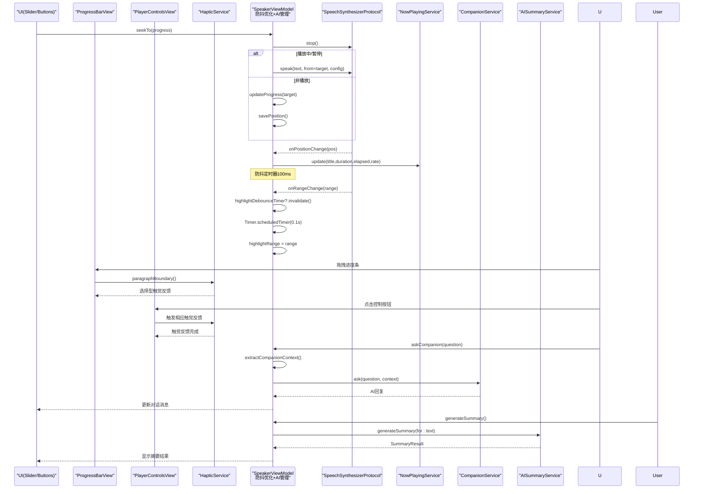

**图表来源**
- [ViewModels/SpeakerViewModel.swift:294-351](file://ViewModels/SpeakerViewModel.swift#L294-L351)
- [ViewModels/SpeakerViewModel.swift:242-290](file://ViewModels/SpeakerViewModel.swift#L242-L290)
- [ViewModels/SpeakerViewModel.swift:200-237](file://ViewModels/SpeakerViewModel.swift#L200-L237)
- [Services/NowPlayingService.swift:1-57](file://Services/NowPlayingService.swift#L1-L57)
- [Services/CompanionService.swift:1-114](file://Services/CompanionService.swift#L1-L114)
- [Services/AISummaryService.swift:20-23](file://Services/AISummaryService.swift#L20-L23)
- [Services/HapticService.swift:1-69](file://Services/HapticService.swift#L1-L69)

**章节来源**
- [ViewModels/SpeakerViewModel.swift:1-399](file://ViewModels/SpeakerViewModel.swift#L1-L399)

### SubscriptionManager 订阅管理
**新增组件**：完整的订阅管理系统，使用StoreKit 2实现

- **订阅状态检查**：实时监控用户的Premium订阅状态，支持当前交易验证和过期检查。
- **产品管理**：动态加载App Store Connect配置的订阅产品，支持多种订阅方案。
- **购买流程**：完整的购买流程实现，包括交易验证、完成交易和状态同步。
- **恢复购买**：支持用户在不同设备间恢复购买记录。
- **错误处理**：完善的错误类型定义和用户友好的错误提示。
- **异步架构**：基于Swift Concurrency的异步API设计，提供更好的用户体验。

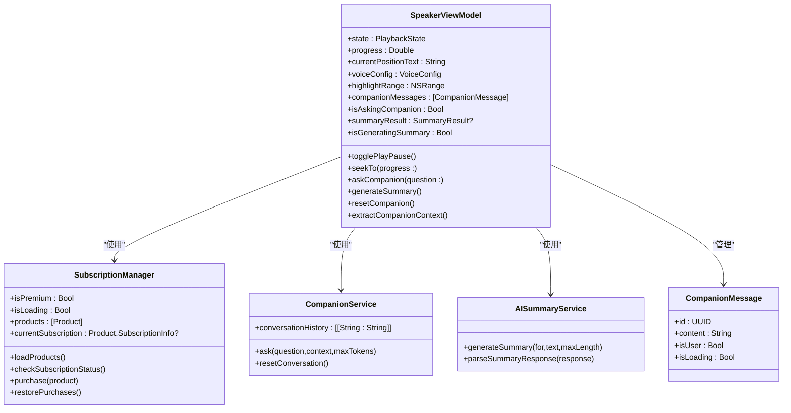

**图表来源**
- [ViewModels/SpeakerViewModel.swift:36-44](file://ViewModels/SpeakerViewModel.swift#L36-L44)
- [Services/SubscriptionManager.swift:1-127](file://Services/SubscriptionManager.swift#L1-L127)
- [Services/CompanionService.swift:1-114](file://Services/CompanionService.swift#L1-L114)
- [Models/CompanionMessage.swift:1-11](file://Models/CompanionMessage.swift#L1-L11)
- [Services/AISummaryService.swift:1-90](file://Services/AISummaryService.swift#L1-L90)

**章节来源**
- [Services/SubscriptionManager.swift:1-127](file://Services/SubscriptionManager.swift#L1-L127)
- [Services/CompanionService.swift:1-114](file://Services/CompanionService.swift#L1-L114)
- [Models/CompanionMessage.swift:1-11](file://Models/CompanionMessage.swift#L1-L11)
- [Services/AISummaryService.swift:1-90](file://Services/AISummaryService.swift#L1-L90)

### AI伴读服务实现
- **CompanionService**：单例服务，基于通义千问API提供智能问答功能。
- **上下文感知**：自动提取当前朗读位置前后500字作为对话上下文。
- **多轮对话**：维护对话历史，最多保留最近10轮对话记录。
- **错误处理**：支持API Key验证、网络错误、服务器错误等多种异常场景。
- **角色设定**：内置专业的阅读伴读助手提示词，要求简洁口语化的回答风格。

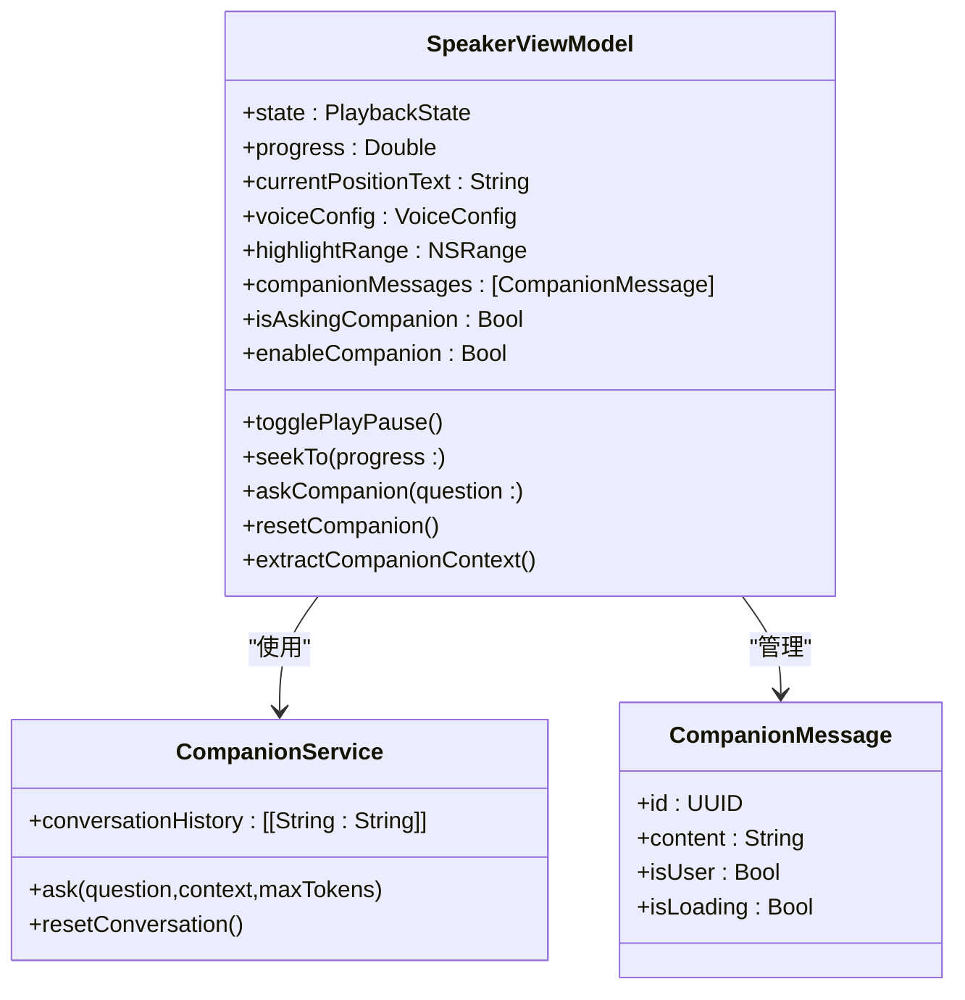

**图表来源**
- [ViewModels/SpeakerViewModel.swift:36-44](file://ViewModels/SpeakerViewModel.swift#L36-L44)
- [Services/CompanionService.swift:1-114](file://Services/CompanionService.swift#L1-L114)
- [Models/CompanionMessage.swift:1-11](file://Models/CompanionMessage.swift#L1-L11)

**章节来源**
- [Services/CompanionService.swift:1-114](file://Services/CompanionService.swift#L1-L114)
- [Models/CompanionMessage.swift:1-11](file://Models/CompanionMessage.swift#L1-L11)

### 播放状态与后端集成
- **AudioSessionService**：统一配置 playback 模式，允许蓝牙与 AirPlay，并提供 activate/deactivate 生命周期管理。
- **NowPlayingService**：注册系统远程控制命令，更新锁屏元数据（标题、时长、已播放时间、速率），并将用户操作回调回 ViewModel。
- **引擎实现**：
  - **SpeechService**：系统 TTS，按句读断点切块，回调 willSpeakRangeOfSpeechString 与 didFinish 以驱动位置与高亮。
  - **CosyVoiceSynthesizer**：云端 TTS 适配器，分段合成 MP3，AVAudioPlayer 播放，定时估算位置并回调。

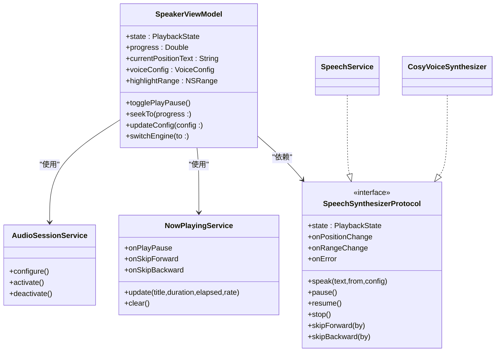

**图表来源**
- [ViewModels/SpeakerViewModel.swift:1-399](file://ViewModels/SpeakerViewModel.swift#L1-L399)
- [Services/AudioSessionService.swift:1-46](file://Services/AudioSessionService.swift#L1-L46)
- [Services/NowPlayingService.swift:1-57](file://Services/NowPlayingService.swift#L1-L57)
- [Services/SpeechService.swift:1-155](file://Services/SpeechService.swift#L1-L155)
- [Services/CosyVoiceSynthesizer.swift:1-258](file://Services/CosyVoiceSynthesizer.swift#L1-L258)

**章节来源**
- [Services/AudioSessionService.swift:1-46](file://Services/AudioSessionService.swift#L1-L46)
- [Services/NowPlayingService.swift:1-57](file://Services/NowPlayingService.swift#L1-L57)
- [Services/SpeechService.swift:1-155](file://Services/SpeechService.swift#L1-L155)
- [Services/CosyVoiceSynthesizer.swift:1-258](file://Services/CosyVoiceSynthesizer.swift#L1-L258)

### 语音选择、语速调节与音量控制
- **语音选择**：VoiceSelectView 支持预设音色与克隆音色列表、单选、删除与试听；选择后更新 voiceConfig.engine 与对应 ID，并通过 switchEngine 切换到云端引擎。
- **语速调节**：**视觉升级** - PlayerControlsView 内置快捷语速按钮，语速预设选项精简为1x、1.2x、1.5x、2x四个常用档位，移除了0.7x选项；**交互优化** - 选中态以实心品牌色背景和白色文字高亮显示；**触觉反馈** - 全面集成触觉反馈；VoiceConfig.speedPresets 提供常用档位；updateConfig 即时生效并在播放中无缝切换。
- **音量控制**：VoiceConfig.volume 字段存在，但当前 UI 未暴露滑块；可在 PlayerControlsView 增加音量滑块并绑定到 voiceConfig.volume，再由引擎应用。

**章节来源**
- [Views/VoiceSelectView.swift:1-215](file://Views/VoiceSelectView.swift#L1-L215)
- [Views/PlayerControlsView.swift:1-85](file://Views/PlayerControlsView.swift#L1-L85)
- [Models/VoiceConfig.swift:1-71](file://Models/VoiceConfig.swift#L1-L71)
- [ViewModels/SpeakerViewModel.swift:1-399](file://ViewModels/SpeakerViewModel.swift#L1-L399)

### 播放队列管理、循环播放与随机播放
- **当前实现**：针对单文档朗读，无多文档队列、循环与随机逻辑。
- **扩展建议**：
  - 在 SpeakerViewModel 引入队列数据结构（如数组）与游标索引，提供 add/remove/clear 等方法。
  - 在 finish 回调中判断是否还有下一项，若有则 loadDocument 并自动播放；若无则根据标志位决定是否从头开始（循环）或随机选取（随机）。
  - 在 UI 层增加"上一首/下一首"、"循环模式"、"随机模式"开关，并与队列逻辑联动。

[本节为概念性内容，不直接分析具体文件]

## 依赖关系分析
- **视图对 ViewModel 的强依赖**：通过 @ObservedObject 订阅状态变更，保证 UI 实时刷新。
- **ViewModel 对服务的松耦合**：通过协议 SpeechSynthesizerProtocol 抽象底层引擎，便于替换与测试。
- **远程控制解耦**：NowPlayingService 仅暴露回调，避免 UI 与系统 API 紧耦合。
- **触觉反馈系统**：**新增架构** - HapticService 作为全局单例，被 PlayerControlsView 和 ProgressBarView 共同使用，提供一致的触觉反馈体验。
- **自定义进度条**：**重要升级** - ProgressBarView 替代默认 Slider，提供段落边界指示和智能拖拽交互。
- **AI伴读功能独立**：通过专用服务提供，不影响现有播放功能。
- **订阅管理集成**：SubscriptionManager 作为全局单例，被多个视图组件使用，实现功能门控。
- **潜在风险**：
  - 云端引擎失败时的降级路径已在 onError 中处理，但仍需关注网络抖动导致的卡顿。
  - 位置估算在云端引擎下为近似值，UI 高亮可能存在轻微偏差。
  - AI伴读需要网络连接，离线环境下无法使用。
  - **段落渲染性能**：超长文档可能导致内存占用增加，需监控 LazyVStack 的渲染性能。
  - **订阅状态同步**：StoreKit 2的状态同步可能存在延迟，需要适当的用户反馈。
  - **触觉反馈兼容性**：不同设备的触觉反馈硬件可能有所不同，需要考虑兼容性问题。

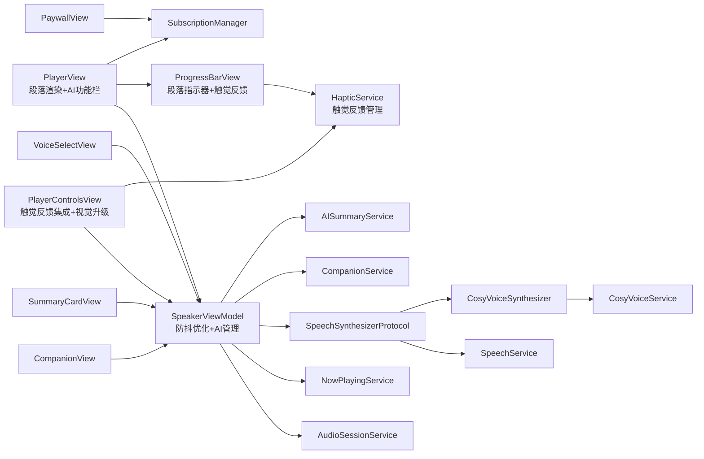

**图表来源**
- [Views/PlayerView.swift:1-329](file://Views/PlayerView.swift#L1-L329)
- [Views/PlayerControlsView.swift:1-85](file://Views/PlayerControlsView.swift#L1-L85)
- [Views/ProgressBarView.swift:1-110](file://Views/ProgressBarView.swift#L1-L110)
- [Services/HapticService.swift:1-69](file://Services/HapticService.swift#L1-L69)
- [Views/CompanionView.swift:1-200](file://Views/CompanionView.swift#L1-L200)
- [Views/PaywallView.swift:1-181](file://Views/PaywallView.swift#L1-L181)
- [Views/SummaryCardView.swift:1-197](file://Views/SummaryCardView.swift#L1-L197)
- [Views/VoiceSelectView.swift:1-215](file://Views/VoiceSelectView.swift#L1-L215)
- [ViewModels/SpeakerViewModel.swift:1-399](file://ViewModels/SpeakerViewModel.swift#L1-L399)
- [Services/SubscriptionManager.swift:1-127](file://Services/SubscriptionManager.swift#L1-L127)
- [Services/AISummaryService.swift:1-90](file://Services/AISummaryService.swift#L1-L90)
- [Services/AudioSessionService.swift:1-46](file://Services/AudioSessionService.swift#L1-L46)
- [Services/NowPlayingService.swift:1-57](file://Services/NowPlayingService.swift#L1-L57)
- [Services/SpeechService.swift:1-155](file://Services/SpeechService.swift#L1-L155)
- [Services/CosyVoiceSynthesizer.swift:1-258](file://Services/CosyVoiceSynthesizer.swift#L1-L258)
- [Services/CosyVoiceService.swift:1-219](file://Services/CosyVoiceService.swift#L1-L219)
- [Services/CompanionService.swift:1-114](file://Services/CompanionService.swift#L1-L114)

**章节来源**
- [ViewModels/SpeakerViewModel.swift:1-399](file://ViewModels/SpeakerViewModel.swift#L1-L399)

## 性能与体验优化
**重大架构升级带来的性能提升**：

- **段落级渲染优化**：
  - 使用 LazyVStack 按需渲染段落，避免一次性加载整个文档。
  - 每段独立计算高亮范围，仅对当前段落内的交集部分应用样式，大幅减少 AttributedString 重绘开销。
  - 大文档可考虑分页渲染或虚拟列表以减少内存占用。

- **精准滚动定位**：
  - 通过 ScrollViewReader 和 id 标识符实现段落级别的精准滚动。
  - 使用 withAnimation(.easeInOut(duration: 0.3)) 提供平滑的滚动动画效果。
  - onChange 监听 activeParagraphIndex 变化，仅在段落切换时触发滚动。

- **防抖高亮同步**：
  - **highlightDebounceTimer**：100ms 防抖机制，避免高频的 onRangeChange 回调导致 UI 频繁更新。
  - 取消之前的定时器后再设置新的定时器，确保只执行最新的更新请求。
  - 系统 TTS 回调粒度较细；云端引擎使用定时器估算，可适当调整间隔平衡精度与功耗。

- **自定义进度条优化**：**重要升级**
  - **段落边界检测**：实时检测拖拽过程中的段落跨越，避免不必要的触觉反馈触发。
  - **动画性能**：使用弹簧动画(.spring)而非缓动动画，提供更自然的交互反馈。
  - **内存管理**：段落位置数组按需计算，避免重复计算开销。
  - **触觉反馈优化**：HapticService 预初始化所有反馈生成器，避免首次触发延迟。

- **触觉反馈系统优化**：**新增架构**
  - **预初始化机制**：在 HapticService 初始化时预热所有反馈生成器，确保即时响应。
  - **差异化反馈**：根据操作类型选择合适的反馈强度，提升用户体验。
  - **资源管理**：每次触发后自动准备下一次使用，避免资源浪费。

- **网络请求优化**：
  - 云端合成采用分段请求，建议在弱网环境下加入重试与缓存策略，减少重复合成。
  - **AI伴读请求**：应加入超时处理和错误重试机制，避免长时间等待。
  - **AI摘要生成**：支持本地缓存，避免重复生成相同内容的摘要。

- **音频资源管理**：
  - 临时文件及时清理，避免磁盘增长；长任务注意取消与状态一致性。
  - **伴读对话历史管理**：限制最大对话轮数防止内存增长。

- **付费墙性能优化**：
  - 订阅状态检查采用异步加载，避免阻塞主线程。
  - 产品列表缓存机制，减少重复的网络请求。
  - 购买流程的状态管理，防止重复购买操作。

- **AI功能栏优化**：
  - **最新UI调整** - AI功能栏位于进度条下方，提供更直观的访问方式。
  - 订阅状态实时检查，避免不必要的付费墙弹出。
  - 按钮状态管理，防止重复点击和加载冲突。

- **视觉设计优化**：**最新改进**
  - **品牌色渐变背景**：文档头部使用LinearGradient实现品牌色渐变，提升视觉层次感。
  - **按钮状态优化**：速度控制按钮选中态使用实心品牌色背景和白色文字，提升状态辨识度。
  - **播放按钮增强**：大按钮采用实心品牌色圆形和阴影效果，增强视觉焦点。
  - **语速预设精简**：移除0.7x选项，保留最常用的1x、1.2x、1.5x、2x四个档位，简化用户选择。

[本节为通用指导，不直接分析具体文件]

## 故障排查指南
- **无法后台播放或蓝牙耳机无输出**：
  - 检查 AudioSessionService 是否正确配置 playback 模式并激活。
- **锁屏/控制中心无控制按钮**：
  - 确认 NowPlayingService 已注册命令且 onPlayPause 等回调已绑定到 ViewModel。
- **云端 TTS 失败**：
  - 查看 CosyVoiceService 的错误枚举与返回码；确认 API Key 有效；观察是否自动降级到系统 TTS。
- **高亮不同步**：
  - 核对 onRangeChange 回调是否在主线程派发；检查 highlightRange 与文本长度边界。
  - **防抖问题**：检查 highlightDebounceTimer 是否正确初始化和管理。
- **段落滚动异常**：
  - 确认 ScrollViewProxy 是否正确初始化；检查段落 id 生成逻辑。
  - 验证 activeParagraphIndex 计算的准确性。
- **AI伴读功能异常**：
  - 检查 dashscope_api_key 是否正确配置。
  - 确认网络连接正常，API服务可用。
  - 查看对话历史是否超过限制，必要时重置对话。
  - 检查伴读按钮是否启用（enableCompanion = true）。
  - **上下文提取问题**：检查 extractCompanionContext 方法的边界计算。
- **AI摘要生成失败**：
  - 检查服务器API连接是否正常。
  - 确认文档内容不为空且长度适中。
  - 查看错误处理逻辑是否正确显示错误信息。
- **付费墙相关问题**：
  - 检查 App Store Connect 中的订阅产品配置是否正确。
  - 确认 StoreKit 权限配置完整。
  - 验证订阅状态同步是否正常工作。
  - 检查购买流程的错误处理和用户反馈。
  - **订阅状态不一致**：检查 currentEntitlements 的验证逻辑和 revocationDate 的处理。
- **AI功能栏问题**：
  - **最新UI调整** - 检查AI功能栏是否正确显示在进度条下方。
  - 验证订阅状态检查逻辑是否正常工作。
  - 确认付费墙弹窗是否正确触发。
  - 检查按钮点击事件是否正确绑定。
- **自定义进度条问题**：**新增排查项**
  - 检查 ProgressBarView 的段落位置计算是否正确。
  - 验证拖拽手势识别是否正常工作。
  - 确认段落边界检测逻辑是否准确。
  - 检查触觉反馈是否按预期触发。
- **触觉反馈问题**：**新增排查项**
  - 确认 HapticService 是否正确初始化。
  - 检查不同设备上的触觉反馈硬件兼容性。
  - 验证各种反馈类型的触发时机是否正确。
  - 检查反馈生成器的预热机制是否正常工作。
- **视觉设计问题**：**新增排查项**
  - **品牌色渐变**：检查LinearGradient的颜色配置是否正确。
  - **按钮状态显示**：验证速度控制按钮选中态的背景色和文字颜色是否正确切换。
  - **播放按钮样式**：确认大按钮的圆形背景和阴影效果是否正常显示。
  - **语速预设选项**：检查精简后的四个选项是否正确显示。

**章节来源**
- [Services/AudioSessionService.swift:1-46](file://Services/AudioSessionService.swift#L1-L46)
- [Services/NowPlayingService.swift:1-57](file://Services/NowPlayingService.swift#L1-L57)
- [Services/CosyVoiceService.swift:1-219](file://Services/CosyVoiceService.swift#L1-L219)
- [Services/SpeechService.swift:1-155](file://Services/SpeechService.swift#L1-L155)
- [Services/CosyVoiceSynthesizer.swift:1-258](file://Services/CosyVoiceSynthesizer.swift#L1-L258)
- [Services/CompanionService.swift:1-114](file://Services/CompanionService.swift#L1-L114)
- [Services/AISummaryService.swift:1-90](file://Services/AISummaryService.swift#L1-L90)
- [Services/SubscriptionManager.swift:1-127](file://Services/SubscriptionManager.swift#L1-L127)
- [Services/HapticService.swift:1-69](file://Services/HapticService.swift#L1-L69)
- [Views/ProgressBarView.swift:1-110](file://Views/ProgressBarView.swift#L1-L110)
- [Views/PlayerControlsView.swift:1-85](file://Views/PlayerControlsView.swift#L1-L85)
- [ViewModels/SpeakerViewModel.swift:305-316](file://ViewModels/SpeakerViewModel.swift#L305-L316)
- [Views/PlayerView.swift:94-109](file://Views/PlayerView.swift#L94-L109)

## 结论
播放器界面以清晰的 MVVM 分层与协议抽象实现了双引擎可插拔的 TTS 能力，结合系统媒体中心提供了完整的后台播放与锁屏控制体验。**重大架构升级**：全新的段落级渲染架构通过智能文本分段、精准滚动定位和防抖高亮同步，显著提升了长文档的播放性能和用户体验。**重要UI升级**：采用自定义ProgressBarView替代默认Slider，提供段落边界可视化指示、智能拖拽交互和全面的触觉反馈系统，为用户带来更加直观和沉浸式的播放体验。**触觉反馈集成**：PlayerControlsView全面集成HapticService，为所有交互元素提供差异化触觉反馈，显著提升用户操作的确认感和满意度。**最新UI调整**：AI摘要和伴读按钮已从导航工具栏移至进度条下方的专用功能栏，集成了实时订阅状态检查，为用户提供了更直观的功能访问方式。**商业化集成**：实现了完整的AI功能付费墙机制，AI功能栏始终可见但需要Premium订阅才能使用，为非付费用户提供清晰的功能预览和升级引导。新增的AI伴读功能为用户提供了智能化的阅读辅助体验，通过AI功能栏便捷访问，支持边听边问的交互式学习模式。AI摘要功能支持异步生成、本地缓存和朗读操作。**视觉设计升级**：播放器控件进行了多项视觉改进，包括速度控制按钮的选择状态优化、播放按钮样式增强，以及语速预设选项的精简优化，配合新的品牌色渐变背景，整体视觉体验得到显著提升。当前版本聚焦单文档朗读，后续可扩展队列、循环与随机播放，并完善音量控制 UI。整体架构具备良好的扩展性与可维护性，AI功能的模块化设计和付费墙机制确保了商业模式的可持续性。**触觉反馈系统的引入**标志着用户体验的重要提升，通过视觉和触觉的双重反馈机制，显著改善了用户与播放器控件的交互体验。

[本节为总结性内容，不直接分析具体文件]

## 附录：扩展与自定义

### 自定义播放器样式
- **主题与配色**：通过 AccentColor 与语义化颜色统一风格；可在 PlayerControlsView 中复用 ControlButton 的 Size 与背景圆角参数实现多种尺寸与视觉层级。
- **动画与过渡**：在 PlayerView 中对高亮滚动与进度条变化添加 withAnimation 包裹，提升流畅度。
- **段落渲染定制**：可通过修改 splitIntoParagraphs 方法的分段逻辑，支持不同的文本格式（如HTML标签、Markdown语法等）。
- **AI功能栏样式**：**最新UI调整** - 可通过修改 aiFeatureBar 的属性来自定义AI功能按钮的外观和布局。
- **付费墙界面定制**：可通过修改 PaywallView 中的渐变配色、功能列表和购买选项进行个性化定制。
- **自定义进度条样式**：**重要升级** - 可通过修改 ProgressBarView 中的颜色、尺寸和动画参数来自定义进度条外观。
- **触觉反馈定制**：**新增功能** - 可通过修改 HapticService 中的反馈类型和强度来定制触觉反馈体验。
- **视觉设计定制**：**最新改进** - 可通过修改品牌色渐变配置、按钮样式和语速预设选项来自定义播放器外观。

**章节来源**
- [Views/PlayerControlsView.swift:1-85](file://Views/PlayerControlsView.swift#L1-L85)
- [Views/PlayerView.swift:94-109](file://Views/PlayerView.swift#L94-L109)
- [Views/PaywallView.swift:1-181](file://Views/PaywallView.swift#L1-L181)
- [Views/ProgressBarView.swift:1-110](file://Views/ProgressBarView.swift#L1-L110)
- [Services/HapticService.swift:1-69](file://Services/HapticService.swift#L1-L69)

### 添加新的控制功能
- **新增控制项步骤**：
  1) 在 PlayerControlsView 中添加按钮或滑块，定义 action 闭包。
  2) 在 SpeakerViewModel 中暴露对应方法（例如 setVolume、setPitch、toggleLoop 等）。
  3) 在 action 中调用 ViewModel 方法，必要时更新 VoiceConfig 并持久化。
  4) 若涉及远程控制，需在 NowPlayingService 中注册相应命令并绑定回调。
  5) **触觉反馈集成**：在操作前调用相应的 HapticService 方法提供触觉反馈。
  6) **视觉样式统一**：参考现有的ControlButton样式，确保新控件与整体设计风格一致。
- **示例参考路径**：
  - 控制按钮与快捷语速：[Views/PlayerControlsView.swift:1-85](file://Views/PlayerControlsView.swift#L1-L85)
  - 配置更新与持久化：[ViewModels/SpeakerViewModel.swift:1-399](file://ViewModels/SpeakerViewModel.swift#L1-L399)
  - 远程控制命令注册：[Services/NowPlayingService.swift:1-57](file://Services/NowPlayingService.swift#L1-L57)
  - 触觉反馈集成：[Services/HapticService.swift:1-69](file://Services/HapticService.swift#L1-L69)

### AI功能扩展
- **功能开关**：通过修改 SpeakerViewModel 中的 enableCompanion 属性控制伴读入口显示。
- **对话配置**：可调整 CompanionService 中的 maxTokens、temperature 等参数优化回答质量。
- **上下文窗口**：修改 extractCompanionContext 方法中的 range 参数调整上下文范围。
- **错误处理**：在 CompanionService 中扩展更多错误类型和处理策略。
- **UI定制**：在 CompanionView 中添加更多快捷问题、表情符号或富文本支持。
- **摘要配置**：可调整 AISummaryService 中的 maxLength 参数控制摘要长度。
- **付费墙配置**：可通过修改 SubscriptionManager 中的 productIDs 配置不同的订阅方案。
- **AI功能栏定制**：**最新UI调整** - 可在 aiFeatureBar 中添加更多AI功能按钮，支持横向滚动或网格布局。

**章节来源**
- [Views/PlayerControlsView.swift:1-85](file://Views/PlayerControlsView.swift#L1-L85)
- [ViewModels/SpeakerViewModel.swift:1-399](file://ViewModels/SpeakerViewModel.swift#L1-L399)
- [Services/NowPlayingService.swift:1-57](file://Services/NowPlayingService.swift#L1-L57)
- [Services/CompanionService.swift:1-114](file://Services/CompanionService.swift#L1-L114)
- [Services/AISummaryService.swift:1-90](file://Services/AISummaryService.swift#L1-L90)
- [Services/SubscriptionManager.swift:1-127](file://Services/SubscriptionManager.swift#L1-L127)
- [Views/CompanionView.swift:1-200](file://Views/CompanionView.swift#L1-L200)
- [Views/PlayerView.swift:114-161](file://Views/PlayerView.swift#L114-L161)

### 付费墙机制扩展
- **功能门控**：**最新UI调整** - 通过在 PlayerView 的 aiFeatureBar 中检查 subscriptionManager.isPremium 状态实现功能访问控制。
- **订阅产品配置**：在 SubscriptionManager 中配置不同的订阅产品ID，支持月订阅和年订阅。
- **购买流程定制**：可修改 PaywallView 中的购买按钮样式和功能描述。
- **状态同步**：利用 StoreKit 2的实时状态同步，确保订阅状态的一致性。
- **错误处理**：完善的错误类型定义和用户友好的错误提示。
- **AI功能栏集成**：**最新UI调整** - 付费墙机制已集成到AI功能栏，用户点击AI功能时自动检查订阅状态。

**章节来源**
- [Views/PlayerView.swift:114-161](file://Views/PlayerView.swift#L114-L161)
- [Services/SubscriptionManager.swift:1-127](file://Services/SubscriptionManager.swift#L1-L127)
- [Views/PaywallView.swift:1-181](file://Views/PaywallView.swift#L1-L181)

### 触觉反馈系统扩展
**新增功能**：扩展触觉反馈系统的使用范围和自定义选项

- **反馈类型扩展**：可在 HapticService 中添加新的反馈类型，如警告、严重错误等不同强度的反馈。
- **反馈强度定制**：可根据不同操作的重要性调整反馈强度，提供个性化的触觉体验。
- **设备兼容性**：针对不同设备的触觉硬件特性进行适配，确保最佳的触觉反馈效果。
- **反馈时机优化**：根据操作类型和使用场景优化反馈触发时机，提升用户体验。
- **国际化支持**：为不同地区的用户提供符合当地习惯的触觉反馈模式。

**章节来源**
- [Services/HapticService.swift:1-69](file://Services/HapticService.swift#L1-L69)

### 自定义进度条扩展
**重要升级**：扩展自定义进度条的功能和定制选项

- **段落标记定制**：可修改段落标记的样式、颜色和透明度，适应不同的主题需求。
- **拖拽交互增强**：可添加更多的拖拽手势支持，如双击跳转到特定段落。
- **动画效果定制**：可调整手柄动画的参数，如弹簧系数、阻尼比等，提供不同的动画体验。
- **触觉反馈配置**：可自定义段落边界跨越时的触觉反馈强度和类型。
- **性能优化**：对于超长文档，可实现懒加载段落位置计算，减少内存占用。

**章节来源**
- [Views/ProgressBarView.swift:1-110](file://Views/ProgressBarView.swift#L1-L110)

### 视觉设计扩展
**最新改进**：扩展视觉设计的定制选项和优化方向

- **品牌色渐变定制**：可修改文档头部的LinearGradient配置，调整渐变的起始点和终点颜色。
- **按钮样式统一**：参考现有的ControlButton设计，为新功能按钮提供一致的视觉风格。
- **语速预设选项定制**：可根据用户需求调整语速预设选项的数量和内容。
- **选中状态优化**：参考速度控制按钮的选中状态设计，为其他交互元素提供清晰的视觉反馈。
- **阴影效果增强**：借鉴播放按钮的阴影效果，为其他重要元素添加适当的阴影提升层次感。

**章节来源**
- [Views/PlayerView.swift:94-109](file://Views/PlayerView.swift#L94-L109)
- [Views/PlayerControlsView.swift:63-85](file://Views/PlayerControlsView.swift#L63-L85)
- [Views/PlayerControlsView.swift:27-52](file://Views/PlayerControlsView.swift#L27-L52)