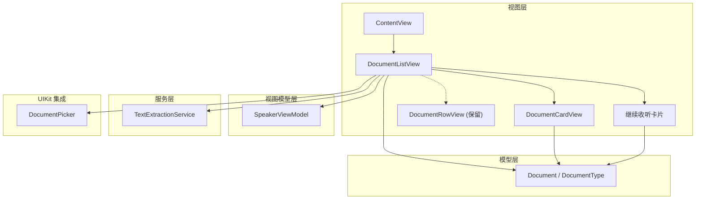
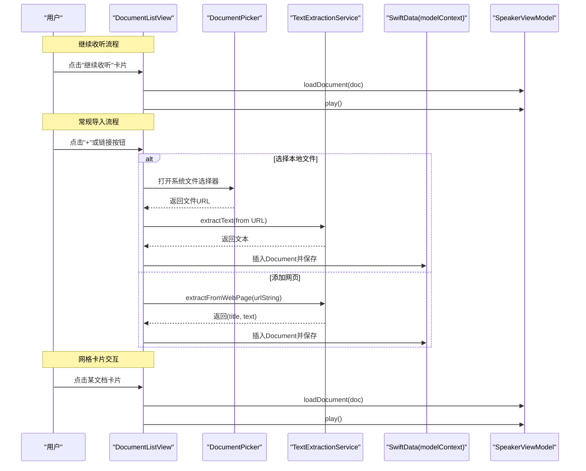
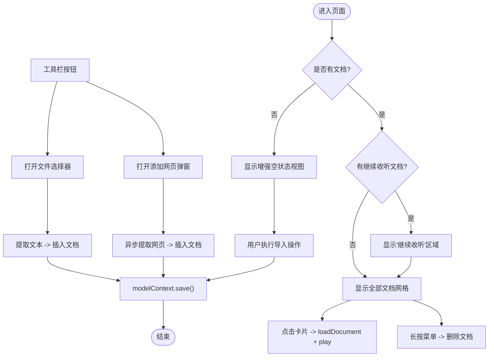
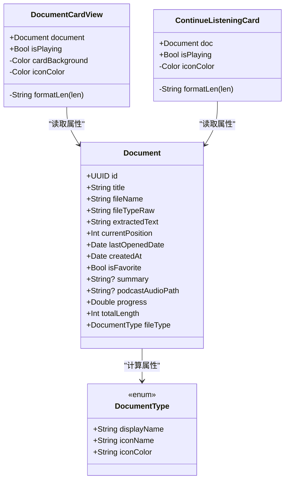
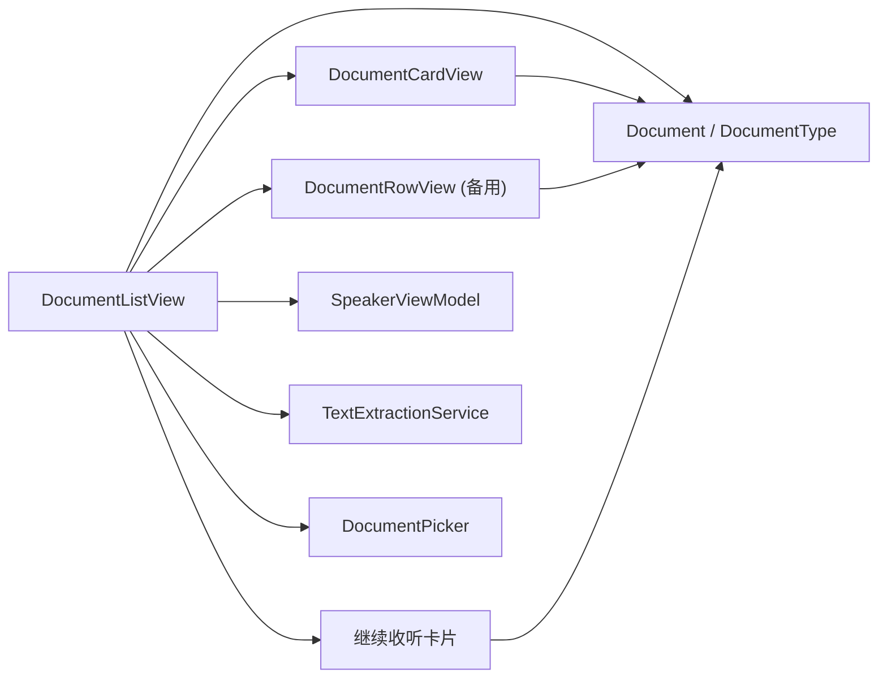

# 文档列表界面

<cite>
**本文引用的文件**   
- [DocumentListView.swift](file://Views/DocumentListView.swift)
- [DocumentCardView.swift](file://Views/DocumentCardView.swift)
- [DocumentRowView.swift](file://Views/DocumentRowView.swift)
- [Document.swift](file://Models/Document.swift)
- [SpeakerViewModel.swift](file://ViewModels/SpeakerViewModel.swift)
- [TextExtractionService.swift](file://Services/TextExtractionService.swift)
- [DocumentPicker.swift](file://UIKit/DocumentPicker.swift)
- [ContentView.swift](file://Views/ContentView.swift)
</cite>

## 更新摘要
**所做更改**   
- 新增"继续收听"功能模块，在文档列表顶部显示最多5个最近访问的文档
- 实现水平滚动布局和紧凑卡片设计，包含阅读进度可视化
- 增强空状态展示，提供更友好的用户引导界面
- 启用导航栏大标题显示模式，提升视觉层次
- 优化整体布局结构，支持条件渲染和动态内容展示

## 目录
1. [简介](#简介)
2. [项目结构](#项目结构)
3. [核心组件](#核心组件)
4. [架构总览](#架构总览)
5. [详细组件分析](#详细组件分析)
6. [依赖关系分析](#依赖关系分析)
7. [性能与可扩展性](#性能与可扩展性)
8. [故障排查指南](#故障排查指南)
9. [结论](#结论)
10. [附录：扩展指南](#附录扩展指南)

## 简介
本文件面向"文档列表界面"的实现，围绕以下目标展开：
- 详细说明 DocumentListView 的数据获取、显示与交互逻辑
- 解析 DocumentCardView 的现代卡片设计模式与可复用性
- 说明搜索、排序与筛选功能的现状与实现方式
- 解释文件类型图标显示、元数据展示与点击交互处理
- 覆盖空状态、加载状态与错误提示机制
- 提供自定义文档卡片样式与新增文档类型的扩展指南

**重要更新**：DocumentListView 已从传统的列表布局完全重构为现代化的卡片式网格布局，采用 LazyVGrid 实现灵活的列大小设置，提供更好的空间利用率和视觉体验。同时新增了"继续收听"功能，为用户提供快速恢复阅读体验。

## 项目结构
与文档列表界面直接相关的代码分布在 Views、Models、ViewModels、Services 与 UIKit 模块中。整体采用 SwiftUI + SwiftData 的声明式 UI 与数据持久化方案，结合 Service 层完成文本提取与网页抓取，使用 ViewModel 管理播放与文档状态。

**图表来源**
- [ContentView.swift:16-24](file://Views/ContentView.swift#L16-L24)
- [DocumentListView.swift:19-77](file://Views/DocumentListView.swift#L19-L77)
- [DocumentCardView.swift:4-127](file://Views/DocumentCardView.swift#L4-L127)
- [DocumentRowView.swift:4-62](file://Views/DocumentRowView.swift#L4-L62)
- [Document.swift:54-114](file://Models/Document.swift#L54-L114)
- [SpeakerViewModel.swift:8-54](file://ViewModels/SpeakerViewModel.swift#L8-L54)
- [TextExtractionService.swift:8-53](file://Services/TextExtractionService.swift#L8-L53)
- [DocumentPicker.swift:5-24](file://UIKit/DocumentPicker.swift#L5-L24)

**章节来源**
- [ContentView.swift:16-24](file://Views/ContentView.swift#L16-L24)
- [DocumentListView.swift:19-77](file://Views/DocumentListView.swift#L19-L77)
- [DocumentCardView.swift:4-127](file://Views/DocumentCardView.swift#L4-L127)
- [DocumentRowView.swift:4-62](file://Views/DocumentRowView.swift#L4-L62)
- [Document.swift:54-114](file://Models/Document.swift#L54-L114)
- [SpeakerViewModel.swift:8-54](file://ViewModels/SpeakerViewModel.swift#L8-L54)
- [TextExtractionService.swift:8-53](file://Services/TextExtractionService.swift#L8-L53)
- [DocumentPicker.swift:5-24](file://UIKit/DocumentPicker.swift#L5-L24)

## 核心组件
- **DocumentListView**：负责文档列表渲染、导入（本地文件/网页）、删除、空状态展示、工具栏操作与错误提示。现已采用 LazyVGrid 实现现代化卡片网格布局，并新增"继续收听"功能模块。
- **DocumentCardView**：全新的卡片式文档展示组件，包含文件类型图标、标题、类型标签、字数统计、阅读进度与播放指示，提供现代卡片视觉效果。
- **DocumentRowView**：原有的行式文档展示组件，作为备用方案保留，包含文件类型图标、标题、类型标签、字数统计、阅读进度与播放指示。
- **继续收听卡片**：紧凑型横向卡片设计，专为有阅读进度的文档设计，支持水平滚动浏览。
- **Document / DocumentType**：SwiftData 模型与文档类型枚举，定义图标、颜色、显示名等元数据。
- **SpeakerViewModel**：统一暴露播放控制与文档加载接口，维护当前文档、播放状态、进度与高亮范围。
- **TextExtractionService**：多格式文本提取服务（PDF/EPUB/Office/Markdown/纯文本/网页），并封装错误类型。
- **DocumentPicker**：基于 UIDocumentPickerViewController 的文件选择器桥接。

**章节来源**
- [DocumentListView.swift:19-159](file://Views/DocumentListView.swift#L19-L159)
- [DocumentCardView.swift:4-127](file://Views/DocumentCardView.swift#L4-L127)
- [DocumentRowView.swift:4-62](file://Views/DocumentRowView.swift#L4-L62)
- [Document.swift:5-114](file://Models/Document.swift#L5-L114)
- [SpeakerViewModel.swift:8-399](file://ViewModels/SpeakerViewModel.swift#L8-L399)
- [TextExtractionService.swift:8-748](file://Services/TextExtractionService.swift#L8-L748)
- [DocumentPicker.swift:5-48](file://UIKit/DocumentPicker.swift#L5-L48)

## 架构总览
下图展示了从用户操作到数据持久化的关键流程：导入文件、添加网页、点击播放、删除文档，以及"继续收听"功能的快速访问路径。

**图表来源**
- [DocumentListView.swift:59-76](file://Views/DocumentListView.swift#L59-L76)
- [DocumentListView.swift:99-139](file://Views/DocumentListView.swift#L99-L139)
- [DocumentListView.swift:127-131](file://Views/DocumentListView.swift#L127-L131)
- [TextExtractionService.swift:27-114](file://Services/TextExtractionService.swift#L27-L114)
- [SpeakerViewModel.swift:81-117](file://ViewModels/SpeakerViewModel.swift#L81-L117)

## 详细组件分析

### DocumentListView 实现要点
- **数据源与排序**
  - 使用 @Query 绑定 SwiftData 中的 Document 集合，默认按 lastOpenedDate 倒序排列，无需额外排序逻辑。
- **现代化网格布局**
  - **已更新**：采用 ScrollView + LazyVGrid 替代传统 List，实现两列弹性网格布局
  - GridItem(.flexible(), spacing: 12) 提供灵活的列宽自适应
  - 每个文档以卡片形式展示，间距为 12pt，水平内边距 16pt
- **"继续收听"功能模块**
  - **新增功能**：在页面顶部显示最多5个有阅读进度的文档
  - recentDocs 计算属性过滤 progress > 0 的文档并限制数量为5个
  - 水平滚动布局，紧凑卡片设计，包含迷你进度条和百分比显示
  - 支持点击快速恢复播放，集成触觉反馈
- **卡片交互与操作**
  - 卡片支持点击触发 speakerVM.loadDocument(doc) 与 play()
  - 使用 contextMenu 提供右滑删除功能，调用 deleteDoc(doc)，若当前正在播放则先停止
  - 点击时集成 HapticService 提供触觉反馈
- **空状态增强**
  - documents.isEmpty 时展示 enhanced emptyView，提供品牌化图标和友好的引导文案
  - 包含"导入文档"和"添加网页"两个主要入口按钮
- **导入本地文件**
  - 通过 DocumentPicker 选择文件后，调用 TextExtractionService.extractText(from:) 提取文本，构造 Document 并写入 SwiftData。
- **添加网页**
  - 弹出 alert 输入 URL，调用 TextExtractionService.extractFromWebPage(urlString:) 异步提取，成功后插入文档并清空输入框。
- **错误提示**
  - 导入失败或网络异常时，设置 alertMsg 并展示 alert。
- **导航栏大标题模式**
  - **新增特性**：启用 .navigationBarTitleDisplayMode(.large) 提供更大的标题显示效果

**图表来源**
- [DocumentListView.swift:22-46](file://Views/DocumentListView.swift#L22-L46)
- [DocumentListView.swift:108-140](file://Views/DocumentListView.swift#L108-L140)
- [DocumentListView.swift:79-97](file://Views/DocumentListView.swift#L79-L97)
- [DocumentListView.swift:99-139](file://Views/DocumentListView.swift#L99-L139)
- [DocumentListView.swift:141-145](file://Views/DocumentListView.swift#L141-L145)
- [DocumentListView.swift:223-276](file://Views/DocumentListView.swift#L223-L276)

**章节来源**
- [DocumentListView.swift:19-159](file://Views/DocumentListView.swift#L19-L159)

### DocumentCardView 设计与可复用性
- **现代化卡片设计**
  - **全新组件**：采用卡片式布局，圆角背景、阴影效果、边框描边
  - 无状态展示型组件：仅接收 document 与 isPlaying 作为输入，内部不持有外部状态，便于在任意网格中复用。
- **文件类型图标与颜色**
  - 根据 document.fileType.iconName 与 iconColor 动态渲染 SF Symbols 图标与彩色背景块
  - 图标容器使用半透明背景色，增强视觉层次
- **元数据展示**
  - 标题（最多两行）、类型标签（displayName）、字数统计（totalLength 格式化）。
- **进度与播放指示**
  - 当 progress > 0 时显示细长的进度条；isPlaying 为真时显示波形动画图标
  - 播放状态下的卡片会显示强调色边框
- **可定制点**
  - 颜色映射 colorFor、长度格式化 formatLen 均可替换为策略注入或配置对象，提升扩展性。

**图表来源**
- [DocumentCardView.swift:4-127](file://Views/DocumentCardView.swift#L4-L127)
- [Document.swift:54-114](file://Models/Document.swift#L54-L114)
- [Document.swift:5-52](file://Models/Document.swift#L5-L52)
- [DocumentListView.swift:142-207](file://Views/DocumentListView.swift#L142-L207)

**章节来源**
- [DocumentCardView.swift:4-127](file://Views/DocumentCardView.swift#L4-L127)
- [Document.swift:5-114](file://Models/Document.swift#L5-L114)

### 继续收听功能详解
- **数据筛选与限制**
  - recentDocs 计算属性通过 filter { $0.progress > 0 } 筛选有阅读进度的文档
  - prefix(5) 限制最多显示5个文档，避免界面过于拥挤
- **紧凑卡片设计**
  - 宽度固定为200pt，适合水平滚动浏览
  - 小尺寸图标（32x32）配合紧凑的垂直间距
  - 迷你进度条（高度2pt）配合百分比文字显示
- **水平滚动布局**
  - 使用 ScrollView(.horizontal, showsIndicators: false) 实现流畅的水平滚动
  - HStack 布局配合适当的间距（14pt）确保卡片间的良好分隔
- **交互体验**
  - 点击卡片立即加载文档并开始播放
  - 集成 PressableStyle 提供按压缩放动画效果
  - 播放状态下的卡片显示波形动画图标
- **视觉层次**
  - 播放中的卡片显示强调色边框
  - 标题颜色随播放状态变化
  - 背景使用 secondarySystemGroupedBackground 保持视觉一致性

**章节来源**
- [DocumentListView.swift:108-207](file://Views/DocumentListView.swift#L108-L207)

### 文档搜索、排序与筛选
- **排序**
  - 已实现：@Query(sort: \Document.lastOpenedDate, order: .reverse) 自动按最近打开时间倒序。
- **搜索与筛选**
  - 当前未实现搜索与筛选功能。如需扩展，可在 DocumentListView 中引入 @State 过滤条件，并在 Query 结果基础上进行内存过滤，或使用 SwiftData 的 predicate 参数进行服务端过滤。

**章节来源**
- [DocumentListView.swift:9](file://Views/DocumentListView.swift#L9)

### 文件类型图标、元数据与点击交互
- **图标与颜色**
  - 由 DocumentType 的 iconName 与 iconColor 决定，DocumentCardView 据此渲染。
- **元数据**
  - 标题、类型标签、字数统计、阅读进度均来自 Document 的计算属性与字段。
- **点击交互**
  - 点击卡片触发 speakerVM.loadDocument(doc) 与 play()，切换当前文档并开始朗读。
  - 集成触觉反馈，提升用户体验。

**章节来源**
- [DocumentCardView.swift:4-127](file://Views/DocumentCardView.swift#L4-L127)
- [Document.swift:72-87](file://Models/Document.swift#L72-L87)
- [DocumentListView.swift:26-35](file://Views/DocumentListView.swift#L26-L35)
- [SpeakerViewModel.swift:81-117](file://ViewModels/SpeakerViewModel.swift#L81-L117)

### 空状态、加载状态与错误提示
- **空状态增强**
  - **已更新**：documents.isEmpty 时展示 enhanced emptyView，包含品牌化圆形图标、友好文案和主要操作按钮
  - 提供"导入文档"和"添加网页"两个主要入口，采用胶囊形状按钮设计
- **加载状态**
  - 添加网页时通过 isLoadingURL 禁用"添加"按钮并提示"正在加载网页..."。
- **错误提示**
  - 导入失败或网络异常时，设置 alertMsg 并通过 alert 展示给用户。

**章节来源**
- [DocumentListView.swift:22-24](file://Views/DocumentListView.swift#L22-L24)
- [DocumentListView.swift:62-76](file://Views/DocumentListView.swift#L62-L76)
- [DocumentListView.swift:113-139](file://Views/DocumentListView.swift#L113-L139)
- [DocumentListView.swift:223-276](file://Views/DocumentListView.swift#L223-L276)

## 依赖关系分析
- **视图与模型**
  - DocumentListView 依赖 Document 模型与 SwiftData 上下文；DocumentCardView 依赖 Document 与 DocumentType。
- **视图与视图模型**
  - DocumentListView 通过 SpeakerViewModel 执行加载与播放；SpeakerViewModel 对外暴露 state、currentDocument、progress 等发布属性。
- **视图与服务**
  - DocumentListView 使用 TextExtractionService 进行文本提取；使用 DocumentPicker 桥接系统文件选择器。
- **外部集成**
  - TextExtractionService 依赖 PDFKit、Vision、UIKit、Compression 等系统框架。

**图表来源**
- [DocumentListView.swift:19-77](file://Views/DocumentListView.swift#L19-L77)
- [DocumentCardView.swift:4-127](file://Views/DocumentCardView.swift#L4-L127)
- [DocumentRowView.swift:4-62](file://Views/DocumentRowView.swift#L4-L62)
- [SpeakerViewModel.swift:8-54](file://ViewModels/SpeakerViewModel.swift#L8-L54)
- [TextExtractionService.swift:8-53](file://Services/TextExtractionService.swift#L8-L53)
- [DocumentPicker.swift:5-24](file://UIKit/DocumentPicker.swift#L5-L24)

**章节来源**
- [DocumentListView.swift:19-77](file://Views/DocumentListView.swift#L19-L77)
- [DocumentCardView.swift:4-127](file://Views/DocumentCardView.swift#L4-L127)
- [DocumentRowView.swift:4-62](file://Views/DocumentRowView.swift#L4-L62)
- [SpeakerViewModel.swift:8-54](file://ViewModels/SpeakerViewModel.swift#L8-L54)
- [TextExtractionService.swift:8-53](file://Services/TextExtractionService.swift#L8-L53)
- [DocumentPicker.swift:5-24](file://UIKit/DocumentPicker.swift#L5-L24)

## 性能与可扩展性
- **网格布局性能**
  - 使用 LazyVGrid 实现懒加载，只渲染可见区域的卡片，避免大量文档时的性能问题
  - 相比传统 List，网格布局在横向空间利用上更高效，适合平板和大屏设备
- **"继续收听"性能优化**
  - 通过 prefix(5) 限制渲染数量，避免过多卡片影响性能
  - 水平滚动使用原生 ScrollView，提供良好的滚动性能
- **文本提取**
  - PDF OCR 与网页抓取可能耗时较长，建议在后台任务中进行，UI 上通过 isLoadingURL 反馈状态。
- **可扩展性**
  - 新增文档类型：在 DocumentType 中添加新枚举值，并完善 displayName/iconName/iconColor；在 TextExtractionService 中补充对应提取逻辑；在 DocumentPicker 中注册 UTType。
  - 自定义卡片样式：可通过修改 DocumentCardView 的背景、边框、阴影等属性实现不同主题风格。

## 故障排查指南
- **导入失败**
  - 检查 TextExtractionService 抛出的 ExtractionError，常见原因包括不支持的文件类型、文件为空、OCR 识别失败、网页无法解析正文等。
- **网页添加失败**
  - 确认 URL 有效、网络可达；注意编码识别与正文区域定位失败时的回退路径。
- **播放异常**
  - 若当前引擎出错，SpeakerViewModel 会自动降级到系统 TTS；检查音频会话激活与远程控制回调是否正常。
- **网格布局问题**
  - 如果卡片显示异常，检查 GridItem 配置是否正确，确保有足够的水平空间容纳两列布局。
- **"继续收听"功能问题**
  - 确认文档的 progress 属性正确计算，检查 recentDocs 过滤逻辑是否正常工作
  - 验证水平滚动布局在不同屏幕尺寸下的适配效果

**章节来源**
- [TextExtractionService.swift:10-25](file://Services/TextExtractionService.swift#L10-L25)
- [TextExtractionService.swift:27-114](file://Services/TextExtractionService.swift#L27-L114)
- [SpeakerViewModel.swift:233-247](file://ViewModels/SpeakerViewModel.swift#L233-L247)
- [Document.swift:83-87](file://Models/Document.swift#L83-L87)

## 结论
文档列表界面已完成现代化重构，采用 SwiftUI + SwiftData 为核心，配合 Service 层实现多格式文本提取与网页抓取，使用统一的 ViewModel 管理播放与文档状态。新的 LazyVGrid 卡片式布局提供了更好的空间利用率和视觉体验，同时新增了"继续收听"功能为用户提供了快速恢复阅读体验的能力。增强的空状态展示和导航栏大标题模式进一步提升了用户体验。整个界面保持了完整的导入、展示、播放与删除能力，并提供了良好的错误提示机制。后续可按扩展指南平滑增加新的文档类型与卡片样式定制能力。

## 附录：扩展指南

### 新增文档类型步骤
- 在 DocumentType 中添加新枚举值，并完善 displayName、iconName、iconColor。
- 在 TextExtractionService 中为该类型实现提取逻辑（例如新增 case 分支与对应方法）。
- 在 DocumentPicker 中注册对应的 UTType，使系统文件选择器允许选择该类型。
- 如有需要，更新 DocumentCardView 的展示细节（如特殊标签或进度条样式）。

**章节来源**
- [Document.swift:5-52](file://Models/Document.swift#L5-L52)
- [TextExtractionService.swift:27-53](file://Services/TextExtractionService.swift#L27-L53)
- [DocumentPicker.swift:9-16](file://UIKit/DocumentPicker.swift#L9-L16)
- [DocumentCardView.swift:4-127](file://Views/DocumentCardView.swift#L4-L127)

### 自定义文档卡片样式
- **修改卡片外观**
  - 调整 DocumentCardView 的 cardBackground 属性，改变背景色、阴影强度、圆角半径等
  - 修改 iconColor 映射逻辑，支持更多颜色主题
  - 调整字体大小、行高、内边距等排版细节
- **布局定制**
  - 修改 DocumentListView 中的 GridItem 配置，调整列数、间距、对齐方式
  - 可根据屏幕尺寸动态调整网格布局，实现响应式设计
- **交互增强**
  - 添加长按预览、滑动操作、拖拽排序等高级交互功能
  - 集成更多触觉反馈和动画效果

**章节来源**
- [DocumentCardView.swift:89-111](file://Views/DocumentCardView.swift#L89-L111)
- [DocumentListView.swift:26-32](file://Views/DocumentListView.swift#L26-L32)

### 网格布局优化建议
- **响应式设计**
  - 根据屏幕宽度动态调整列数，在小屏幕上显示单列，在大屏幕上显示多列
- **性能优化**
  - 对于大量文档，考虑分页加载或虚拟滚动
  - 预加载卡片图片资源，减少首次渲染延迟
- **无障碍支持**
  - 为卡片添加适当的 Accessibility 标签和描述
  - 支持 VoiceOver 导航和键盘操作

### "继续收听"功能扩展指南
- **自定义显示数量**
  - 修改 recentDocs 计算属性中的 prefix(5) 参数来调整显示数量
- **卡片样式定制**
  - 调整 continueListeningCard 函数的布局、颜色、字体等样式属性
  - 修改卡片宽度（当前为200pt）以适应不同的设计需求
- **交互行为增强**
  - 添加长按菜单提供更多操作选项
  - 集成更多触觉反馈和动画效果
- **数据筛选扩展**
  - 可以添加更多筛选条件，如按时间、类型、收藏状态等过滤文档

**章节来源**
- [DocumentListView.swift:110-113](file://Views/DocumentListView.swift#L110-L113)
- [DocumentListView.swift:142-207](file://Views/DocumentListView.swift#L142-L207)