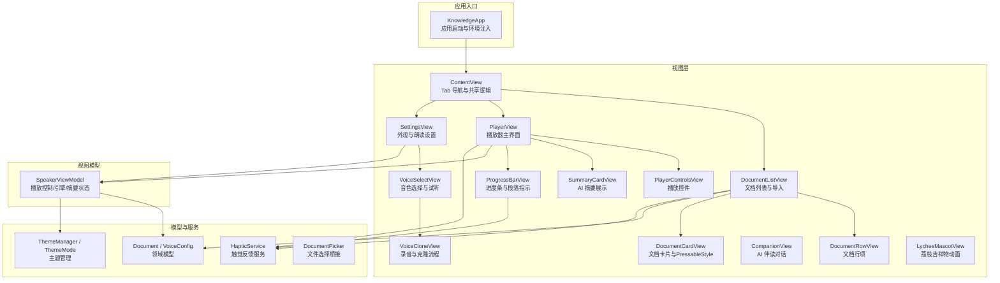
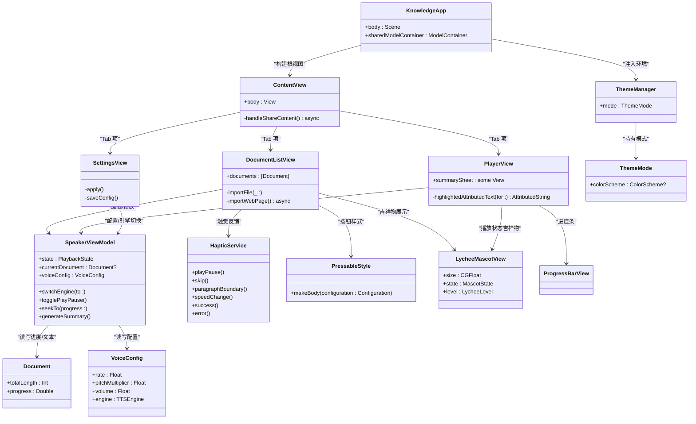
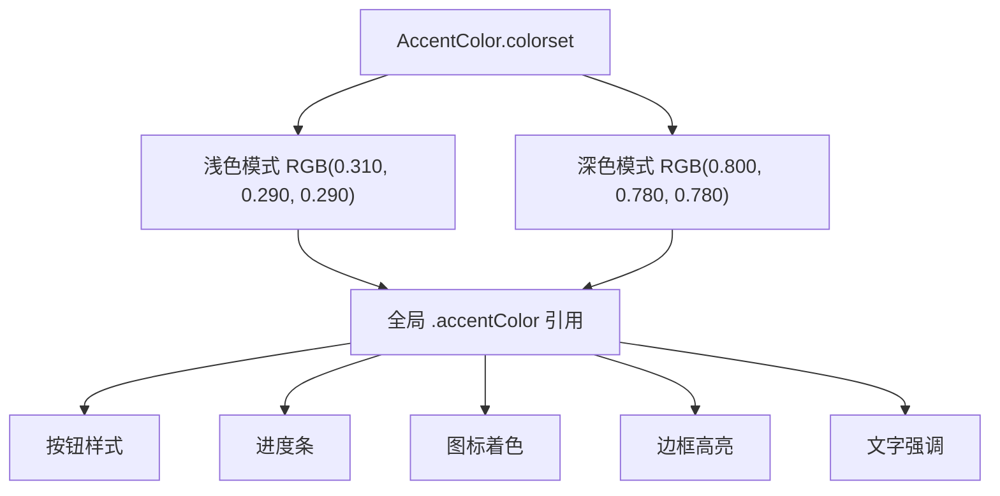
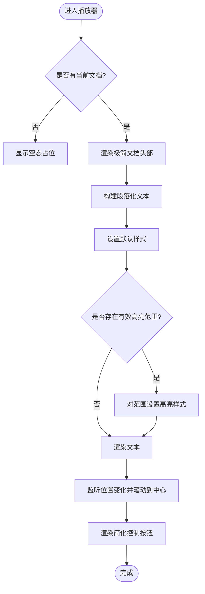
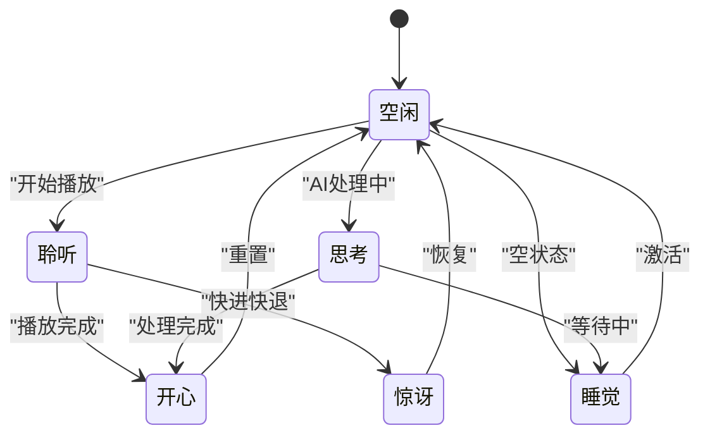
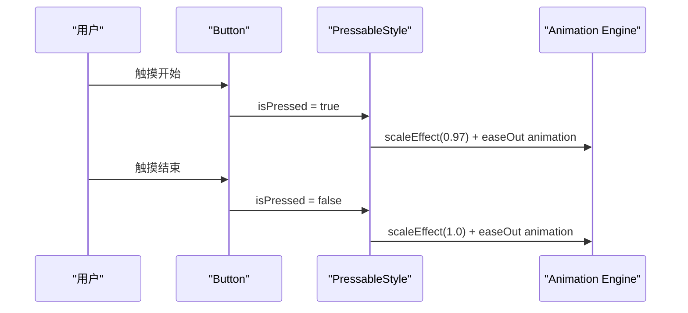
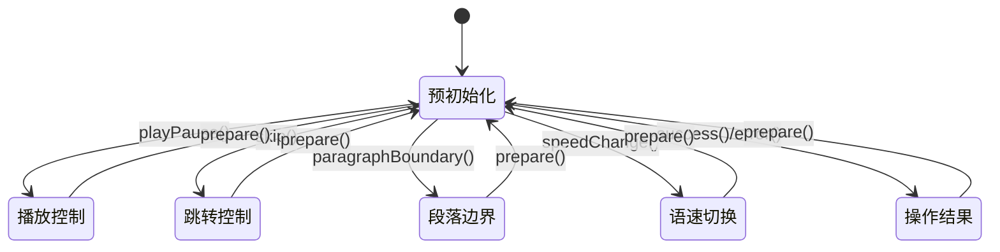
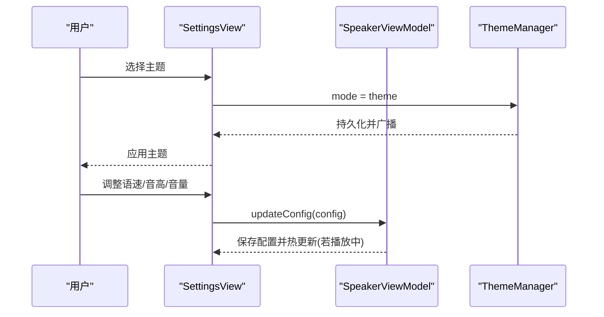
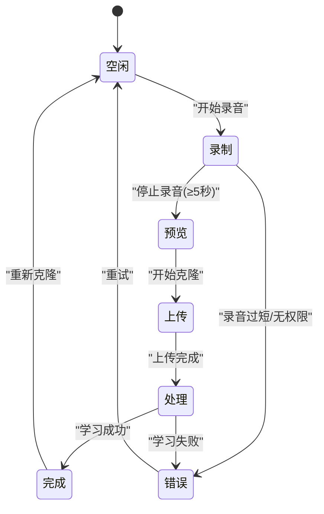
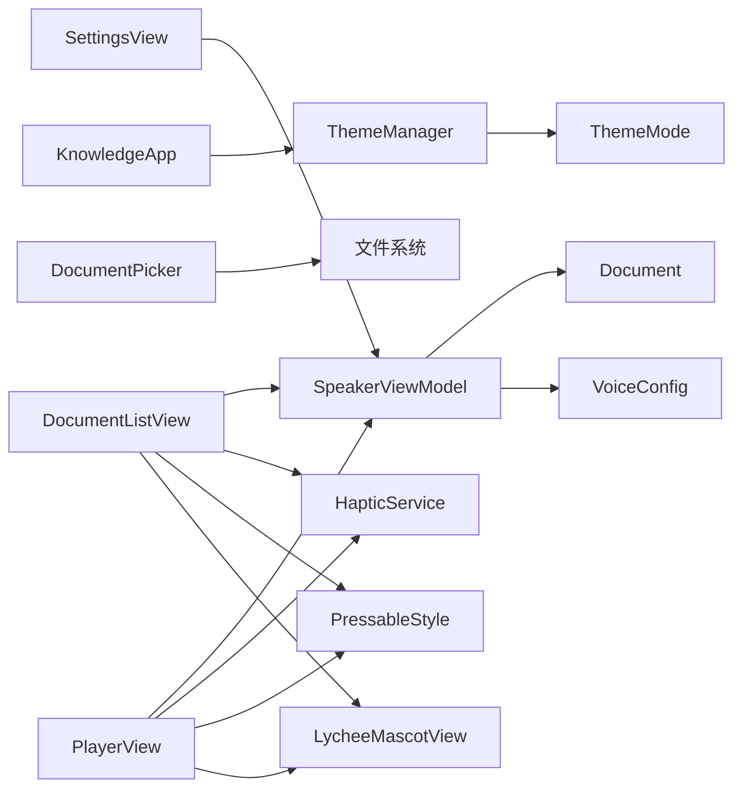

# 用户界面设计

<cite>
**本文引用的文件**   
- [KnowledgeApp.swift](file://App/KnowledgeApp.swift)
- [ContentView.swift](file://Views/ContentView.swift)
- [DocumentListView.swift](file://Views/DocumentListView.swift)
- [DocumentRowView.swift](file://Views/DocumentRowView.swift)
- [PlayerView.swift](file://Views/PlayerView.swift)
- [PlayerControlsView.swift](file://Views/PlayerControlsView.swift)
- [SettingsView.swift](file://Views/SettingsView.swift)
- [SummaryCardView.swift](file://Views/SummaryCardView.swift)
- [VoiceCloneView.swift](file://Views/VoiceCloneView.swift)
- [VoiceSelectView.swift](file://Views/VoiceSelectView.swift)
- [ThemeMode.swift](file://Models/ThemeMode.swift)
- [ThemeManager.swift](file://Services/ThemeManager.swift)
- [Document.swift](file://Models/Document.swift)
- [VoiceConfig.swift](file://Models/VoiceConfig.swift)
- [SpeakerViewModel.swift](file://ViewModels/SpeakerViewModel.swift)
- [DocumentPicker.swift](file://UIKit/DocumentPicker.swift)
- [HapticService.swift](file://Services/HapticService.swift)
- [ProgressBarView.swift](file://Views/ProgressBarView.swift)
- [CompanionView.swift](file://Views/CompanionView.swift)
- [LycheeMascotView.swift](file://Views/LycheeMascotView.swift)
- [DocumentCardView.swift](file://Views/DocumentCardView.swift)
</cite>

## 更新摘要
**变更内容**   
- 应用经历全面的Notion风格UI重构，采用低饱和度暖灰色调替代原有暖橙色配色方案
- 文档列表界面重新设计为网格布局（32px垂直间距，10px水平间距），移除彩色渐变背景
- 采用简洁的边框和最小化样式设计，强调内容而非装饰元素
- 播放器控制按钮进行简化处理，去除冗余装饰效果
- 摘要卡片和伴读对话界面采用中性色调与极简设计元素
- 整体视觉风格向极简主义靠拢，提升阅读体验和信息密度

## 目录
1. [简介](#简介)
2. [项目结构](#项目结构)
3. [核心组件](#核心组件)
4. [架构总览](#架构总览)
5. [详细组件分析](#详细组件分析)
6. [依赖关系分析](#依赖关系分析)
7. [性能与体验优化](#性能与体验优化)
8. [可访问性与用户体验最佳实践](#可访问性与用户体验最佳实践)
9. [故障排查指南](#故障排查指南)
10. [结论](#结论)

## 简介
本文件面向 Knowledge 应用的 SwiftUI 用户界面，系统性阐述基于声明式 UI 的架构组织、主要页面职责与交互流程、响应式设计与主题切换机制、自定义组件创建与样式定制方法，以及可访问性与用户体验优化的实践建议。文档以代码级事实为依据，配合可视化图示帮助读者快速理解并高效扩展界面。

**最新更新** 应用经历了全面的Notion风格UI重构，采用低饱和度暖灰色调和极简设计风格，显著提升信息密度和阅读体验。新的色彩系统从暖橙色系转向专业中性的暖灰色调，营造更加沉浸的阅读环境。

## 项目结构
应用采用分层清晰的 SwiftUI 工程结构：
- App 层：应用入口、全局环境注入（主题、数据容器）
- Views 层：按功能划分的视图组件（书库、播放器、设置、摘要卡片、语音克隆等）
- ViewModels 层：统一编排播放控制、引擎切换、AI 摘要状态等
- Models 层：领域模型（文档、主题模式、语音配置）
- Services 层：主题管理、TTS 服务、音频会话、分享处理、触觉反馈等
- UIKit 桥接：系统文件选择器封装

**图表来源**
- [KnowledgeApp.swift:1-29](file://App/KnowledgeApp.swift#L1-L29)
- [ContentView.swift:1-98](file://Views/ContentView.swift#L1-L98)
- [DocumentListView.swift:1-283](file://Views/DocumentListView.swift#L1-L283)
- [PlayerView.swift:1-385](file://Views/PlayerView.swift#L1-L385)
- [SettingsView.swift:1-429](file://Views/SettingsView.swift#L1-L429)
- [HapticService.swift:1-69](file://Services/HapticService.swift#L1-L69)
- [ProgressBarView.swift:1-112](file://Views/ProgressBarView.swift#L1-L112)
- [DocumentCardView.swift:1-124](file://Views/DocumentCardView.swift#L1-L124)
- [LycheeMascotView.swift:1-233](file://Views/LycheeMascotView.swift#L1-L233)

## 核心组件
- 应用入口与环境注入
  - 在应用启动时注入主题管理器到环境，并通过 preferredColorScheme 驱动全局明暗主题；同时初始化 SwiftData 容器，提供 Document 模型的持久化能力。
- 根导航与共享逻辑
  - 使用 TabView 组织"书库""正在播放""设置"三大模块；集中处理来自分享扩展的内容提示与导入流程，统一错误弹窗。
- **重构后** 文档列表页
  - 采用 Notion 风格的网格布局，32px 垂直间距和 10px 水平间距；支持从本地导入与网页链接抓取文本；支持滑动删除与空态引导。
- **重构后** 播放器界面
  - 顶部文档信息、中间高亮文本滚动区域、底部进度条与控制按钮；集成 AI 摘要生成与朗读；采用极简边框设计。
- 设置页
  - 主题切换、TTS 引擎选择、语速/音高/音量滑块、语言与声音选择；实时保存与播放中动态更新。
- 摘要卡片
  - 展示摘要正文与关键要点，支持一键朗读摘要；包含加载与错误状态。
- 语音克隆与音色选择
  - 录音流程、预览、上传与学习状态机；预设与克隆音色分类展示、试听与选择。
- **重构后** 播放器控件
  - 简化的播放/暂停、快进/后退、快捷语速切换按钮，去除冗余装饰效果。
- **新增** 荔枝吉祥物
  - 多状态动画系统，支持呼吸、聆听、思考、开心、睡觉、惊讶、挥手等多种状态。
- **新增** PressableStyle按钮样式
  - 提供一致的点击缩放动画效果，增强用户交互反馈。

**章节来源**
- [KnowledgeApp.swift:1-29](file://App/KnowledgeApp.swift#L1-L29)
- [ContentView.swift:1-98](file://Views/ContentView.swift#L1-L98)
- [DocumentListView.swift:1-283](file://Views/DocumentListView.swift#L1-L283)
- [PlayerView.swift:1-385](file://Views/PlayerView.swift#L1-L385)
- [SettingsView.swift:1-429](file://Views/SettingsView.swift#L1-L429)
- [HapticService.swift:1-69](file://Services/HapticService.swift#L1-L69)
- [DocumentCardView.swift:1-124](file://Views/DocumentCardView.swift#L1-L124)
- [LycheeMascotView.swift:1-233](file://Views/LycheeMascotView.swift#L1-L233)

## 架构总览
UI 层遵循 SwiftUI 声明式范式，通过 @StateObject/@ObservedObject 与 @EnvironmentObject 实现跨层级状态共享；播放控制与引擎切换由 SpeakerViewModel 统一编排，对外暴露简洁接口供各视图调用。

**图表来源**
- [KnowledgeApp.swift:1-29](file://App/KnowledgeApp.swift#L1-L29)
- [ContentView.swift:1-98](file://Views/ContentView.swift#L1-L98)
- [DocumentListView.swift:1-283](file://Views/DocumentListView.swift#L1-L283)
- [PlayerView.swift:1-385](file://Views/PlayerView.swift#L1-L385)
- [SettingsView.swift:1-429](file://Views/SettingsView.swift#L1-L429)
- [SpeakerViewModel.swift:1-314](file://ViewModels/SpeakerViewModel.swift#L1-L314)
- [ThemeManager.swift:1-25](file://Services/ThemeManager.swift#L1-L25)
- [ThemeMode.swift:1-25](file://Models/ThemeMode.swift#L1-L25)
- [HapticService.swift:1-69](file://Services/HapticService.swift#L1-L69)
- [DocumentCardView.swift:1-124](file://Views/DocumentCardView.swift#L1-L124)
- [LycheeMascotView.swift:1-233](file://Views/LycheeMascotView.swift#L1-L233)

## 详细组件分析

### Notion风格色彩系统
**重大更新** 应用采用全新的Notion风格色彩系统，从原有的暖橙色系转向低饱和度暖灰色调，营造更加专业和沉浸的阅读体验。

- **浅色模式**: RGB(0.310, 0.290, 0.290) - 低饱和度暖灰色
- **深色模式**: RGB(0.800, 0.780, 0.780) - 柔和浅灰色
- **设计理念**: 减少视觉干扰，突出内容本身，符合Notion极简美学
- **系统性应用**: 在整个界面中统一应用新的强调色，包括按钮、进度条、图标、边框等元素

**图表来源**
- [Contents.json:1-39](file://Resources/Assets.xcassets/AccentColor.colorset/Contents.json#L1-L39)

**章节来源**
- [Contents.json:1-39](file://Resources/Assets.xcassets/AccentColor.colorset/Contents.json#L1-L39)
- [ContentView.swift:25](file://Views/ContentView.swift#L25)
- [DocumentListView.swift:159-187](file://Views/DocumentListView.swift#L159-L187)
- [PlayerView.swift:98-134](file://Views/PlayerView.swift#L98-L134)
- [SettingsView.swift:31-150](file://Views/SettingsView.swift#L31-L150)

### 网格布局文档列表
**重大更新** 文档列表界面完全重构为Notion风格的网格布局，大幅提升信息密度和浏览效率。

- **网格规格**: 双列布局，每列弹性宽度，10px水平间距
- **垂直间距**: 32px的主要间距，营造舒适的视觉节奏
- **卡片设计**: 白色背景 + 细边框，播放状态时边框加粗并使用强调色
- **内容层次**: 文件类型图标、标题、元信息、进度条的清晰层次结构
- **交互优化**: 统一的PressableStyle点击反馈，contextMenu删除操作

**图表来源**
- [DocumentListView.swift:1-283](file://Views/DocumentListView.swift#L1-L283)
- [SpeakerViewModel.swift:1-314](file://ViewModels/SpeakerViewModel.swift#L1-L314)
- [Document.swift:1-115](file://Models/Document.swift#L1-L115)

**章节来源**
- [DocumentListView.swift:1-283](file://Views/DocumentListView.swift#L1-L283)
- [DocumentCardView.swift:1-124](file://Views/DocumentCardView.swift#L1-L124)
- [DocumentRowView.swift:1-62](file://Views/DocumentRowView.swift#L1-L62)
- [DocumentPicker.swift:1-48](file://UIKit/DocumentPicker.swift#L1-L48)
- [Document.swift:1-115](file://Models/Document.swift#L1-L115)

### 极简播放器界面
**重大更新** 播放器界面采用极简设计，去除所有冗余装饰，专注于内容展示和核心功能。

- **头部设计**: 文件类型图标 + 文档信息 + 荔枝吉祥物，采用轻量边框背景
- **文本区域**: 段落化高亮显示，随朗读位置自动滚动，无背景装饰
- **控制区域**: 简化的播放控件，去除渐变和阴影效果
- **AI功能栏**: 独立的AI总结和伴读按钮，采用边框卡片样式
- **进度条**: 自定义进度条，带段落标记和荔枝拖拽手柄

**图表来源**
- [PlayerView.swift:1-385](file://Views/PlayerView.swift#L1-L385)
- [SpeakerViewModel.swift:1-314](file://ViewModels/SpeakerViewModel.swift#L1-L314)

**章节来源**
- [PlayerView.swift:1-385](file://Views/PlayerView.swift#L1-L385)
- [PlayerControlsView.swift:1-79](file://Views/PlayerControlsView.swift#L1-L79)
- [SummaryCardView.swift:1-523](file://Views/SummaryCardView.swift#L1-L523)
- [SpeakerViewModel.swift:1-314](file://ViewModels/SpeakerViewModel.swift#L1-L314)

### 荔枝吉祥物系统
**新增** 完整的荔枝吉祥物动画系统，为应用增添生动的品牌元素。

- **多状态支持**: 空闲、聆听、思考、开心、睡觉、惊讶、挥手等7种状态
- **等级系统**: 小、中、大三个等级，对应不同的尺寸和装饰元素
- **动画系统**: 每种状态都有独特的动画效果，包括旋转、缩放、位移等
- **彩蛋功能**: 长按触发趣味气泡对话，增强用户互动体验
- **场景应用**: 在空状态、播放状态、AI处理状态等不同场景中智能切换

**图表来源**
- [LycheeMascotView.swift:1-233](file://Views/LycheeMascotView.swift#L1-L233)

**章节来源**
- [LycheeMascotView.swift:1-233](file://Views/LycheeMascotView.swift#L1-L233)
- [PlayerView.swift:142-148](file://Views/PlayerView.swift#L142-L148)
- [DocumentListView.swift:196](file://Views/DocumentListView.swift#L196)

### PressableStyle按钮样式
**新增** 创建了统一的PressableStyle按钮样式，提供一致的触觉反馈和缩放动画效果。

- **缩放动画**: 点击时缩小至0.97倍，松开后恢复原状
- **平滑过渡**: 使用.easeOut(duration: 0.15)提供自然的过渡效果
- **广泛使用**: 应用于文档卡片、AI功能按钮、快捷操作等交互元素

**图表来源**
- [DocumentCardView.swift:103-109](file://Views/DocumentCardView.swift#L103-L109)

**章节来源**
- [DocumentCardView.swift:103-109](file://Views/DocumentCardView.swift#L103-L109)
- [DocumentListView.swift:58](file://Views/DocumentListView.swift#L58)
- [DocumentListView.swift:138](file://Views/DocumentListView.swift#L138)
- [PlayerView.swift:192](file://Views/PlayerView.swift#L192)
- [PlayerView.swift:221](file://Views/PlayerView.swift#L221)

### 触觉反馈系统
**新增** 集成了完整的触觉反馈系统，为用户提供丰富的物理交互体验。

- **预初始化**: 预热所有反馈生成器，避免首次触发延迟
- **多样化反馈**: 
  - playPause(): soft impact用于播放/暂停
  - skip(): light impact用于快进/快退
  - paragraphBoundary(): selection feedback用于段落边界
  - speedChange(): rigid impact用于语速切换
  - success()/error(): notification feedback用于操作结果

**图表来源**
- [HapticService.swift:1-69](file://Services/HapticService.swift#L1-L69)

**章节来源**
- [HapticService.swift:1-69](file://Services/HapticService.swift#L1-L69)
- [PlayerControlsView.swift:7-35](file://Views/PlayerControlsView.swift#L7-L35)
- [DocumentListView.swift:52-54](file://Views/DocumentListView.swift#L52-L54)
- [ProgressBarView.swift:15-96](file://Views/ProgressBarView.swift#L15-L96)

### 设置页面
- 主题切换
  - 遍历 ThemeMode.allCases，点击即写入 UserDefaults 并通过 environmentObject 传播至根视图，应用 preferredColorScheme 生效。
- TTS 引擎与朗读参数
  - 引擎切换会替换内部合成器实例，并在播放中无缝重启；语速/音高/音量滑块实时更新配置，仅播放中才热更新引擎参数。
- 语言与声音
  - 根据所选语言过滤系统可用语音，支持选择默认或具体 voiceIdentifier。

**图表来源**
- [SettingsView.swift:1-429](file://Views/SettingsView.swift#L1-L429)
- [ThemeManager.swift:1-25](file://Services/ThemeManager.swift#L1-L25)
- [ThemeMode.swift:1-25](file://Models/ThemeMode.swift#L1-L25)
- [SpeakerViewModel.swift:1-314](file://ViewModels/SpeakerViewModel.swift#L1-L314)

**章节来源**
- [SettingsView.swift:1-429](file://Views/SettingsView.swift#L1-L429)
- [ThemeManager.swift:1-25](file://Services/ThemeManager.swift#L1-L25)
- [ThemeMode.swift:1-25](file://Models/ThemeMode.swift#L1-L25)
- [VoiceConfig.swift:1-52](file://Models/VoiceConfig.swift#L1-L52)

### 语音克隆与音色选择
- 语音克隆流程
  - 状态机：空闲→录制→预览→上传→处理→完成/错误；录音时长校验、权限请求、临时文件管理与播放预览。
- 音色选择
  - 分组展示"我的音色"和"预设音色"，支持试听、选择与删除；选择后同步到 SpeakerViewModel 并切换引擎。

**图表来源**
- [VoiceCloneView.swift:1-404](file://Views/VoiceCloneView.swift#L1-L404)
- [VoiceSelectView.swift:1-215](file://Views/VoiceSelectView.swift#L1-L215)
- [SpeakerViewModel.swift:1-314](file://ViewModels/SpeakerViewModel.swift#L1-L314)

**章节来源**
- [VoiceCloneView.swift:1-404](file://Views/VoiceCloneView.swift#L1-L404)
- [VoiceSelectView.swift:1-215](file://Views/VoiceSelectView.swift#L1-L215)

## 依赖关系分析
- 视图与 ViewModel
  - 所有播放相关视图通过 @ObservedObject 订阅 SpeakerViewModel 的状态变更，保证 UI 与业务状态一致。
- 主题与环境
  - ThemeManager 作为单例被注入到环境，根视图通过 preferredColorScheme 应用主题；设置页直接修改其 mode。
- 数据模型
  - Document 提供 totalLength、progress 等计算属性，简化 UI 展示；VoiceConfig 承载全部朗读参数与引擎选择。
- 外部集成
  - DocumentPicker 桥接系统文件选择器；SpeakerViewModel 内部组合系统 TTS 与 CosyVoice 两种合成器，并提供错误降级策略。
- **新增** 触觉反馈集成
  - 所有交互按钮和控件都集成了 HapticService，提供一致的触觉反馈体验。
- **新增** 统一按钮样式
  - PressableStyle 被广泛应用于各种按钮和卡片，确保一致的视觉反馈。
- **新增** 吉祥物系统集成
  - LycheeMascotView 在多个关键界面中展示，增强品牌识别和用户情感连接。

**图表来源**
- [SpeakerViewModel.swift:1-314](file://ViewModels/SpeakerViewModel.swift#L1-L314)
- [Document.swift:1-115](file://Models/Document.swift#L1-L115)
- [VoiceConfig.swift:1-52](file://Models/VoiceConfig.swift#L1-L52)
- [ThemeManager.swift:1-25](file://Services/ThemeManager.swift#L1-L25)
- [ThemeMode.swift:1-25](file://Models/ThemeMode.swift#L1-L25)
- [DocumentPicker.swift:1-48](file://UIKit/DocumentPicker.swift#L1-L48)
- [HapticService.swift:1-69](file://Services/HapticService.swift#L1-L69)
- [DocumentCardView.swift:1-124](file://Views/DocumentCardView.swift#L1-L124)
- [LycheeMascotView.swift:1-233](file://Views/LycheeMascotView.swift#L1-L233)

**章节来源**
- [SpeakerViewModel.swift:1-314](file://ViewModels/SpeakerViewModel.swift#L1-L314)
- [Document.swift:1-115](file://Models/Document.swift#L1-L115)
- [VoiceConfig.swift:1-52](file://Models/VoiceConfig.swift#L1-L52)
- [ThemeManager.swift:1-25](file://Services/ThemeManager.swift#L1-L25)
- [ThemeMode.swift:1-25](file://Models/ThemeMode.swift#L1-L25)
- [DocumentPicker.swift:1-48](file://UIKit/DocumentPicker.swift#L1-L48)
- [HapticService.swift:1-69](file://Services/HapticService.swift#L1-L69)
- [DocumentCardView.swift:1-124](file://Views/DocumentCardView.swift#L1-L124)
- [LycheeMascotView.swift:1-233](file://Views/LycheeMascotView.swift#L1-L233)

## 性能与体验优化
- 列表渲染
  - 使用 @Query 自动增量更新，避免手动刷新；Grid 布局相比传统 List 提供更好的性能和视觉效果。
- 文本高亮
  - 仅在必要区间进行 AttributedString 样式覆盖，避免全量重算；合理限制 NSRange 边界，防止越界。
- 播放控制
  - 通过 Timer.publish 低频轮询状态，结合 onPositionChange/onRangeChange 回调，降低 UI 抖动。
- 资源管理
  - 临时音频文件及时清理；预览任务支持取消，避免后台残留。
- 网络与异步
  - 网页抓取与 AI 摘要均使用异步任务，UI 层提供加载与错误反馈，避免阻塞主线程。
- **新增** 触觉反馈优化
  - 预初始化所有反馈生成器，避免首次触发延迟；合理使用不同类型的反馈提升用户体验。
- **新增** 动画性能
  - PressableStyle 使用轻量动画提供自然流畅的交互反馈；吉祥物动画采用高效的 keyframe 动画。
- **重构后** 视觉性能
  - 去除复杂的渐变背景和阴影效果，提升渲染性能；采用纯色背景和简单边框，减少 GPU 压力。

## 可访问性与用户体验最佳实践
- 语义化标签
  - 为重要按钮与输入框提供清晰 label 与辅助描述，便于 VoiceOver 朗读。
- 对比度与可读性
  - 高亮文本使用 accentColor 与浅色背景叠加，确保明暗主题下均有足够对比度。
- 键盘与手势
  - 输入框禁用自动纠错与首字母大写，提升链接粘贴体验；长按/滑动操作提供明确视觉反馈。
- 错误与空态
  - 统一的错误弹窗与空态引导，帮助用户快速定位问题并采取下一步行动。
- 远程控制
  - 与系统"正在播放"集成，锁屏与控制中心可控制播放，提升多场景可用性。
- **新增** 触觉反馈可访问性
  - 触觉反馈作为视觉和听觉反馈的补充，不替代必要的视觉提示；确保所有重要操作都有多重反馈。
- **重构后** 极简设计原则
  - 遵循 Notion 风格的设计理念，减少视觉噪音，突出核心内容；采用一致的间距和字体层级，提升信息可读性。
- **新增** 品牌一致性
  - 新的低饱和度暖灰色调在所有界面元素中保持一致应用，强化专业品牌形象。

## 故障排查指南
- 无法导入文件
  - 检查文件类型是否在支持的 UTType 列表中；确认沙盒拷贝是否成功。
- 网页抓取失败
  - 检查网络连接与 URL 有效性；查看错误提示并引导用户重试。
- 播放异常或无声
  - 确认音频会话已激活；检查 TTS 引擎是否可用；若知识语音出错，会自动降级到系统 TTS。
- 主题未生效
  - 确认 ThemeManager.mode 已写入 UserDefaults，且根视图已应用 preferredColorScheme。
- 摘要生成失败
  - 检查 API Key 是否正确配置；查看错误消息并提示重试。
- **新增** 触觉反馈问题
  - 检查 HapticService 是否正确初始化；确认设备是否支持触觉反馈；验证不同反馈类型的调用时机。
- **新增** 按钮样式问题
  - 检查 PressableStyle 是否正确应用到目标按钮；确认动画参数是否符合预期；验证与其他按钮样式的兼容性。
- **重构后** 网格布局问题
  - 检查 GridItem 配置是否正确；确认间距设置是否符合设计要求；验证在不同屏幕尺寸下的适配效果。
- **新增** 吉祥物动画问题
  - 检查 MascotState 状态转换逻辑；确认动画参数设置是否合理；验证不同等级下的显示效果。

**章节来源**
- [DocumentPicker.swift:1-48](file://UIKit/DocumentPicker.swift#L1-L48)
- [SpeakerViewModel.swift:1-314](file://ViewModels/SpeakerViewModel.swift#L1-L314)
- [ThemeManager.swift:1-25](file://Services/ThemeManager.swift#L1-L25)
- [KnowledgeApp.swift:1-29](file://App/KnowledgeApp.swift#L1-L29)
- [HapticService.swift:1-69](file://Services/HapticService.swift#L1-L69)
- [DocumentCardView.swift:1-124](file://Views/DocumentCardView.swift#L1-L124)
- [LycheeMascotView.swift:1-233](file://Views/LycheeMascotView.swift#L1-L233)

## 结论
Knowledge 的 UI 以 SwiftUI 声明式范式为核心，围绕 SpeakerViewModel 形成清晰的职责边界与数据流向。通过主题管理、引擎切换、AI 摘要与语音克隆等功能，构建了完整的阅读—聆听—总结闭环。**重大更新** 引入了全面的Notion风格UI重构，采用低饱和度暖灰色调和极简设计，显著提升了信息密度和阅读体验。新的网格布局文档列表、简化的播放器界面、完整的荔枝吉祥物系统和统一的触觉反馈机制，为用户提供了更加专业、沉浸和愉悦的使用体验。建议在后续迭代中继续强化可访问性、错误恢复与性能监控，以提升整体用户体验。