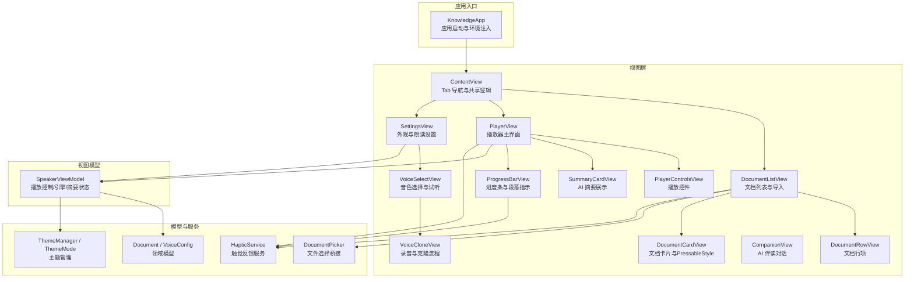
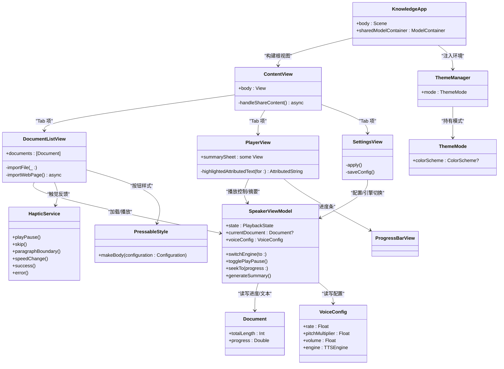
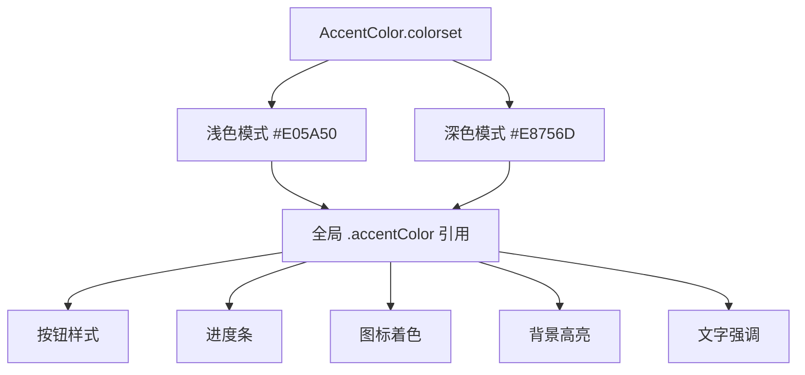
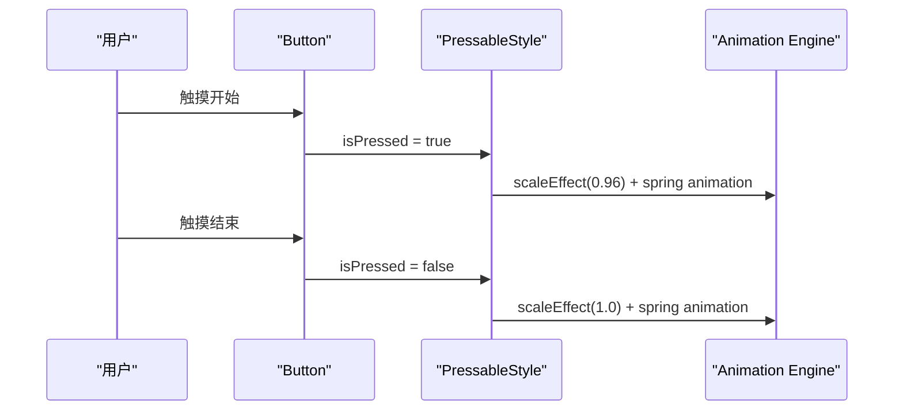
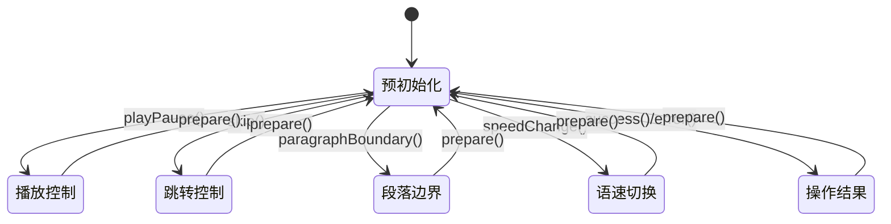
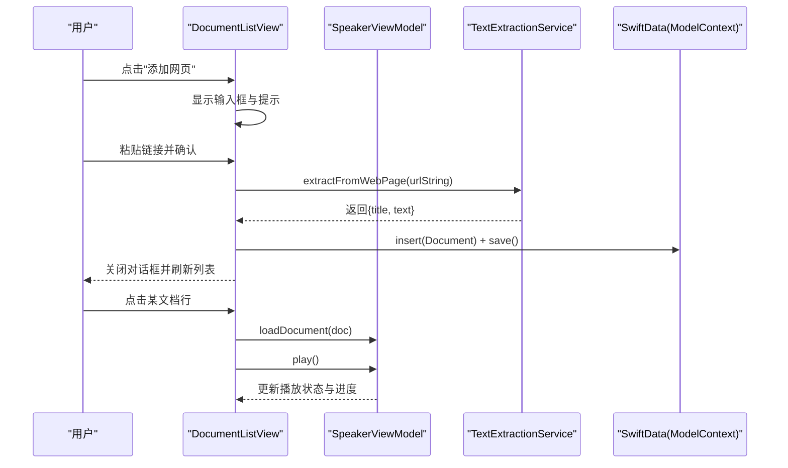
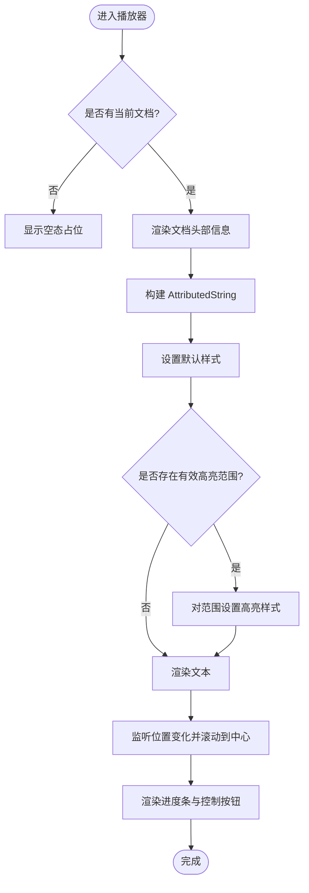
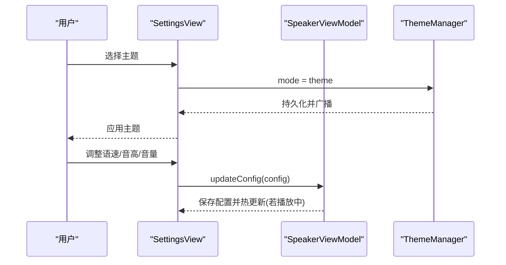
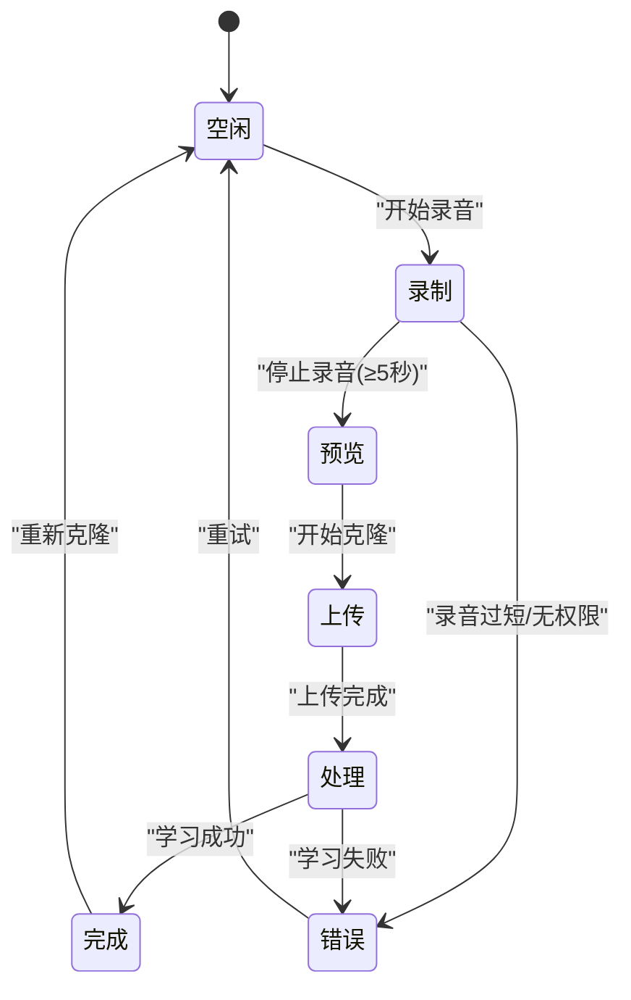
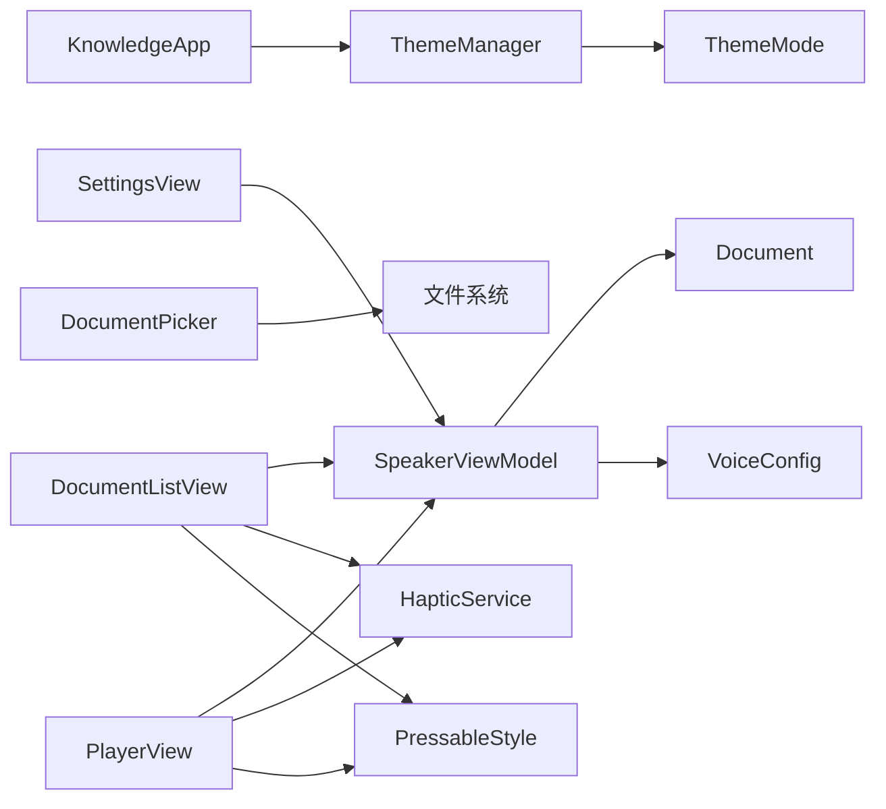

# 用户界面设计

<cite>
**本文引用的文件**   
- [KnowledgeApp.swift](file://App/KnowledgeApp.swift)
- [ContentView.swift](file://Views/ContentView.swift)
- [DocumentListView.swift](file://Views/DocumentListView.swift)
- [DocumentRowView.swift](file://Views/DocumentRowView.swift)
- [PlayerView.swift](file://Views/PlayerView.swift)
- [PlayerControlsView.swift](file://Views/PlayerControlsView.swift)
- [SettingsView.swift](file://Views/SettingsView.swift)
- [SummaryCardView.swift](file://Views/SummaryCardView.swift)
- [VoiceCloneView.swift](file://Views/VoiceCloneView.swift)
- [VoiceSelectView.swift](file://Views/VoiceSelectView.swift)
- [ThemeMode.swift](file://Models/ThemeMode.swift)
- [ThemeManager.swift](file://Services/ThemeManager.swift)
- [Document.swift](file://Models/Document.swift)
- [VoiceConfig.swift](file://Models/VoiceConfig.swift)
- [SpeakerViewModel.swift](file://ViewModels/SpeakerViewModel.swift)
- [DocumentPicker.swift](file://UIKit/DocumentPicker.swift)
- [HapticService.swift](file://Services/HapticService.swift)
- [ProgressBarView.swift](file://Views/ProgressBarView.swift)
- [CompanionView.swift](file://Views/CompanionView.swift)
</cite>

## 更新摘要
**变更内容**   
- 应用全新品牌色彩系统，将强调色从紫色(#0095FF)更改为荔枝红色(浅色模式#E05A50，深色模式#E8756D)
- 集成PressableStyle按钮样式，提供一致的触觉反馈和缩放动画
- 增强触觉反馈系统，支持播放控制、进度条拖拽和语速切换等交互
- 系统性应用新品牌色彩到所有UI组件

## 目录
1. [简介](#简介)
2. [项目结构](#项目结构)
3. [核心组件](#核心组件)
4. [架构总览](#架构总览)
5. [详细组件分析](#详细组件分析)
6. [依赖关系分析](#依赖关系分析)
7. [性能与体验优化](#性能与体验优化)
8. [可访问性与用户体验最佳实践](#可访问性与用户体验最佳实践)
9. [故障排查指南](#故障排查指南)
10. [结论](#结论)

## 简介
本文件面向 Knowledge 应用的 SwiftUI 用户界面，系统性阐述基于声明式 UI 的架构组织、主要页面职责与交互流程、响应式设计与主题切换机制、自定义组件创建与样式定制方法，以及可访问性与用户体验优化的实践建议。文档以代码级事实为依据，配合可视化图示帮助读者快速理解并高效扩展界面。

**更新** 应用了全新的品牌色彩系统，采用荔枝红色作为主色调，并提供一致的触觉反馈体验。

## 项目结构
应用采用分层清晰的 SwiftUI 工程结构：
- App 层：应用入口、全局环境注入（主题、数据容器）
- Views 层：按功能划分的视图组件（书库、播放器、设置、摘要卡片、语音克隆等）
- ViewModels 层：统一编排播放控制、引擎切换、AI 摘要状态等
- Models 层：领域模型（文档、主题模式、语音配置）
- Services 层：主题管理、TTS 服务、音频会话、分享处理、触觉反馈等
- UIKit 桥接：系统文件选择器封装

**图表来源**
- [KnowledgeApp.swift:1-29](file://App/KnowledgeApp.swift#L1-L29)
- [ContentView.swift:1-98](file://Views/ContentView.swift#L1-L98)
- [DocumentListView.swift:1-200](file://Views/DocumentListView.swift#L1-L200)
- [PlayerView.swift:1-200](file://Views/PlayerView.swift#L1-L200)
- [SettingsView.swift:1-194](file://Views/SettingsView.swift#L1-L194)
- [HapticService.swift:1-69](file://Services/HapticService.swift#L1-L69)
- [ProgressBarView.swift:1-109](file://Views/ProgressBarView.swift#L1-L109)
- [DocumentCardView.swift:110-136](file://Views/DocumentCardView.swift#L110-L136)

## 核心组件
- 应用入口与环境注入
  - 在应用启动时注入主题管理器到环境，并通过 preferredColorScheme 驱动全局明暗主题；同时初始化 SwiftData 容器，提供 Document 模型的持久化能力。
- 根导航与共享逻辑
  - 使用 TabView 组织"书库""正在播放""设置"三大模块；集中处理来自分享扩展的内容提示与导入流程，统一错误弹窗。
- 文档列表页
  - 通过 @Query 自动排序渲染文档列表；支持从本地导入与网页链接抓取文本；支持滑动删除与空态引导。
- 播放器界面
  - 顶部文档信息、中间高亮文本滚动区域、底部进度条与控制按钮；集成 AI 摘要生成与朗读。
- 设置页
  - 主题切换、TTS 引擎选择、语速/音高/音量滑块、语言与声音选择；实时保存与播放中动态更新。
- 摘要卡片
  - 展示摘要正文与关键要点，支持一键朗读摘要；包含加载与错误状态。
- 语音克隆与音色选择
  - 录音流程、预览、上传与学习状态机；预设与克隆音色分类展示、试听与选择。
- 播放器控件
  - 统一的播放/暂停、快进/后退、快捷语速切换按钮。
- 文档行项
  - 显示类型图标、标题、长度、进度与播放指示。
- **新增** 触觉反馈服务
  - 统一管理所有触觉反馈，包括播放控制、进度条拖拽、语速切换等操作。
- **新增** PressableStyle按钮样式
  - 提供一致的点击缩放动画效果，增强用户交互反馈。

**章节来源**
- [KnowledgeApp.swift:1-29](file://App/KnowledgeApp.swift#L1-L29)
- [ContentView.swift:1-98](file://Views/ContentView.swift#L1-L98)
- [DocumentListView.swift:1-200](file://Views/DocumentListView.swift#L1-L200)
- [PlayerView.swift:1-200](file://Views/PlayerView.swift#L1-L200)
- [SettingsView.swift:1-194](file://Views/SettingsView.swift#L1-L194)
- [HapticService.swift:1-69](file://Services/HapticService.swift#L1-L69)
- [DocumentCardView.swift:110-136](file://Views/DocumentCardView.swift#L110-L136)

## 架构总览
UI 层遵循 SwiftUI 声明式范式，通过 @StateObject/@ObservedObject 与 @EnvironmentObject 实现跨层级状态共享；播放控制与引擎切换由 SpeakerViewModel 统一编排，对外暴露简洁接口供各视图调用。

**图表来源**
- [KnowledgeApp.swift:1-29](file://App/KnowledgeApp.swift#L1-L29)
- [ContentView.swift:1-98](file://Views/ContentView.swift#L1-L98)
- [DocumentListView.swift:1-200](file://Views/DocumentListView.swift#L1-L200)
- [PlayerView.swift:1-200](file://Views/PlayerView.swift#L1-L200)
- [SettingsView.swift:1-194](file://Views/SettingsView.swift#L1-L194)
- [SpeakerViewModel.swift:1-314](file://ViewModels/SpeakerViewModel.swift#L1-L314)
- [ThemeManager.swift:1-25](file://Services/ThemeManager.swift#L1-L25)
- [ThemeMode.swift:1-25](file://Models/ThemeMode.swift#L1-L25)
- [HapticService.swift:1-69](file://Services/HapticService.swift#L1-L69)
- [DocumentCardView.swift:110-136](file://Views/DocumentCardView.swift#L110-L136)

## 详细组件分析

### 品牌色彩系统
**新增** 应用采用了全新的品牌色彩系统，将强调色从紫色(#0095FF)更改为荔枝红色，该颜色直接来源于应用标志。

- **浅色模式**: #E05A50 (RGB: 0.878, 0.353, 0.314)
- **深色模式**: #E8756D (RGB: 0.910, 0.459, 0.427)
- **系统性应用**: 在整个界面中替换了之前的紫色强调色，包括按钮、进度条、图标、背景等元素

**图表来源**
- [Contents.json:1-39](file://Resources/Assets.xcassets/AccentColor.colorset/Contents.json#L1-L39)

**章节来源**
- [Contents.json:1-39](file://Resources/Assets.xcassets/AccentColor.colorset/Contents.json#L1-L39)
- [ContentView.swift:25](file://Views/ContentView.swift#L25)
- [DocumentListView.swift:159-187](file://Views/DocumentListView.swift#L159-L187)
- [PlayerView.swift:98-134](file://Views/PlayerView.swift#L98-L134)
- [SettingsView.swift:31-150](file://Views/SettingsView.swift#L31-L150)

### PressableStyle按钮样式
**新增** 创建了统一的PressableStyle按钮样式，提供一致的触觉反馈和缩放动画效果。

- **缩放动画**: 点击时缩小至0.96倍，松开后恢复原状
- **弹簧动画**: 使用.spring(response: 0.3, dampingFraction: 0.6)提供自然的弹性效果
- **广泛使用**: 应用于文档卡片、AI功能按钮、快捷操作等交互元素

**图表来源**
- [DocumentCardView.swift:114-121](file://Views/DocumentCardView.swift#L114-L121)

**章节来源**
- [DocumentCardView.swift:114-121](file://Views/DocumentCardView.swift#L114-L121)
- [DocumentListView.swift:57](file://Views/DocumentListView.swift#L57)
- [DocumentListView.swift:134](file://Views/DocumentListView.swift#L134)
- [PlayerView.swift:136](file://Views/PlayerView.swift#L136)
- [PlayerView.swift:159](file://Views/PlayerView.swift#L159)

### 触觉反馈系统
**新增** 集成了完整的触觉反馈系统，为用户提供丰富的物理交互体验。

- **预初始化**: 预热所有反馈生成器，避免首次触发延迟
- **多样化反馈**: 
  - playPause(): soft impact用于播放/暂停
  - skip(): light impact用于快进/快退
  - paragraphBoundary(): selection feedback用于段落边界
  - speedChange(): rigid impact用于语速切换
  - success()/error(): notification feedback用于操作结果

**图表来源**
- [HapticService.swift:1-69](file://Services/HapticService.swift#L1-L69)

**章节来源**
- [HapticService.swift:1-69](file://Services/HapticService.swift#L1-L69)
- [PlayerControlsView.swift:7-35](file://Views/PlayerControlsView.swift#L7-L35)
- [DocumentListView.swift:51-53](file://Views/DocumentListView.swift#L51-L53)
- [ProgressBarView.swift:15-96](file://Views/ProgressBarView.swift#L15-L96)

### 文档列表页（书库）
- 设计思路
  - 使用 NavigationStack 包裹 List，空态时提供"导入文档/添加网页"双入口；非空时展示文档行，支持滑动删除与点击播放。
- 关键交互
  - 点击行：加载文档并立即开始播放，触发触觉反馈
  - 右上角"+"：弹出系统文件选择器，复制并解析文本后插入数据库
  - 右上角"链接"：输入 URL，异步抓取网页文本并插入数据库
  - 滑动删除：若当前正在播放该文档，先停止再删除
- 数据流
  - @Query 监听 Document 变化自动刷新列表
  - TextExtractionService 负责本地文件与网页文本提取
  - SwiftData modelContext 负责插入与持久化

**图表来源**
- [DocumentListView.swift:1-200](file://Views/DocumentListView.swift#L1-L200)
- [SpeakerViewModel.swift:1-314](file://ViewModels/SpeakerViewModel.swift#L1-L314)
- [Document.swift:1-115](file://Models/Document.swift#L1-L115)

**章节来源**
- [DocumentListView.swift:1-200](file://Views/DocumentListView.swift#L1-L200)
- [DocumentRowView.swift:1-62](file://Views/DocumentRowView.swift#L1-L62)
- [DocumentPicker.swift:1-48](file://UIKit/DocumentPicker.swift#L1-L48)
- [Document.swift:1-115](file://Models/Document.swift#L1-L115)

### 播放器界面
- 设计思路
  - 头部展示文档类型图标与基本信息；中部为带高亮的文本滚动区，随朗读位置自动滚动；底部为进度条与控制按钮。
- 高亮文本算法
  - 将全文转换为 AttributedString，默认前景色为主色；根据 highlightRange 计算安全 NSRange，映射到 AttributedString.Index 范围，设置前景色、字号加粗与背景色。
- 摘要面板
  - 首次进入 sheet 时触发生成；加载中显示动画；失败显示重试；成功展示内容并支持朗读摘要。

**图表来源**
- [PlayerView.swift:1-200](file://Views/PlayerView.swift#L1-L200)
- [SpeakerViewModel.swift:1-314](file://ViewModels/SpeakerViewModel.swift#L1-L314)

**章节来源**
- [PlayerView.swift:1-200](file://Views/PlayerView.swift#L1-L200)
- [PlayerControlsView.swift:1-65](file://Views/PlayerControlsView.swift#L1-L65)
- [SummaryCardView.swift:1-197](file://Views/SummaryCardView.swift#L1-L197)
- [SpeakerViewModel.swift:1-314](file://ViewModels/SpeakerViewModel.swift#L1-L314)

### 设置页面
- 主题切换
  - 遍历 ThemeMode.allCases，点击即写入 UserDefaults 并通过 environmentObject 传播至根视图，应用 preferredColorScheme 生效。
- TTS 引擎与朗读参数
  - 引擎切换会替换内部合成器实例，并在播放中无缝重启；语速/音高/音量滑块实时更新配置，仅播放中才热更新引擎参数。
- 语言与声音
  - 根据所选语言过滤系统可用语音，支持选择默认或具体 voiceIdentifier。

**图表来源**
- [SettingsView.swift:1-194](file://Views/SettingsView.swift#L1-L194)
- [ThemeManager.swift:1-25](file://Services/ThemeManager.swift#L1-L25)
- [ThemeMode.swift:1-25](file://Models/ThemeMode.swift#L1-L25)
- [SpeakerViewModel.swift:1-314](file://ViewModels/SpeakerViewModel.swift#L1-L314)

**章节来源**
- [SettingsView.swift:1-194](file://Views/SettingsView.swift#L1-L194)
- [ThemeManager.swift:1-25](file://Services/ThemeManager.swift#L1-L25)
- [ThemeMode.swift:1-25](file://Models/ThemeMode.swift#L1-L25)
- [VoiceConfig.swift:1-52](file://Models/VoiceConfig.swift#L1-L52)

### 语音克隆与音色选择
- 语音克隆流程
  - 状态机：空闲→录制→预览→上传→处理→完成/错误；录音时长校验、权限请求、临时文件管理与播放预览。
- 音色选择
  - 分组展示"我的音色"和"预设音色"，支持试听、选择与删除；选择后同步到 SpeakerViewModel 并切换引擎。

**图表来源**
- [VoiceCloneView.swift:1-404](file://Views/VoiceCloneView.swift#L1-L404)
- [VoiceSelectView.swift:1-215](file://Views/VoiceSelectView.swift#L1-L215)
- [SpeakerViewModel.swift:1-314](file://ViewModels/SpeakerViewModel.swift#L1-L314)

**章节来源**
- [VoiceCloneView.swift:1-404](file://Views/VoiceCloneView.swift#L1-L404)
- [VoiceSelectView.swift:1-215](file://Views/VoiceSelectView.swift#L1-L215)

## 依赖关系分析
- 视图与 ViewModel
  - 所有播放相关视图通过 @ObservedObject 订阅 SpeakerViewModel 的状态变更，保证 UI 与业务状态一致。
- 主题与环境
  - ThemeManager 作为单例被注入到环境，根视图通过 preferredColorScheme 应用主题；设置页直接修改其 mode。
- 数据模型
  - Document 提供 totalLength、progress 等计算属性，简化 UI 展示；VoiceConfig 承载全部朗读参数与引擎选择。
- 外部集成
  - DocumentPicker 桥接系统文件选择器；SpeakerViewModel 内部组合系统 TTS 与 CosyVoice 两种合成器，并提供错误降级策略。
- **新增** 触觉反馈集成
  - 所有交互按钮和控件都集成了 HapticService，提供一致的触觉反馈体验。
- **新增** 统一按钮样式
  - PressableStyle 被广泛应用于各种按钮和卡片，确保一致的视觉反馈。

**图表来源**
- [SpeakerViewModel.swift:1-314](file://ViewModels/SpeakerViewModel.swift#L1-L314)
- [Document.swift:1-115](file://Models/Document.swift#L1-L115)
- [VoiceConfig.swift:1-52](file://Models/VoiceConfig.swift#L1-L52)
- [ThemeManager.swift:1-25](file://Services/ThemeManager.swift#L1-L25)
- [ThemeMode.swift:1-25](file://Models/ThemeMode.swift#L1-L25)
- [DocumentPicker.swift:1-48](file://UIKit/DocumentPicker.swift#L1-L48)
- [HapticService.swift:1-69](file://Services/HapticService.swift#L1-L69)
- [DocumentCardView.swift:110-136](file://Views/DocumentCardView.swift#L110-L136)

**章节来源**
- [SpeakerViewModel.swift:1-314](file://ViewModels/SpeakerViewModel.swift#L1-L314)
- [Document.swift:1-115](file://Models/Document.swift#L1-L115)
- [VoiceConfig.swift:1-52](file://Models/VoiceConfig.swift#L1-L52)
- [ThemeManager.swift:1-25](file://Services/ThemeManager.swift#L1-L25)
- [ThemeMode.swift:1-25](file://Models/ThemeMode.swift#L1-L25)
- [DocumentPicker.swift:1-48](file://UIKit/DocumentPicker.swift#L1-L48)
- [HapticService.swift:1-69](file://Services/HapticService.swift#L1-L69)
- [DocumentCardView.swift:110-136](file://Views/DocumentCardView.swift#L110-L136)

## 性能与体验优化
- 列表渲染
  - 使用 @Query 自动增量更新，避免手动刷新；List 行项尽量保持轻量，减少不必要的重绘。
- 文本高亮
  - 仅在必要区间进行 AttributedString 样式覆盖，避免全量重算；合理限制 NSRange 边界，防止越界。
- 播放控制
  - 通过 Timer.publish 低频轮询状态，结合 onPositionChange/onRangeChange 回调，降低 UI 抖动。
- 资源管理
  - 临时音频文件及时清理；预览任务支持取消，避免后台残留。
- 网络与异步
  - 网页抓取与 AI 摘要均使用异步任务，UI 层提供加载与错误反馈，避免阻塞主线程。
- **新增** 触觉反馈优化
  - 预初始化所有反馈生成器，避免首次触发延迟；合理使用不同类型的反馈提升用户体验。
- **新增** 动画性能
  - PressableStyle 使用弹簧动画提供自然流畅的交互反馈；合理设置动画参数平衡性能与体验。

## 可访问性与用户体验最佳实践
- 语义化标签
  - 为重要按钮与输入框提供清晰 label 与辅助描述，便于 VoiceOver 朗读。
- 对比度与可读性
  - 高亮文本使用 accentColor 与浅色背景叠加，确保明暗主题下均有足够对比度。
- 键盘与手势
  - 输入框禁用自动纠错与首字母大写，提升链接粘贴体验；长按/滑动操作提供明确视觉反馈。
- 错误与空态
  - 统一的错误弹窗与空态引导，帮助用户快速定位问题并采取下一步行动。
- 远程控制
  - 与系统"正在播放"集成，锁屏与控制中心可控制播放，提升多场景可用性。
- **新增** 触觉反馈可访问性
  - 触觉反馈作为视觉和听觉反馈的补充，不替代必要的视觉提示；确保所有重要操作都有多重反馈。
- **新增** 品牌一致性
  - 新的荔枝红色强调色在所有界面元素中保持一致应用，强化品牌识别度。

## 故障排查指南
- 无法导入文件
  - 检查文件类型是否在支持的 UTType 列表中；确认沙盒拷贝是否成功。
- 网页抓取失败
  - 检查网络连接与 URL 有效性；查看错误提示并引导用户重试。
- 播放异常或无声
  - 确认音频会话已激活；检查 TTS 引擎是否可用；若知识语音出错，会自动降级到系统 TTS。
- 主题未生效
  - 确认 ThemeManager.mode 已写入 UserDefaults，且根视图已应用 preferredColorScheme。
- 摘要生成失败
  - 检查 API Key 是否正确配置；查看错误消息并提示重试。
- **新增** 触觉反馈问题
  - 检查 HapticService 是否正确初始化；确认设备是否支持触觉反馈；验证不同反馈类型的调用时机。
- **新增** 按钮样式问题
  - 检查 PressableStyle 是否正确应用到目标按钮；确认动画参数是否符合预期；验证与其他按钮样式的兼容性。

**章节来源**
- [DocumentPicker.swift:1-48](file://UIKit/DocumentPicker.swift#L1-L48)
- [SpeakerViewModel.swift:1-314](file://ViewModels/SpeakerViewModel.swift#L1-L314)
- [ThemeManager.swift:1-25](file://Services/ThemeManager.swift#L1-L25)
- [KnowledgeApp.swift:1-29](file://App/KnowledgeApp.swift#L1-L29)
- [HapticService.swift:1-69](file://Services/HapticService.swift#L1-L69)
- [DocumentCardView.swift:110-136](file://Views/DocumentCardView.swift#L110-L136)

## 结论
Knowledge 的 UI 以 SwiftUI 声明式范式为核心，围绕 SpeakerViewModel 形成清晰的职责边界与数据流向。通过主题管理、引擎切换、AI 摘要与语音克隆等功能，构建了完整的阅读—聆听—总结闭环。**最新更新**引入了全新的品牌色彩系统和触觉反馈机制，显著提升了用户体验的一致性和丰富性。荔枝红色的品牌色彩贯穿整个应用，配合 PressableStyle 的统一按钮样式和全面的触觉反馈，为用户提供了更加直观和愉悦的交互体验。建议在后续迭代中继续强化可访问性、错误恢复与性能监控，以提升整体用户体验。