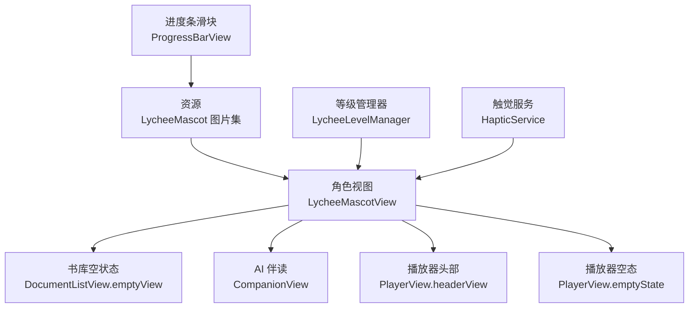
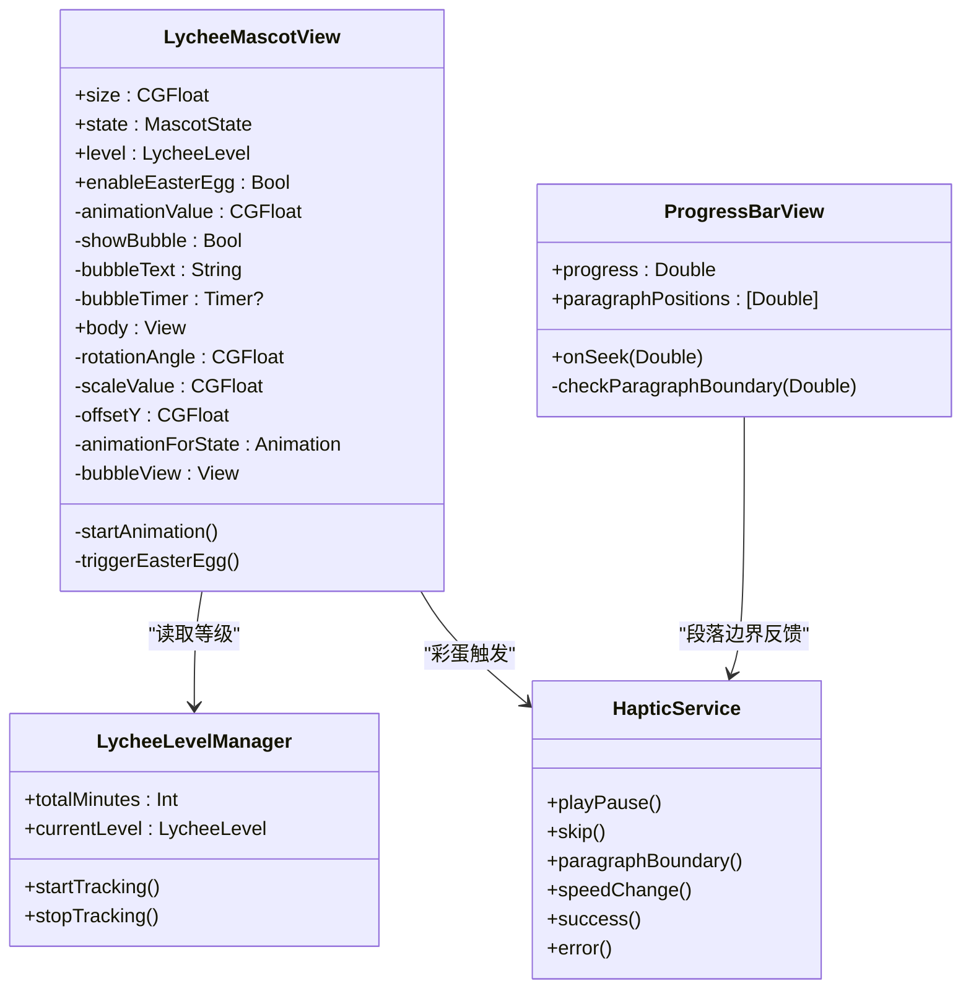
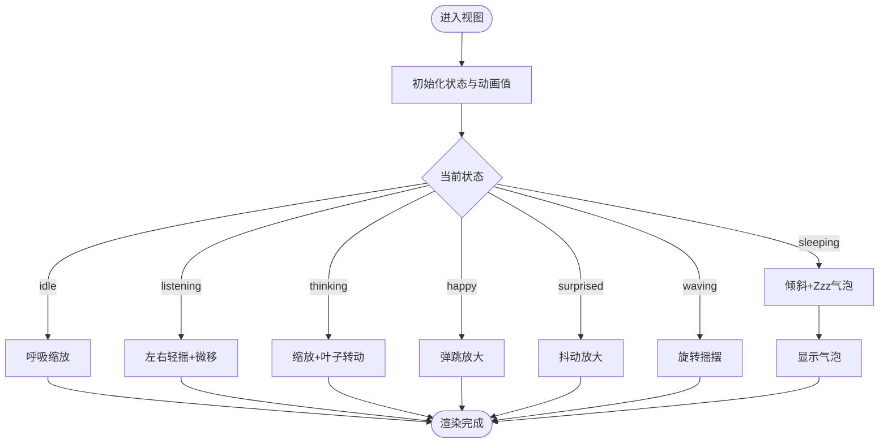
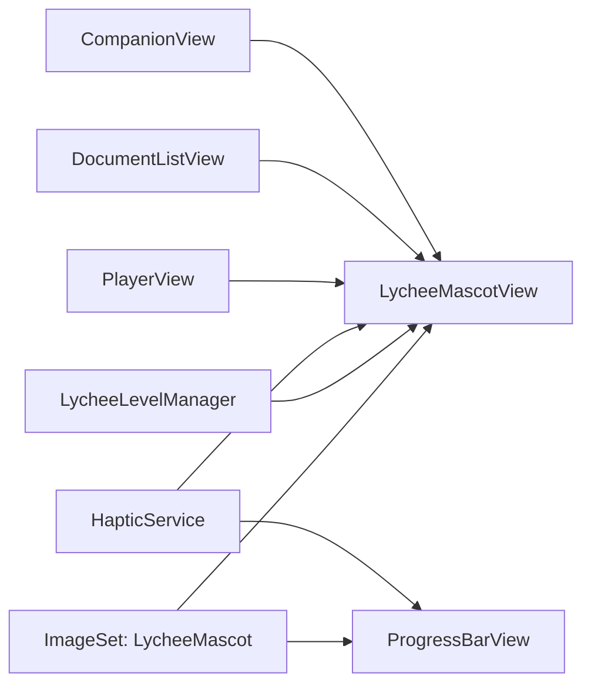

# 荔枝吉祥物系统

<cite>
**本文引用的文件**
- [LycheeMascotView.swift](file://Views/LycheeMascotView.swift)
- [DocumentListView.swift](file://Views/DocumentListView.swift)
- [CompanionView.swift](file://Views/CompanionView.swift)
- [PlayerView.swift](file://Views/PlayerView.swift)
- [ProgressBarView.swift](file://Views/ProgressBarView.swift)
- [LycheeLevelManager.swift](file://Models/LycheeLevelManager.swift)
- [HapticService.swift](file://Services/HapticService.swift)
- [Contents.json](file://Resources/Assets.xcassets/LycheeMascot.imageset/Contents.json)
</cite>

## 目录
1. [简介](#简介)
2. [项目结构](#项目结构)
3. [核心组件](#核心组件)
4. [架构总览](#架构总览)
5. [详细组件分析](#详细组件分析)
6. [依赖关系分析](#依赖关系分析)
7. [性能与体验优化](#性能与体验优化)
8. [故障排查指南](#故障排查指南)
9. [结论](#结论)

## 简介
本系统围绕“荔枝吉祥物”在应用内多场景的视觉与交互植入，构建了一个可复用、可扩展的角色视图组件。通过单一静态素材配合 SwiftUI 动画，实现多种表情状态（呼吸、摇摆、思考、开心、睡眠、惊讶、挥手），并叠加等级装饰与长按彩蛋气泡，贯穿书库空状态、AI 伴读头像、播放器伴侣、加载动画、进度条滑块、以及空播放态等关键界面，提升品牌感与用户情绪反馈。

## 项目结构
- 资源层：将角色图片作为独立 Image Set 管理，便于统一替换与缩放适配。
- 视图层：提供可复用的角色视图组件，并在多个页面中按需组合使用。
- 模型与服务层：提供等级成长追踪与触觉反馈服务，增强互动体验。

图表来源
- [LycheeMascotView.swift:44-101](file://Views/LycheeMascotView.swift#L44-L101)
- [DocumentListView.swift:191-233](file://Views/DocumentListView.swift#L191-L233)
- [CompanionView.swift:140-217](file://Views/CompanionView.swift#L140-L217)
- [PlayerView.swift:119-159](file://Views/PlayerView.swift#L119-L159)
- [ProgressBarView.swift:43-52](file://Views/ProgressBarView.swift#L43-L52)
- [LycheeLevelManager.swift:7-26](file://Models/LycheeLevelManager.swift#L7-L26)
- [HapticService.swift:6-23](file://Services/HapticService.swift#L6-L23)

章节来源
- [LycheeMascotView.swift:1-233](file://Views/LycheeMascotView.swift#L1-L233)
- [DocumentListView.swift:1-283](file://Views/DocumentListView.swift#L1-L283)
- [CompanionView.swift:1-256](file://Views/CompanionView.swift#L1-L256)
- [PlayerView.swift:1-385](file://Views/PlayerView.swift#L1-L385)
- [ProgressBarView.swift:1-112](file://Views/ProgressBarView.swift#L1-L112)
- [LycheeLevelManager.swift:1-53](file://Models/LycheeLevelManager.swift#L1-L53)
- [HapticService.swift:1-69](file://Services/HapticService.swift#L1-L69)
- [Contents.json:1-14](file://Resources/Assets.xcassets/LycheeMascot.imageset/Contents.json#L1-L14)

## 核心组件
- 角色视图 LycheeMascotView：封装了角色图像、动画参数、等级装饰与长按彩蛋逻辑，支持 size/state/level/easterEgg 等配置项。
- 等级管理器 LycheeLevelManager：基于累计收听时长计算等级，驱动角色大小与装饰变化。
- 触觉服务 HapticService：为快进/快退、段落边界、播放/暂停等操作提供一致的触觉反馈。
- 进度条 ProgressBarView：以荔枝小图标作为拖拽滑块，结合段落标记与触觉反馈，提升操作手感。

章节来源
- [LycheeMascotView.swift:44-210](file://Views/LycheeMascotView.swift#L44-L210)
- [LycheeLevelManager.swift:7-53](file://Models/LycheeLevelManager.swift#L7-L53)
- [HapticService.swift:6-69](file://Services/HapticService.swift#L6-L69)
- [ProgressBarView.swift:1-112](file://Views/ProgressBarView.swift#L1-L112)

## 架构总览
整体采用“单图 + 动画修饰符”的方式，避免多套素材带来的维护成本；通过枚举状态驱动不同动画曲线与幅度，形成统一的视觉语言。等级体系与触觉反馈作为横切关注点，被多处 UI 消费。

图表来源
- [LycheeMascotView.swift:44-210](file://Views/LycheeMascotView.swift#L44-L210)
- [LycheeLevelManager.swift:7-53](file://Models/LycheeLevelManager.swift#L7-L53)
- [HapticService.swift:6-69](file://Services/HapticService.swift#L6-L69)
- [ProgressBarView.swift:1-112](file://Views/ProgressBarView.swift#L1-L112)

## 详细组件分析

### 角色视图 LycheeMascotView
- 状态机：通过 MascotState 枚举驱动动画，覆盖 idle/listening/thinking/happy/sleeping/surprised/waving 七种状态。
- 动画参数：分别控制旋转角度、缩放比例、垂直偏移，并以不同 Animation 曲线循环播放。
- 等级装饰：根据 LycheeLevel 显示不同装饰图标与尺寸倍率。
- 彩蛋交互：长按触发震动与气泡提示，自动定时隐藏。

图表来源
- [LycheeMascotView.swift:105-175](file://Views/LycheeMascotView.swift#L105-L175)
- [LycheeMascotView.swift:179-193](file://Views/LycheeMascotView.swift#L179-L193)

章节来源
- [LycheeMascotView.swift:44-210](file://Views/LycheeMascotView.swift#L44-L210)

### 书库空状态 — 荔枝邀请你
- 使用 waving 状态的荔枝作为引导，搭配文案与导入按钮，降低新用户上手门槛。
- 长按触发惊喜彩蛋，增强品牌记忆点。

章节来源
- [DocumentListView.swift:191-233](file://Views/DocumentListView.swift#L191-L233)
- [LycheeMascotView.swift:179-193](file://Views/LycheeMascotView.swift#L179-L193)

### AI 伴读头像 — 荔枝伴读伙伴
- 欢迎区使用 waving 状态的大号荔枝，营造友好氛围。
- 消息气泡左侧展示小号荔枝头像，加载中切换为 thinking 状态替代传统进度指示。

章节来源
- [CompanionView.swift:140-217](file://Views/CompanionView.swift#L140-L217)
- [LycheeMascotView.swift:105-161](file://Views/LycheeMascotView.swift#L105-L161)

### 播放器伴侣 — 荔枝跟随
- 头部右侧展示随播放状态变化的荔枝：playing→listening、paused→idle、finished→happy、无文档→sleeping。
- 等级装饰与大小随累计收听时长动态变化。

章节来源
- [PlayerView.swift:119-159](file://Views/PlayerView.swift#L119-L159)
- [LycheeLevelManager.swift:7-53](file://Models/LycheeLevelManager.swift#L7-L53)

### 进度条滑块 — 荔枝拖动
- 以荔枝小图标作为拖拽滑块，滑动时轻微放大，经过段落边界触发选择型触觉反馈。
- 段落标记以细线形式呈现，辅助定位。

章节来源
- [ProgressBarView.swift:43-99](file://Views/ProgressBarView.swift#L43-L99)
- [HapticService.swift:41-47](file://Services/HapticService.swift#L41-L47)

### 空播放态 — 荔枝休眠
- 无文档时展示 sleeping 状态，传递“等待开始”的情绪信号。

章节来源
- [PlayerView.swift:352-367](file://Views/PlayerView.swift#L352-L367)

## 依赖关系分析
- 资源依赖：LycheeMascotView 与 ProgressBarView 均引用同一 Image Set，确保视觉一致性。
- 状态联动：PlayerView 将播放状态映射到 MascotState，LycheeLevelManager 驱动等级装饰。
- 触觉联动：HapticService 在快进/快退、段落边界、播放/暂停等动作中被调用，形成一致的手感。

图表来源
- [LycheeMascotView.swift:97-101](file://Views/LycheeMascotView.swift#L97-L101)
- [ProgressBarView.swift:43-52](file://Views/ProgressBarView.swift#L43-L52)
- [LycheeLevelManager.swift:7-53](file://Models/LycheeLevelManager.swift#L7-L53)
- [HapticService.swift:6-69](file://Services/HapticService.swift#L6-L69)
- [PlayerView.swift:119-159](file://Views/PlayerView.swift#L119-L159)
- [DocumentListView.swift:191-233](file://Views/DocumentListView.swift#L191-L233)
- [CompanionView.swift:140-217](file://Views/CompanionView.swift#L140-L217)

章节来源
- [LycheeMascotView.swift:97-101](file://Views/LycheeMascotView.swift#L97-L101)
- [ProgressBarView.swift:43-52](file://Views/ProgressBarView.swift#L43-L52)
- [LycheeLevelManager.swift:7-53](file://Models/LycheeLevelManager.swift#L7-L53)
- [HapticService.swift:6-69](file://Services/HapticService.swift#L6-L69)
- [PlayerView.swift:119-159](file://Views/PlayerView.swift#L119-L159)
- [DocumentListView.swift:191-233](file://Views/DocumentListView.swift#L191-L233)
- [CompanionView.swift:140-217](file://Views/CompanionView.swift#L140-L217)

## 性能与体验优化
- 动画性能：所有动画基于 SwiftUI 修饰符与 repeatForever 循环，避免额外帧动画或外部库，减少 CPU/GPU 压力。
- 资源复用：单张高分辨率素材配合 .resizable 与 aspectRatio 适配，降低内存占用与包体体积。
- 触觉预热：HapticService 预创建 generator 并 prepare，降低首次触发延迟，提升即时反馈体验。
- 等级更新节流：按分钟粒度更新等级，避免频繁状态变更导致的 UI 重绘。

[本节为通用建议，不直接分析具体文件]

## 故障排查指南
- 图片未显示
  - 检查 Image Set 名称与引用是否一致，确认 Contents.json 中的文件名与 scale 设置正确。
  - 路径参考：[Contents.json:1-14](file://Resources/Assets.xcassets/LycheeMascot.imageset/Contents.json#L1-L14)
- 动画不生效
  - 确认 state 已变更且触发了 onAppear/onChange 回调，检查 animationForState 返回值是否为非空 Animation。
  - 路径参考：[LycheeMascotView.swift:83-89](file://Views/LycheeMascotView.swift#L83-L89)、[LycheeMascotView.swift:146-161](file://Views/LycheeMascotView.swift#L146-L161)
- 彩蛋气泡不出现
  - 确认 enableEasterEgg 为 true，长按时间满足最小阈值，检查 bubbleTimer 是否正确调度与清理。
  - 路径参考：[LycheeMascotView.swift:85-88](file://Views/LycheeMascotView.swift#L85-L88)、[LycheeMascotView.swift:187-193](file://Views/LycheeMascotView.swift#L187-L193)
- 等级装饰不更新
  - 检查 LycheeLevelManager 的 totalMinutes 是否递增，currentLevel 是否发生变化并触发 UI 刷新。
  - 路径参考：[LycheeLevelManager.swift:31-44](file://Models/LycheeLevelManager.swift#L31-L44)
- 触觉反馈无效
  - 确认设备支持触觉反馈，检查对应方法是否被调用，generator 是否已 prepare。
  - 路径参考：[HapticService.swift:16-23](file://Services/HapticService.swift#L16-L23)、[HapticService.swift:28-67](file://Services/HapticService.swift#L28-L67)

章节来源
- [Contents.json:1-14](file://Resources/Assets.xcassets/LycheeMascot.imageset/Contents.json#L1-L14)
- [LycheeMascotView.swift:83-89](file://Views/LycheeMascotView.swift#L83-L89)
- [LycheeMascotView.swift:146-161](file://Views/LycheeMascotView.swift#L146-L161)
- [LycheeMascotView.swift:187-193](file://Views/LycheeMascotView.swift#L187-L193)
- [LycheeLevelManager.swift:31-44](file://Models/LycheeLevelManager.swift#L31-L44)
- [HapticService.swift:16-23](file://Services/HapticService.swift#L16-L23)
- [HapticService.swift:28-67](file://Services/HapticService.swift#L28-L67)

## 结论
本系统以轻量、高内聚的方式实现了荔枝吉祥物在多场景的统一表达：通过单一组件承载状态、动画与交互，结合等级系统与触觉反馈，既保证了视觉一致性，也提升了用户体验的丰富度。后续可在不引入新素材的前提下，扩展更多状态与装饰，持续强化品牌情感连接。