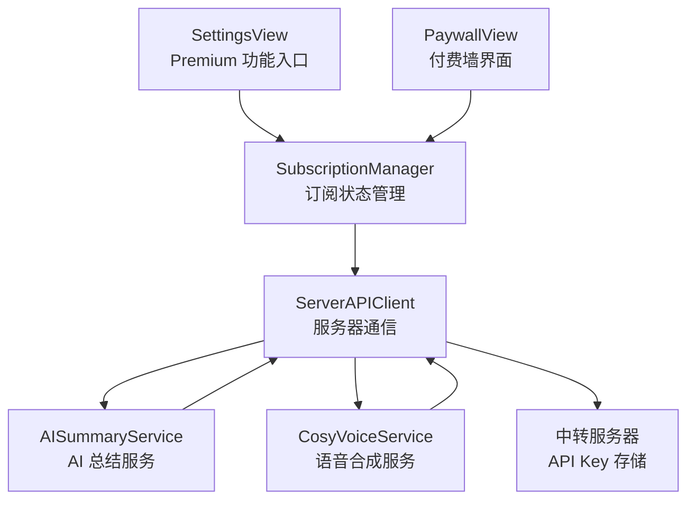
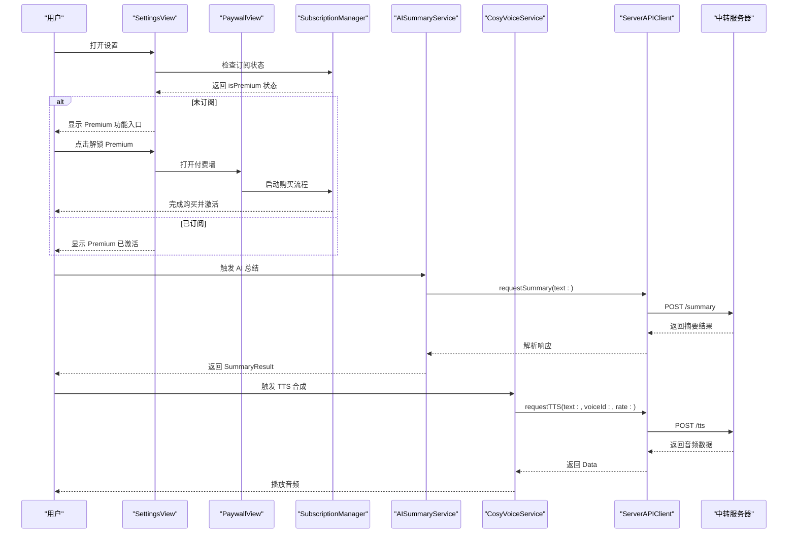
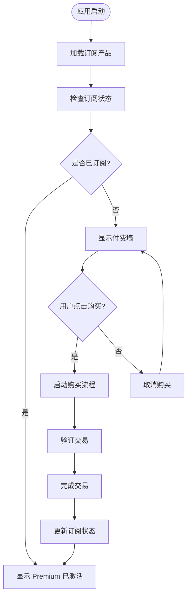
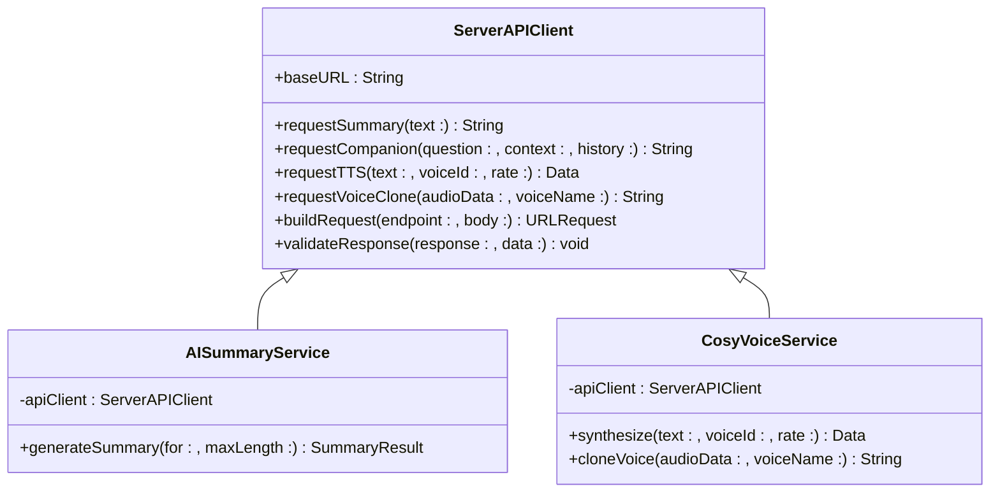
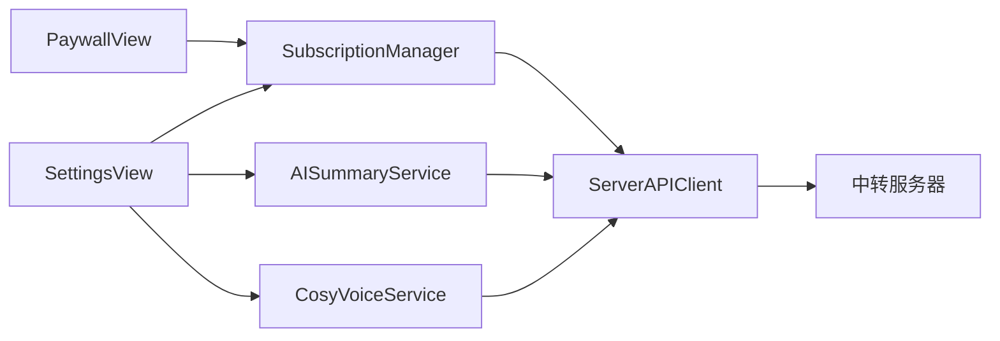

# API密钥配置

<cite>
**本文引用的文件**   
- [SubscriptionManager.swift](file://Services/SubscriptionManager.swift)
- [ServerAPIClient.swift](file://Services/ServerAPIClient.swift)
- [AISummaryService.swift](file://Services/AISummaryService.swift)
- [CosyVoiceService.swift](file://Services/CosyVoiceService.swift)
- [SettingsView.swift](file://Views/SettingsView.swift)
- [PaywallView.swift](file://Views/PaywallView.swift)
</cite>

## 更新摘要
**变更内容**   
- 完全移除了客户端侧 API 密钥配置功能（APIKeyConfigView 及相关组件已删除）
- 所有 AI 功能改为通过订阅制服务器中转访问
- API 密钥仅存储在服务器端，不再在客户端存储或配置
- 引入完整的订阅管理系统控制功能访问权限
- 简化了服务层架构，统一通过 ServerAPIClient 进行通信
- 新增付费墙界面和订阅状态管理

## 目录
1. [简介](#简介)
2. [项目结构](#项目结构)
3. [核心组件](#核心组件)
4. [架构总览](#架构总览)
5. [详细组件分析](#详细组件分析)
6. [依赖关系分析](#依赖关系分析)
7. [性能与安全考量](#性能与安全考量)
8. [故障排查指南](#故障排查指南)
9. [结论](#结论)
10. [附录：订阅制服务集成指南](#附录订阅制服务集成指南)

## 简介
本文件围绕"订阅制服务器中转架构"展开，说明客户端如何通过订阅管理访问 AI 服务，以及 API 密钥的安全存储策略。由于客户端侧 API 密钥配置功能已被完全移除，所有 AI 请求现在通过统一的服务器中转层处理，确保敏感信息的安全性。文档涵盖订阅状态管理、服务器通信机制、错误处理逻辑，以及新的安全最佳实践。

## 项目结构
与订阅制服务器中转相关的代码主要分布在以下位置：
- 订阅管理：SubscriptionManager（应用内购买和订阅状态管理）
- 服务器通信：ServerAPIClient（统一的 API 客户端，处理所有网络请求）
- 服务层：AISummaryService、CosyVoiceService（通过服务器中转调用 AI 服务）
- 设置入口：SettingsView（Premium 功能入口和订阅状态显示）
- 付费墙：PaywallView（订阅购买界面）

**图示来源**
- [SettingsView.swift:44-82](file://Views/SettingsView.swift#L44-L82)
- [SubscriptionManager.swift:8-39](file://Services/SubscriptionManager.swift#L8-L39)
- [ServerAPIClient.swift:6-23](file://Services/ServerAPIClient.swift#L6-L23)
- [AISummaryService.swift:6-11](file://Services/AISummaryService.swift#L6-L11)
- [CosyVoiceService.swift:7-12](file://Services/CosyVoiceService.swift#L7-L12)
- [PaywallView.swift:6-11](file://Views/PaywallView.swift#L6-L11)

**章节来源**
- [SubscriptionManager.swift:1-127](file://Services/SubscriptionManager.swift#L1-L127)
- [ServerAPIClient.swift:1-203](file://Services/ServerAPIClient.swift#L1-L203)
- [AISummaryService.swift:1-90](file://Services/AISummaryService.swift#L1-L90)
- [CosyVoiceService.swift:1-104](file://Services/CosyVoiceService.swift#L1-L104)
- [SettingsView.swift:1-321](file://Views/SettingsView.swift#L1-L321)
- [PaywallView.swift:1-181](file://Views/PaywallView.swift#L1-L181)

## 核心组件
- SubscriptionManager：管理 Premium 订阅状态，支持产品加载、购买、恢复购买等功能，使用 StoreKit 2 实现。
- ServerAPIClient：统一的服务器通信客户端，处理所有 AI 服务的网络请求，包含错误处理和响应验证。
- AISummaryService：AI 文档总结服务，通过服务器中转调用通义千问，不再直接访问 DashScope API。
- CosyVoiceService：CosyVoice 语音合成服务，通过服务器中转调用阿里云 DashScope，支持 TTS 和语音克隆。
- SettingsView：设置页面，显示 Premium 订阅状态和功能入口。
- PaywallView：付费墙界面，提供订阅购买功能和功能展示。

**章节来源**
- [SubscriptionManager.swift:8-39](file://Services/SubscriptionManager.swift#L8-L39)
- [ServerAPIClient.swift:6-23](file://Services/ServerAPIClient.swift#L6-L23)
- [AISummaryService.swift:6-11](file://Services/AISummaryService.swift#L6-L11)
- [CosyVoiceService.swift:7-12](file://Services/CosyVoiceService.swift#L7-L12)
- [SettingsView.swift:44-82](file://Views/SettingsView.swift#L44-L82)
- [PaywallView.swift:6-11](file://Views/PaywallView.swift#L6-L11)

## 架构总览
下图展示了用户从设置进入 Premium 功能、订阅后通过服务器中转访问 AI 服务的完整流程。

**图示来源**
- [SettingsView.swift:44-82](file://Views/SettingsView.swift#L44-L82)
- [PaywallView.swift:160-175](file://Views/PaywallView.swift#L160-L175)
- [SubscriptionManager.swift:56-69](file://Services/SubscriptionManager.swift#L56-L69)
- [AISummaryService.swift:20-23](file://Services/AISummaryService.swift#L20-L23)
- [CosyVoiceService.swift:22-24](file://Services/CosyVoiceService.swift#L22-L24)
- [ServerAPIClient.swift:27-33](file://Services/ServerAPIClient.swift#L27-L33)

## 详细组件分析

### 订阅管理系统
SubscriptionManager 负责管理应用的 Premium 订阅状态，使用 StoreKit 2 实现完整的订阅生命周期管理。

**主要功能：**
- 订阅状态检查：监听当前 entitlements，验证交易有效性
- 产品加载：从 App Store Connect 获取可用订阅产品
- 购买流程：处理用户购买请求，包括验证和完成交易
- 购买恢复：支持跨设备恢复购买记录

**图示来源**
- [SubscriptionManager.swift:34-39](file://Services/SubscriptionManager.swift#L34-L39)
- [SubscriptionManager.swift:56-69](file://Services/SubscriptionManager.swift#L56-L69)
- [SubscriptionManager.swift:71-95](file://Services/SubscriptionManager.swift#L71-95)

**章节来源**
- [SubscriptionManager.swift:8-39](file://Services/SubscriptionManager.swift#L8-L39)
- [SubscriptionManager.swift:56-69](file://Services/SubscriptionManager.swift#L56-L69)
- [SubscriptionManager.swift:71-95](file://Services/SubscriptionManager.swift#L71-95)

### 服务器 API 客户端
ServerAPIClient 是所有 AI 服务请求的统一入口，负责与中转服务器通信，处理网络请求、响应验证和错误处理。

**核心特性：**
- 统一的基础 URL 配置，便于部署环境切换
- 自动的请求超时和资源超时管理
- 标准化的 JSON 请求体构建
- 灵活的响应解析，支持多种数据格式
- 全面的错误分类和处理

**图示来源**
- [ServerAPIClient.swift:6-23](file://Services/ServerAPIClient.swift#L6-L23)
- [AISummaryService.swift:6-11](file://Services/AISummaryService.swift#L6-L11)
- [CosyVoiceService.swift:7-12](file://Services/CosyVoiceService.swift#L7-L12)

**章节来源**
- [ServerAPIClient.swift:6-23](file://Services/ServerAPIClient.swift#L6-L23)
- [ServerAPIClient.swift:27-33](file://Services/ServerAPIClient.swift#L27-L33)
- [ServerAPIClient.swift:49-88](file://Services/ServerAPIClient.swift#L49-L88)
- [ServerAPIClient.swift:101-110](file://Services/ServerAPIClient.swift#L101-L110)
- [ServerAPIClient.swift:161-173](file://Services/ServerAPIClient.swift#L161-L173)

### 服务层重构
AISummaryService 和 CosyVoiceService 经过重构，移除了直接的 API Key 管理和 UserDefaults 依赖，改为通过 ServerAPIClient 进行所有网络请求。

**AISummaryService 变更：**
- 移除了 apiKey 属性和相关初始化逻辑
- 直接使用 ServerAPIClient.shared 进行请求
- 简化了错误处理，专注于业务逻辑

**CosyVoiceService 变更：**
- 移除了 apiKey 属性和相关鉴权逻辑
- 通过 ServerAPIClient 处理 TTS 和语音克隆请求
- 保留了分段合成的辅助功能

**章节来源**
- [AISummaryService.swift:6-11](file://Services/AISummaryService.swift#L6-L11)
- [AISummaryService.swift:20-23](file://Services/AISummaryService.swift#L20-L23)
- [CosyVoiceService.swift:7-12](file://Services/CosyVoiceService.swift#L7-L12)
- [CosyVoiceService.swift:22-24](file://Services/CosyVoiceService.swift#L22-L24)

### 设置界面更新
SettingsView 进行了重大更新，移除了 API Key 配置入口，新增了 Premium 订阅功能展示和管理。

**主要变更：**
- 新增 Premium 功能区域，显示订阅状态
- 移除 API Key 配置相关的所有 UI 元素
- 添加订阅状态检查和购买入口
- 保持其他设置功能的完整性

**章节来源**
- [SettingsView.swift:44-82](file://Views/SettingsView.swift#L44-L82)
- [SettingsView.swift:76-82](file://Views/SettingsView.swift#L76-L82)

### 付费墙界面
PaywallView 提供了完整的订阅购买界面，展示 Premium 功能列表和订阅选项。

**主要功能：**
- 功能展示：清晰列出所有 Premium 功能
- 订阅选项：支持月度和年度订阅
- 购买流程：集成 StoreKit 2 购买流程
- 错误处理：完善的购买错误提示
- 恢复购买：支持跨设备恢复购买记录

**章节来源**
- [PaywallView.swift:6-11](file://Views/PaywallView.swift#L6-L11)
- [PaywallView.swift:160-175](file://Views/PaywallView.swift#L160-L175)

### 错误处理机制
新的错误处理机制集中在 ServerAPIClient 中，提供统一的错误分类和用户友好的错误消息。

**错误类型：**
- invalidResponse：服务器返回数据异常
- unauthorized：认证失败，需要重新订阅
- quotaExceeded：使用次数超限
- noAudioData：未获取到音频数据
- serverError：服务器错误，包含状态码和消息
- networkError：网络连接错误

**章节来源**
- [ServerAPIClient.swift:178-202](file://Services/ServerAPIClient.swift#L178-L202)
- [ServerAPIClient.swift:161-173](file://Services/ServerAPIClient.swift#L161-L173)

## 依赖关系分析
新的架构简化了依赖关系，消除了客户端对 API Key 的直接依赖，所有 AI 服务都通过统一的服务器中转层访问。

**图示来源**
- [SettingsView.swift:44-82](file://Views/SettingsView.swift#L44-L82)
- [SubscriptionManager.swift:8-39](file://Services/SubscriptionManager.swift#L8-L39)
- [AISummaryService.swift:6-11](file://Services/AISummaryService.swift#L6-L11)
- [CosyVoiceService.swift:7-12](file://Services/CosyVoiceService.swift#L7-L12)
- [ServerAPIClient.swift:6-23](file://Services/ServerAPIClient.swift#L6-L23)
- [PaywallView.swift:6-11](file://Views/PaywallView.swift#L6-L11)

**章节来源**
- [SettingsView.swift:44-82](file://Views/SettingsView.swift#L44-L82)
- [SubscriptionManager.swift:8-39](file://Services/SubscriptionManager.swift#L8-L39)
- [AISummaryService.swift:6-11](file://Services/AISummaryService.swift#L6-L11)
- [CosyVoiceService.swift:7-12](file://Services/CosyVoiceService.swift#L7-L12)
- [ServerAPIClient.swift:6-23](file://Services/ServerAPIClient.swift#L6-L23)
- [PaywallView.swift:6-11](file://Views/PaywallView.swift#L6-L11)

## 性能与安全考量
**性能优化：**
- 统一的 URLSession 配置，避免重复创建连接
- 合理的超时设置，防止长时间阻塞
- 服务端缓存和负载均衡，提升响应速度
- 分段合成支持，适合长文本场景

**安全增强：**
- API Key 完全从客户端移除，仅存储在服务器端
- 所有敏感操作通过 HTTPS 加密传输
- 订阅状态验证，防止未授权访问
- 服务器端限流和配额管理
- 统一的错误处理，避免敏感信息泄露

**章节来源**
- [ServerAPIClient.swift:18-23](file://Services/ServerAPIClient.swift#L18-L23)
- [CosyVoiceService.swift:58-77](file://Services/CosyVoiceService.swift#L58-L77)
- [ServerAPIClient.swift:161-173](file://Services/ServerAPIClient.swift#L161-L173)

## 故障排查指南
**现象：提示"请确认已订阅 Premium"**
- 原因：服务器返回 401/403 错误，表示未订阅或订阅过期
- 处理：检查订阅状态，引导用户完成购买流程

**现象：提示"本月使用次数已达上限"**
- 原因：服务器返回 402/429 错误，表示达到配额限制
- 处理：升级套餐或等待下月重置

**现象：提示"服务器返回数据异常"**
- 原因：服务器响应格式不符合预期
- 处理：检查网络连接，稍后重试

**现象：提示"网络错误"**
- 原因：网络连接失败或超时
- 处理：检查网络连接状态，确认服务器可达性

**章节来源**
- [ServerAPIClient.swift:178-202](file://Services/ServerAPIClient.swift#L178-L202)
- [ServerAPIClient.swift:161-173](file://Services/ServerAPIClient.swift#L161-L173)

## 结论
通过移除客户端侧 API 密钥配置功能并引入订阅制服务器中转架构，应用实现了更高的安全性和更简洁的用户体验。新的架构将敏感信息完全托管在服务器端，通过订阅管理控制功能访问权限，同时保持了良好的性能和可扩展性。这种设计模式为未来的功能扩展和安全增强奠定了坚实基础。

## 附录：订阅制服务集成指南
**新增订阅功能步骤：**
1. 在 App Store Connect 中配置订阅产品和定价
2. 更新 SubscriptionManager 中的 productIDs 配置
3. 在 SettingsView 中添加订阅状态检查和购买入口
4. 在服务层添加订阅状态验证逻辑
5. 实现错误处理和用户反馈机制

**服务器中转 API 开发要点：**
1. 设计统一的 API 接口规范
2. 实现 API Key 管理和轮换机制
3. 添加请求频率限制和配额管理
4. 实现完善的日志记录和监控
5. 提供健康检查和状态查询接口

**迁移现有功能建议：**
1. 逐步替换直接 API 调用为服务器中转
2. 保持向后兼容的错误处理
3. 添加详细的日志记录便于调试
4. 实施 A/B 测试验证新功能效果
5. 建立完善的监控和告警机制