# 设置界面

<cite>
**本文引用的文件**
- [Views/SettingsView.swift](file://Views/SettingsView.swift)
- [Views/PaywallView.swift](file://Views/PaywallView.swift)
- [Services/SubscriptionManager.swift](file://Services/SubscriptionManager.swift)
- [Views/VoiceSelectView.swift](file://Views/VoiceSelectView.swift)
- [Views/VoiceCloneView.swift](file://Views/VoiceCloneView.swift)
- [Views/SystemVoiceSelectView.swift](file://Views/SystemVoiceSelectView.swift)
- [Views/EdgeVoiceSelectView.swift](file://Views/EdgeVoiceSelectView.swift)
- [Models/VoiceConfig.swift](file://Models/VoiceConfig.swift)
- [Models/ClonedVoice.swift](file://Models/ClonedVoice.swift)
- [Models/ThemeMode.swift](file://Models/ThemeMode.swift)
- [Models/LycheeLevelManager.swift](file://Models/LycheeLevelManager.swift)
- [Services/ThemeManager.swift](file://Services/ThemeManager.swift)
- [Services/SystemVoiceManager.swift](file://Services/SystemVoiceManager.swift)
- [Services/EdgeTTSService.swift](file://Services/EdgeTTSService.swift)
- [Services/EdgeTTSSynthesizer.swift](file://Services/EdgeTTSSynthesizer.swift)
- [Services/CompanionService.swift](file://Services/CompanionService.swift)
- [ViewModels/SpeakerViewModel.swift](file://ViewModels/SpeakerViewModel.swift)
- [Services/CosyVoiceService.swift](file://Services/CosyVoiceService.swift)
- [Services/ErrorHandler.swift](file://Services/ErrorHandler.swift)
- [privacy-policy.html](file://privacy-policy.html)
</cite>

## 更新摘要
**已进行的更改**
- Premium订阅入口视觉设计升级：移除彩色渐变背景，采用轻量级图标和次级颜色背景的简洁设计
- 新增隐私政策页面集成：在"关于"部分添加隐私政策链接，提供完整的数据收集、本地存储、服务器处理、第三方服务集成、App Store购买处理、安全措施和儿童隐私保护信息
- 优化Premium功能卡片的视觉层次结构，提升用户体验

## 目录
1. [简介](#简介)
2. [项目结构](#项目结构)
3. [核心组件](#核心组件)
4. [架构总览](#架构总览)
5. [详细组件分析](#详细组件分析)
6. [依赖关系分析](#依赖关系分析)
7. [性能与体验优化](#性能与体验优化)
8. [故障排查指南](#故障排查指南)
9. [结论](#结论)
10. [附录：扩展开发指南](#附录扩展开发指南)

## 简介
本文件面向开发者与维护者，系统化梳理"设置"相关界面的整体布局、功能组织与数据流，覆盖以下要点：
- SettingsView的多引擎动态适配与分组交互逻辑，包括即将推出功能的特殊处理和Premium订阅管理
- AI伴读难度级别选择功能，支持入门、进阶、专业三种回答风格的个性化配置
- Edge TTS引擎集成，提供免费的微软Neural云端语音合成服务
- SubscriptionManager的订阅状态管理与StoreKit 2集成
- PaywallView的付费墙界面设计和购买流程
- VoiceSelectView的AI音色选择与参数调节联动
- SystemVoiceSelectView的Apple Neural TTS专业音色管理与下载引导
- EdgeVoiceSelectView的云端音色选择和试听功能
- VoiceCloneView的声音克隆流程与用户引导
- LycheeLevelManager的荔枝成长体系管理
- 主题切换、语言设置与其他配置的持久化策略
- 设置验证、默认值恢复与配置导入导出能力（含实现建议）
- 新增设置项与自定义配置界面的开发规范
- **新增** 隐私政策页面集成和用户隐私保护措施说明

## 项目结构
设置相关的代码主要分布在 Views、Models、Services 与 ViewModels 四个层次：
- Views：提供 UI 与用户交互（设置主界面、付费墙、音色选择、语音克隆、系统音色管理、AI伴读难度选择、Edge云端音色管理）
- Models：定义配置模型、主题枚举、预设与克隆音色数据结构、荔枝等级管理器
- Services：主题管理、CosyVoice 服务、系统语音管理、错误处理、订阅管理、AI伴读服务、Edge TTS服务和合成器
- ViewModels：统一编排播放引擎、配置加载与保存、状态同步

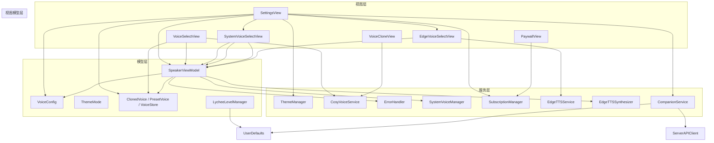
```mermaid
graph TB
subgraph "视图层"
SV["SettingsView"]
PV["PaywallView"]
VSV["VoiceSelectView"]
VCV["VoiceCloneView"]
SYSVS["SystemVoiceSelectView"]
EVSV["EdgeVoiceSelectView"]
end
subgraph "模型层"
VC["VoiceConfig"]
TV["ThemeMode"]
CV["ClonedVoice / PresetVoice / VoiceStore"]
SVM["SystemVoiceInfo"]
LLM["LycheeLevelManager"]
end
subgraph "服务层"
TM["ThemeManager"]
CVS["CosyVoiceService"]
EH["ErrorHandler"]
SYSVM["SystemVoiceManager"]
SM["SubscriptionManager"]
ETS["EdgeTTSService"]
ETSS["EdgeTTSSynthesizer"]
CS["CompanionService"]
end
subgraph "视图模型层"
SVM["SpeakerViewModel"]
end
SV --> SVM
SV --> TM
SV --> VC
SV --> CV
SV --> SYSVS
SV --> EVSV
SV --> SM
SV --> CS
PV --> SM
VSV --> SVM
VSV --> CV
VSV --> CVS
VCV --> CVS
SYSVS --> SVM
SYSVS --> SVM
SYSVS --> SVM
EVSV --> SVM
EVSV --> ETS
SVM --> VC
SVM --> CV
SVM --> EH
SVM --> SYSVM
SVM --> ETSS
LLM --> UserDefaults
CS --> UserDefaults
CS --> ServerAPIClient
```

**图表来源**
- [Views/SettingsView.swift:1-429](file://Views/SettingsView.swift#L1-L429)
- [Views/PaywallView.swift:1-181](file://Views/PaywallView.swift#L1-L181)
- [Services/SubscriptionManager.swift:1-127](file://Services/SubscriptionManager.swift#L1-L127)
- [Views/VoiceSelectView.swift:1-215](file://Views/VoiceSelectView.swift#L1-L215)
- [Views/VoiceCloneView.swift:1-404](file://Views/VoiceCloneView.swift#L1-L404)
- [Views/SystemVoiceSelectView.swift:1-274](file://Views/SystemVoiceSelectView.swift#L1-L274)
- [Views/EdgeVoiceSelectView.swift:1-174](file://Views/EdgeVoiceSelectView.swift#L1-L174)
- [Models/VoiceConfig.swift:1-82](file://Models/VoiceConfig.swift#L1-L82)
- [Models/ClonedVoice.swift:1-118](file://Models/ClonedVoice.swift#L1-L118)
- [Models/ThemeMode.swift:1-25](file://Models/ThemeMode.swift#L1-L25)
- [Models/LycheeLevelManager.swift:1-53](file://Models/LycheeLevelManager.swift#L1-L53)
- [Services/ThemeManager.swift:1-25](file://Services/ThemeManager.swift#L1-L25)
- [Services/SystemVoiceManager.swift:1-104](file://Services/SystemVoiceManager.swift#L1-L104)
- [Services/EdgeTTSService.swift:1-134](file://Services/EdgeTTSService.swift#L1-L134)
- [Services/EdgeTTSSynthesizer.swift:1-248](file://Services/EdgeTTSSynthesizer.swift#L1-L248)
- [Services/CompanionService.swift:1-170](file://Services/CompanionService.swift#L1-L170)
- [Services/CosyVoiceService.swift:1-219](file://Services/CosyVoiceService.swift#L1-L219)
- [Services/ErrorHandler.swift:1-53](file://Services/ErrorHandler.swift#L1-L53)
- [ViewModels/SpeakerViewModel.swift:1-402](file://ViewModels/SpeakerViewModel.swift#L1-L402)

## 核心组件
- **SettingsView**：设置主入口，支持多TTS引擎动态适配，按引擎类型显示不同的语音选择界面；实时应用并持久化配置；**已升级** Premium订阅状态显示和付费墙访问入口，采用轻量级图标和次级颜色背景的简洁设计；AI伴读难度级别选择功能，使用分段控件实现入门、进阶、专业三种回答风格的切换；Edge TTS引擎支持，显示绿色"免费"徽章；即将推出功能的灰化处理；移除 API密钥配置功能；**新增** 隐私政策链接集成
- **CompanionService**：AI伴读服务，管理对话历史、学习状态和难度级别配置，通过服务器中转调用通义千问，支持多轮对话和上下文感知
- **LycheeLevelManager**：荔枝成长体系管理器，根据累计收听时长计算荔枝等级，提供实时追踪和持久化存储
- **EdgeVoiceSelectView**：专为Edge TTS设计的云端音色选择界面，展示精选中文和粤语音色列表，支持试听功能和性别标识
- **EdgeTTSService**：Edge TTS云端语音合成服务，通过自建服务器中转调用微软Edge TTS，提供免费无限量的高质量语音合成
- **EdgeTTSSynthesizer**：Edge TTS引擎适配器，实现SpeechSynthesizerProtocol，支持分段合成、位置追踪和错误降级
- **SubscriptionManager**：订阅管理器，基于StoreKit 2实现订阅状态检查、产品加载、购买和恢复功能
- **PaywallView**：付费墙界面，展示Premium功能列表和订阅选项，提供完整的购买流程
- **SystemVoiceSelectView**：专为iOS 17+ Apple Neural TTS设计的音色选择界面，提供推荐音色分类和专业音质标识；增强下载引导和用户提示功能
- VoiceSelectView：展示"我的音色"和"预设音色"，支持试听、删除、选择并切换引擎
- VoiceCloneView：录音→预览→上传→AI 学习→完成的全流程引导，包含权限校验、时长校验与错误提示
- ThemeManager：主题模式单例，读写 UserDefaults，驱动全局主题切换
- SpeakerViewModel：统一暴露 TTS 控制接口，负责引擎切换、配置加载/保存、播放状态同步与降级策略；增加Edge TTS引擎支持和错误降级逻辑
- CosyVoiceService：封装云端 TTS 与克隆接口，返回音频或 voice_id，集中错误类型
- SystemVoiceManager：系统语音管理器，提供iOS 17+ Neural TTS音色查询和推荐算法
- ErrorHandler：统一错误日志与弹窗提示

## 架构总览
设置界面采用 MVVM + Service 分层，支持多引擎动态适配、AI伴读难度管理和订阅管理：
- 视图层通过 @ObservedObject/@State 绑定 ViewModel 与服务，响应式更新 UI
- 配置以 JSON 编码后写入 UserDefaults，保证跨会话持久化
- AI伴读难度级别通过 CompanionService.difficulty 属性管理，自动持久化到 UserDefaults
- 引擎切换由 SpeakerViewModel 统一调度，必要时自动降级到系统 TTS
- 云端能力通过 CosyVoiceService 和 EdgeTTSService 调用，错误集中抛出并由 ErrorHandler 呈现
- 订阅管理通过 SubscriptionManager 统一管理，使用 StoreKit 2 进行 IAP 处理
- 设备能力检查通过 TTSEngine.isSupported 属性在渲染前过滤不支持的引擎选项
- 即将推出功能通过专门的视图构建器处理禁用状态
- 荔枝成长体系通过 LycheeLevelManager 管理累计收听时长和等级变化

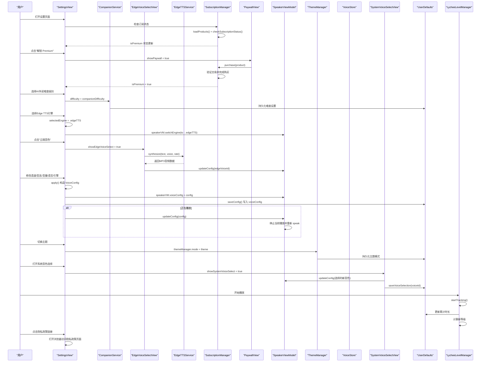
```mermaid
sequenceDiagram
participant U as "用户"
participant S as "SettingsView"
participant CS as "CompanionService"
participant EVSV as "EdgeVoiceSelectView"
participant ETS as "EdgeTTSService"
participant SM as "SubscriptionManager"
participant PV as "PaywallView"
participant VM as "SpeakerViewModel"
participant TM as "ThemeManager"
participant VS as "VoiceStore"
participant SVS as "SystemVoiceSelectView"
participant UD as "UserDefaults"
participant LLM as "LycheeLevelManager"
U->>S : 打开设置页面
S->>SM : 检查订阅状态
SM->>SM : loadProducts() + checkSubscriptionStatus()
SM-->>S : isPremium 状态更新
U->>S : 点击"解锁 Premium"
S->>PV : showPaywall = true
PV->>SM : purchase(product)
SM->>SM : 验证交易并完成购买
SM-->>S : isPremium = true
U->>S : 选择AI伴读难度级别
S->>CS : difficulty = companionDifficulty
CS->>UD : 持久化难度设置
U->>S : 选择Edge TTS引擎
S->>S : selectedEngine = .edgeTTS
S->>VM : speakerVM.switchEngine(to : .edgeTTS)
U->>S : 点击"云端音色"
S->>EVSV : showEdgeVoiceSelect = true
EVSV->>ETS : synthesize(text, voice, rate)
ETS-->>EVSV : 返回MP3音频数据
EVSV->>VM : updateConfig(edgeVoiceId)
U->>S : 修改语速/音高/音量/语言/引擎
S->>S : apply() 构造 VoiceConfig
S->>VM : speakerVM.voiceConfig = config
S->>UD : saveConfig() 写入 voiceConfig
alt 正在播放
S->>VM : updateConfig(config)
VM->>VM : 停止当前播放并重新 speak
end
U->>S : 切换主题
S->>TM : themeManager.mode = theme
TM->>UD : 持久化主题模式
U->>S : 打开系统音色选择
S->>SVS : showSystemVoiceSelect = true
SVS->>VM : updateConfig(选择的新音色)
SVS->>UD : saveVoiceSelection(voiceId)
U->>LLM : 开始播放
LLM->>LLM : startTracking()
LLM->>UD : 更新累计时长
LLM->>LLM : 计算新等级
U->>S : 点击隐私政策链接
S->>S : 打开浏览器访问隐私政策页面
```

**图表来源**
- [Views/SettingsView.swift:282-309](file://Views/SettingsView.swift#L282-L309)
- [Services/CompanionService.swift:21-25](file://Services/CompanionService.swift#L21-L25)
- [Views/SettingsView.swift:44-102](file://Views/SettingsView.swift#L44-L102)
- [Views/SettingsView.swift:231-258](file://Views/SettingsView.swift#L231-L258)
- [Views/EdgeVoiceSelectView.swift:123-152](file://Views/EdgeVoiceSelectView.swift#L123-L152)
- [Services/EdgeTTSService.swift:63-92](file://Services/EdgeTTSService.swift#L63-L92)
- [Views/SettingsView.swift:245-247](file://Views/SettingsView.swift#L245-L247)
- [Views/PaywallView.swift:160-175](file://Views/PaywallView.swift#L160-L175)
- [Services/SubscriptionManager.swift:72-95](file://Services/SubscriptionManager.swift#L72-95)
- [Views/SystemVoiceSelectView.swift:95-106](file://Views/SystemVoiceSelectView.swift#L95-L106)
- [ViewModels/SpeakerViewModel.swift:186-196](file://ViewModels/SpeakerViewModel.swift#L186-L196)
- [Services/ThemeManager.swift:10-23](file://Services/ThemeManager.swift#L10-L23)
- [Models/ClonedVoice.swift:72-90](file://Models/ClonedVoice.swift#L72-L90)
- [Models/LycheeLevelManager.swift:30-45](file://Models/LycheeLevelManager.swift#L30-L45)
- [Views/SettingsView.swift:307-319](file://Views/SettingsView.swift#L307-L319)

## 详细组件分析

### SettingsView：多引擎动态适配的设置主界面
- **更新** 分组与布局
  - 外观：遍历 ThemeMode 列表，点击即切换主题，右侧显示选中标记
  - **已升级** Premium 功能：采用轻量级图标和次级颜色背景的简洁设计，未订阅用户显示带有浅色背景图标的卡片，包含副标题描述"AI 总结、AI 伴读、高品质音色"，提供更好的视觉层次结构；已订阅用户显示皇冠图标和"Premium 已激活"状态，附带"全部 AI 功能已解锁"的详细说明
  - AI伴读设置：独立的"AI 伴读"分组，包含回答风格选择器和详细说明
    - 使用分段控件实现入门、进阶、专业三种难度级别的直观选择
    - 每个级别配有详细的风格说明，帮助用户理解不同选项的特点
    - 实时更新 CompanionService.shared.difficulty 并持久化存储
  - 语音引擎：使用 `TTSEngine.allCases.filter { $0.isSupported }` 动态过滤支持的引擎；每个引擎显示名称和描述；Knowledge Voice 现在显示"即将推出"标签和锁图标，处于禁用状态；Apple Neural TTS 标记为"推荐"选项；Edge TTS 显示"免费"绿色徽章
  - 智能语音选择：根据当前选择的引擎类型显示对应的语音选择界面
    - Apple Neural TTS：显示"系统音色"按钮，打开 SystemVoiceSelectView
    - Knowledge Voice：显示"AI 音色"按钮，打开 VoiceSelectView  
    - Edge TTS：显示"云端音色"按钮，打开 EdgeVoiceSelectView，显示当前选中的云语音名称
    - 传统系统 TTS：显示传统的语言和声音 Picker
  - 朗读设置：语速滑块+快捷档位、音高滑块、音量滑块；变更时即时 apply()
  - 关于：显示版本号；**新增** 隐私政策链接，点击可访问完整的隐私政策页面
- **更新** 数据流
  - onAppear 从 speakerVM.voiceConfig 初始化本地 State，同时从 CompanionService.shared.difficulty 加载AI伴读难度设置
  - apply() 构建 VoiceConfig 并写入 UserDefaults，若处于播放中则调用 updateConfig 热更新
  - saveConfig() 将完整配置 JSON 编码保存
- **新增** 关键点
  - 使用 AVSpeechSynthesisVoice.speechVoices() 动态获取可用语音并按语言前缀过滤
  - 当引擎为 Knowledge Voice 时，VoiceConfig 会附带 selectedCloneId/presetVoiceId
  - 设备能力检查：通过 `TTSEngine.isSupported` 属性在 iOS < 17 时自动过滤 Apple Neural TTS
  - 条件渲染：根据 selectedEngine 的值动态显示相应的语音选择入口
  - comingSoonEngineRow() 视图构建器：为即将推出的功能提供统一的禁用状态处理
  - 订阅状态监听：通过 @ObservedObject subscriptionManager 实时响应订阅状态变化
  - Edge TTS徽章显示：当选中Edge TTS引擎时，显示绿色"免费"标签
  - AI伴读难度级别管理：通过分段控件实现直观的三级难度选择，实时更新并持久化
  - **新增** 隐私政策集成：在"关于"部分添加隐私政策链接，指向 naolizhi.cn/privacy.html
- **移除** API密钥配置：不再在设置界面中显示API Key输入和保存功能

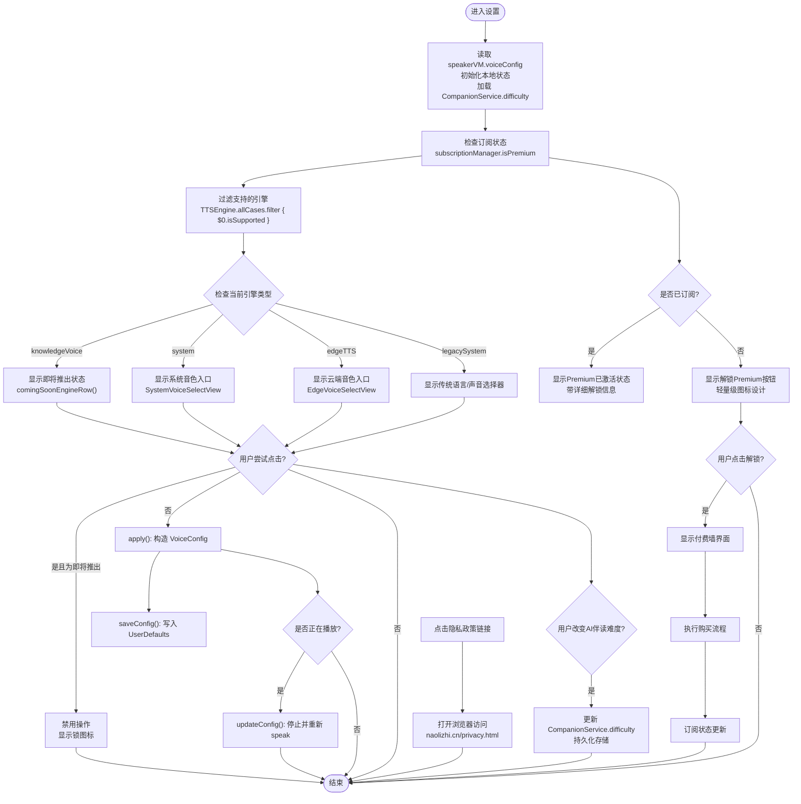
```mermaid
flowchart TD
Start(["进入设置"]) --> Init["读取 speakerVM.voiceConfig<br/>初始化本地状态<br/>加载 CompanionService.difficulty"]
Init --> CheckSub["检查订阅状态<br/>subscriptionManager.isPremium"]
CheckSub --> Filter["过滤支持的引擎<br/>TTSEngine.allCases.filter { $0.isSupported }"]
Filter --> EngineCheck{"检查当前引擎类型"}
EngineCheck --> |knowledgeVoice| ShowComingSoon["显示即将推出状态<br/>comingSoonEngineRow()"]
EngineCheck --> |system| ShowSystemVoice["显示系统音色入口<br/>SystemVoiceSelectView"]
EngineCheck --> |edgeTTS| ShowEdgeVoice["显示云端音色入口<br/>EdgeVoiceSelectView"]
EngineCheck --> |legacySystem| ShowLegacyPicker["显示传统语言/声音选择器"]
ShowComingSoon --> UserChange{"用户尝试点击?"}
ShowSystemVoice --> UserChange
ShowEdgeVoice --> UserChange
ShowLegacyPicker --> UserChange
UserChange --> |是且为即将推出| Disabled["禁用操作<br/>显示锁图标"]
UserChange --> |否| Apply["apply(): 构造 VoiceConfig"]
Apply --> Persist["saveConfig(): 写入 UserDefaults"]
Apply --> Playing{"是否正在播放?"}
Playing --> |是| Update["updateConfig(): 停止并重新 speak"]
Playing --> |否| End(["结束"])
Update --> End
Disabled --> End
UserChange --> |否| End
CheckSub --> PremiumCheck{"是否已订阅?"}
PremiumCheck --> |是| ShowPremium["显示Premium已激活状态<br/>带详细解锁信息"]
PremiumCheck --> |否| ShowUnlock["显示解锁Premium按钮<br/>轻量级图标设计"]
ShowUnlock --> ClickUnlock{"用户点击解锁?"}
ClickUnlock --> |是| ShowPaywall["显示付费墙界面"]
ClickUnlock --> |否| End
ShowPaywall --> Purchase["执行购买流程"]
Purchase --> SubUpdated["订阅状态更新"]
SubUpdated --> End
UserChange --> DifficultyChange{"用户改变AI伴读难度?"}
DifficultyChange --> |是| UpdateDifficulty["更新 CompanionService.difficulty<br/>持久化存储"]
UpdateDifficulty --> End
AboutSection["点击隐私政策链接"] --> OpenPrivacy["打开浏览器访问<br/>naolizhi.cn/privacy.html"]
OpenPrivacy --> End
```

**图表来源**
- [Views/SettingsView.swift:44-102](file://Views/SettingsView.swift#L44-L102)
- [Views/SettingsView.swift:104-140](file://Views/SettingsView.swift#L104-L140)
- [Views/SettingsView.swift:282-309](file://Views/SettingsView.swift#L282-L309)
- [Views/SettingsView.swift:231-258](file://Views/SettingsView.swift#L231-L258)
- [Views/SettingsView.swift:307-339](file://Views/SettingsView.swift#L307-L339)
- [Views/SettingsView.swift:245-247](file://Views/SettingsView.swift#L245-L247)
- [Services/SubscriptionManager.swift:57-69](file://Services/SubscriptionManager.swift#L57-L69)
- [Services/CompanionService.swift:21-25](file://Services/CompanionService.swift#L21-L25)
- [Views/SettingsView.swift:307-319](file://Views/SettingsView.swift#L307-L319)

**章节来源**
- [Views/SettingsView.swift:1-429](file://Views/SettingsView.swift#L1-L429)
- [Models/VoiceConfig.swift:1-82](file://Models/VoiceConfig.swift#L1-L82)

### AI伴读难度级别管理：个性化学习体验
- 界面设计
  - 独立的"AI 伴读"设置分组，位于朗读设置之后
  - 使用 SwiftUI 的分段控件（segmented picker）实现三种难度级别的直观选择
  - 每个级别配有详细的风格说明，帮助用户理解不同选项的特点
  - 实时更新反馈，用户选择后立即生效
- 核心功能
  - 三级难度体系：入门（beginner）、进阶（intermediate）、专业（advanced）
  - 实时持久化：通过 CompanionService.shared.difficulty 属性自动保存到 UserDefaults
  - 动态风格说明：根据当前选择显示对应的详细解释文本
  - 默认值管理：未设置时默认为"进阶"级别
- 用户体验
  - 清晰的视觉层次：标题、分段控件、说明文字的层次化展示
  - 直观的交互反馈：选择后立即更新，无需额外确认
  - 完善的用户引导：footer 提供功能说明，帮助用户理解设置的作用
  - 智能默认选择：从 CompanionService 加载已保存的难度设置

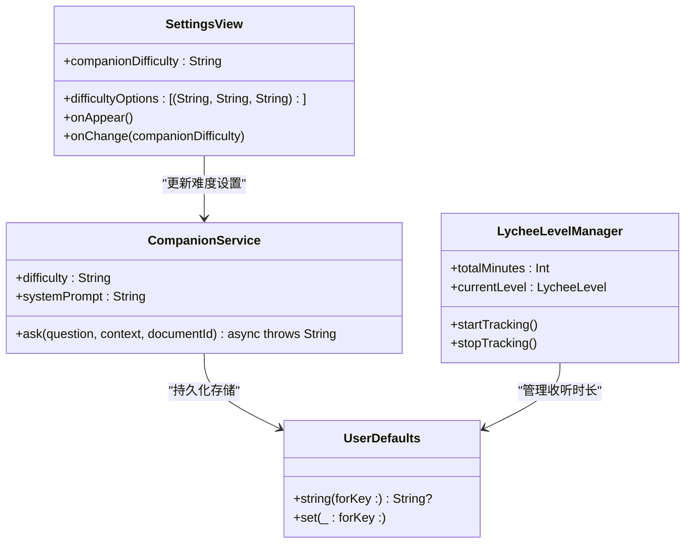
```mermaid
classDiagram
class SettingsView {
+companionDifficulty : String
+difficultyOptions : [(String, String, String)]
+onAppear()
+onChange(companionDifficulty)
}
class CompanionService {
+difficulty : String
+ask(question, context, documentId) async throws String
+systemPrompt : String
}
class UserDefaults {
+string(forKey : ) String?
+set(_ : forKey : )
}
class LycheeLevelManager {
+totalMinutes : Int
+currentLevel : LycheeLevel
+startTracking()
+stopTracking()
}
SettingsView --> CompanionService : "更新难度设置"
CompanionService --> UserDefaults : "持久化存储"
LycheeLevelManager --> UserDefaults : "管理收听时长"
```

**图表来源**
- [Views/SettingsView.swift:282-309](file://Views/SettingsView.swift#L282-L309)
- [Services/CompanionService.swift:21-25](file://Services/CompanionService.swift#L21-L25)
- [Models/LycheeLevelManager.swift:10-26](file://Models/LycheeLevelManager.swift#L10-L26)

**章节来源**
- [Views/SettingsView.swift:282-309](file://Views/SettingsView.swift#L282-L309)
- [Services/CompanionService.swift:1-170](file://Services/CompanionService.swift#L1-L170)

### PrivacyPolicyIntegration：隐私政策页面集成
- **新增** 界面设计
  - 在"关于"部分添加隐私政策链接，采用标准的Link组件实现
  - 链接样式与设置界面保持一致，包含箭头图标指示外部链接
  - 点击后在系统浏览器中打开完整的隐私政策页面
- **新增** 核心功能
  - 隐私政策页面托管在 naolizhi.cn/privacy.html
  - 提供完整的数据收集、本地存储、服务器处理、第三方服务集成说明
  - 涵盖App Store购买处理、安全措施和儿童隐私保护等关键信息
  - 支持深色模式和自适应布局
- **新增** 用户体验
  - 清晰的导航路径：设置 → 关于 → 隐私政策
  - 标准的外部链接行为，符合iOS设计规范
  - 完整的隐私信息透明度，提升用户信任度

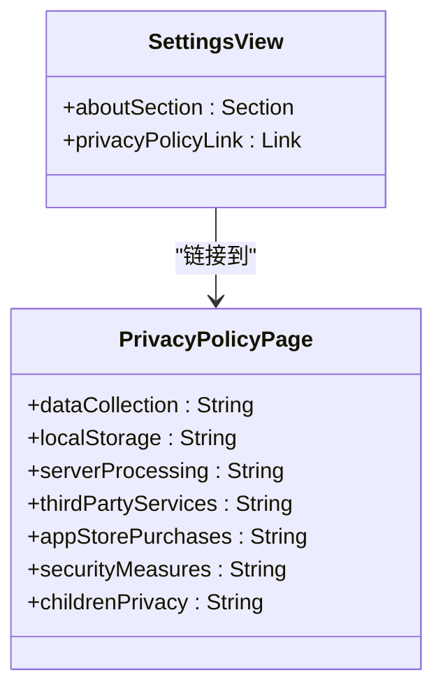
```mermaid
classDiagram
class SettingsView {
+aboutSection : Section
+privacyPolicyLink : Link
}
class PrivacyPolicyPage {
+dataCollection : String
+localStorage : String
+serverProcessing : String
+thirdPartyServices : String
+appStorePurchases : String
+securityMeasures : String
+childrenPrivacy : String
}
SettingsView --> PrivacyPolicyPage : "链接到"
```

**图表来源**
- [Views/SettingsView.swift:307-319](file://Views/SettingsView.swift#L307-L319)
- [privacy-policy.html:1-131](file://privacy-policy.html#L1-L131)

**章节来源**
- [Views/SettingsView.swift:307-319](file://Views/SettingsView.swift#L307-L319)
- [privacy-policy.html:1-131](file://privacy-policy.html#L1-L131)

### CompanionService：AI伴读服务与难度管理
- 核心功能
  - 管理AI伴读的多轮对话历史和上下文信息
  - 通过服务器中转调用通义千问，API Key仅存储在服务器端
  - 支持难度级别自适应，影响AI的回答风格和深度
  - 维护学习状态（首次提问、连续追问、复习模式）
- 难度级别管理
  - difficulty 属性提供难度级别的持久化存储，默认值为"intermediate"
  - 难度设置自动保存到 UserDefaults 的 "companion_difficulty" key
  - 在系统提示词中注入当前难度级别，影响AI的响应策略
- 关键特性
  - 单例模式：CompanionService.shared确保全局唯一实例
  - 异步请求：使用async/await处理网络请求
  - 对话历史管理：最多保留最近10轮对话，避免内存占用过大
  - 学习状态计算：根据对话历史和文档ID判断当前学习状态
  - 最近话题提取：自动提取最近3条用户问题作为上下文
- 配置管理
  - 系统提示词模板：包含完整的AI行为规则和难度自适应逻辑
  - 动态上下文注入：实时替换{context}、{session_state}、{difficulty}等占位符
  - 边界规则处理：确保AI回答符合伴读场景的要求

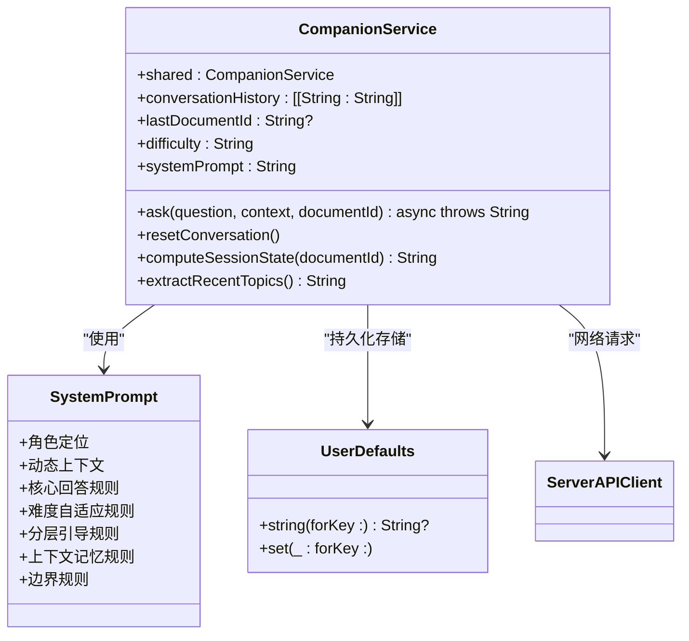
```mermaid
classDiagram
class CompanionService {
+shared : CompanionService
+conversationHistory : [[String : String]]
+lastDocumentId : String?
+difficulty : String
+systemPrompt : String
+ask(question, context, documentId) async throws String
+resetConversation()
+computeSessionState(documentId) String
+extractRecentTopics() String
}
class SystemPrompt {
+角色定位
+动态上下文
+核心回答规则
+难度自适应规则
+分层引导规则
+上下文记忆规则
+边界规则
}
class UserDefaults {
+string(forKey : ) String?
+set(_ : forKey : )
}
CompanionService --> SystemPrompt : "使用"
CompanionService --> UserDefaults : "持久化存储"
CompanionService --> ServerAPIClient : "网络请求"
```

**图表来源**
- [Services/CompanionService.swift:1-170](file://Services/CompanionService.swift#L1-L170)

**章节来源**
- [Services/CompanionService.swift:1-170](file://Services/CompanionService.swift#L1-L170)

### LycheeLevelManager：荔枝成长体系管理
- 核心功能
  - 跟踪用户的累计收听时长，每分钟更新一次
  - 根据收听时长计算荔枝等级，提供成长激励
  - 实时追踪播放状态，自动开始和停止计时
  - 持久化存储累计时长，重启应用后保持进度
- 关键特性
  - 单例模式：LycheeLevelManager.shared确保全局唯一实例
  - 发布属性：@Published修饰符确保UI实时更新
  - Timer驱动：每秒更新累计秒数，每分钟持久化一次
  - 等级计算：根据累计分钟数自动计算当前等级
- 技术实现
  - 运行时追踪：accumulatedSeconds记录当前会话的累计秒数
  - 定时器管理：Timer.scheduledTimer实现精确的时间追踪
  - 状态同步：totalMinutes和currentLevel保持同步更新
  - 资源清理：stopTracking方法正确释放Timer资源

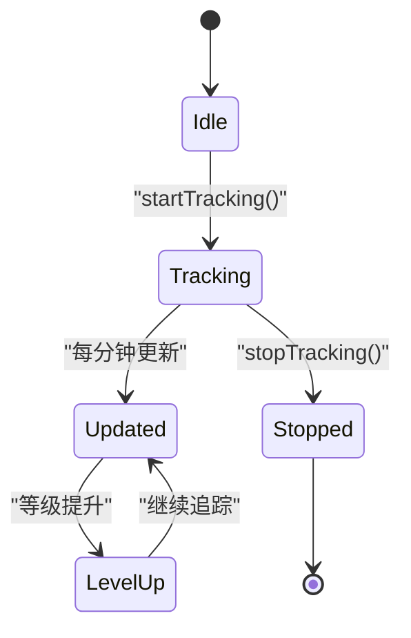
```mermaid
stateDiagram-v2
[*] --> Idle
Idle --> Tracking : "startTracking()"
Tracking --> Updated : "每分钟更新"
Updated --> LevelUp : "等级提升"
LevelUp --> Updated : "继续追踪"
Tracking --> Stopped : "stopTracking()"
Stopped --> [*]
```

**图表来源**
- [Models/LycheeLevelManager.swift:30-51](file://Models/LycheeLevelManager.swift#L30-L51)

**章节来源**
- [Models/LycheeLevelManager.swift:1-53](file://Models/LycheeLevelManager.swift#L1-L53)

### EdgeVoiceSelectView：Edge TTS云端音色选择界面
- 界面设计
  - 专为Edge TTS设计的云端音色选择界面，采用NavigationStack和List布局
  - 按语言分类展示：普通话音色和粤语音色两个主要区域
  - 每个音色显示性别图标（粉色女性/蓝色男性）、名称、ID和可选标签
  - 支持试听功能：点击播放按钮可试听指定音色的效果
  - 选中标记：当前选中的音色显示对勾图标
- 核心功能
  - 精选音色列表：内置推荐的中文女声（晓晓、晓伊等）和男声（云扬、云希等），以及粤语音色
  - 试听功能：调用EdgeTTSService.synthesize生成临时音频并播放
  - 音色应用：选择音色后更新VoiceConfig.edgeVoiceId并切换到Edge TTS引擎
  - 状态管理：维护selectedVoiceId和isTesting状态
- 用户体验
  - 清晰的视觉层次：性别图标、名称、ID、标签的层次化展示
  - 直观的交互反馈：试听按钮动画、选中标记变化
  - 完善的工具栏：取消和确定按钮，支持键盘快捷键
  - 智能默认选择：从当前配置中恢复已选音色

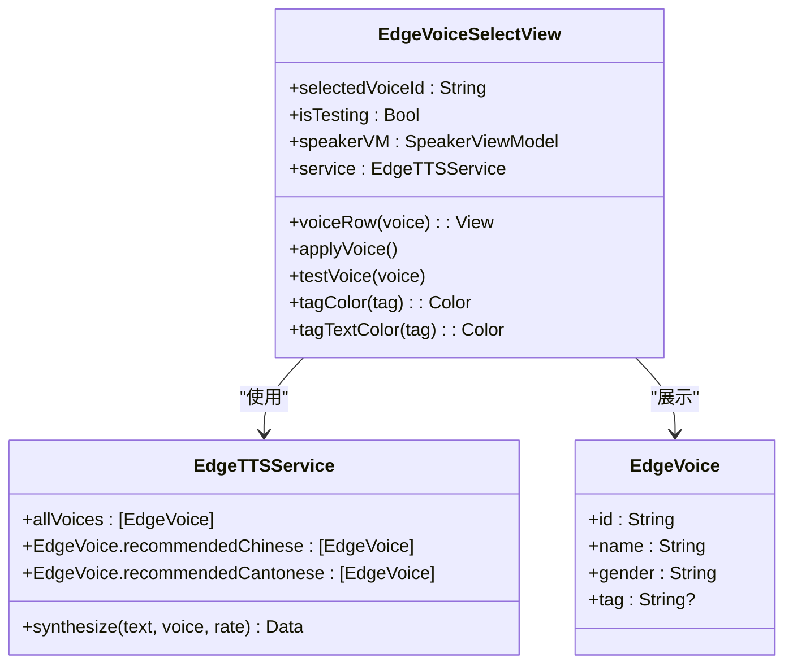
```mermaid
classDiagram
class EdgeVoiceSelectView {
+selectedVoiceId : String
+isTesting : Bool
+speakerVM : SpeakerViewModel
+service : EdgeTTSService
+voiceRow(voice) : View
+applyVoice()
+testVoice(voice)
+tagColor(tag) : Color
+tagTextColor(tag) : Color
}
class EdgeTTSService {
+allVoices : [EdgeVoice]
+synthesize(text, voice, rate) Data
+EdgeVoice.recommendedChinese : [EdgeVoice]
+EdgeVoice.recommendedCantonese : [EdgeVoice]
}
class EdgeVoice {
+id : String
+name : String
+gender : String
+tag : String?
}
EdgeVoiceSelectView --> EdgeTTSService : "使用"
EdgeVoiceSelectView --> EdgeVoice : "展示"
```

**图表来源**
- [Views/EdgeVoiceSelectView.swift:1-174](file://Views/EdgeVoiceSelectView.swift#L1-L174)
- [Services/EdgeTTSService.swift:1-134](file://Services/EdgeTTSService.swift#L1-L134)

**章节来源**
- [Views/EdgeVoiceSelectView.swift:1-174](file://Views/EdgeVoiceSelectView.swift#L1-L174)
- [Services/EdgeTTSService.swift:1-134](file://Services/EdgeTTSService.swift#L1-L134)

### EdgeTTSService：Edge TTS云端语音合成服务
- 核心功能
  - 通过自建服务器（naolizhi.cn）中转调用微软Edge TTS，提供免费无限量的高质量语音合成
  - 内置精选中文和粤语音色列表，包含晓晓、云扬等知名Neural音色
  - 支持文本合成，最大5000字符限制，返回MP3格式音频数据
  - 语速转换：将内部语速值（0.1~2.0）转换为Edge TTS百分比格式
- 关键特性
  - 单例模式：EdgeTTSService.shared确保全局唯一实例
  - 异步合成：使用async/await处理网络请求
  - 错误处理：完善的EdgeTTSError类型定义，包括URL无效、响应异常、无音频数据等
  - 音色管理：EdgeVoice结构体支持性别、标签等元数据
- 配置管理
  - 推荐音色分类：recommendedChinese和recommendedCantonese分别管理普通话和粤语音色
  - 全部音色聚合：allVoices属性合并所有推荐音色

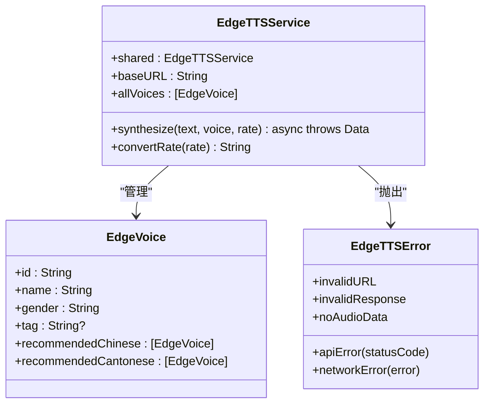
```mermaid
classDiagram
class EdgeTTSService {
+shared : EdgeTTSService
+baseURL : String
+allVoices : [EdgeVoice]
+synthesize(text, voice, rate) async throws Data
+convertRate(rate) String
}
class EdgeVoice {
+id : String
+name : String
+gender : String
+tag : String?
+recommendedChinese : [EdgeVoice]
+recommendedCantonese : [EdgeVoice]
}
class EdgeTTSError {
+invalidURL
+invalidResponse
+noAudioData
+apiError(statusCode)
+networkError(error)
}
EdgeTTSService --> EdgeVoice : "管理"
EdgeTTSService --> EdgeTTSError : "抛出"
```

**图表来源**
- [Services/EdgeTTSService.swift:1-134](file://Services/EdgeTTSService.swift#L1-L134)

**章节来源**
- [Services/EdgeTTSService.swift:1-134](file://Services/EdgeTTSService.swift#L1-L134)

### EdgeTTSSynthesizer：Edge TTS引擎适配器
- 核心功能
  - 实现SpeechSynthesizerProtocol协议，与现有TTS引擎保持一致的接口
  - 支持分段合成：每段最多2000字符，避免超过服务器限制
  - 位置估算：基于每秒约3个字符的速度估算当前位置
  - 错误降级：出错时通知上层，由SpeakerViewModel处理降级逻辑
- 关键特性
  - 分段播放：合成一段播放一段，支持长文本朗读
  - 位置追踪：维护segmentStartPositions数组精确跟踪各段落起始位置
  - 状态管理：完整的PlaybackState状态机支持
  - 资源管理：临时文件清理和Task取消机制
- 技术实现
  - 文本分割：智能断句，优先在句号、换行符、逗号处截断
  - 音频播放：AVAudioPlayer代理回调处理段落切换
  - 定时器更新：每0.5秒更新一次播放位置

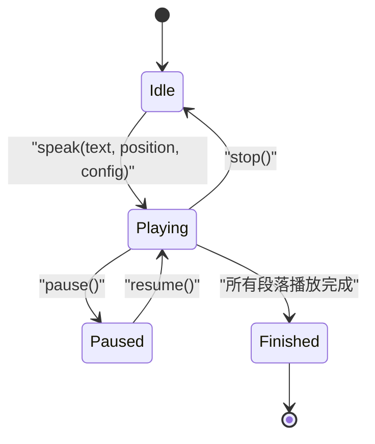
```mermaid
stateDiagram-v2
[*] --> Idle
Idle --> Playing : "speak(text, position, config)"
Playing --> Paused : "pause()"
Paused --> Playing : "resume()"
Playing --> Finished : "所有段落播放完成"
Playing --> Idle : "stop()"
Finished --> [*]
```

**图表来源**
- [Services/EdgeTTSSynthesizer.swift:1-248](file://Services/EdgeTTSSynthesizer.swift#L1-L248)

**章节来源**
- [Services/EdgeTTSSynthesizer.swift:1-248](file://Services/EdgeTTSSynthesizer.swift#L1-L248)

### SubscriptionManager：订阅状态管理服务
- 核心功能
  - 基于StoreKit 2实现的订阅状态管理
  - 自动加载可用的订阅产品（月订阅和年订阅）
  - 实时检查用户的订阅状态和entitlements
  - 支持购买流程、交易验证和购买恢复
- 关键特性
  - 异步初始化：在init中自动加载产品和检查订阅状态
  - 发布状态：@Published属性确保UI实时更新
  - 错误处理：完善的错误类型定义和用户友好的错误消息
  - 安全验证：Transaction验证防止伪造交易
- 配置管理
  - 产品ID配置：支持月订阅和年订阅两种方案
  - 待办事项：明确标注需要在App Store Connect中配置实际产品ID

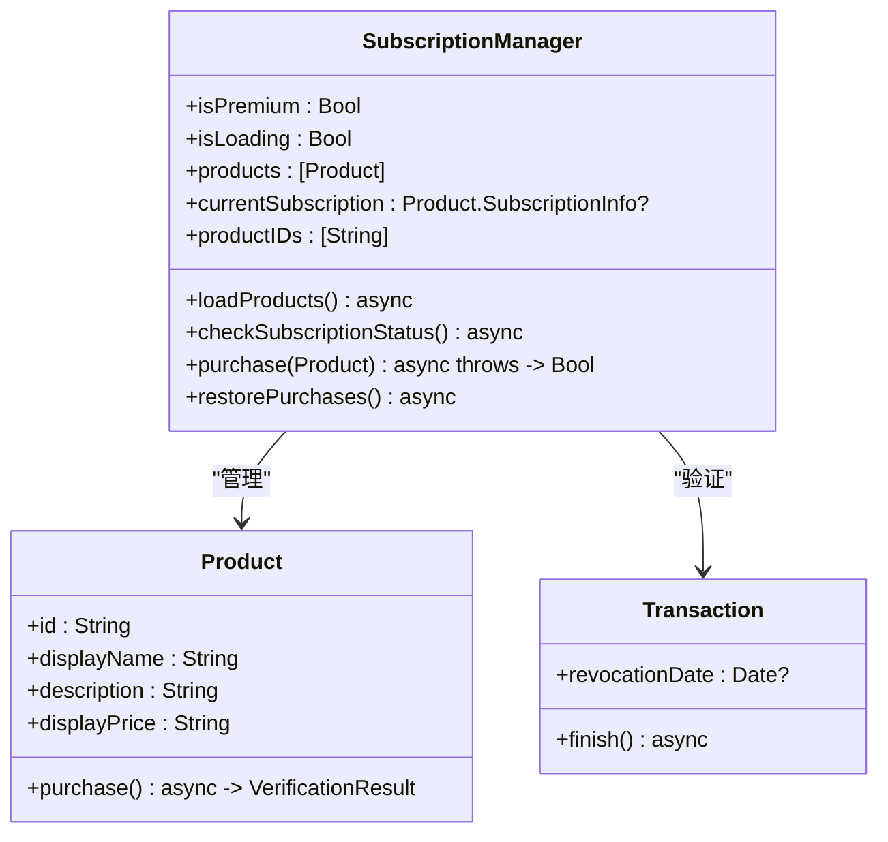
```mermaid
classDiagram
class SubscriptionManager {
+isPremium : Bool
+isLoading : Bool
+products : [Product]
+currentSubscription : Product.SubscriptionInfo?
+loadProducts() async
+checkSubscriptionStatus() async
+purchase(Product) async throws -> Bool
+restorePurchases() async
+productIDs : [String]
}
class Product {
+id : String
+displayName : String
+description : String
+displayPrice : String
+purchase() async -> VerificationResult
}
class Transaction {
+revocationDate : Date?
+finish() async
}
SubscriptionManager --> Product : "管理"
SubscriptionManager --> Transaction : "验证"
```

**图表来源**
- [Services/SubscriptionManager.swift:8-127](file://Services/SubscriptionManager.swift#L8-L127)

**章节来源**
- [Services/SubscriptionManager.swift:1-127](file://Services/SubscriptionManager.swift#L1-L127)

### PaywallView：付费墙界面
- 界面设计
  - 精美的顶部图标和标题区域，使用渐变色突出Premium主题
  - 功能特性列表：展示AI智能总结、AI伴读、AI高品质音色、语音克隆等核心功能
  - 订阅选项区域：动态加载StoreKit产品，显示价格和购买按钮
  - 恢复购买功能：支持用户在不同设备间恢复订阅
- 交互逻辑
  - 产品加载状态管理：显示加载进度和重试机制
  - 购买流程：完整的购买验证和错误处理
  - 状态反馈：购买成功自动关闭界面，失败显示错误信息
  - 响应式设计：适配不同屏幕尺寸和设备方向
- 用户体验
  - 清晰的视觉层次和信息架构
  - 直观的功能展示和价格对比
  - 流畅的购买流程和状态反馈
  - 完善的错误处理和用户引导

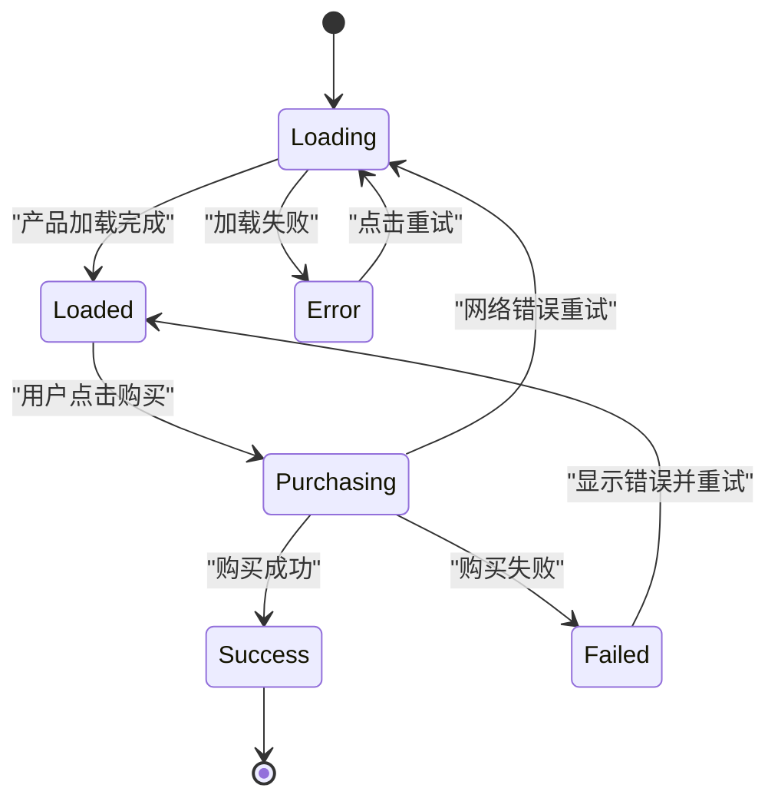
```mermaid
stateDiagram-v2
[*] --> Loading
Loading --> Loaded : "产品加载完成"
Loading --> Error : "加载失败"
Loaded --> Purchasing : "用户点击购买"
Purchasing --> Success : "购买成功"
Purchasing --> Failed : "购买失败"
Purchasing --> Loading : "网络错误重试"
Success --> [*]
Failed --> Loaded : "显示错误并重试"
Error --> Loading : "点击重试"
```

**图表来源**
- [Views/PaywallView.swift:12-81](file://Views/PaywallView.swift#L12-L81)
- [Views/PaywallView.swift:85-136](file://Views/PaywallView.swift#L85-L136)
- [Views/PaywallView.swift:160-175](file://Views/PaywallView.swift#L160-L175)

**章节来源**
- [Views/PaywallView.swift:1-181](file://Views/PaywallView.swift#L1-L181)

### SystemVoiceSelectView：Apple Neural TTS专业音色管理
- 功能特性
  - 专为iOS 17+ Apple Neural TTS设计的音色选择界面
  - 智能分类：区分"推荐音色"和"全部音色"两个区域
  - 音质标识：显示"Neural"标签和音质等级（标准版/增强版/高级版）
  - 语言支持：优先展示中文和英文的Neural音色
  - 设备兼容：iOS < 17时显示友好的升级提示
- 核心逻辑
  - loadVoices()：获取所有可用系统语音并转换为 SystemVoiceInfo，增强中文Neural音色检测和调试信息输出
  - recommendedVoices：筛选推荐的Neural音色（中文和英文优先），改进语言代码匹配逻辑
  - selectVoice()：更新配置并保存到UserDefaults
  - voiceRow()：专业的UI展示，包含选择指示器和音质信息
- 用户体验
  - 大图标选择指示器，清晰的状态反馈
  - 选中音色的扬声器图标动画
  - 完整的导航栏和工具栏支持
  - 新增 downloadHintSection：当没有可用的中文Neural音色时，显示详细的下载指导步骤
  - 新增 智能下载引导：提供前往系统设置的快捷按钮，帮助用户手动下载所需的Neural TTS音色

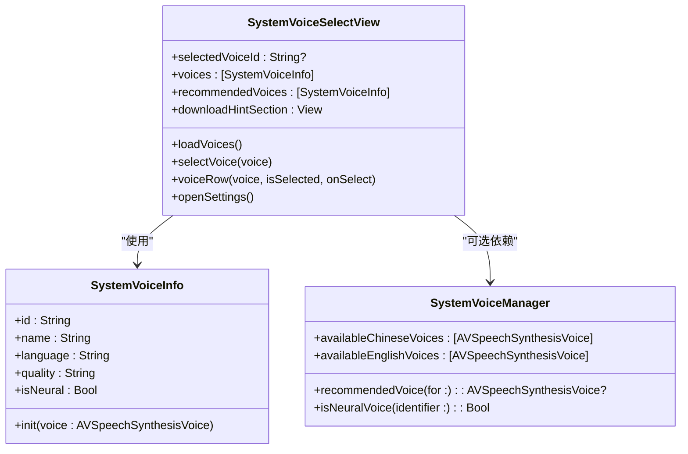
```mermaid
classDiagram
class SystemVoiceSelectView {
+selectedVoiceId : String?
+voices : [SystemVoiceInfo]
+recommendedVoices : [SystemVoiceInfo]
+loadVoices()
+selectVoice(voice)
+voiceRow(voice, isSelected, onSelect)
+downloadHintSection : View
+openSettings()
}
class SystemVoiceInfo {
+id : String
+name : String
+language : String
+quality : String
+isNeural : Bool
+init(voice : AVSpeechSynthesisVoice)
}
class SystemVoiceManager {
+availableChineseVoices : [AVSpeechSynthesisVoice]
+availableEnglishVoices : [AVSpeechSynthesisVoice]
+recommendedVoice(for : ) : AVSpeechSynthesisVoice?
+isNeuralVoice(identifier : ) : Bool
}
SystemVoiceSelectView --> SystemVoiceInfo : "使用"
SystemVoiceSelectView --> SystemVoiceManager : "可选依赖"
```

**图表来源**
- [Views/SystemVoiceSelectView.swift:1-274](file://Views/SystemVoiceSelectView.swift#L1-L274)
- [Services/SystemVoiceManager.swift:62-104](file://Services/SystemVoiceManager.swift#L62-L104)

**章节来源**
- [Views/SystemVoiceSelectView.swift:1-274](file://Views/SystemVoiceSelectView.swift#L1-L274)
- [Services/SystemVoiceManager.swift:1-104](file://Services/SystemVoiceManager.swift#L1-L104)

### VoiceSelectView：AI音色选择与试听
- 功能组织
  - "我的音色"：来自 VoiceStore.loadClonedVoices()，支持删除
  - "录制我的声音"：弹出 VoiceCloneView 进行克隆
  - "预设音色"：按分类展示内置预设，支持选择与试听
- 选择与切换
  - 选择预设：设置 engine=knowledgeVoice，保存 presetVoiceId，清空 clonedVoiceId
  - 选择克隆：设置 engine=knowledgeVoice，保存 clonedVoiceId，清空 presetVoiceId
  - 试听：调用 CosyVoiceService.previewVoice 下载临时音频并播放
- 与设置联动
  - SettingsView 在 Knowledge Voice 模式下，会从 VoiceStore 读取已选克隆/预设 ID 并回填

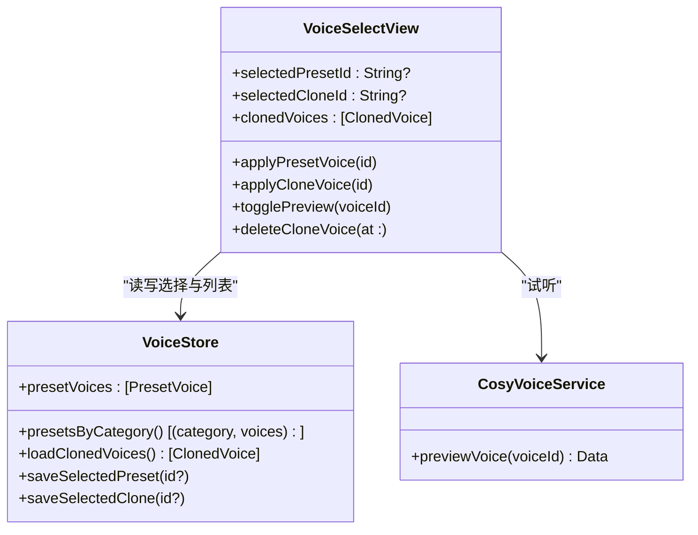
```mermaid
classDiagram
class VoiceSelectView {
+selectedPresetId : String?
+selectedCloneId : String?
+clonedVoices : [ClonedVoice]
+applyPresetVoice(id)
+applyCloneVoice(id)
+togglePreview(voiceId)
+deleteCloneVoice(at : )
}
class VoiceStore {
+presetVoices : [PresetVoice]
+presetsByCategory() [(category, voices)]
+loadClonedVoices() [ClonedVoice]
+saveSelectedPreset(id?)
+saveSelectedClone(id?)
}
class CosyVoiceService {
+previewVoice(voiceId) Data
}
VoiceSelectView --> VoiceStore : "读写选择与列表"
VoiceSelectView --> CosyVoiceService : "试听"
```

**图表来源**
- [Views/VoiceSelectView.swift:1-215](file://Views/VoiceSelectView.swift#L1-L215)
- [Models/ClonedVoice.swift:92-117](file://Models/ClonedVoice.swift#L92-L117)
- [Services/CosyVoiceService.swift:153-156](file://Services/CosyVoiceService.swift#L153-L156)

**章节来源**
- [Views/VoiceSelectView.swift:1-215](file://Views/VoiceSelectView.swift#L1-L215)
- [Models/ClonedVoice.swift:1-118](file://Models/ClonedVoice.swift#L1-L118)
- [Services/CosyVoiceService.swift:1-219](file://Services/CosyVoiceService.swift#L1-L219)

### VoiceCloneView：声音克隆流程与用户引导
- 流程状态机
  - idle → recording → preview → uploading → processing → completed/error
- 关键校验
  - 麦克风权限请求失败 → error
  - 录音时长不足 5 秒 → error
- 云端集成
  - 上传参考音频并触发 cloneVoice，成功后保存 ClonedVoice 到 VoiceStore，并设为当前选择
- 用户体验
  - 大图标状态反馈、进度条、重试/取消按钮、完成后可直接回到音色选择

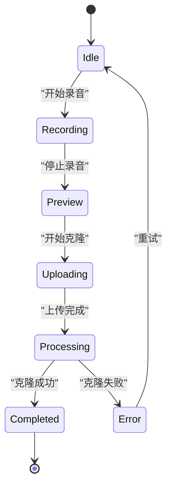
```mermaid
stateDiagram-v2
[*] --> Idle
Idle --> Recording : "开始录音"
Recording --> Preview : "停止录音"
Preview --> Uploading : "开始克隆"
Uploading --> Processing : "上传完成"
Processing --> Completed : "克隆成功"
Processing --> Error : "克隆失败"
Error --> Idle : "重试"
Completed --> [*]
```

**图表来源**
- [Views/VoiceCloneView.swift:16-24](file://Views/VoiceCloneView.swift#L16-L24)
- [Views/VoiceCloneView.swift:261-322](file://Views/VoiceCloneView.swift#L261-L322)
- [Services/CosyVoiceService.swift:97-144](file://Services/CosyVoiceService.swift#L97-L144)

**章节来源**
- [Views/VoiceCloneView.swift:1-404](file://Views/VoiceCloneView.swift#L1-L404)
- [Services/CosyVoiceService.swift:1-219](file://Services/CosyVoiceService.swift#L1-L219)

### 主题切换、语言设置与配置持久化
- 主题切换
  - ThemeManager 单例持有 mode，写入 UserDefaults；SettingsView 直接修改该属性
- 语言与声音
  - SettingsView 根据所选语言过滤系统语音；SpeakerViewModel 在加载文档时可自动检测语言并匹配最佳语音
  - SystemVoiceSelectView 提供智能的Neural音色选择和推荐算法，增强下载引导功能
  - Edge TTS音色选择通过EdgeVoiceSelectView管理，支持云端音色配置
  - AI伴读难度级别通过CompanionService管理，支持三级难度选择
- 配置持久化
  - VoiceConfig 以 JSON 编码保存到 UserDefaults 的 voiceConfig key
  - 主题模式保存在 themeMode key
  - 克隆音色列表与选择保存在 clonedVoices、selectedPresetVoiceId、selectedCloneVoiceId
  - 系统音色选择保存在 selectedSystemVoiceIdentifier key
  - Edge TTS音色ID保存在VoiceConfig.edgeVoiceId字段
  - AI伴读难度级别保存在companion_difficulty key
  - 荔枝累计收听时长保存在lycheeTotalListeningMinutes key
- 订阅状态持久化
  - 订阅状态通过StoreKit 2自动管理，无需手动持久化
  - 订阅状态变化会自动通知所有观察者
- 荔枝成长体系持久化
  - LycheeLevelManager自动管理累计收听时长和等级变化
  - 播放时自动开始追踪，暂停时停止追踪
  - 等级变化通过@Published属性实时更新UI

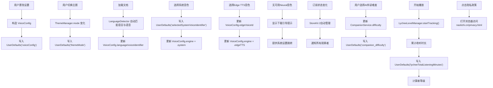
```mermaid
flowchart TD
A["用户更改设置"] --> B["构造 VoiceConfig"]
B --> C["写入 UserDefaults('voiceConfig')"]
D["用户切换主题"] --> E["ThemeManager.mode 变化"]
E --> F["写入 UserDefaults('themeMode')"]
G["加载文档"] --> H["LanguageDetector 自动匹配语言与语音"]
H --> I["更新 VoiceConfig.language/voiceIdentifier"]
J["选择系统音色"] --> K["写入 UserDefaults('selectedSystemVoiceIdentifier')"]
K --> L["更新 VoiceConfig.engine = .system"]
M["选择Edge TTS音色"] --> N["更新 VoiceConfig.edgeVoiceId"]
N --> O["更新 VoiceConfig.engine = .edgeTTS"]
P["无可用Neural音色"] --> Q["显示下载引导提示"]
Q --> R["提供系统设置跳转"]
S["订阅状态变化"] --> T["StoreKit 2自动管理"]
T --> U["通知所有观察者"]
V["用户选择AI伴读难度"] --> W["更新 CompanionService.difficulty"]
W --> X["写入 UserDefaults('companion_difficulty')"]
Y["开始播放"] --> Z["LycheeLevelManager.startTracking()"]
Z --> AA["累计收听时长"]
AA --> AB["写入 UserDefaults('lycheeTotalListeningMinutes')"]
AB --> AC["计算新等级"]
AD["点击隐私政策"] --> AE["打开浏览器访问<br/>naolizhi.cn/privacy.html"]
```

**图表来源**
- [Services/ThemeManager.swift:10-23](file://Services/ThemeManager.swift#L10-L23)
- [Views/SettingsView.swift:273-305](file://Views/SettingsView.swift#L273-L305)
- [Views/SystemVoiceSelectView.swift:145-160](file://Views/SystemVoiceSelectView.swift#L145-L160)
- [ViewModels/SpeakerViewModel.swift:99-122](file://ViewModels/SpeakerViewModel.swift#L99-L122)
- [Views/SystemVoiceSelectView.swift:229-266](file://Views/SystemVoiceSelectView.swift#L229-L266)
- [Services/SubscriptionManager.swift:57-69](file://Services/SubscriptionManager.swift#L57-L69)
- [Models/VoiceConfig.swift:65-66](file://Models/VoiceConfig.swift#L65-L66)
- [Services/CompanionService.swift:21-25](file://Services/CompanionService.swift#L21-L25)
- [Models/LycheeLevelManager.swift:10-26](file://Models/LycheeLevelManager.swift#L10-L26)
- [Views/SettingsView.swift:307-319](file://Views/SettingsView.swift#L307-L319)

**章节来源**
- [Services/ThemeManager.swift:1-25](file://Services/ThemeManager.swift#L1-L25)
- [Views/SettingsView.swift:1-429](file://Views/SettingsView.swift#L1-L429)
- [Views/SystemVoiceSelectView.swift:1-274](file://Views/SystemVoiceSelectView.swift#L1-L274)
- [Views/EdgeVoiceSelectView.swift:1-174](file://Views/EdgeVoiceSelectView.swift#L1-L174)
- [ViewModels/SpeakerViewModel.swift:1-402](file://ViewModels/SpeakerViewModel.swift#L1-L402)
- [Services/SubscriptionManager.swift:1-127](file://Services/SubscriptionManager.swift#L1-L127)
- [Models/VoiceConfig.swift:1-82](file://Models/VoiceConfig.swift#L1-L82)
- [Services/CompanionService.swift:1-170](file://Services/CompanionService.swift#L1-L170)
- [Models/LycheeLevelManager.swift:1-53](file://Models/LycheeLevelManager.swift#L1-L53)

## 依赖关系分析
- 视图对 ViewModel 的依赖
  - SettingsView 与 VoiceSelectView 均依赖 SpeakerViewModel 以同步 voiceConfig 与引擎切换
  - SystemVoiceSelectView 也依赖 SpeakerViewModel 进行配置更新
  - EdgeVoiceSelectView 依赖 SpeakerViewModel 和 EdgeTTSService 进行音色选择和试听
  - SettingsView 依赖 SubscriptionManager 管理订阅状态
  - SettingsView 依赖 CompanionService 管理AI伴读难度设置
  - PaywallView 依赖 SubscriptionManager 处理购买流程
- 服务层解耦
  - CosyVoiceService 仅依赖网络与 UserDefaults 中的 API Key
  - ThemeManager 独立于业务逻辑，只负责主题持久化
  - SystemVoiceManager 提供系统语音管理能力，独立于其他服务
  - SubscriptionManager 基于StoreKit 2独立管理订阅逻辑
  - EdgeTTSService 提供Edge TTS云端合成服务，独立于其他TTS服务
  - EdgeTTSSynthesizer 实现SpeechSynthesizerProtocol，与现有引擎架构一致
  - CompanionService 独立管理AI伴读逻辑，通过ServerAPIClient进行网络请求
  - LycheeLevelManager 独立管理荔枝成长体系，不依赖其他业务服务
- 错误处理
  - CosyVoiceError 提供明确错误语义，SpeakerViewModel 在错误回调中执行降级策略（知识语音失败回退系统 TTS）
  - EdgeTTSError 提供Edge TTS特定的错误类型和处理
  - 设备兼容性检查：TTSEngine.isSupported 属性确保只在支持的设备上显示相应引擎选项
  - 订阅错误处理：SubscriptionManager.StoreError 提供购买验证失败的错误处理
  - AI伴读错误处理：CompanionService 提供统一的错误处理机制
- 即将推出功能处理
  - comingSoonEngineRow() 提供统一的禁用状态UI，避免用户误操作

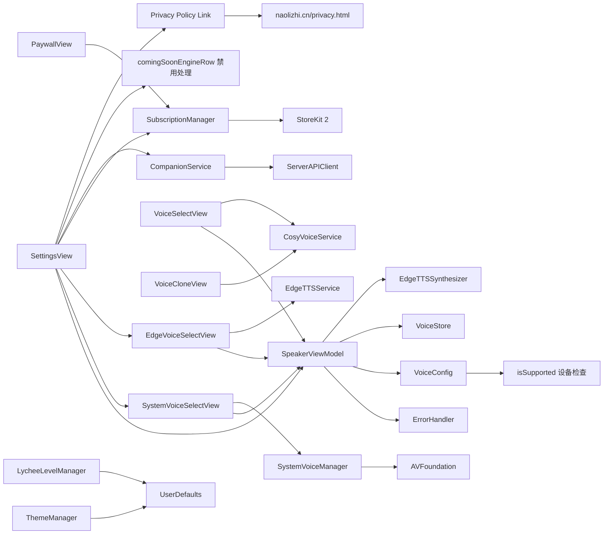
```mermaid
graph LR
SV["SettingsView"] --> SVM["SpeakerViewModel"]
SV --> SYSVS["SystemVoiceSelectView"]
SV --> EVSV["EdgeVoiceSelectView"]
SV --> SM["SubscriptionManager"]
SV --> CS["CompanionService"]
PV["PaywallView"] --> SM
VSV["VoiceSelectView"] --> SVM
VSV --> CVS["CosyVoiceService"]
VCV["VoiceCloneView"] --> CVS
SYSVS --> SVM
SYSVS --> SYSVM["SystemVoiceManager"]
EVSV --> SVM
EVSV --> ETS["EdgeTTSService"]
SVM --> EH["ErrorHandler"]
SVM --> VC["VoiceConfig"]
SVM --> VS["VoiceStore"]
SVM --> ETSS["EdgeTTSSynthesizer"]
TM["ThemeManager"] --> UD["UserDefaults"]
VC --> IS["isSupported 设备检查"]
SYSVM --> AVF["AVFoundation"]
SV --> CSER["comingSoonEngineRow 禁用处理"]
SM --> SK["StoreKit 2"]
CS --> SAPIC["ServerAPIClient"]
LLM["LycheeLevelManager"] --> UD
SV --> PP["Privacy Policy Link"]
PP --> WEB["naolizhi.cn/privacy.html"]
```

**图表来源**
- [Views/SettingsView.swift:1-429](file://Views/SettingsView.swift#L1-L429)
- [Views/PaywallView.swift:1-181](file://Views/PaywallView.swift#L1-L181)
- [Services/SubscriptionManager.swift:1-127](file://Services/SubscriptionManager.swift#L1-L127)
- [Views/SystemVoiceSelectView.swift:1-274](file://Views/SystemVoiceSelectView.swift#L1-L274)
- [Views/EdgeVoiceSelectView.swift:1-174](file://Views/EdgeVoiceSelectView.swift#L1-L174)
- [Views/VoiceSelectView.swift:1-215](file://Views/VoiceSelectView.swift#L1-L215)
- [Views/VoiceCloneView.swift:1-404](file://Views/VoiceCloneView.swift#L1-L404)
- [ViewModels/SpeakerViewModel.swift:1-402](file://ViewModels/SpeakerViewModel.swift#L1-L402)
- [Services/SystemVoiceManager.swift:1-104](file://Services/SystemVoiceManager.swift#L1-L104)
- [Services/EdgeTTSService.swift:1-134](file://Services/EdgeTTSService.swift#L1-L134)
- [Services/EdgeTTSSynthesizer.swift:1-248](file://Services/EdgeTTSSynthesizer.swift#L1-L248)
- [Services/CompanionService.swift:1-170](file://Services/CompanionService.swift#L1-L170)
- [Services/CosyVoiceService.swift:1-219](file://Services/CosyVoiceService.swift#L1-L219)
- [Services/ThemeManager.swift:1-25](file://Services/ThemeManager.swift#L1-L25)
- [Models/VoiceConfig.swift:26-40](file://Models/VoiceConfig.swift#L26-L40)
- [Models/LycheeLevelManager.swift:1-53](file://Models/LycheeLevelManager.swift#L1-L53)
- [Views/SettingsView.swift:307-319](file://Views/SettingsView.swift#L307-L319)

**章节来源**
- [ViewModels/SpeakerViewModel.swift:321-335](file://ViewModels/SpeakerViewModel.swift#L321-335)
- [Services/CosyVoiceService.swift:191-218](file://Services/CosyVoiceService.swift#L191-218)
- [Models/VoiceConfig.swift:26-40](file://Models/VoiceConfig.swift#L26-L40)
- [Services/SystemVoiceManager.swift:1-104](file://Services/SystemVoiceManager.swift#L1-L104)
- [Services/SubscriptionManager.swift:116-125](file://Services/SubscriptionManager.swift#L116-125)
- [Services/EdgeTTSService.swift:112-133](file://Services/EdgeTTSService.swift#L112-133)
- [Services/CompanionService.swift:98-133](file://Services/CompanionService.swift#L98-L133)
- [Models/LycheeLevelManager.swift:30-51](file://Models/LycheeLevelManager.swift#L30-L51)

## 性能与体验优化
- 避免频繁重绘
  - 语速/音高/音量滑动时使用 .onChange 触发最小必要更新，已在 SettingsView 中实现
- 网络与音频
  - 试听音频写入临时目录，播放完成后清理；长文本合成建议使用分段合成（CosyVoiceService.synthesizeSegments）
  - Edge TTS分段合成：每段最多2000字符，避免网络超时和内存占用过大
- 引擎切换
  - 仅在播放中才热更新引擎，减少不必要的中断
  - 设备能力检查在渲染前过滤不支持的引擎，避免运行时错误
  - 智能引擎推荐：Apple Neural TTS 作为推荐选项，提供更好的音质和离线支持
  - 即将推出功能处理：通过专用视图构建器提供一致的禁用状态体验
  - Edge TTS免费标识：绿色徽章提升用户对免费服务的认知
- 资源占用
  - 录音采样率 24kHz、单声道、16bit，兼顾质量与体积
- 用户体验优化
  - 多引擎动态适配：根据设备能力和用户偏好显示合适的引擎选项
  - 专业的音色管理界面：SystemVoiceSelectView 提供清晰的音质标识和分类
  - Edge TTS云端音色管理：EdgeVoiceSelectView 提供丰富的中文和粤语音色选择
  - AI伴读难度选择：分段控件提供直观的三级难度选择，实时更新反馈
  - 友好的设备兼容性提示：iOS < 17 时显示明确的升级建议
  - 智能下载引导：当缺少必要的Neural TTS音色时，提供详细的下载步骤说明
  - 智能默认选择：自动选择最佳的Neural音色作为默认选项
  - 荔枝成长激励：LycheeLevelManager提供累计收听时长追踪和等级提升反馈
- 订阅管理优化
  - 异步加载：订阅产品和状态检查在后台任务中执行，不阻塞UI
  - 状态缓存：订阅状态检查结果缓存，避免重复网络请求
  - 错误恢复：网络错误时提供重试机制，提升用户体验
  - 内存管理：合理使用@Published属性，避免内存泄漏
- **已升级** Premium订阅卡片优化
  - 采用轻量级图标和次级颜色背景的简洁设计
  - 改进的排版层次结构，包含副标题描述
  - 更好的视觉分隔和状态反馈
  - 激活状态显示更详细的解锁信息
- AI伴读性能优化
  - 难度级别设置立即生效，无需等待应用重启
  - 对话历史限制在10轮以内，避免内存占用过大
  - 最近话题提取优化，只保留前20字的关键信息
- 荔枝成长体系优化
  - 每分钟更新一次累计时长，平衡精度和性能
  - 等级计算延迟执行，避免频繁UI更新
  - Timer资源正确释放，防止内存泄漏
- **新增** 隐私政策集成优化
  - 使用标准Link组件，符合iOS设计规范
  - 外部链接行为自然流畅，不影响应用性能
  - 隐私政策页面采用响应式设计，适配各种屏幕尺寸

## 故障排查指南
- 录音失败
  - 现象：需要麦克风权限或录音时长不足
  - 处理：授予麦克风权限；确保录音≥5秒
- 引擎异常降级
  - 现象：Knowledge Voice 或 Edge TTS 出错后自动回退系统 TTS
  - 处理：查看错误日志；确认网络与 API Key；必要时手动切回系统 TTS
- Edge TTS相关问题
  - 现象：Edge TTS合成失败或音色无法试听
  - 处理：检查网络连接；确认Edge TTS服务器可用性；查看控制台错误日志
  - 现象：Edge TTS音色选择界面空白
  - 处理：重启应用；检查EdgeTTSService的音色列表初始化
- AI伴读相关问题
  - 现象：AI伴读难度设置不生效
  - 处理：检查CompanionService.difficulty属性是否正确更新；确认UserDefaults存储正常
  - 现象：AI回答风格不符合预期
  - 处理：检查难度级别设置；确认系统提示词中的难度自适应逻辑
  - 现象：对话历史丢失
  - 处理：检查conversationHistory数组长度限制；确认resetConversation()调用时机
- 荔枝成长体系问题
  - 现象：累计收听时长不更新
  - 处理：检查LycheeLevelManager.startTracking()是否正确调用；确认Timer是否正常运行
  - 现象：等级不提升
  - 处理：检查累计时长是否达到等级阈值；确认等级计算逻辑
- 订阅相关问题
  - 现象：付费墙无法加载或购买失败
  - 处理：检查网络连接；确认App Store Connect配置；查看控制台错误日志
  - 现象：订阅状态不正确
  - 处理：重启应用重新检查订阅状态；使用"恢复购买"功能；检查设备时间设置
- 设备兼容性问题
  - 现象：iOS < 17 设备上无法选择 Apple Neural TTS 或看到升级提示
  - 处理：这是预期行为，系统会自动过滤不支持的引擎选项；建议升级到 iOS 17+
- 系统音色选择问题
  - 现象：SystemVoiceSelectView 显示空白或无法加载音色
  - 处理：检查 iOS 版本是否为 17+；确认网络连接正常；重启应用重试
- Neural TTS 音色下载问题
  - 现象：SystemVoiceSelectView 显示下载提示但无法找到Neural音色
  - 处理：按照提示前往系统设置手动下载所需的中英文Neural TTS音色包
- Premium订阅卡片显示问题
  - 现象：订阅卡片显示异常或状态不正确
  - 处理：检查SubscriptionManager状态；确认订阅状态是否正确同步；重启应用刷新状态
- **新增** 隐私政策链接问题
  - 现象：点击隐私政策链接无反应或无法打开
  - 处理：检查网络连接；确认naolizhi.cn域名可访问；检查URL格式是否正确
  - 现象：隐私政策页面显示异常
  - 处理：检查网页内容完整性；确认HTML格式正确；检查CSS样式是否正常加载
- 配置丢失
  - 现象：重启后设置未生效
  - 处理：检查 UserDefaults 键值是否存在；确认 JSON 编解码是否成功
- AI伴读配置丢失
  - 现象：重启后AI伴读难度设置重置
  - 处理：检查companion_difficulty键值；确认CompanionService.difficulty属性的get/set逻辑

**章节来源**
- [Services/CosyVoiceService.swift:191-218](file://Services/CosyVoiceService.swift#L191-218)
- [Views/VoiceCloneView.swift:261-281](file://Views/VoiceCloneView.swift#L261-L281)
- [ViewModels/SpeakerViewModel.swift:321-335](file://ViewModels/SpeakerViewModel.swift#L321-335)
- [Services/ErrorHandler.swift:21-35](file://Services/ErrorHandler.swift#L21-L35)
- [Models/VoiceConfig.swift:26-40](file://Models/VoiceConfig.swift#L26-L40)
- [Views/SystemVoiceSelectView.swift:33-56](file://Views/SystemVoiceSelectView.swift#L33-L56)
- [Views/SystemVoiceSelectView.swift:229-266](file://Views/SystemVoiceSelectView.swift#L229-L266)
- [Services/SubscriptionManager.swift:116-125](file://Services/SubscriptionManager.swift#L116-125)
- [Views/PaywallView.swift:160-175](file://Views/PaywallView.swift#L160-L175)
- [Views/SettingsView.swift:44-102](file://Views/SettingsView.swift#L44-L102)
- [Services/EdgeTTSService.swift:112-133](file://Services/EdgeTTSService.swift#L112-133)
- [Services/CompanionService.swift:21-25](file://Services/CompanionService.swift#L21-L25)
- [Models/LycheeLevelManager.swift:30-51](file://Models/LycheeLevelManager.swift#L30-L51)
- [Views/SettingsView.swift:307-319](file://Views/SettingsView.swift#L307-L319)

## 结论
设置模块以清晰的分组与响应式数据流为核心，结合统一的配置持久化与错误处理，提供了良好的可扩展性与用户体验。**最新更新**显著增强了多TTS引擎的动态适配能力，通过引入SystemVoiceSelectView为Apple Neural TTS提供专业的音色管理界面，实现了针对不同引擎类型的专门化用户界面。**AI伴读难度级别选择功能**为用户提供了个性化的学习体验，通过分段控件实现入门、进阶、专业三种回答风格的直观切换，并持久化存储影响AI的沟通风格。**Edge TTS引擎集成**为用户提供了免费的云端语音合成服务，通过EdgeVoiceSelectView提供丰富的中文和粤语音色选择，并通过绿色"免费"徽章清晰标识其免费特性。**荔枝成长体系**通过LycheeLevelManager管理累计收听时长和等级变化，为用户提供成长激励。**即将推出功能处理机制**确保了未来功能上线前的良好用户体验，而**增强的Neural TTS下载引导**则大幅提升了用户的配置成功率。**最重要的更新**是引入了完整的订阅管理系统，通过SubscriptionManager和PaywallView实现了Premium功能的商业化变现路径，为用户提供清晰的付费墙体验和购买流程。**同时移除了API密钥配置功能**，简化了设置界面，使用户体验更加简洁明了。**最新的视觉升级**进一步提升了Premium订阅卡片的用户体验，通过轻量级图标和次级颜色背景的简洁设计，为用户提供了更加清爽的高级功能入口。**Edge TTS的集成**不仅丰富了TTS引擎的选择，还通过EdgeTTSService和EdgeTTSSynthesizer实现了与现有架构的完美融合，为未来的云服务扩展奠定了坚实基础。**AI伴读系统的完善**通过CompanionService实现了难度级别自适应、多轮对话管理和上下文感知，为用户提供了智能化的学习助手。**新增的隐私政策集成**体现了对用户隐私保护的重视，通过完整的隐私政策页面展示了数据收集、本地存储、服务器处理、第三方服务集成、App Store购买处理、安全措施和儿童隐私保护等关键信息。**通过这些改进**，应用在不同iOS版本上的稳定运行、最佳用户体验和商业可持续性得到了全面保障。

## 附录：扩展开发指南

### 新增设置项
- 在 SettingsView 中添加新的 Section 与控件，并在 apply()/saveConfig() 中纳入 VoiceConfig 字段
- 如需新字段，请在 VoiceConfig 中声明并保证 Codable
- 在 onAppear 中从 speakerVM.voiceConfig 初始化本地状态
- 若涉及引擎切换，调用 speakerVM.switchEngine(to:) 或 updateConfig(config)
- 如需添加新引擎，请在 TTSEngine 中定义并实现 isSupported 属性，同时在 SettingsView 中添加相应的条件渲染逻辑
- 对于即将推出的功能，使用 comingSoonEngineRow() 视图构建器提供统一的禁用状态处理
- 对于Premium功能，考虑添加订阅状态检查和访问控制
- 对于云端引擎，参考Edge TTS的实现模式，提供独立的Service和Synthesizer类
- 对于AI伴读相关设置，参考难度级别选择的实现，使用适当的UI控件和持久化存储

**章节来源**
- [Views/SettingsView.swift:44-102](file://Views/SettingsView.swift#L44-L102)
- [Views/SettingsView.swift:104-140](file://Views/SettingsView.swift#L104-L140)
- [Views/SettingsView.swift:282-309](file://Views/SettingsView.swift#L282-L309)
- [Views/SettingsView.swift:231-258](file://Views/SettingsView.swift#L231-L258)
- [Views/SettingsView.swift:307-339](file://Views/SettingsView.swift#L307-L339)
- [Models/VoiceConfig.swift:43-82](file://Models/VoiceConfig.swift#L43-L82)
- [ViewModels/SpeakerViewModel.swift:69-98](file://ViewModels/SpeakerViewModel.swift#L69-L98)
- [Models/VoiceConfig.swift:26-40](file://Models/VoiceConfig.swift#L26-L40)

### 自定义配置界面
- 新建 SwiftUI View，使用 NavigationStack 与 Form 组织表单
- 敏感信息请使用 SecureField，并考虑迁移到 Keychain 存储
- 保存后立即 dismiss，并通过通知或共享状态源（如 UserDefaults 或单例）让其他界面感知变更
- 对于特定引擎的配置界面，参考 SystemVoiceSelectView 和 EdgeVoiceSelectView 的设计模式，提供专业化的用户体验
- 对于需要下载额外资源的界面，参考 downloadHintSection 的实现，提供清晰的引导流程
- 对于Premium功能界面，参考 PaywallView 的设计，提供完整的购买流程和状态管理
- 对于云端服务界面，参考 EdgeVoiceSelectView 的试听功能和音色展示模式
- 对于AI伴读相关界面，参考难度级别选择的实现，使用分段控件和实时反馈

**章节来源**
- [Views/SystemVoiceSelectView.swift:1-274](file://Views/SystemVoiceSelectView.swift#L1-L274)
- [Views/EdgeVoiceSelectView.swift:1-174](file://Views/EdgeVoiceSelectView.swift#L1-L174)
- [Views/SystemVoiceSelectView.swift:229-266](file://Views/SystemVoiceSelectView.swift#L229-L266)
- [Views/PaywallView.swift:1-181](file://Views/PaywallView.swift#L1-L181)
- [Views/SettingsView.swift:282-309](file://Views/SettingsView.swift#L282-L309)

### 设置验证与默认值恢复
- 建议在保存前做基本校验（非空、范围限制），并在失败时通过 ErrorHandler 提示
- 提供"恢复默认"操作：将 VoiceConfig 重置为 defaultConfig 并重新持久化
- 针对多引擎场景，确保默认值考虑设备兼容性和最佳实践
- 对于即将推出的功能，确保在禁用状态下不会破坏现有配置
- 对于Premium功能，确保未订阅用户无法访问受限功能
- 对于云端引擎，确保配置中包含必要的服务端点和服务密钥
- 对于AI伴读设置，确保难度级别在有效范围内（beginner/intermediate/advanced）

**章节来源**
- [Models/VoiceConfig.swift:57-82](file://Models/VoiceConfig.swift#L57-L82)
- [Services/ErrorHandler.swift:21-35](file://Services/ErrorHandler.swift#L21-L35)
- [Services/CompanionService.swift:21-25](file://Services/CompanionService.swift#L21-L25)

### 配置导入导出
- 导出：将 VoiceConfig 与相关配置（主题等）序列化为 JSON 字符串，提供分享/复制能力
- 导入：解析 JSON 并合并到现有配置，冲突项可按策略覆盖或提示用户
- 考虑导出引擎特定的配置信息，如系统音色ID、AI音色ID、Edge TTS音色ID等
- 考虑导出AI伴读难度级别设置和荔枝累计收听时长
- 对于即将推出的功能，确保导出的配置不会导致运行时错误
- 订阅状态不应导出，应由StoreKit 2自动管理
- 云端服务配置应考虑安全性，避免敏感信息泄露

### 设备兼容性处理
- 在 TTSEngine 中实现 isSupported 属性，根据 iOS 版本和设备能力返回支持状态
- 在 UI 中使用 `.filter { $0.isSupported }` 过滤不支持的选项
- 为用户提供清晰的引擎描述，帮助理解各选项的差异和适用场景
- 参考 SystemVoiceSelectView 和 EdgeVoiceSelectView 的实现，为不支持的功能提供友好的降级提示
- 对于需要额外资源的功能，提供详细的下载引导和系统设置跳转

**章节来源**
- [Models/VoiceConfig.swift:26-40](file://Models/VoiceConfig.swift#L26-L40)
- [Views/SettingsView.swift:104-140](file://Views/SettingsView.swift#L104-L140)
- [Views/SystemVoiceSelectView.swift:33-56](file://Views/SystemVoiceSelectView.swift#L33-L56)
- [Views/SystemVoiceSelectView.swift:229-266](file://Views/SystemVoiceSelectView.swift#L229-L266)

### 多引擎架构扩展
- 设计原则：每个引擎类型应有独立的配置管理和UI界面
- 引擎注册：在 TTSEngine 中定义新引擎，实现必要的属性和方法
- 条件渲染：在 SettingsView 中根据引擎类型显示相应的配置界面
- 兼容性处理：确保新引擎在不同iOS版本上的正确行为和降级策略
- 测试覆盖：为新引擎添加完整的单元测试和集成测试
- 即将推出功能处理：使用 comingSoonEngineRow() 提供统一的禁用状态UI
- 云端引擎架构：参考Edge TTS的实现，创建独立的Service和Synthesizer类

**章节来源**
- [Models/VoiceConfig.swift:5-40](file://Models/VoiceConfig.swift#L5-L40)
- [Views/SettingsView.swift:104-140](file://Views/SettingsView.swift#L104-L140)
- [Views/SystemVoiceSelectView.swift:1-274](file://Views/SystemVoiceSelectView.swift#L1-L274)
- [Views/SettingsView.swift:307-339](file://Views/SettingsView.swift#L307-L339)
- [Services/EdgeTTSService.swift:1-134](file://Services/EdgeTTSService.swift#L1-L134)
- [Services/EdgeTTSSynthesizer.swift:1-248](file://Services/EdgeTTSSynthesizer.swift#L1-L248)

### 即将推出功能开发指南
- 使用 comingSoonEngineRow() 视图构建器创建禁用的功能入口
- 保持与正常功能相同的视觉结构，但添加锁图标和半透明效果
- 提供"即将推出"标签，让用户了解功能状态
- 确保禁用状态下不会触发任何操作或状态变更
- 为未来的功能启用预留足够的扩展点

**章节来源**
- [Views/SettingsView.swift:307-339](file://Views/SettingsView.swift#L307-L339)

### Neural TTS 下载引导开发指南
- 检测系统中可用的Neural TTS音色，特别是中文和英文支持
- 当检测到缺失必要的音色包时，显示详细的下载指导
- 提供一键跳转到系统设置的便捷操作
- 使用清晰的视觉元素（图标、颜色、排版）提升可读性
- 确保引导信息的准确性和时效性

**章节来源**
- [Views/SystemVoiceSelectView.swift:229-266](file://Views/SystemVoiceSelectView.swift#L229-L266)
- [Views/SystemVoiceSelectView.swift:100-143](file://Views/SystemVoiceSelectView.swift#L100-L143)

### 订阅管理开发指南
- 在 TTSEngine 中实现 isSupported 属性，根据 iOS 版本和设备能力返回支持状态
- 在 UI 中使用 `.filter { $0.isSupported }` 过滤不支持的选项
- 为用户提供清晰的引擎描述，帮助理解各选项的差异和适用场景
- 参考 SystemVoiceSelectView 的实现，为不支持的功能提供友好的降级提示
- 对于需要额外资源的功能，提供详细的下载引导和系统设置跳转

**章节来源**
- [Services/SubscriptionManager.swift:1-127](file://Services/SubscriptionManager.swift#L1-L127)
- [Views/PaywallView.swift:1-181](file://Views/PaywallView.swift#L1-L181)
- [Views/SettingsView.swift:44-102](file://Views/SettingsView.swift#L44-L102)

### 付费墙界面开发指南
- 参考 PaywallView 的实现，创建美观的付费墙界面
- 集成 SubscriptionManager 处理购买流程和状态管理
- 提供清晰的功能列表和价格展示
- 实现完整的错误处理和用户反馈
- 支持购买恢复和状态同步

**章节来源**
- [Views/PaywallView.swift:1-181](file://Views/PaywallView.swift#L1-L181)
- [Services/SubscriptionManager.swift:72-95](file://Services/SubscriptionManager.swift#L72-95)

### Premium订阅卡片视觉升级指南
- 采用轻量级图标和次级颜色背景的简洁设计
- 改进排版层次结构，包含主标题和副标题描述
- 添加适当的间距和边框，提供更好的视觉分隔
- 为激活状态提供更详细的解锁信息展示
- 确保在不同主题下的视觉一致性

**章节来源**
- [Views/SettingsView.swift:44-102](file://Views/SettingsView.swift#L44-L102)

### Edge TTS引擎集成开发指南
- 参考EdgeTTSService和EdgeTTSSynthesizer的实现模式
- 创建独立的Service类处理网络请求和API调用
- 实现SpeechSynthesizerProtocol确保与现有架构兼容
- 提供音色选择界面，支持试听和选择功能
- 在SettingsView中添加引擎选项和徽章标识
- 在SpeakerViewModel中实现引擎切换逻辑
- 处理网络错误和降级策略

**章节来源**
- [Services/EdgeTTSService.swift:1-134](file://Services/EdgeTTSService.swift#L1-L134)
- [Services/EdgeTTSSynthesizer.swift:1-248](file://Services/EdgeTTSSynthesizer.swift#L1-L248)
- [Views/EdgeVoiceSelectView.swift:1-174](file://Views/EdgeVoiceSelectView.swift#L1-L174)
- [Views/SettingsView.swift:127-146](file://Views/SettingsView.swift#L127-L146)
- [ViewModels/SpeakerViewModel.swift:77-84](file://ViewModels/SpeakerViewModel.swift#L77-L84)

### AI伴读难度级别开发指南
- 参考SettingsView中难度级别选择的实现，使用分段控件提供直观的三级选择
- 在CompanionService中实现difficulty属性的持久化存储
- 在系统提示词中注入难度级别，影响AI的回答风格
- 提供详细的风格说明，帮助用户理解不同选项的特点
- 确保难度设置实时更新并立即生效
- 处理默认值和错误情况

**章节来源**
- [Views/SettingsView.swift:282-309](file://Views/SettingsView.swift#L282-L309)
- [Services/CompanionService.swift:21-25](file://Services/CompanionService.swift#L21-L25)
- [Services/CompanionService.swift:85-88](file://Services/CompanionService.swift#L85-L88)

### 荔枝成长体系开发指南
- 参考LycheeLevelManager的实现，管理累计收听时长和等级计算
- 在播放开始时调用startTracking()，暂停时调用stopTracking()
- 实现Timer驱动的时长追踪，每分钟更新一次
- 提供等级计算逻辑和UI更新机制
- 确保资源正确释放和内存管理
- 提供友好的用户反馈和等级提升提示

**章节来源**
- [Models/LycheeLevelManager.swift:1-53](file://Models/LycheeLevelManager.swift#L1-L53)

### **新增** 隐私政策集成开发指南
- 在SettingsView的"关于"部分添加隐私政策链接
- 使用SwiftUI的Link组件实现外部链接功能
- 链接指向naolizhi.cn/privacy.html的完整隐私政策页面
- 确保链接样式与设置界面保持一致
- 提供清晰的导航路径和用户引导
- 支持深色模式和自适应布局

**章节来源**
- [Views/SettingsView.swift:307-319](file://Views/SettingsView.swift#L307-L319)
- [privacy-policy.html:1-131](file://privacy-policy.html#L1-L131)