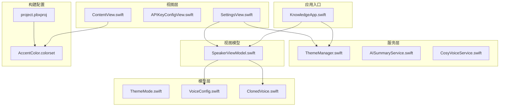
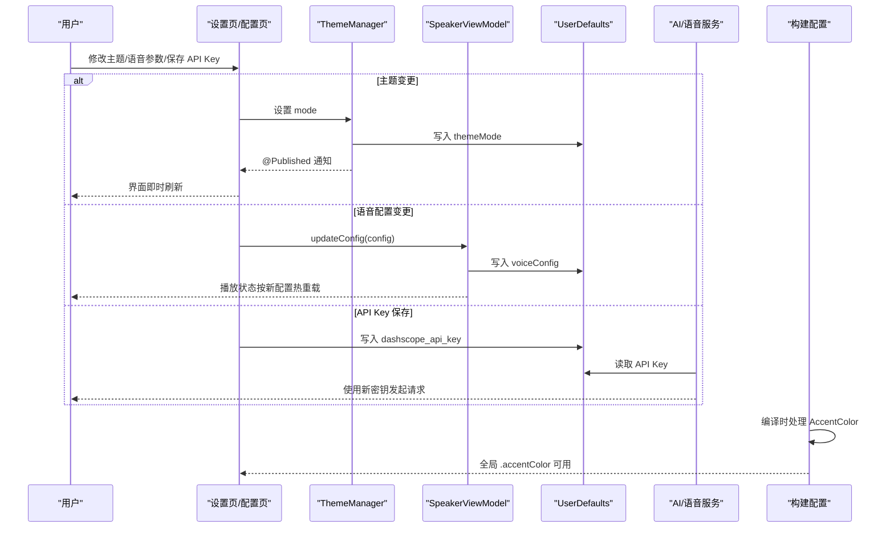
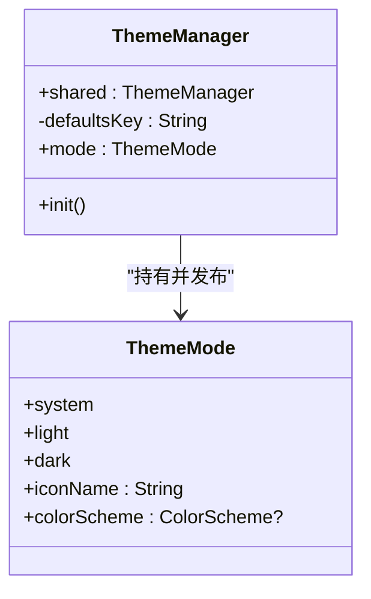
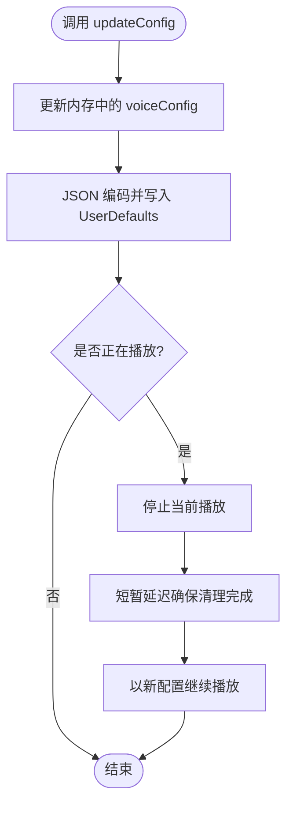
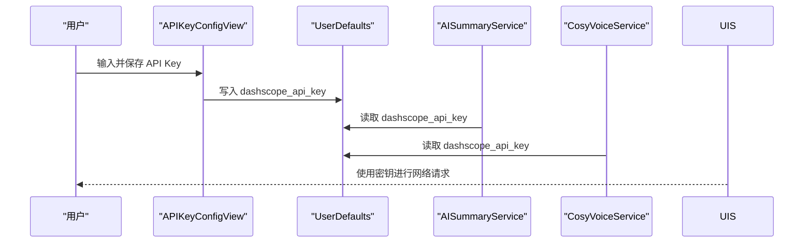
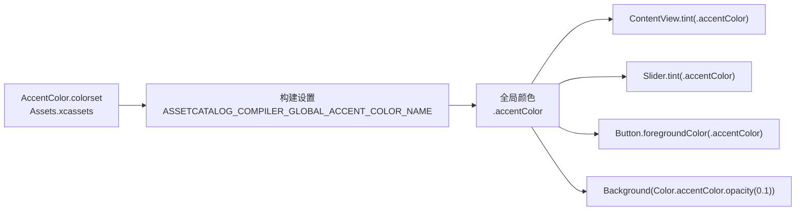
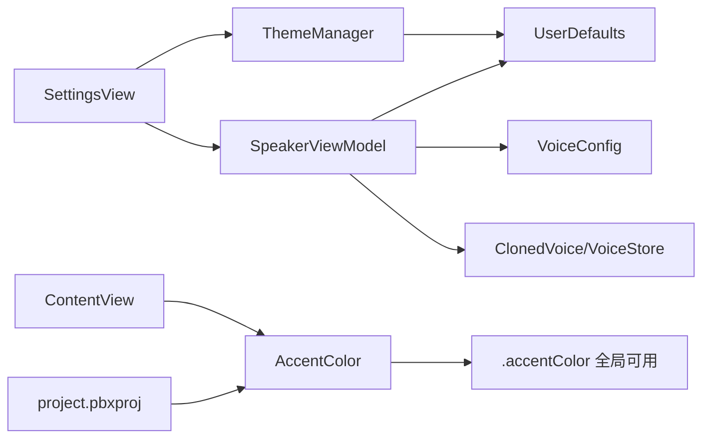

# 配置管理

<cite>
**本文引用的文件**
- [KnowledgeApp.swift](file://App/KnowledgeApp.swift)
- [ThemeManager.swift](file://Services/ThemeManager.swift)
- [ThemeMode.swift](file://Models/ThemeMode.swift)
- [VoiceConfig.swift](file://Models/VoiceConfig.swift)
- [SpeakerViewModel.swift](file://ViewModels/SpeakerViewModel.swift)
- [SettingsView.swift](file://Views/SettingsView.swift)
- [ClonedVoice.swift](file://Models/ClonedVoice.swift)
- [AISummaryService.swift](file://Services/AISummaryService.swift)
- [CosyVoiceService.swift](file://Services/CosyVoiceService.swift)
- [project.pbxproj](file://Knowledge.xcodeproj/project.pbxproj)
- [AccentColor.colorset/Contents.json](file://Resources/Assets.xcassets/AccentColor.colorset/Contents.json)
- [ContentView.swift](file://Views/ContentView.swift)
</cite>

## 更新摘要
**所做更改**
- 新增构建配置章节，详细说明全局品牌颜色配置机制
- 更新主题系统章节，补充AccentColor资产目录和构建设置的配置说明
- 添加颜色配置管理和品牌一致性维护的相关指导
- 完善配置验证和默认值管理部分，包含颜色资源验证

## 目录
1. [简介](#简介)
2. [项目结构](#项目结构)
3. [核心组件](#核心组件)
4. [架构总览](#架构总览)
5. [详细组件分析](#详细组件分析)
6. [构建配置与资源管理](#构建配置与资源管理)
7. [依赖关系分析](#依赖关系分析)
8. [性能与可维护性](#性能与可维护性)
9. [故障排查指南](#故障排查指南)
10. [结论](#结论)
11. [附录：配置文件结构与命名规范](#附录配置文件结构与命名规范)

## 简介
本文件面向 Knowledge 应用的"配置管理系统"，聚焦以下目标：
- 集中化管理应用配置，包括主题系统与用户偏好设置
- API 密钥的安全配置与管理策略
- 动态配置更新与热重载机制
- 配置验证、默认值管理与迁移方案
- 配置文件结构与命名规范
- 安全性与可维护性保障
- **新增**：构建配置与品牌颜色资源管理

当前实现以 UserDefaults 作为持久化存储，结合 SwiftUI 的 @Published 与 EnvironmentObject 实现 UI 层的热重载；通过统一的 ViewModel 与服务层读取配置并驱动运行时行为。**同时采用 Xcode 构建设置确保品牌颜色在整个应用中正确传播。**

## 项目结构
配置相关代码分布在 Services、Models、ViewModels、Views 等目录中，遵循"服务/模型/视图模型/视图"的分层组织方式：
- 主题系统：ThemeManager + ThemeMode
- 用户偏好（语音合成）：VoiceConfig + SpeakerViewModel + SettingsView
- API 密钥：APIKeyConfigView + AISummaryService + CosyVoiceService
- 音色选择与克隆：ClonedVoice（含 VoiceStore）
- **新增**：构建配置与品牌颜色资源管理

**图表来源**
- [KnowledgeApp.swift:1-29](file://App/KnowledgeApp.swift#L1-L29)
- [ThemeManager.swift:1-25](file://Services/ThemeManager.swift#L1-L25)
- [ThemeMode.swift:1-25](file://Models/ThemeMode.swift#L1-L25)
- [VoiceConfig.swift:1-52](file://Models/VoiceConfig.swift#L1-L52)
- [ClonedVoice.swift:1-118](file://Models/ClonedVoice.swift#L1-L118)
- [SpeakerViewModel.swift:1-314](file://ViewModels/SpeakerViewModel.swift#L1-L314)
- [SettingsView.swift:1-193](file://Views/SettingsView.swift#L1-L193)
- [ContentView.swift:20-30](file://Views/ContentView.swift#L20-L30)
- [project.pbxproj:402-432](file://Knowledge.xcodeproj/project.pbxproj#L402-L432)
- [AccentColor.colorset/Contents.json:1-39](file://Resources/Assets.xcassets/AccentColor.colorset/Contents.json#L1-L39)

## 核心组件
- 主题管理器（ThemeManager）：单例 ObservableObject，持有 @Published 的主题模式，读写 UserDefaults，并在应用启动时注入到环境对象，驱动全局颜色方案。
- 主题枚举（ThemeMode）：定义跟随系统/白天/暗黑三种模式，提供图标与 ColorScheme 映射。
- 语音配置（VoiceConfig）：包含语速、音高、音量、语言、引擎、预设/克隆音色 ID 等字段，提供默认实例与常用档位常量。
- 主视图模型（SpeakerViewModel）：统一加载/保存 VoiceConfig，切换 TTS 引擎，支持播放过程中动态更新配置并热重载。
- 设置页（SettingsView）：收集用户输入，构造 VoiceConfig 并持久化；同时联动主题切换。
- **新增**：品牌颜色配置（AccentColor）：通过 Xcode 构建设置 ASSETCATALOG_COMPILER_GLOBAL_ACCENT_COLOR_NAME 确保全局颜色一致性。
- 音色数据（ClonedVoice/VoiceStore）：封装预设与克隆音色的持久化键与方法。

**章节来源**
- [ThemeManager.swift:1-25](file://Services/ThemeManager.swift#L1-L25)
- [ThemeMode.swift:1-25](file://Models/ThemeMode.swift#L1-L25)
- [VoiceConfig.swift:1-52](file://Models/VoiceConfig.swift#L1-L52)
- [SpeakerViewModel.swift:158-170](file://ViewModels/SpeakerViewModel.swift#L158-L170)
- [SettingsView.swift:178-193](file://Views/SettingsView.swift#L178-L193)
- [project.pbxproj:402-432](file://Knowledge.xcodeproj/project.pbxproj#L402-L432)
- [AccentColor.colorset/Contents.json:1-39](file://Resources/Assets.xcassets/AccentColor.colorset/Contents.json#L1-L39)
- [ClonedVoice.swift:50-118](file://Models/ClonedVoice.swift#L50-L118)

## 架构总览
配置管理的整体流程如下：
- 应用启动时，KnowledgeApp 将 ThemeManager 注入为 EnvironmentObject，并基于其 mode 设置 preferredColorScheme。
- 用户在设置页修改主题或语音参数后，ThemeManager 或 SpeakerViewModel 立即写入 UserDefaults，并通过 @Published 触发 UI 刷新。
- API Key 在配置页保存后，AI 总结与语音服务在需要时从 UserDefaults 读取并使用。
- **新增**：构建阶段，Xcode 根据 ASSETCATALOG_COMPILER_GLOBAL_ACCENT_COLOR_NAME 设置将 AccentColor 资产注册为全局颜色，所有使用 .accentColor 的视图自动应用品牌色。

**图表来源**
- [KnowledgeApp.swift:20-27](file://App/KnowledgeApp.swift#L20-L27)
- [ThemeManager.swift:10-23](file://Services/ThemeManager.swift#L10-L23)
- [SpeakerViewModel.swift:160-170](file://ViewModels/SpeakerViewModel.swift#L160-L170)
- [project.pbxproj:402-432](file://Knowledge.xcodeproj/project.pbxproj#L402-L432)
- [AccentColor.colorset/Contents.json:1-39](file://Resources/Assets.xcassets/AccentColor.colorset/Contents.json#L1-L39)

## 详细组件分析

### 主题系统（ThemeManager + ThemeMode）
- 职责
  - 提供单例主题管理器，暴露 @Published 的 mode
  - 初始化时从 UserDefaults 恢复上次选择，否则回退到系统模式
  - 写入 UserDefaults 保证跨会话持久化
- 与 UI 集成
  - 应用根视图通过 environmentObject 注入 ThemeManager
  - WindowGroup 使用 preferredColorScheme(mode.colorScheme) 实时生效
- 复杂度与性能
  - 读写均为 O(1)，@Published 仅触发必要视图重绘

**图表来源**
- [ThemeManager.swift:5-24](file://Services/ThemeManager.swift#L5-L24)
- [ThemeMode.swift:4-24](file://Models/ThemeMode.swift#L4-L24)

**章节来源**
- [ThemeManager.swift:1-25](file://Services/ThemeManager.swift#L1-L25)
- [ThemeMode.swift:1-25](file://Models/ThemeMode.swift#L1-L25)
- [KnowledgeApp.swift:20-27](file://App/KnowledgeApp.swift#L20-L27)

### 用户偏好设置（VoiceConfig + SpeakerViewModel + SettingsView）
- 数据结构
  - VoiceConfig 包含速率、音高、音量、语言、引擎、预设/克隆音色 ID 等，并提供默认实例与常用档位
- 持久化
  - 通过 JSON 编码/解码保存到 key "voiceConfig"
- 动态更新与热重载
  - updateConfig 更新内存中的 voiceConfig，持久化后若正在播放则停止并在新配置下继续播放
  - switchEngine 切换底层 TTS 引擎并同步保存，必要时重启播放
- 默认值与降级
  - loadConfig 失败时返回 .defaultConfig
  - 引擎错误时自动降级到系统 TTS 并保存

**图表来源**
- [SpeakerViewModel.swift:160-170](file://ViewModels/SpeakerViewModel.swift#L160-L170)
- [SpeakerViewModel.swift:302-312](file://ViewModels/SpeakerViewModel.swift#L302-L312)
- [VoiceConfig.swift:24-51](file://Models/VoiceConfig.swift#L24-L51)

**章节来源**
- [VoiceConfig.swift:1-52](file://Models/VoiceConfig.swift#L1-L52)
- [SpeakerViewModel.swift:158-170](file://ViewModels/SpeakerViewModel.swift#L158-L170)
- [SpeakerViewModel.swift:302-312](file://ViewModels/SpeakerViewModel.swift#L302-L312)
- [SettingsView.swift:178-193](file://Views/SettingsView.swift#L178-L193)

### API 密钥安全配置与管理
- 输入与存储
  - 使用 SecureField 安全输入，避免明文显示
  - 保存至 key "dashscope_api_key"
- 使用位置
  - AI 总结服务与 CosyVoice 服务在初始化时读取该 key
- 建议
  - 后续可引入钥匙串（Keychain）替代 UserDefaults 以提升安全性
  - 增加密钥格式校验与过期提示

**图表来源**
- [APIKeyConfigView.swift:55-65](file://Views/APIKeyConfigView.swift#L55-L65)
- [AISummaryService.swift](file://Services/AISummaryService.swift)
- [CosyVoiceService.swift](file://Services/CosyVoiceService.swift)

**章节来源**
- [APIKeyConfigView.swift:1-71](file://Views/APIKeyConfigView.swift#L1-L71)
- [AISummaryService.swift](file://Services/AISummaryService.swift)
- [CosyVoiceService.swift](file://Services/CosyVoiceService.swift)

### 音色选择与克隆（ClonedVoice + VoiceStore）
- 功能
  - 内置多组预设音色，支持按分类获取
  - 记录用户选择的预设/克隆音色 ID，并持久化
- 持久化键
  - "clonedVoices"、"selectedPresetVoiceId"、"selectedCloneVoiceId"

**章节来源**
- [ClonedVoice.swift:50-118](file://Models/ClonedVoice.swift#L50-L118)

## 构建配置与资源管理

### 品牌颜色配置机制
Knowledge 应用采用 Xcode 构建设置来管理品牌颜色，确保整个应用的颜色一致性：

- **构建设置**：在 project.pbxproj 中配置 `ASSETCATALOG_COMPILER_GLOBAL_ACCENT_COLOR_NAME = AccentColor;`
- **资产目录**：AccentColor.colorset 包含浅色和深色模式的配色方案
- **全局可用性**：编译后所有 SwiftUI 视图可直接使用 `.accentColor` 修饰符

### 颜色资源配置
- **浅色模式**：RGB(0.878, 0.353, 0.314) - 温暖的珊瑚红色调
- **深色模式**：RGB(0.910, 0.459, 0.427) - 稍亮的珊瑚红色调
- **透明度**：alpha 值为 1.000，确保颜色饱和度

### 颜色使用最佳实践
- 所有交互元素使用 `.tint(.accentColor)` 或 `.foregroundColor(.accentColor)`
- 背景强调使用 `Color.accentColor.opacity(0.1)` 创建半透明效果
- 按钮激活状态使用 `.accentColor` 提供视觉反馈

**图表来源**
- [AccentColor.colorset/Contents.json:1-39](file://Resources/Assets.xcassets/AccentColor.colorset/Contents.json#L1-L39)
- [project.pbxproj:402-432](file://Knowledge.xcodeproj/project.pbxproj#L402-L432)
- [ContentView.swift:24-25](file://Views/ContentView.swift#L24-L25)
- [SettingsView.swift:150-151](file://Views/SettingsView.swift#L150-L151)

**章节来源**
- [project.pbxproj:402-432](file://Knowledge.xcodeproj/project.pbxproj#L402-L432)
- [AccentColor.colorset/Contents.json:1-39](file://Resources/Assets.xcassets/AccentColor.colorset/Contents.json#L1-L39)
- [ContentView.swift:24-25](file://Views/ContentView.swift#L24-L25)
- [SettingsView.swift:150-151](file://Views/SettingsView.swift#L150-L151)

## 依赖关系分析
- 耦合与内聚
  - ThemeManager 与 ThemeMode 高度内聚，对外仅暴露 @Published 的 mode
  - SpeakerViewModel 聚合多个服务（TTS、音频会话、远程控制），对配置进行统一编排
  - 视图层仅负责收集用户输入与展示，不直接操作存储
  - **新增**：构建配置与资源文件解耦，通过构建设置建立连接
- 外部依赖
  - UserDefaults 作为轻量级配置存储
  - AVFoundation 用于音频会话与系统语音能力
  - **新增**：Xcode Asset Catalog Compiler 用于颜色资源编译
- 潜在循环依赖
  - 当前未见循环引用；服务与模型之间单向依赖清晰

**图表来源**
- [ThemeManager.swift:10-23](file://Services/ThemeManager.swift#L10-L23)
- [SpeakerViewModel.swift:302-312](file://ViewModels/SpeakerViewModel.swift#L302-L312)
- [SettingsView.swift:178-193](file://Views/SettingsView.swift#L178-L193)
- [ContentView.swift:24-25](file://Views/ContentView.swift#L24-L25)
- [project.pbxproj:402-432](file://Knowledge.xcodeproj/project.pbxproj#L402-L432)
- [AccentColor.colorset/Contents.json:1-39](file://Resources/Assets.xcassets/AccentColor.colorset/Contents.json#L1-L39)

**章节来源**
- [SpeakerViewModel.swift:1-314](file://ViewModels/SpeakerViewModel.swift#L1-L314)
- [SettingsView.swift:1-193](file://Views/SettingsView.swift#L1-L193)
- [ContentView.swift:20-30](file://Views/ContentView.swift#L20-L30)
- [project.pbxproj:402-432](file://Knowledge.xcodeproj/project.pbxproj#L402-L432)

## 性能与可维护性
- 性能
  - UserDefaults 读写为本地 I/O，开销极低；@Published 仅触发最小范围 UI 更新
  - 动态更新配置时采用"停止—短暂延迟—重新播放"的策略，避免竞态
  - **新增**：品牌颜色在编译时处理，运行时零开销
- 可维护性
  - 配置读写集中在 ViewModel 与服务层，视图层保持简洁
  - 通过 Codable 序列化配置，便于扩展字段与版本演进
  - **新增**：品牌颜色集中管理，修改一处即可全局生效

## 故障排查指南
- 主题未生效
  - 检查 ThemeManager 是否正确注入为 EnvironmentObject，以及 WindowGroup 是否设置了 preferredColorScheme
- 语音配置未持久化
  - 确认 SettingsView 保存逻辑是否执行，查看 UserDefaults 中是否存在 "voiceConfig"
- API Key 无效
  - 确认 APIKeyConfigView 已保存且服务层读取的是同一 key
  - 检查网络权限与密钥有效性
- 引擎异常降级
  - 观察 SpeakerViewModel 的错误回调，确认是否自动降级到系统 TTS 并保存了新的 engine
- **新增**：品牌颜色未生效
  - 检查 project.pbxproj 中是否正确配置 ASSETCATALOG_COMPILER_GLOBAL_ACCENT_COLOR_NAME
  - 确认 AccentColor.colorset 文件存在且格式正确
  - 清理构建缓存并重新编译项目

**章节来源**
- [KnowledgeApp.swift:20-27](file://App/KnowledgeApp.swift#L20-L27)
- [SpeakerViewModel.swift:234-247](file://ViewModels/SpeakerViewModel.swift#L234-L247)
- [project.pbxproj:402-432](file://Knowledge.xcodeproj/project.pbxproj#L402-L432)
- [AccentColor.colorset/Contents.json:1-39](file://Resources/Assets.xcassets/AccentColor.colorset/Contents.json#L1-L39)

## 结论
Knowledge 应用的配置管理以 UserDefaults 为核心，配合 SwiftUI 的响应式机制实现了主题与用户偏好的集中化与热重载。API Key 通过安全输入与集中读取满足基本需求。**新增的品牌颜色配置机制通过 Xcode 构建设置确保全局颜色一致性，解决了重复数据相关的编译问题。**建议在后续迭代中引入更安全的密钥存储（如钥匙串）、完善配置校验与迁移机制，进一步提升安全性与可维护性。

## 附录：配置文件结构与命名规范
- 存储介质
  - 当前全部使用 UserDefaults，key 命名采用小写下划线风格
- 关键键名
  - "themeMode"：主题模式（跟随系统/白天/暗黑）
  - "voiceConfig"：语音合成配置（JSON 编码）
  - "dashscope_api_key"：阿里云 DashScope API Key
  - "clonedVoices"：克隆音色列表（JSON 编码）
  - "selectedPresetVoiceId"：选中的预设音色 ID
  - "selectedCloneVoiceId"：选中的克隆音色 ID
- 构建配置
  - **新增**：ASSETCATALOG_COMPILER_GLOBAL_ACCENT_COLOR_NAME = AccentColor
  - **新增**：AccentColor.colorset 包含浅色和深色模式配色
- 默认值与回退
  - 主题：未设置时回退到系统模式
  - 语音配置：解析失败时回退到 VoiceConfig.defaultConfig
  - **新增**：品牌颜色：未配置时使用系统默认 accent color
- 验证与约束
  - API Key：建议增加非空与格式校验
  - 语音参数：建议限制范围（如速率、音高、音量）
  - **新增**：颜色资源：确保 RGB 值在有效范围内，alpha 值不为 0
- 迁移策略
  - 当 VoiceConfig 新增字段时，loadConfig 应兼容旧数据（缺失字段使用默认值）
  - 主题模式新增选项时，需兼容旧字符串值并给出合理回退
  - **新增**：品牌颜色更新时，确保新旧配色保持一致的设计语言

**章节来源**
- [ThemeManager.swift:16-23](file://Services/ThemeManager.swift#L16-L23)
- [SpeakerViewModel.swift:302-312](file://ViewModels/SpeakerViewModel.swift#L302-L312)
- [project.pbxproj:402-432](file://Knowledge.xcodeproj/project.pbxproj#L402-L432)
- [AccentColor.colorset/Contents.json:1-39](file://Resources/Assets.xcassets/AccentColor.colorset/Contents.json#L1-L39)
- [ClonedVoice.swift:54-90](file://Models/ClonedVoice.swift#L54-L90)